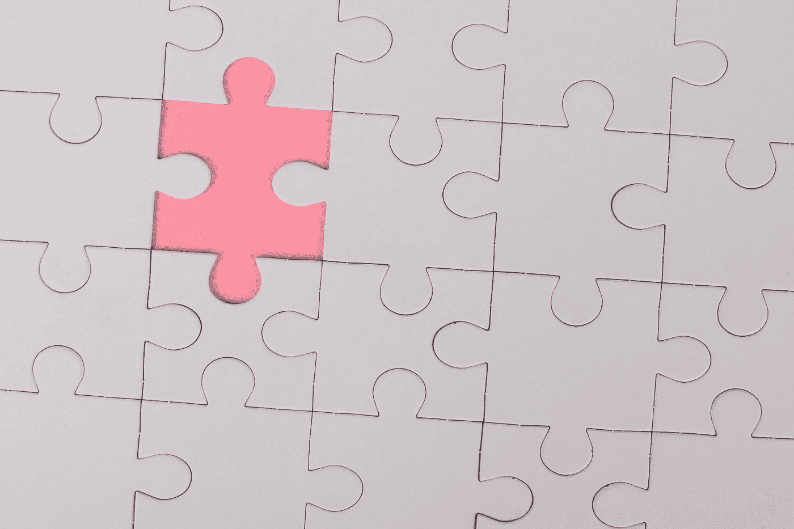
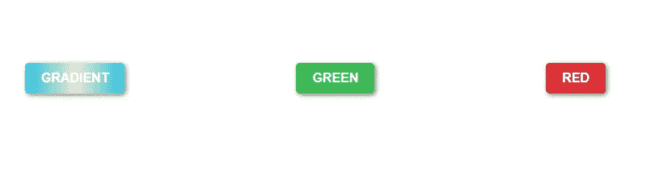
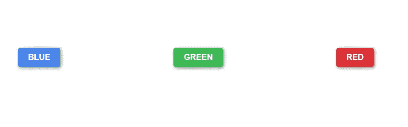
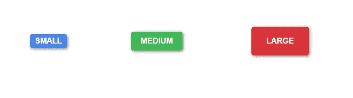
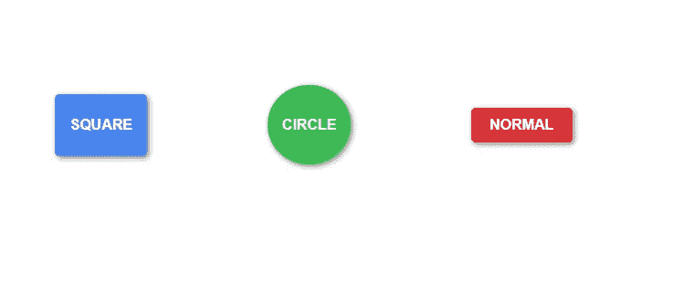
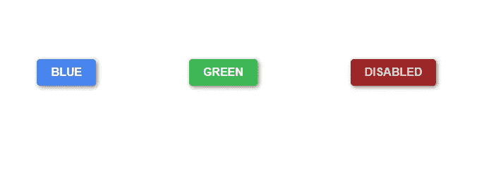

# 如何在 React 中创建一个完全可定制的按钮组件

> 原文：<https://javascript.plainenglish.io/how-to-create-a-fully-customizable-button-component-in-react-8e286cb25712?source=collection_archive---------1----------------------->



Photo by [Ann H](https://www.pexels.com/@ann-h-45017?utm_content=attributionCopyText&utm_medium=referral&utm_source=pexels) from [Pexels](https://www.pexels.com/photo/pink-jigsaw-puzzle-piece-3482441/?utm_content=attributionCopyText&utm_medium=referral&utm_source=pexels)



组件是 React 的支柱。有了组件，我们的代码不仅变得更加可读和可理解，而且更加灵活和可重用。这就是能够为任何 React 开发人员创建可靠应用程序的力量。

今天我将讨论如何完全控制在 React 应用程序中创建的组件。具体来说，我们将关注如何创建一个完全可定制的按钮组件，您将能够在整个 React 应用程序中使用它。

本教程主要面向刚刚开始学习 React 和/或希望在框架内提高技能的新开发人员。对于那些刚接触 React 的人，让我们定义一下组件到底是什么👍

# 什么是 React 组件？

首先，我们必须确定我所说的反应组件是什么意思。组件可以被描述为一段可重用的代码，用来返回 HTML 或 JSX。在 React 中有两种类型的组件，功能组件和类组件。这些组件通常自包含在一个单独的文件中，然后导入到我们想要使用它们的其他文件中。我们可以把零部件想象成一个单独的拼图或者汽车引擎的一部分。有许多小块可以放在一起，创造一个更大，更完善的产品。

组件是 React 的支柱。有了组件，我们的代码不仅变得更加可读和可理解，而且更加灵活和可重用。这就是能够为任何 React 开发人员创建可靠应用程序的力量。

说完这些，让我们进入正题。😎

# 创建初始按钮

为了真正很好地理解如何编写你的第一个组件，我不想一开始就跳到过于复杂的地方。我总是发现，在承担更复杂的任务之前，从小处着手并真正理解我们的代码在做什么是一个好主意。

首先，我们应该从创建应用程序文件开始。为此我们将使用 **create-react-app** 。我假设你已经有了一些建立自己的 React 环境的知识，因为这不是一个关于如何创建你的第一个 React 应用的教程。

让我们创建我们的 React 应用程序，方法是跳到我们的终端并键入:

```
*npx create-react-app my-custom-button*
```

完成后，我们应该将目录更改为新创建的项目

```
*cd my-custom-button*
```

现在已经完成了，您可以键入***yarn start****来确保运行当前项目没有问题。在此之后，您将希望确保更改您的 *App.js* 文件，如下所示:*

```
*import './App.css'
import './Button.css'function App(){
 return(
  <div className="container">
   <h1>React Button Component</h1>
   <div className="inner-container">
     <div className="button-container">
      <button className="custom-button blue"></button>
     </div>
     <div className="button-container">
      <button className="custom-button green"></button>
     </div>
     <div className="button-container">
      <button className="custom-button red"></button>
     </div>
   </div>
  </div>
 )
}export default App;*
```

*在您的 *App.css* 文件中，您将需要添加以下样式*

```
*.container{display: flex;flex-direction: column;align-items: center;}.inner-container{display: flex;flex-direction: row;width: 60%;padding: 70px;justify-content: space-evenly;align-items: center;}*
```

*之后，我们将想要添加两个新文件到我们的项目中，并将它们命名为 *Button.js* 和 *Button.css* 。这些文件将允许我们创建和定制我们的按钮组件。现在，我们只想给我们的 *Button.css* 文件添加几行代码，如下所示:*

```
*.custom-button{border: none;border-radius: 5px;color: white;width: fit-content;text-transform: uppercase;font-weight: bold;font-size: 16px;padding: 10px 20px 10px 20px;box-shadow: 2px 2px 6px grey;transition: .25s;overflow: hidden;position: relative;}.custom-button:after {content: "";background: lightgray;display: block;position: absolute;padding-top: 300%;padding-left: 350%;margin-left: -20px!important;margin-top: -120%;opacity: 0;transition: all 0.8s}.custom-button:active:after {padding: 0;margin: 0;opacity: 1;transition: 0s} /* Button Colors */.blue{background-color: #4885ed;}.green{background-color: #3cba54;}.red{background-color: #db3236;}/* Button Effects */.button-container button.custom-button.blue:hover{cursor: pointer;background-color: #2b5294;box-shadow: 2px 2px 20px grey;}.button-container button.custom-button.green:hover{cursor: pointer;background-color: #298039;box-shadow: 2px 2px 20px grey;}.button-container button.custom-button.red:hover{cursor: pointer;background-color: #9e2427;box-shadow: 2px 2px 20px grey;}*
```

*现在我们已经有了初始文件设置，我们可以通过键入 ***yarn start*** 来运行我们的应用程序。应用程序完成后，您应该会看到三个不同颜色的按钮，如下所示:*

**

*请注意，通过给我们的 HTML 按钮标签添加一些样式，我们可以将 HTML 中那些暗灰色的默认按钮变成更加定制化、更加美观的东西。但是现在每次我们想要添加另一个不同颜色的按钮，比如黄色，我们都必须回到我们的 *App.js* 文件，复制并粘贴我们的按钮 div，然后在我们的 *Button.css* 文件中添加黄色样式。*

*当您处理一个包含数百个不同文件的项目时，其中一半呈现一个按钮，当我们需要呈现一个按钮时，不得不在每个文件中再次复制和粘贴所有代码，这真的很乏味。这就是我们利用 React 组件的地方🙌*

# ***输入 React 组件***

*还记得我们一开始设置的 *Button.js* 文件吗？这是变得非常方便的部分。这个文件将包含我们定制的按钮组件的代码。让我们首先将这段代码添加到我们的 *Button.js* 文件中:*

```
*import './Button.css';const Button = ({color = "blue",name = "name"}) => {return(
 <div className="button-container">
  <button className={`custom-button ${color}`}>{name}</button>
 </div>
)}export default Button;*
```

*让我们稍微分解一下这个组件。我们导入我们的 *Button.css* 文件来确保我们的按钮组件可以访问样式表。注意，我们的组件在这里也接受几个参数或“道具”。如果你不熟悉 ES6 语法，我们正在做一个叫做析构的东西。这允许我们检索通过名称传递给组件的道具，而不是在整个组件文件中使用 *props.color* 或 *props.name* 。它只是使阅读和理解组件接受的参数变得更容易。我们还设置默认参数值，以防没有指定。*

*如果我们查看组件的主体，我们可以看到它看起来非常类似于我们在 *App.js* 文件中定义的 button div，只是做了一些调整。*

```
*<button className={`custom-button ${color}`}>{name}</button>*
```

*上面这段代码允许我们做几件事情。首先，它允许我们使用传递给按钮组件的动态颜色类。只要我们在样式表中定义了这个颜色，按钮就会呈现这个颜色。其次，它允许我们动态地为我们的按钮传入一个名称，这是不言自明的。现在让我们使用新定义的按钮组件，并用我们的 *App.js* 文件中的代码替换它，如下所示:*

```
*import './App.css';import Button from './Button';function App() {return (<div className="container"> <h1>React Button</h1> <div className="inner-container"> <Button color="blue" name="Blue" /> <Button color="green" name="Green" /> <Button color="red" name="Red" /> </div> </div>);}export default App;*
```

*用新的按钮组件替换旧的按钮代码，现在看起来更整洁了，老实说可读性也更好了。如果我们再次运行 ***yarn start*** ，我们会注意到我们得到了与之前相同的结果，这正是我们想要的。这很酷，但是如果我们也想要不同大小的按钮呢？幸运的是，对我们来说这真的很简单。要改变按钮组件的大小，我们首先必须为我们的 *Button.css* 文件定义一些 CSS 类。在本教程中，我们将把 *small，medium，large & xlarge* 添加到样式表中。*

*继续将这些类添加到 *Button.css* 样式表中:*

```
*/* Button Sizes */.small{ padding: 5px 10px 5px 10px;}.medium{ padding: 10px 20px 10px 20px;}.large{ padding: 20px 30px 20px 30px;}.xlarge{ padding: 30px 40px 30px 40px;}*
```

*(当然，我鼓励所有读者看看改变值对按钮大小有什么影响，并决定哪种大小对你来说最合适…你不必使用这些精确的值)。在定义了我们的新尺寸之后，我们需要确保我们的按钮组件能够将它识别为一个可以接受的道具。我们需要对我们的 *Button.js* 文件做一些细微的修改，这样才能工作。*

```
*import './Button.css';const Button = ({color = "blue",name = "name",size = "medium"}) => {return( <div className="button-container"> <button className={`custom-button ${color} ${size}`}>{name}   </button> </div> )}export default Button;*
```

*我们还想将**大小的**道具添加到 *App.js* 文件主体中的按钮组件中，如下所示:*

```
*return (<div className="container"> <h1>React Button</h1> <div className="inner-container"> <Button color="blue" name="Small" size="small"/> <Button color="green" name="Medium" size="medium" /> <Button color="red" name="Large" size="large" /> </div></div>);*
```

*再次运行我们的应用程序会得到这样的结果:*

**

*我们刚刚向按钮组件添加了另一个级别的定制。如果我们不仅想要不同大小和颜色的按钮，还想要不同形状的按钮，如正方形或圆形，会怎么样？我们可以这么做！我们所要做的就是在我们的按钮样式表中定义 shape 类，并做与按钮大小相同的事情。为此，我将只显示要更改的代码，因为我们在创建按钮大小时已经完成了大部分工作。*

*让我们在文件中添加/调整以下代码行。*

***Button.css***

```
*/* Button Styles */.square{ padding: 25px 16px 25px 16px;}.circle{ padding: 38% 16px; border-radius: 50%;}*
```

***Button.js***

```
*import './Button.css';const Button = ({color = "blue",name = "name",size = "medium",type = null}) => {return( <div className="button-container"> <button className={`custom-button ${color} ${size} ${type}`}> {name}</button> </div>)}export default Button;*
```

***App.js***

```
*return ( <div className="container"> <h1>React Button</h1> <div className="inner-container"> <Button color="blue" name="Square" size="medium" type="square"/> <Button color="green" name="Circle" size="medium" type="circle" /> <Button color="red" name="Normal" size="medium" /> </div> </div>);*
```

*再次运行我们的应用程序后，我们得到了这个结果:*

**

*好了，这越来越有趣了。我们刚刚为我们的按钮组件添加了第三个级别的定制，而且还不止于此。如果我们试着点击这些按钮中的任何一个会发生什么？嗯，现在…没什么。我们实际上还没有定义如何处理按钮上的点击事件。所以我们应该设置它，因为如果一个按钮点击后什么也不做，那它还有什么用呢🤷‍♂️*

# *处理按钮事件*

*在组件中处理事件实际上有点棘手，这取决于您想要完成的任务。我不期望新的 React 开发人员能够完全理解这是如何工作的，但是我会尽我所能解释清楚。*

*所以我们现在需要做的是给我们的按钮组件添加一些东西，允许我们处理一个 **onClick** 事件。为此，我们需要向我们的 *Button.js* 文件添加更多代码:*

```
*import './Button.css';const Button = ({color = "blue",name = "name",size = "medium",type = null,onClick}) => {const onButtonClick = () => { if(onClick){ onClick(name); }}return( <div className="button-container"> <button className={`custom-button ${color} ${size} ${type}`} onClick={onButtonClick}>{name}</button> </div>)}export default Button;*
```

*如您所见，我们刚刚为按钮组件定义了一个方法，该方法允许我们与定义它的父组件进行对话。这个方法说的是:如果按钮组件要接受点击事件，那么调用传递给我们的按钮组件的 **onClick** prop。我们在这里需要这种检查，因为我们可以定义一个没有 onClick 方法的按钮，单击按钮实际上会导致应用程序出错。*

*我们已经在按钮组件中定义了一个方法来接受来自父组件的 onClick 事件，但是我们可能应该在我们的 *App.js* 文件中定义一些东西，当按钮被点击时将执行这些东西。让我们向文件中添加一个新方法，如下所示:*

```
*import './App.css';import Button from './Button';function App() {const onButtonClick = (name) => { alert(`${name} button clicked!`)}return ( <div className="container"> <h1>React Button</h1> <div className="inner-container"> <Button color="blue" name="Blue" size="medium" onClick= {onButtonClick}/> <Button color="green" name="Green" size="medium" /> <Button color="red" name="Red" size="medium" onClick={onButtonClick} /> </div> </div>);}export default App;*
```

*好，让我们再次启动我们的应用程序，看看会发生什么。如果我们点击蓝色按钮，会弹出一个警告说“蓝色按钮已点击！”。点击红色按钮，会弹出一个警告说“红色按钮已点击！”，点击绿色按钮没有任何作用。为什么绿色按钮不像其他两个一样提示警告？还记得我们说过一些按钮不需要接受 onClick 事件，绿色按钮没有 Click 事件，这意味着它永远不会显示警告，这正是我们想要的。如果我们不希望按钮是可点击的呢？如果我们不想让按钮处于活动状态，我们需要启用禁用按钮的方法。*

*这实际上做起来也很简单，实际上这与我们之前实现组件的大小、颜色和形状的方式基本相同。像以前一样，我们将再次对我们所有的文件进行一些修改。下面是应该添加到以下文件中的更改:*

***Button.css***

```
*.button-container button.custom-button.blue:disabled{cursor: pointer;background-color: #2b5294;color: lightgray;} .button-container button.custom-button.green:disabled{cursor: pointer;background-color: #298039;color: lightgray;}.button-container button.custom-button.red:disabled{cursor: pointer;background-color: #9e2427;color: lightgray;}*
```

***Button.js***

```
*import './Button.css';const Button = ({color = "blue",name = "name",size = "medium",type = null,disabled = false,onClick}) => {const onButtonClick = () => { if(onClick){ onClick(name); }} return( <div className="button-container"> <button disabled={disabled} className={`custom-button ${color}  ${size} ${type}`} onClick={onButtonClick}>{name}</button> </div> )}export default Button;*
```

***App.js***

```
*return ( <div className="container"> <h1>React Button</h1> <div className="inner-container"> <Button color="blue" name="blue" size="medium" onClick= {onButtonClick}/> <Button color="green" name="green" size="medium" /> <Button color="red" name="red" size="medium" disabled/> </div> </div>);*
```

*在进行这些更改并再次运行我们的应用程序后，我们得到了这个结果*

**

*正如你所看到的，我们在红色按钮上启用了 disabled 属性，与绿色和蓝色按钮相比，它看起来暗淡无光。当我们单击红色按钮时，什么也没有发生，这是因为该按钮组件附加了 disabled 属性。至此，我想我们已经完成了完全定制的 React 按钮组件。*

# *结论*

*恭喜你坚持到最后！这有很多内容要介绍，但是有很多事情可以用 React 组件来做，并且有很多方法可以定制自己的组件，以便在整个应用程序中使用。如果我只说你可以使用 Material-UI 之类的组件库，那么本教程会快很多，但问题是会有这样的情况，你需要一个比 Material-UI 所能执行的更复杂的组件，并且创建我们自己的组件允许我们拥有像这样的库不一定能提供的完全的灵活性。*

*作为我的第一个媒体故事，我想感谢所有坚持到最后的人，为此，我在这篇文章的顶部添加了自定义渐变按钮的代码，作为一点奖励。如果你喜欢这种类型的内容，并想了解更多关于如何成为一个反应大师，然后给我一个关注，看看更多像这样的故事。谢谢，我们下一集再见😉*

```
*.gradient{background-image: linear-gradient(to right, #2BC0E4 0%, #EAECC6 51%, #2BC0E4 100%)}.button-container button.custom-button.gradient:hover{cursor: pointer;background-image: linear-gradient(to right, #2BC0E4 0%, #EAECC6 0%, #2BC0E4 180%);box-shadow: 2px 2px 20px grey;}*
```

**更多内容看*[***plain English . io***](http://plainenglish.io)*