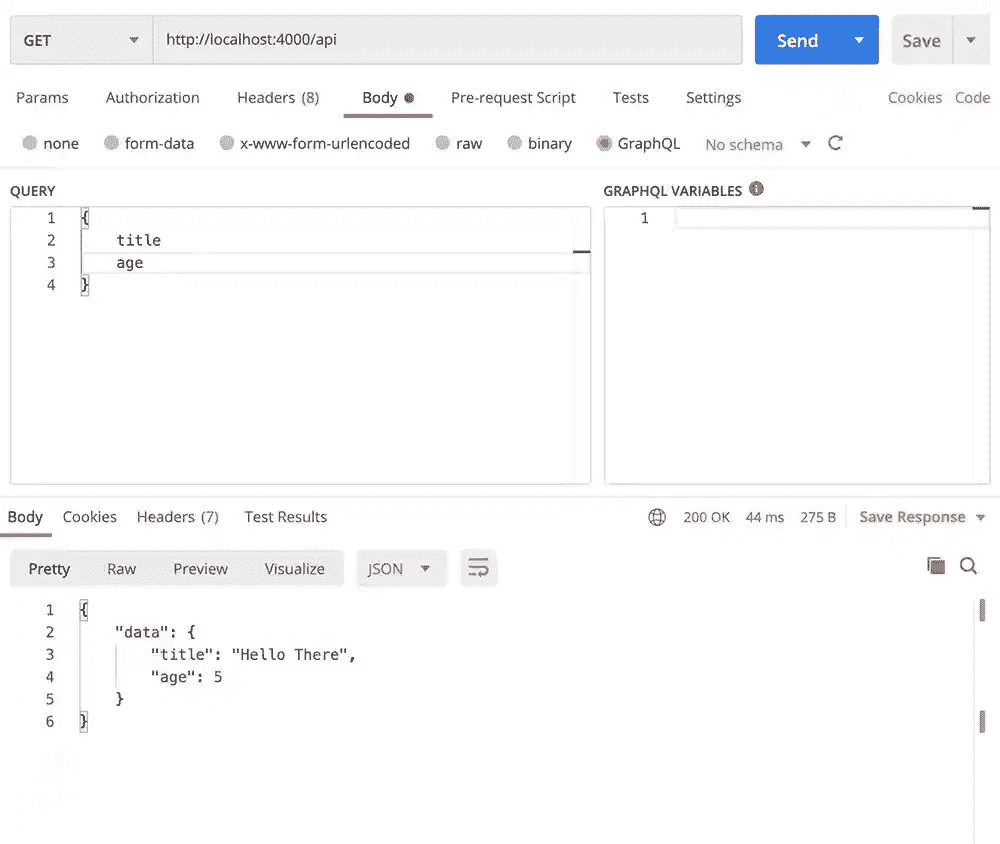
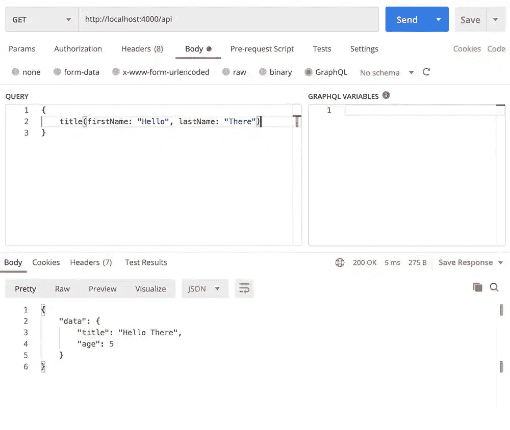
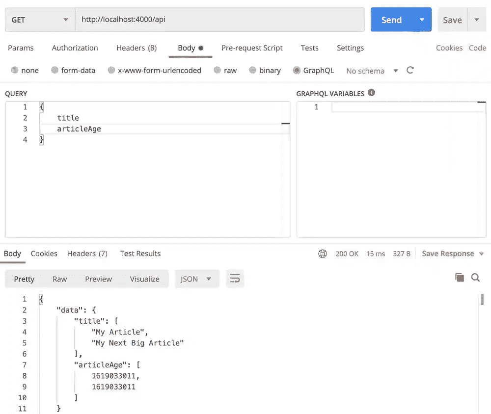

# 如何创建一个由 MongoDB 和 Express 支持的 GraphQL API

> 原文：<https://javascript.plainenglish.io/how-to-create-a-graphql-api-powered-by-mongodb-and-express-89119a25bb38?source=collection_archive---------15----------------------->


GraphQL 是一种主要为 API 使用而构建的语言。它很容易与 JavaScript 和其他语言交互。在本文中，让我们看看如何将 Express、MongoDB 和 GraphQL 结合到一个基本的 API 中，以便从数据库中获取标题和日期。

GraphQL 有点偏离经典的 REST APIs，但是一旦您习惯了它，您就会知道它运行起来有多容易。让我们看看。

# 安装 GraphQL

第一步是在 Node.js 服务器上安装标准的 GraphQL 包和 Express，方法是在命令行上运行以下安装:

```
***npm*** i graphql
***npm*** i graphql-express
***npm*** i express
***npm*** i mongoose
```

# 一个基本的 GraphQL Express 端点

让我们从一个功能强大的 express/GraphQL 服务器开始。创建一个名为`index.js`的文件，并插入以下代码:

正如您所看到的，GraphQL 需要三个主要部分。首先，我们定义一个模式，这是我们的端点将返回的数据类型。每个 GraphQL 都需要一个“`type Query`”模式，但是在此之后，您可以使用任何您想要的名称来代替“Query”。例如，你可以有一个`type TeamMember`模式。

接下来，我们有了我们的根本价值观。这些是模式中的项目，以及为每个项目返回一个值的相关函数。如果用户试图从 API 中获取“`age`”，他们将得到 5 的返回。

最后，当用户从 API 发出`GET`请求时，我们返回数据。如果您安装了[邮差](https://www.postman.com/)(我会在本教程中推荐)，您可以很容易地用 GraphQL 发送这样的查询，看看它是如何工作的。

GraphQL 有一种非常简单的查询语言，我们只需要将我们想要的元素的键放在花括号中发送。您甚至可以为多级对象在多个级别执行此操作。示例如下所示:



# 计划

GraphQL 有一种特定的查询语言，允许我们创建模式。模式本质上是我们的 API 将返回的数据类型的定义。然后，用户可以发送查询，以选择该模式的特定组件。

# 根值

根值是模式中所有事物的对象。

# 变量

也可以将变量添加到组合中。为此，我们只需要在模式和根值中定义变量。我们必须将变量包装在`{}`括号中的根值中。

然后，我们可以使用以下查询在邮递员中查询标题变量:



# 与 MongoDB 结合

现在我们有了一个简单的 GraphQL 接口，让我们把它和 MongoDB 结合起来。用您的 MongoDB 模式创建一个文件。我的是关于文章的，所以看起来有点像我们下面的内容。注意，这里的数据库模式是不同的，但这不会阻止我们:

# 组合蒙古数据库

因此，首先，将您的新模型添加到 index.js 文件中，之前您在该文件中有您的 express router。如果需要，不要忘记连接到您的 MongoDB:

# 更新我们的根和模型

为此，我想在单独的数组中返回数据库中的所有标题和所有页面日期。首先，让我们更新我们的模式，以反映 graphQL 应该返回项目数组:

简单。接下来，让我们更新我们的根变量。这一次，我们将连接到我们的 MongoDB 来返回文章，并将它们压缩成一维数组:

现在，我们可以像以前一样使用相同的查询样式运行 API，以获取所有的文章日期和标题:



# 结论

今天到此为止。如果你有兴趣了解更多，请通过@ T0 fjolt dev T1 在 Twitter 上关注我，获取我的最新文章。

这里是一些有用的资源，以及今天最后一个例子中的代码。

*   [GraphQL 文档](https://graphql.org/learn/)
*   [代码回购](https://github.com/smpnjn/graphql-mongodb-express)

*更多内容请看*[*plain English . io*](http://plainenglish.io/)