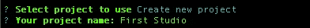

# 如何在 5 分钟内设置一个无头 CMS

> 原文：<https://javascript.plainenglish.io/how-to-create-a-headless-cms-in-under-5-minutes-c57216a8530f?source=collection_archive---------10----------------------->

## 创建你的第一个理智工作室的初学者指南


Photo by [Emmanuel Acua](https://unsplash.com/@acuamanny?utm_source=medium&utm_medium=referral) on [Unsplash](https://unsplash.com?utm_source=medium&utm_medium=referral)

最近，我很开心地了解了 JAMstack。如果你不熟悉 JAMstack 网站，可以看看下面的两个网站。它们可以让你很好地理解它们是什么，以及为什么我们应该使用它们。

[](https://jamstack.org/) [## 快速安全的网站| Jamstack

### 你准备好发射进入太空了吗？查看 Jamstack Explorers！立即行动……的全面指南

jamstack.org](https://jamstack.org/) [](https://jamstack.wtf/) [## JAMstack WTF

### 以下提示将帮助您充分利用堆栈中的精华。内容交付网络，因为所有的标记和…

jamstack.wtf](https://jamstack.wtf/) 

JAMstack 站点可以由内容管理系统(CMS)控制。通常，这些被称为无头 CMS。如果你想更多地了解什么是无头 CMS，这里有一个 2 分钟的视频可以帮助你快速上手。

我已经尝试了几种不同的无头 CMS，到目前为止我最喜欢的是 Sanity。他们有一个慷慨的免费层，你可以得到它设置在短短几个步骤。在本文中，我想向您介绍 Sanity，并帮助您建立您的第一个 Sanity 工作室。

根据他们的[网站](https://www.sanity.io/studio)，

> “Sanity Studio 是一个用 React.js 构建的开源单页应用程序。您可以用简单的 JavaScript 定义您的内容模型。还可以用自己的 React.js 组件对其进行扩展。Studio 具有高级功能，可让您为编辑量身定制工作流程。也可以为 Sanity Studio 安装制作插件，发布到 npm 上。”

# 创建健全工作室

在我们创建第一个工作室之前，我们需要安装 Sanity CLI 工具。您可以通过在命令行中运行以下命令来进行全局安装。

```
npm install -g @sanity/cli
```

一旦安装了 Sanity CLI 工具，您就可以通过运行以下代码来创建一个新项目。

```
sanity init
```

如果这是你第一次使用 Sanity，它会提示你登录或创建一个新帐户。您可以使用您的 Google 或 GitHub 帐户，或者电子邮件和密码。


登录后，系统会提示您选择现有项目或创建新项目。选择“创建新项目”并为您的项目命名。我将命名我的第一个工作室。



然后将询问您，“使用默认数据集配置吗？`.您的项目中可以有多个数据集。默认为生产。在我们的例子中，我们将把它作为缺省值，并选择 Yes。


接下来，您需要确认项目输出路径。我们将让它保持原样，然后按回车键。


最后，您可以选择一个项目模板。这里有 4 个选项可供您选择，这取决于您将要构建的内容。在我们的例子中，我们将使用 blog 模板，它将为 Blog 设置基本的模式。


选择项目模板后，您的 Sanity Studio 将被创建。完成后，您可以在文本编辑器中打开项目。您应该会看到创建了一个新项目，类似这样。


从这里，您可以通过运行以下命令来启动您的项目。

```
sanity start
```

这将为您的项目启动一个 web 服务器。访问 [http://localhost:3333/](http://localhost:3333/) 并使用之前相同的身份验证登录。您应该会看到下面的页面。


恭喜你！你刚刚创建了你的第一个理智工作室。您现在可以添加数据、定制模式，并将其与您喜欢的任何前端连接起来。我喜欢它的易用性和定制的灵活性。

如果你想管理你的工作室，你可以去 https://manage.sanity.io/[看看你的项目使用和设置。](https://manage.sanity.io/)

感谢阅读！要了解更多关于健全的知识，请查看下面的文档。

[](https://www.sanity.io/docs/sanity-studio) [## 理智工作室

### Sanity Studio 是一个用 React.js 构建的开源单页应用程序

www.sanity.io](https://www.sanity.io/docs/sanity-studio)