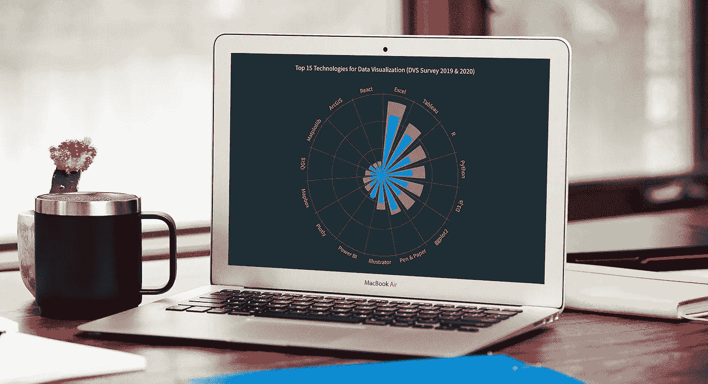
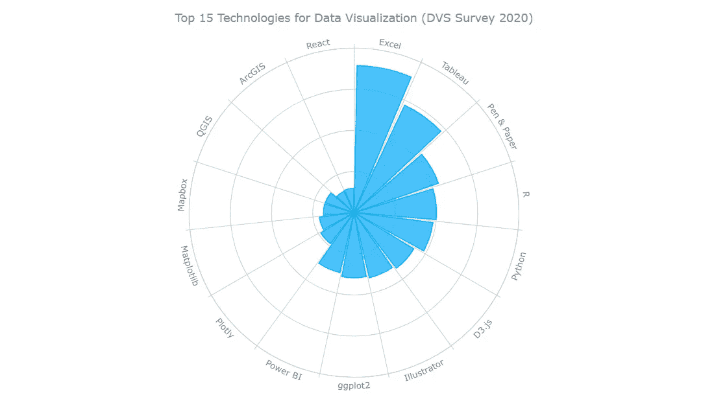
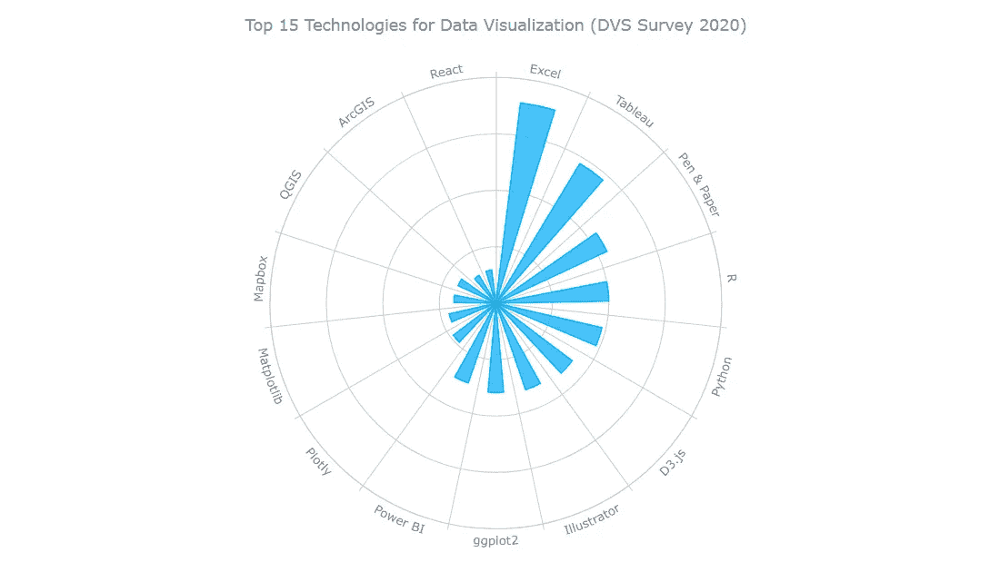
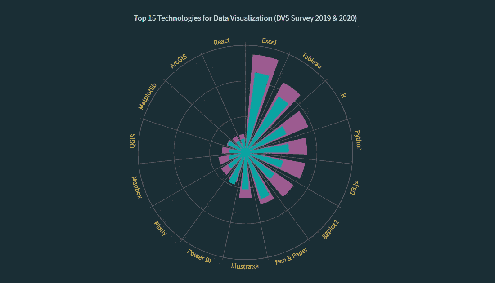

# 如何创建 JavaScript 极坐标图

> 原文：<https://javascript.plainenglish.io/how-to-create-a-javascript-polar-chart-c2719cbf778f?source=collection_archive---------13----------------------->



极坐标图通常看起来令人印象深刻，这使得一些人认为创建它们是一个需要大量技能和专业知识的棘手过程。好吧，我现在就要揭穿这个流言！让我向您展示如何在一个漂亮的交互式 JavaScript 极坐标图中轻松地可视化数据。

从根本上说，[极坐标图](https://www.anychart.com/chartopedia/chart-type/polar-chart/)是用极坐标绘制的圆形图的变体。它还可以很好地将一些分类数据可视化以进行比较，这正是我现在想要演示的情况。在本教程中，我将构建一个柱形图，其中的条形从图的中心开始增长，用它们的长度来表示值。

[数据可视化协会](https://www.datavisualizationsociety.org/) (DVS)对数据从业者进行年度[行业状态](https://www.datavisualizationsociety.org/survey)调查，我认为这可能是一个利用其最新数据的好机会。特别是，我想根据回答来看看用于数据可视化的最流行的技术。因此，在这里，我将制作一个 JS 极坐标图，绘制前 15 个，构成一个很酷的说明性现实世界的例子。

会很有趣的——大家都来吧！

# JS 极坐标图预览

先睹为快，看看最终的 JavaScript 极坐标图会是什么样子:


# 用 4 个简单的步骤构建 JavaScript 极坐标图

为了在这里创建一个极坐标图，我将使用一个 JavaScript 图表库。这种库配备了用于基本功能的预写代码，这使得创建数据可视化更加容易和快速。

对于本教程，我选择了 AnyChart JavaScript 库,因为它简单易用、灵活，并且对于非商业用途是免费的。此外，这是一个很好的库，因为它有很多示例和文档。

一般来说，可以将创建任何 JS 图(包括极坐标图)的整个过程分为四个基本步骤或阶段。它们是:

1.  用 HTML 创建一个基本的网页。
2.  引用所需的 JavaScript 文件。
3.  添加数据。
4.  写一些 JS 代码来画图表。

和我一起按照这些步骤来制作一个基于 JavaScript 的交互式极线图可视化吧！

## 1.用 HTML 创建一个基本网页

首先，我创建了一个基本的 HTML 页面和一个包含极坐标图的 block 元素:

```
<html>
  <head>
    <title>JavaScript Polar Chart</title>
    <style type="text/css">      
      html, body, #container { 
        width: 100%; height: 100%; margin: 0; padding: 0; 
      } 
    </style>
  </head>
  <body>
    <div id="container"></div>
  </body>
</html>
```

正如你看到的,`<div>`元素被赋予了一个 id，这样我就可以在代码中引用它。另外，`<div>`块的宽度和高度被指定为 100%,以使极坐标图呈现在整个页面上。

## 2.引用所需的 JavaScript 文件

接下来，在页面的`<head>`部分，我引用了正在使用的图表库的特定脚本。

在这里，我使用 AnyChart，所以我将包含来自其 [CDN](https://cdn.anychart.com) 的所需文件。这个库是模块化的，对于极坐标图，我所需要的就是方便的核心模块和极坐标模块。

```
<html>
  <head>
    <title>JavaScript Polar Chart</title>
    <script src="https://cdn.anychart.com/releases/8.10.0/js/anychart-core.min.js"></script>
    <script src="https://cdn.anychart.com/releases/8.10.0/js/anychart-polar.min.js"></script>
    <style type="text/css">      
      html, body, #container { 
        width: 100%; height: 100%; margin: 0; padding: 0; 
      } 
    </style>
  </head>
  <body>  
    <div id="container"></div>
    <script>
 ***// All the JS polar chart code will come here.***    </script>
  </body>
</html>
```

## 3.添加数据

为了给我未来的极坐标图获取数据集，我过滤了 DVS 的[数据可视化普查调查 2020 数据](https://github.com/data-visualization-society/data_visualization_survey/tree/master/data/2020)，并确定了受访者回答的 15 种最常用的技术。

现在，为了正确地将这些数据添加到图表中，我创建了一个[数组](https://docs.anychart.com/Working_with_Data/Data_Sets#array_of_objects)，将类别名称作为`x`参数，正如我们在 X 轴上绘制的那样，并将每个类别的度量作为`value`参数。

```
***// add data as an array of objects*** var data = [
  { x: 'Excel', value: 44.7 },
  { x: 'Tableau', value: 36.1 },
  { x: 'Pen & Paper', value: 27.1 },
  { x: 'R', value: 25 },
  { x: 'Python', value: 24.1 },
  { x: 'D3.js', value: 21.2 },
  { x: 'Illustrator', value: 20.3 },
  { x: 'ggplot2', value: 19.8 },
  { x: 'Power BI', value: 18.7 },
  { x: 'Plotly', value: 11.8 },
  { x: 'Matplotlib', value: 10.58 },
  { x: 'Mapbox', value: 9.28 },
  { x: 'QGIS', value: 9.22 },
  { x: 'ArcGIS', value: 7.18 },
  { x: 'React', value: 7.4 }
];
```

准备工作已经完成，现在是时候让基于 JavaScript 的极坐标图出现在画布上了！

## 4.写一些 JS 代码来画极坐标图

我在这里做的第一件事是添加一个包含所有 JS 极坐标图代码的函数。这确保了只有在网页准备好之后，它里面的所有东西才会执行。

用 JavaScript 制作极坐标图非常简单。我只需编写一行代码来创建它，然后添加上一步准备的数据数组，并将数据连接到图表，创建一个列系列。

```
anychart.onDocumentReady(function () {***// create a polar chart* **  var chart = anychart.polar();

 ***// add data as an array of objects***  var data = [
    { x: 'Excel', value: 44.7 },
    { x: 'Tableau', value: 36.1 },
    { x: 'Pen & Paper', value: 27.1 },
    { x: 'R', value: 25 },
    { x: 'Python', value: 24.1 },
    { x: 'D3.js', value: 21.2 },
    { x: 'Illustrator', value: 20.3 },
    { x: 'ggplot2', value: 19.8 },
    { x: 'Power BI', value: 18.7 },
    { x: 'Plotly', value: 11.8 },
    { x: 'Matplotlib', value: 10.58 },
    { x: 'Mapbox', value: 9.28 },
    { x: 'QGIS', value: 9.22 },
    { x: 'ArcGIS', value: 7.18 },
    { x: 'React', value: 7.4 }
  ];

 ***// connect the data creating a column series***  var columnSeries = chart.column(data);});
```

数据是分类的，由离散值组成。所以我把 X 轴定为序数。我还将 Y 轴设置为“false ”,以避免显示相应的值。

```
***// set the x-scale*** chart.xScale('ordinal');

***// disable the y-axis*** chart.yAxis(false);
```

将图表命名为总是很重要的，这样查看者可以很快理解显示的内容。所以，我设定了极坐标图的标题:

```
***// set the chart title*** chart
  .title('Top 15 Technologies for Data Visualization (DVS Survey 2020)');
```

最后，我引用之前添加的`<div>`容器和命令来显示结果极坐标图。

```
***// set the chart container id*** chart.container('container');

***// initiate the chart display*** chart.draw();
```

## 初始极坐标图结果

瞧，一个基于 JavaScript 的交互式极坐标图已经准备好了，只需几行代码！

> ***点击这里查看这个初始版本，并在*** [***AnyChart 游乐场***](https://playground.anychart.com/SrUCGEuV/) ***或***[***CodePen***](https://codepen.io/shacheeswadia/pen/jOwJbvm)***上随意摆弄。***

```
<html>
  <head>
    <title>JavaScript Polar Chart</title>
    <script src="https://cdn.anychart.com/releases/8.10.0/js/anychart-core.min.js"></script>
    <script src="https://cdn.anychart.com/releases/8.10.0/js/anychart-polar.min.js"></script>
    <style type="text/css">
      html,
      body,
      #container {
        width: 100%;
        height: 100%;
        margin: 0;
        padding: 0;
      }
    </style>
  </head>
  <body>
    <div id="container"></div>
    <script>
      anychart.onDocumentReady(function () {

 ***// create a polar chart***        var chart = anychart.polar();

 ***// add data as an array of objects***        var data = [
          { x: 'Excel', value: 44.7 },
          { x: 'Tableau', value: 36.1 },
          { x: 'Pen & Paper', value: 27.1 },
          { x: 'R', value: 25 },
          { x: 'Python', value: 24.1 },
          { x: 'D3.js', value: 21.2 },
          { x: 'Illustrator', value: 20.3 },
          { x: 'ggplot2', value: 19.8 },
          { x: 'Power BI', value: 18.7 },
          { x: 'Plotly', value: 11.8 },
          { x: 'Matplotlib', value: 10.58 },
          { x: 'Mapbox', value: 9.28 },
          { x: 'QGIS', value: 9.22 },
          { x: 'ArcGIS', value: 7.18 },
          { x: 'React', value: 7.4 }
        ];

 ***// connect the data creating a column series***        var columnSeries = chart.column(data);

 ***// set the x-scale***        chart.xScale('ordinal');

 ***// disable the y-axis***        chart.yAxis(false);

 ***// set the chart title***        chart
          .title('Top 15 Technologies for Data Visualization (DVS Survey 2020)');

 ***// set the chart container id***        chart.container('container');

 ***// initiate the chart display***        chart.draw();});
    </script>
  </body>
</html>
```



这样的极坐标图让我们清楚地看到，根据最新的 DVS 调查，Microsoft Excel 是最受欢迎的数据可视化技术，其次是 Tableau、笔和纸和 r

其实这只是一个基础版本。我们可以添加很多东西。请跟随我演示如何定制这个(以及基本上任何其他的)JS 极坐标图，以获得更实用、更有趣的表示！

# 自定义 JS 极坐标图

有多种方法可以定制这样的极坐标图。现在，我将向你展示如何做一些快速而有效的调整。

## A.修改点的宽度

可以根据您的喜好更改和设置默认的点宽度。我想减少它，使极坐标图看起来像一套花瓣。这很容易做到，只需一行代码:

```
***// set the width of the series points*** chart.pointWidth(10);
```

## B.改进工具提示和标题

然后，我想修改极坐标图的默认工具提示，使其更有见地。因为这些值是百分比数字，所以我在它们旁边添加了一个百分号:

```
***// set the tooltip*** chart.tooltip().format("{%value}%");
```

接下来，我只是在图表标题的底部添加了一些填充:

```
***// configure the chart title*** chart
    .title()
    .enabled(true)
    .text('Top 15 Technologies for Data Visualization (DVS Survey 2019 & 2020)')
    .padding({ bottom: 20 });
```

> ***你可以在***[***any chart 游乐场***](https://playground.anychart.com/j6pNX8oi/) ***或者***[***CodePen***](https://codepen.io/shacheeswadia/pen/dyRrLzy)***上看一下这个 JavaScript 极坐标图迭代的完整代码。***



## C.添加第二个系列

我决定看看这些数据可视化技术的使用是如何变化的，为此，添加 2019 年的数据，使极坐标图更具信息量，并从数据分析的角度为其带来更多价值。

所以，我把 [2019 年的数据](https://github.com/data-visualization-society/data_visualization_survey/blob/master/data/cleaned_survey_results_2019.csv)包括进来，并给每年的数据取了变量名`data1`(2020 年)和`data2`(2019 年)。类似地，我将两个数据集连接到两个系列，并给它们命名。看看它是如何做到的:

```
***// data for 2020*** var data1 = [
    { x: 'Excel', value: 44.7 },
    { x: 'Tableau', value: 36.1 },
    { x: 'Pen & Paper', value: 27.1 },
    { x: 'R', value: 25 },
    { x: 'Python', value: 24.1 },
    { x: 'D3.js', value: 21.2 },
    { x: 'ggplot2', value: 19.8 },
    { x: 'Illustrator', value: 20.3 },
    { x: 'Power BI', value: 18.7 },
    { x: 'Plotly', value: 11.8 },
    { x: 'Matplotlib', value: 10.58 },
    { x: 'Mapbox', value: 9.28 },
    { x: 'QGIS', value: 9.22 },
    { x: 'ArcGIS', value: 7.18 },
    { x: 'React', value: 7.4 }
];

***// data for 2019*** var data2 = [
    { x: 'Excel', value: 54.7 },
    { x: 'Tableau', value: 44.3 },
    { x: 'R', value: 37.7 },
    { x: 'Python', value: 34.2 },
    { x: 'D3.js', value: 33.6 },
    { x: 'ggplot2', value: 32.3 },
    { x: 'Pen & Paper', value: 30.1 },
    { x: 'Illustrator', value: 25.3 },
    { x: 'Power BI', value: 17.3 },
    { x: 'Plotly', value: 16.1 },
    { x: 'Mapbox', value: 15.1 },
    { x: 'QGIS', value: 12.9 },
    { x: 'Matplotlib', value: 11.1 },
    { x: 'ArcGIS', value: 10.2 },
    { x: 'React', value: 10.1 }
]

***// create two series and connect the data respectively*** var columnSeries2 = chart.column(data2);
var columnSeries1 = chart.column(data1);

***// set the series names
// series #1*** columnSeries1.name('2020');
***// series #2*** columnSeries2.name('2019');
```

我保留了之前定义的 2020 系列的宽度，并使 2019 系列更宽一些，以便更容易在视觉上区分它们:

```
***// set the width of the series points
// series #1*** columnSeries1.pointWidth(10);
***// series #2*** columnSeries2.pointWidth(15);
```

## D.改变颜色

现在，我想为每个系列设置不同的颜色，我选择了三种主要 [DVS 颜色](https://www.datavisualizationsociety.org/brand-guidelines)中的两种:青绿色(#2db1a4)和梅子色(#9f5f9c)。第三种颜色稍后会用到。

```
***// customize the series color
// series #1*** columnSeries1.color('#2db1a4');
***// series #2*** columnSeries2.color('#9f5f9c');
```

AnyChart JavaScript 图表库提供了多个预建的[主题](https://docs.anychart.com/Appearance_Settings/Themes)。为了用 DVS 的颜色让极坐标图看起来更有活力，我设置了一个深色主题，也就是黑暗魅力。因此，我在`<head>`部分添加了必要的脚本，然后将主题包含在主要的 JS 代码中。像这样:

```
<script src="https://cdn.anychart.com/releases/8.10.0/themes/dark_glamour.min.js"></script>...***// set the chart design theme*** anychart.theme('darkGlamour');
```

## E.增强标签、工具提示和标题

这里是我使用 DVS 标志的第三种颜色，芥末色。我修改了极坐标图标签，为每个标签设置了颜色，并更改了字体大小参数以提高可读性:

```
***// configure the chart labels*** var labels = chart.xAxis().labels();
labels.fontSize(14)
  .fontColor('#dcb22a');
```

接下来，我修改工具提示来反映每个系列的颜色以及标签，使其看起来更吸引人:

```
***// set the tooltip title*** chart.tooltip().title().fontColor('#dcb22a');

***// set the tooltip content*** chart.tooltip().format("{%seriesName}: {%value}%").fontSize(14).fontWeight(600);

***// set the tooltip font color
// series #1*** columnSeries1.tooltip().fontColor('#2db1a4')
***// series #2*** columnSeries2.tooltip().fontColor('#9f5f9c');
```

最后，我修改了极坐标图的标题，使其包含两年，并定制了字体大小和颜色以增强外观:

```
***// configure the chart title*** chart
  .title()
  .enabled(true)
  .text('Top 15 Technologies for Data Visualization (DVS Survey 2019 & 2020)')
  .fontSize(16)
  .fontColor("#d5dcdc")
  .padding({ bottom: 20 });
```

## 最终极坐标图结果

就是这样！一个绝对令人惊叹和深刻的 JavaScript 极坐标图已经完成！



我们看到，数据可视化的顶级技术在这两年中基本保持不变。但 2020 年，15 种技术中大多数技术的百分比低于 2019 年，这暗示着前 15 名以外的技术的增长。唯一的例外是 Power BI，其使用量有所增加。Matplotlib 在 2020 年的使用量与 2019 年大致相同。

> ***查看下面这个最终交互式 JS 极坐标图的完整代码，并随意在*** [***AnyChart 游乐场***](https://playground.anychart.com/lWNxFLO4/) ***或***[***CodePen***](https://codepen.io/shacheeswadia/pen/LYLavdY)***上尝试一些实验。***

```
<html>

<head>
  <title>JavaScript Polar Chart</title>
  <script src="https://cdn.anychart.com/releases/8.10.0/js/anychart-core.min.js"></script>
  <script src="https://cdn.anychart.com/releases/8.10.0/js/anychart-polar.min.js"></script>
  <script src="https://cdn.anychart.com/releases/8.10.0/themes/dark_glamour.min.js"></script>
  <style type="text/css">
    html,
    body,
    #container {
      width: 100%;
      height: 100%;
      margin: 0;
      padding: 0;
    }
  </style>
</head>

<body>
  <div id="container"></div>
  <script>
    anychart.onDocumentReady(function () {

 ***// set the chart design theme***      anychart.theme('darkGlamour');

 ***// create a polar chart***      var chart = anychart.polar();

 ***// data for 2020***      var data1 = [
        { x: 'Excel', value: 44.7 },
        { x: 'Tableau', value: 36.1 },
        { x: 'Pen & Paper', value: 27.1 },
        { x: 'R', value: 25 },
        { x: 'Python', value: 24.1 },
        { x: 'D3.js', value: 21.2 },
        { x: 'ggplot2', value: 19.8 },
        { x: 'Illustrator', value: 20.3 },
        { x: 'Power BI', value: 18.7 },
        { x: 'Plotly', value: 11.8 },
        { x: 'Matplotlib', value: 10.58 },
        { x: 'Mapbox', value: 9.28 },
        { x: 'QGIS', value: 9.22 },
        { x: 'ArcGIS', value: 7.18 },
        { x: 'React', value: 7.4 }
      ];

 ***// data for 2019***      var data2 = [
        { x: 'Excel', value: 54.7 },
        { x: 'Tableau', value: 44.3 },
        { x: 'R', value: 37.7 },
        { x: 'Python', value: 34.2 },
        { x: 'D3.js', value: 33.6 },
        { x: 'ggplot2', value: 32.3 },
        { x: 'Pen & Paper', value: 30.1 },
        { x: 'Illustrator', value: 25.3 },
        { x: 'Power BI', value: 17.3 },
        { x: 'Plotly', value: 16.1 },
        { x: 'Mapbox', value: 15.1 },
        { x: 'QGIS', value: 12.9 },
        { x: 'Matplotlib', value: 11.1 },
        { x: 'ArcGIS', value: 10.2 },
        { x: 'React', value: 10.1 }
      ];

 ***// set the x-scale***      chart.xScale('ordinal');

 ***// disable the y-axis***      chart.yAxis(false);

 ***// create two column series and connect the data respectively***      var columnSeries2 = chart.column(data2);
      var columnSeries1 = chart.column(data1);

 ***// set the series names
      // series #1***      columnSeries1.name('2020');
 ***// series #2***      columnSeries2.name('2019');

 ***// set the width of the series points
      // series #1***      columnSeries1.pointWidth(10);
 ***// series #2***      columnSeries2.pointWidth(15);

 ***// customize the series color
      // series #1***      columnSeries1.color('#2db1a4');
 ***// series #2***      columnSeries2.color('#9f5f9c');

 ***// configure the chart labels***      var labels = chart.xAxis().labels();
      labels.fontSize(14)
        .fontColor("#dcb22a");

 ***// set the tooltip title***      chart.tooltip().title().fontColor('#dcb22a');

 ***// set the tooltip content***      chart.tooltip().format("{%seriesName}: {%value}%").fontSize(14).fontWeight(600);

 ***// set the tooltip font color
      // series #1***      columnSeries1.tooltip().fontColor('#2db1a4')
 ***// series #2***      columnSeries2.tooltip().fontColor('#9f5f9c');

 ***// configure the chart title***      chart
        .title()
        .enabled(true)
        .text('Top 15 Technologies for Data Visualization (DVS Survey 2019 & 2020)')
        .fontSize(16)
        .fontColor("#d5dcdc")
        .padding({ bottom: 20 });

 ***// set the chart container id***      chart.container('container');

 ***// initiate the chart display***      chart.draw();

    });
  </script>
</body>

</html>
```

# 结论

极坐标图是一种非常酷的数据可视化方式。而且即使你是初学者，用 JS 创建一个漂亮的交互也不是那么困难。不要错过[极坐标图文档](https://docs.anychart.com/Basic_Charts/Polar_Plot/),了解更多关于 JavaScript 极坐标图可视化的内容，以及如何使用极坐标代替序数刻度。

如果你有任何问题，请让我知道，并继续自己创造一些令人兴奋和有用的可视化！

AnyChart 的团队感谢自由数据设计师 Shachee Swadia 为我们的博客撰写了这篇精彩的 JavaScript 极坐标图教程。

***在***[***Chartopedia***](https://www.anychart.com/chartopedia/chart-type/polar-chart)***上了解更多关于极坐标图的信息，不要错过我们博客上更多的***[***JavaScript 制图教程***](https://www.anychart.com/blog/category/javascript-chart-tutorials/) ***。***

***你愿意为我们写一篇很酷的客座博文吗？我们要*** [***听听***](https://www.anychart.com/support/) ***你的想法！***

*原载于 2021 年 11 月 11 日 https://www.anychart.com*[](https://www.anychart.com/blog/2021/11/11/javascript-polar-chart/)**。**

**更多内容看*[***plain English . io***](http://plainenglish.io/)*