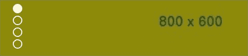
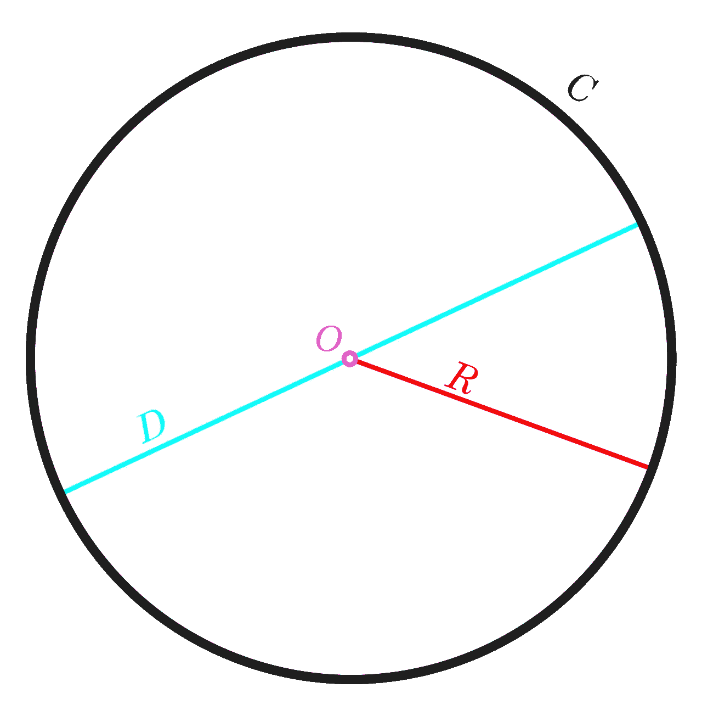

# 如何使用 Greensock 创建一个带有漂亮计时器的 JavaScript 滑块

> 原文：<https://javascript.plainenglish.io/how-to-create-a-javascript-slider-with-a-beautiful-timer-using-greensock-d811836ed7e0?source=collection_archive---------10----------------------->

让我们像在芝加哥科学与工业博物馆的网站上那样来构建滑块控件。


Photo by [Veri Ivanova](https://unsplash.com/@veri_ivanova?utm_source=unsplash&utm_medium=referral&utm_content=creditCopyText) on [Unsplash](https://unsplash.com/s/photos/timer?utm_source=unsplash&utm_medium=referral&utm_content=creditCopyText)

我刚才在这篇文章的小标题里提到的[网站](https://www.msichicago.org/)挺不错的。如果你登陆主页，你会看到背景图片在几秒钟后发生变化并向上滑动。在左侧，有一个典型的 JavaScript 点导航。它配有一个带有时间指示器的播放/暂停按钮。我将向你们展示如何在 GSAP·格林斯托克图书馆的帮助下重建甚至改进它。


Slider from Museum of Science + Industry Chicago.

让我们仔细看看。如果我在任何时候单击暂停，然后再次播放，它会跳到下一步。我假设计时器将继续旋转，直到它达到一个完整的循环，然后我们将进入下一张幻灯片。也许创建者会告诉我这是一个特性而不是一个 bug，但是我现在想忽略这个假设。


在浏览器中快速检查源代码后，看起来转盘是由一个过时的 jQuery 插件驱动的，这个插件叫做[循环](https://github.com/malsup/cycle2)。别担心，我们会从头开始建造整个系统。[结果](https://stackblitz.com/edit/js-gsap-timer-slider?file=index.js)会是这样的:


Our GSAP animated timer — pause works as expected.

## 超文本标记语言

我们首先需要 HTML 结构。你会如何建造它？你会使用哪些元素？我决定对上面显示圆点的计时器使用下面的 HTML:

```
<div class="carousel-nav">
  <div class="timer">
    <svg width="60" height="60" viewBox="0 0 60 60">
 **<circle cx="30" cy="30" r="29" fill="none" stroke="#ffffff" stroke-width="1" stroke-dasharray="182.212" stroke-dashoffset="0">  
      </circle>**
    </svg>
    <svg width="60" height="60">
      **<circle id="circle" cx="30" cy="30" r="28" fill="none" stroke="#ffffff" stroke-width="4" data-time="5" style="stroke-dashoffset: 0">
      </circle>**
    </svg>
    <span class="play" id="timer-btn"></span>
  </div> <ul class="dots">
    <li class=""><span></span></li>
    <li class=""><span></span></li>
    <li class=""><span></span></li>
    <li class="active"><span></span></li>
    <li class=""><span></span></li>
  </ul>
</div>
```

定时器有两个 SVG 圈。一个是用于薄的外侧冲程，另一个将为我们提供时间指示。注意*冲程-冲击偏移*和*冲程-冲击阵列*属性。我们将通过改变*笔画-dashoffset* 值*、*来制作较粗笔画的动画，但我们将在稍后进行。

图像滑块本身可以由几个 div 元素组成，我们为每个元素设置背景图像。对于 CSS 样式，请直接参考[演示](https://stackblitz.com/edit/js-gsap-timer-slider?file=index.js)。

```
<div class="bg-imgs">
  <div style='background-image: url("http://placehold.jp/14/597999/003366/800x600.jpg"); display: none;' class="bgimg"> <div style='background-image: url("[http://placehold.jp/14/597999/003366/800x600.jpg](http://placehold.jp/14/8f0869/003366/800x600.jpg)"); display: none;' class="bgimg"> <div style='background-image: url("[http://placehold.jp/14/597999/003366/800x600.jpg](http://placehold.jp/14/0a8f30/003366/800x600.jpg)"); display: none;' class="bgimg"> <div style='background-image: url("[http://placehold.jp/14/597999/003366/800x600.jpg](http://placehold.jp/14/0a8f30/003366/800x600.jpg)"); display: none;' class="bgimg">
</div>
```

## 圆点导航

在我们开始计时之前，让我们先准备基本的点导航。(代码片段还包含 jQuery，因为这实际上是我几年前从事的工作)。

我们可以从定义一些变量开始:

```
var allImgs = $(“.bg-imgs > div”);
var allDots = $(“.dots li”);
var currentStep = 0;
```

然后我们添加一些功能，通过点击圆点来改变背景:

```
function changeBackground() {
  allImgs.fadeOut(800);
  allImgs.eq(currentStep).fadeIn(800);
  allDots.removeClass("active");
  allDots.eq(currentStep).addClass("active");
}allDots.on("click", function() {
  var btnIndex = $(this).index();
  currentStep = btnIndex;
  changeBackground();
});$(".dots li").eq(0).addClass("active");
```

通过单击这个点，我们得到它的索引(0–3，因为我们有 4 个图像)，将它设置为 currentStep 并根据该值更改背景(隐藏所有图像并显示当前图像)。



## GSAP 动画计时器

> 《GSAP》是一部面向现代网络的专业级 JavaScript 动画。

这是网络动画的标准，并且这个库很快，包含了很多特性。你甚至可以用一些插件来创造其他非常酷的东西。我们只需要最基本的东西。

让我们添加更多的变量来控制计时器。

```
var circle = document.getElementById(“circle”);
var button = document.getElementById(“timer-btn”);**var tl = gsap.timeline();  // GSAP v3** var intervalTimer;
var timeLeft;
var wholeTime = 8;
var isPaused = false;
var isStarted = false;
**var radius = 28;**
**var initialOffset = Math.PI * 2 * radius;  // Circumference**
```

> **注意:**GSAP API 已经更改，所以您可能会遇到使用 TimelineLite 或 TimelineMax 构造函数的 v2 实例。



[Circumference = *π* × diameter = 2*π* × radius.](https://en.wikipedia.org/wiki/Circumference#/media/File:Circle-withsegments.svg)

我们定义代表圆周的*半径*和*初始偏移量*变量。

如前所述，SVG circle 元素有 *stroke-dasharray* 属性，我们将对其进行动画处理。对于半径 28，我们将得到值 175.92，我们希望将其更改为 0。

如果您查看 *#circle* 元素，您还会看到一个*数据时间*属性，我们添加该属性是为了确定动画应该持续多少秒。

我们初始化两个函数 *animateTimer()* 和 *pauseTimer()。*

```
if (circle) {
  wholeTime = parseInt(circle.dataset.time, 10);
  animateTimer();
  pauseTimer();
}button.addEventListener(“click”, pauseTimer);
```

在***animate timer()***函数中，我们使用 GSAP [时间轴*。to()*](https://greensock.com/docs/v3/GSAP/Timeline/to()) 动画显示 SVG 圆的 strokeDashoffset。我们定义目标(我们的#circle)，传递时间(duration)，将 strokeDashoffset 设置为圆的周长作为初始值，以及一些其他属性，如 repeat: -1 以无限播放它。

```
function animateTimer() {
  tl.to("#circle", {
    duration: wholeTime
    startAt: {
      strokeDashoffset: initialOffset
    },
    strokeDashoffset: 0,
    repeat: -1,
    ease: "linear",
    onComplete: tl.invalidate
  });
}
```

在下面的 ***pauseTimer()*** 函数中(我本来可以取个更好的名字)，我们基本上是检查定时器的状态。开始了还是暂停了？基于此，我们切换按钮类(播放/暂停)并控制时间轴实例。

> [tl.paused(boolean)](https://greensock.com/docs/v3/GSAP/Timeline/paused()) —获取或设置动画的暂停状态，该状态指示动画当前是否暂停。

```
function pauseTimer() {
  if (isStarted === false) {
    timer(wholeTime);
    isStarted = true;
    button.classList.remove("play");
    button.classList.add("pause");
    tl.paused(false);
  } else if (isPaused) {
    button.classList.remove("play");
    button.classList.add("pause");
    timer(timeLeft);
    isPaused = isPaused ? false : true;
    tl.paused(isPaused);
  } else {
    button.classList.remove("pause");
    button.classList.add("play");
    clearInterval(intervalTimer);
    isPaused = isPaused ? false : true;
    tl.paused(isPaused);
  }
}
```

在上面的代码中，我还调用了 *timer()* 函数，设置间隔。[*setInterval*](https://developer.mozilla.org/en-US/docs/Web/API/WindowOrWorkerGlobalScope/setInterval)*()*方法内的函数每 10 毫秒执行一次。我们计算剩下的时间，在一个完整的迭代完成后，我们重新开始时间线并更新当前步骤。

```
function timer(seconds) {
  var remainTime = Date.now() + seconds * 1000; intervalTimer = setInterval(function() {
    timeLeft = ((remainTime — Date.now()) / 1000).toFixed(2);

    if (timeLeft <= 0) {
      tl.restart();
      clearInterval(intervalTimer);
      isStarted = false;
      currentStep = currentStep + 1 < allImgs.length ? currentStep + 1 : 0;
      pauseTimer();
      changeBackground();
      return;
    }
  }, 10);
}
```

*查看* [*演示*](https://stackblitz.com/edit/js-gsap-timer-slider?file=index.js) *。*

## 摘要

我们从头开始创建了带有计时器和点导航的 JavaScript 滑块。我们几乎复制了芝加哥科学与工业博物馆网站上的那个。格林斯托克 GSAP 动画库帮助我们无缝动画圆中风，所以它看起来完美无瑕。

请随意使用演示，尝试不同的动画。你也可以重构和改进代码，因为我只升级了 GSAP 代码片段来反映库的最新版本。我想看看你的作品！

*更多内容尽在*[*plain English . io*](http://plainenglish.io/)