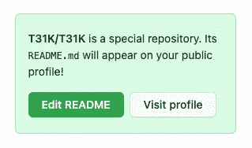
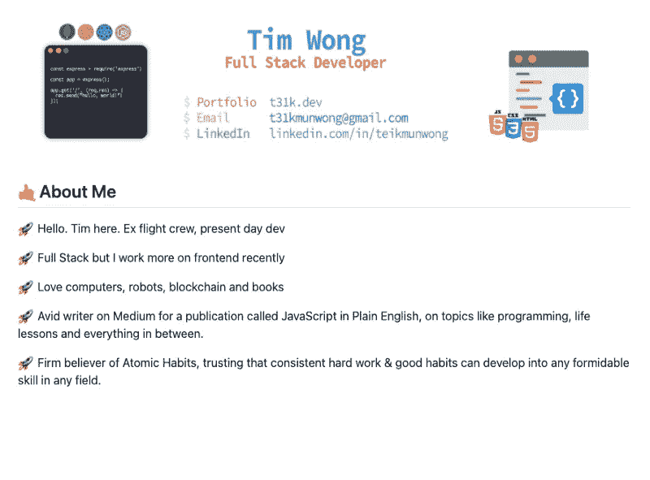
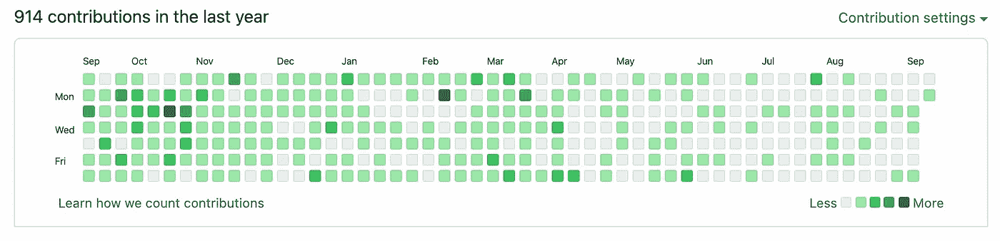
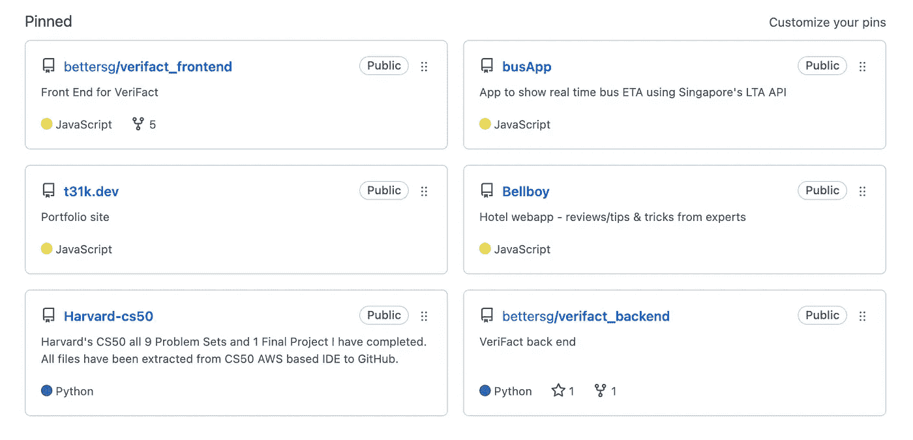

# 如何创建一个出色的 GitHub 个人资料

> 原文：<https://javascript.plainenglish.io/how-to-create-a-kick-ass-github-profile-30de733d2833?source=collection_archive---------15----------------------->

人们使用脸书结识新朋友，使用 YouTube 学习新事物，使用 Tinder 交友。但是作为开发人员，我们使用 GitHub 做所有这些事情(除了连接部分——我希望！).

通常，当试图评估一个开发人员时，我们倾向于看他们的 GitHub 档案。这是一个我们都喜欢的平台，也是我们展示项目的地方。

因此，最重要的是，我们要把我们的 GitHub 档案打磨到(近乎)完美，以改善我们的就业前景，并在机会出现时抓住它。

我们可以这样做:

## 自述文件

*自述文件*是***创建一流 GitHub 档案的第一步。因为这是人们首先会看到的东西，你可以把它想象成一个用来吸引顾客的餐馆标志。***

***人们说:你只有 7 秒钟的时间让人们给你留下印象，所以你要珍惜这 7 秒钟。***

***话虽如此，这就是为什么你需要想出一个时髦而吸引人的介绍来快速介绍你是谁。***

***要访问自述文件，您需要创建一个与您的用户名同名的特殊存储库(或 repo)。***

******

***由于 README 是一个 markdown，它支持所有的 markdown 格式功能(包括表情符号)，使事情变得更有趣。***

***以下是我的一些参考，包括一些基本信息，如:
✅职位
✅社交关系
✅简介
✅工作时做什么
✅工作之外做什么***

******

## ***提交历史记录***

******

***我之前在几个账号上提到过这个，但是提交历史*在让你的 GitHub 个人资料看起来更好看方面*真的发挥了很大的作用吗？***

***当然，这并不意味着你应该每天不必要地承诺和推动只是为了让那个绿框被选中。***

***贡献和提交计数可能非常主观，它肯定不是具体衡量生产率的最佳指标。***

***因此，我不会说这是一个数字游戏。但是，你仍然应该保持一个相对频繁的提交(一般情况下)和 GitHub 的习惯。***

***乍一看，它肯定会让你的个人资料看起来更赏心悦目，而且它显示了一般的活动。***

***在与其他几个大型项目的开发人员合作时，经常提交也是一种最佳实践。***

***总的来说，保持相对频繁的贡献会让你赢得一些印象分。***

## ***固定项目***

******

***GitHub 允许在您的个人资料中最多锁定 6 个回购。虽然这取决于你的偏好，但我建议你至少放 4-6 个项目。***

***因为我主要申请前端工作，所以我把大部分用 JavaScript 构建的项目放在最上面。你也可以这样做来强调你的潜在雇主想要寻找什么。***

***特别是对于新的开发者，你可能没有太多东西可以展示，所以使用这些图钉来展示你的杰作吧！***

***没有什么比看到一个候选人有一大堆个人项目更令人耳目一新的了，因为这展示了学习的热情和意愿，而这是许多人低估的一个关键特质。***

## ***干净的代码***

***这更像是一条一般性的建议，但是你应该为人们*实际上*点击你的项目并浏览你的代码的可能性做好准备。***

***编写干净的代码是优秀程序员的开发范例，它展示了良好的基础和执行解决方案的简洁方式。***

***许多开发人员也喜欢把事情复杂化，当他们有更简单的选择时，就写一些夸张的函数。***

***我不会用细节来烦你，因为我确信有太多的文章在谈论编写干净的代码。***

***当然，除非你购买了罗伯特·马丁 的《清洁代码》——[*这本书，否则你无法升级为开发者，所以一定要去看看。*](https://www.amazon.sg/Clean-Code-Handbook-Software-Craftsmanship/dp/0132350882/ref=asc_df_0132350882/?tag=googleshoppin-22&linkCode=df0&hvadid=389124471048&hvpos=&hvnetw=g&hvrand=11051490016543932949&hvpone=&hvptwo=&hvqmt=&hvdev=c&hvdvcmdl=&hvlocint=&hvlocphy=9062549&hvtargid=pla-435472505264&psc=1)***

## ***出色的文档***

***这里适用的另一条建议是编写优秀的文档。***

***文档是编程中经常被忽视的部分，但在确保其他开发人员知道你实际上在做什么方面却扮演着如此重要的角色。***

***伟大的文档首先应该包括:你试图解决什么问题，你如何用代码解决它？这应该让人们理解你试图解决的问题的基本假设。***

***接下来，展示你如何解决问题的用例。现在许多文档都包括演示(图片/gif ),以帮助他们的用户更容易地可视化你的解决方案。***

***最后但同样重要的是，您应该始终包括安装说明和所需的依赖项，以及对人们可能遇到的安装错误的任何修复。***

*****额外收获**:就我个人而言，我喜欢在*中包含我的思考过程，即为什么*我选择了这种特殊的方式来解决问题——例如，数据库结构、设计决策、框架选择、可伸缩性。***

***这可以让招聘经理更好地了解你的心理状态，展示你有效沟通你的想法和实施方法的能力。***

## ***最后的想法***

***如果你正确地遵循它，你的 GitHub 将开始在其他认为它理所当然的开发者中大放异彩。***

***仅凭我的 GitHub 个人资料，我就能不时地胜过其他比我更有经验的求职者，甚至有几个人获得了工作机会。***

***我希望这也能帮助你理解 GitHub 有多重要，以及为什么你应该花时间来完善它。***

***它需要时间来打磨，但一旦它开始运行，它会像钻石和海扁王一样闪闪发光！***

***像往常一样，保重，下次再见。
~蒂姆***

***请考虑[给我买一杯☕️咖啡](https://www.buymeacoffee.com/t31k)。
加入我的媒体邮件列表[这里](https://t31k.medium.com/subscribe/)📪
当我[发布](https://t31k.dev/newsletter)(非中等会员)时收到邮件***

****更多内容请看*[***plain English . io***](http://plainenglish.io/)***