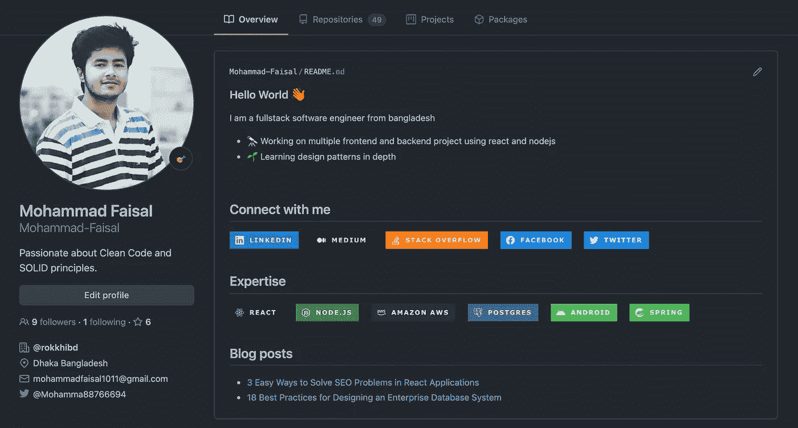
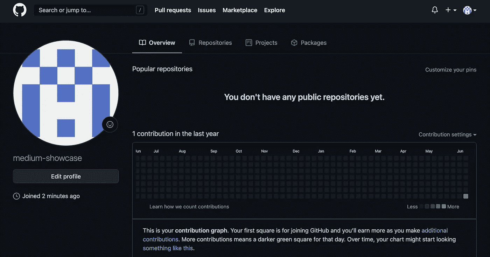
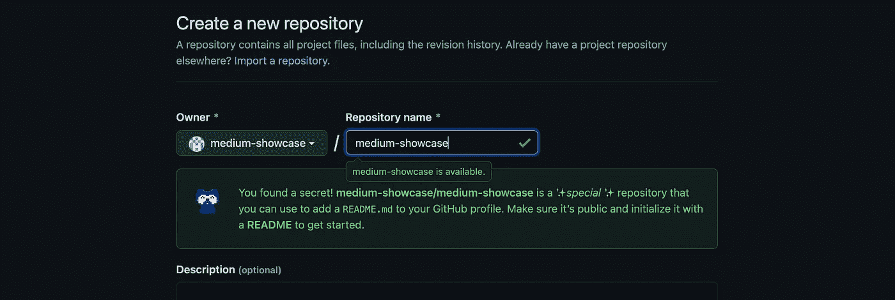
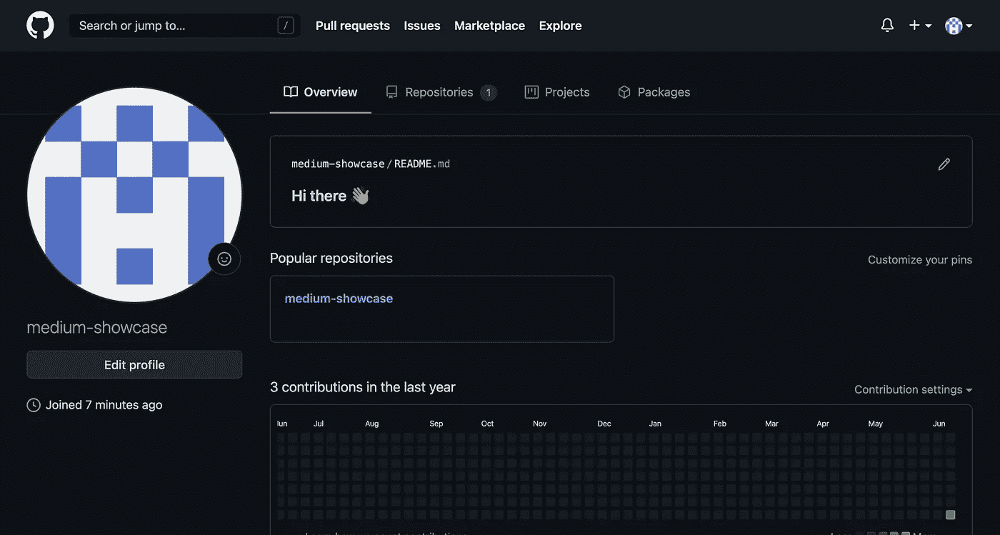
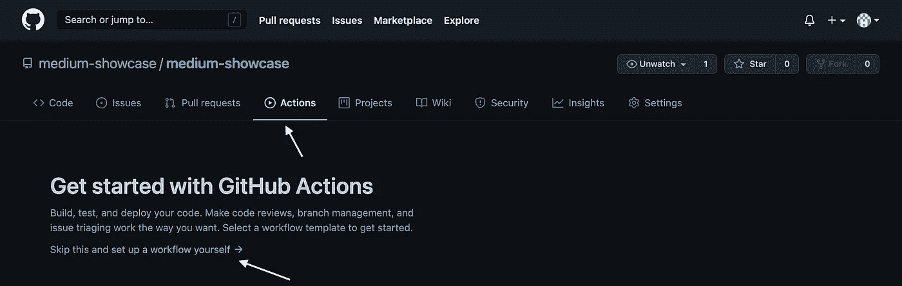
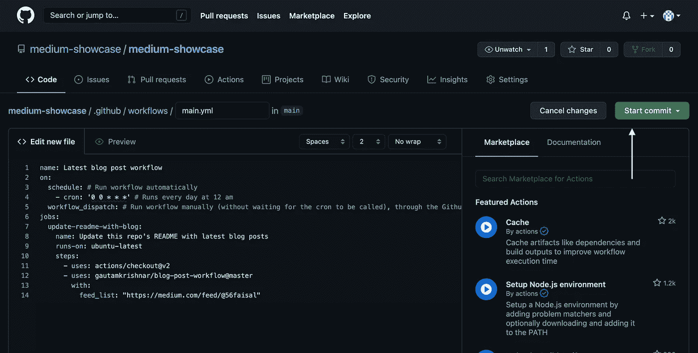
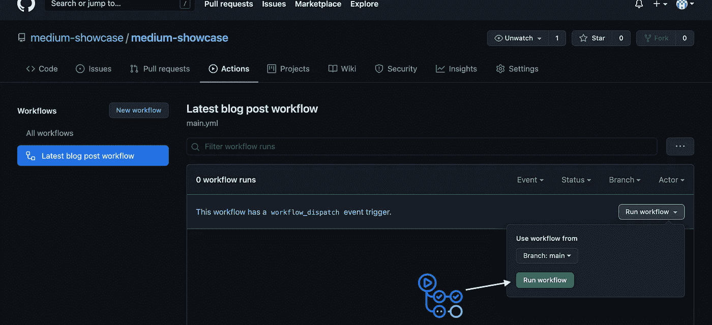
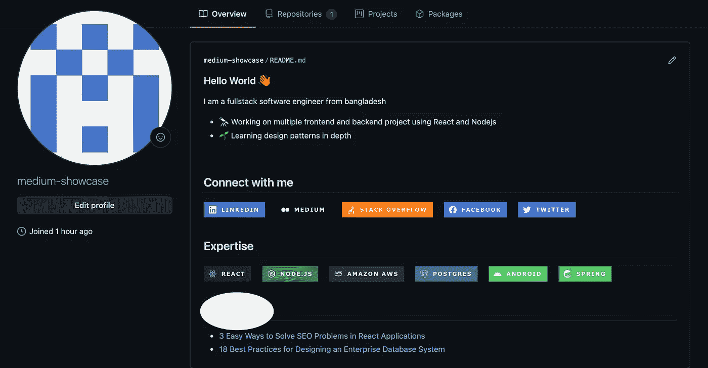

# 如何在 5 分钟内创建一个很棒的 GitHub 简介

> 原文：<https://javascript.plainenglish.io/how-to-create-a-kick-ass-github-profile-in-5-minutes-19a8e8d0693b?source=collection_archive---------1----------------------->

## 第一印象是最后的。让它有价值！



Authors Github Profile

作为开发者，你的 GitHub 档案是你最重要的档案。这是你简历上列出的第一份，有时也是唯一的一份资料。

在你的个人资料中加入一些与众不同的东西可以对他人的思想产生积极的影响。这也非常非常容易做到。那么，为什么不呢？

今天，我们将看到如何为您的 GitHub 个人资料创建一个漂亮的登录页面。只需 5 分钟即可完成！

我们开始吧！

# 步骤 1:创建 Github 概要文件

我很确定你已经有一个 GitHub 档案了。如果没有，那么这篇文章可能不适合你。

为了这篇文章，我在 GitHub 上创建了一个新的个人资料。如果你去你的个人资料页面，你会看到这样的内容。



Normal Github Profile

这很简单。你的个人信息在左边，你的贡献在右边。

# 步骤 2:创建新的存储库

现在，创建一个新的存储库，并将其命名为与您的用户名相同的名称。

我们正在使用的档案的用户名是`medium-showcase`。因此，我们正在创建一个名为 medium-showcase 的存储库。



Create a new repository

看看你页面的底部，这里说这个库是一个特殊的库，应该是公开的。

选中下面的复选框创建一个`README.md`文件。您在此文件上放置的任何内容都将显示在您的个人资料中。

默认情况下，它有一个名为“你好！👋."因此，如果您现在打开您的个人资料，它将看起来像这样。



Profile with the initial readme

让我们更新我们的`Readme.MD`文件来创建一个漂亮的个人资料。

# 步骤 3:更新自述文件

现在，转到存储库并编辑文件。首先，我们直接复制粘贴下面的代码，看看结果。

```
### Hello World 👋
I am a fullstack software engineer from bangladesh- 🔭 Working on multiple frontend and backend project using React and Nodejs
- 🌱 Learning design patterns in depth
<br>## Connect with me[]([https://www.linkedin.com/in/mohammad-faisal-2665b5134](https://www.linkedin.com/in/mohammad-faisal-2665b5134))[]([https://56faisal.medium.com/](https://56faisal.medium.com/))[]([https://stackoverflow.com/users/5379437/mohammad-faisal](https://stackoverflow.com/users/5379437/mohammad-faisal))[]([https://www.facebook.com/56faisal/](https://www.facebook.com/56faisal/))[]([https://twitter.com/Mohamma88766694](https://twitter.com/Mohamma88766694))<br>
<br>## Expertise
<br>
<br>
```

现在，打开你的个人资料，看看神奇之处。您的个人资料现在是这样的。


Your Awesome Looking

哇，厉害！但是我们还有一些工作要做。

# 第四步:定制

我在这里添加了两个部分— `Connect with me`和`Expertise`。如果你仔细观察`Connect with me`下的图标，就会发现每个社交媒体平台都有链接。

```
[]([https://www.linkedin.com/in/mohammad-faisal-2665b5134](https://www.linkedin.com/in/mohammad-faisal-2665b5134)) -> see here
```

*所以，你需要* ***用你自己的个人资料链接替换这些链接。***

此外，如果您想在您的个人资料中添加更多图标和链接，请访问 [https://img.shields.io](https://img.shields.io/badge/linkedin-%230077B5.svg?&style=for-the-badge&logo=linkedin&logoColor=white) ，甚至在那里创建您自己的徽章！

# 额外收获:获得你的媒介故事

你是一个博客写手，也喜欢把你的故事放在你的个人资料里吗？那太好了。但是，我们是否需要每次在 Medium 上发布新故事时手动更新我们的个人资料？

当然不是。我们是开发者，自动化是我们最好的朋友。我们将创建一个由`[github-actions](https://github.com/features/actions)`运行的 cron 作业。

> 如果你对`github-actions`一无所知，那也不用担心！这是一段将由 Github 为我们自动运行的代码。

转到您刚刚创建的`Readme.md`文件，并在文件底部添加以下部分。

```
## Blog posts
<!-- BLOG-POST-LIST:START -->

<!-- BLOG-POST-LIST:END -->
```

这将作为博客链接的占位符。

# 下一步:添加 GitHub 动作

现在，我们将为您的存储库创建一个新的操作。有一个很牛逼的[动作模板](https://github.com/marketplace/actions/blog-post-workflow)可以直接用。此操作将从您的媒体个人资料中获取博客，并将其放在您的 GitHub 个人资料页面上。

转到操作选项卡并点击`**set up a workflow yourself**`按钮。



您将看到一个带有代码编辑器的屏幕。在那里添加以下代码。

mediumblogpost.yml

> 在文件的底部，您可以看到一个链接。这是我在 Medium 上的个人资料的链接。将它更改为包含您自己的个人资料。

然后使用右键提交文件，就差不多完成了。



Commit the action file

目前，它被设置为每天午夜运行。你可以根据你的意愿改变它。要了解 cron jobs，你可以去[这里](https://crontab.guru/every-night-at-midnight)。如果您想现在运行操作并查看结果，请再次转到`Actions`选项卡并点击`Run Workflow`按钮。



Run workflow

工作流程将运行，您的媒体故事将出现在您的 GitHub 个人资料中。打开您的个人资料，看看神奇！



Final result

# 结论

还有很多其他方法可以制作一个漂亮的 GitHub 个人资料页面。我一直保持它的简单和功能。让我知道你是否喜欢它。

如果你感兴趣的话，这是我的真实资料。

祝您愉快！

**通过**[**LinkedIn**](https://www.linkedin.com/in/56faisal/)**或我的** [**个人网站**](https://www.mohammadfaisal.dev/) **与我取得联系。**

[](https://betterprogramming.pub/22-best-practices-to-take-your-api-design-skills-to-the-next-level-65569b200b9) [## 22 个最佳实践，让您的 API 设计技能更上一层楼

### 设计 REST APIs 的实用建议

better 编程. pub](https://betterprogramming.pub/22-best-practices-to-take-your-api-design-skills-to-the-next-level-65569b200b9) [](https://levelup.gitconnected.com/think-twice-before-joining-large-companies-as-a-junior-engineer-a1179c967642) [## 作为初级工程师加入大公司前要三思

### 你梦想中的工作可能是你未来最糟糕的投资！

levelup.gitconnected.com](https://levelup.gitconnected.com/think-twice-before-joining-large-companies-as-a-junior-engineer-a1179c967642) 

## 资源:

*   工作流程:[https://github.com/marketplace/actions/blog-post-workflow](https://github.com/marketplace/actions/blog-post-workflow)
*   克朗伯:【https://crontab.guru/every-night-at-midnight】T2
*   图标:【https://shields.io/ 

*更多内容请看*[***plain English . io***](http://plainenglish.io/)