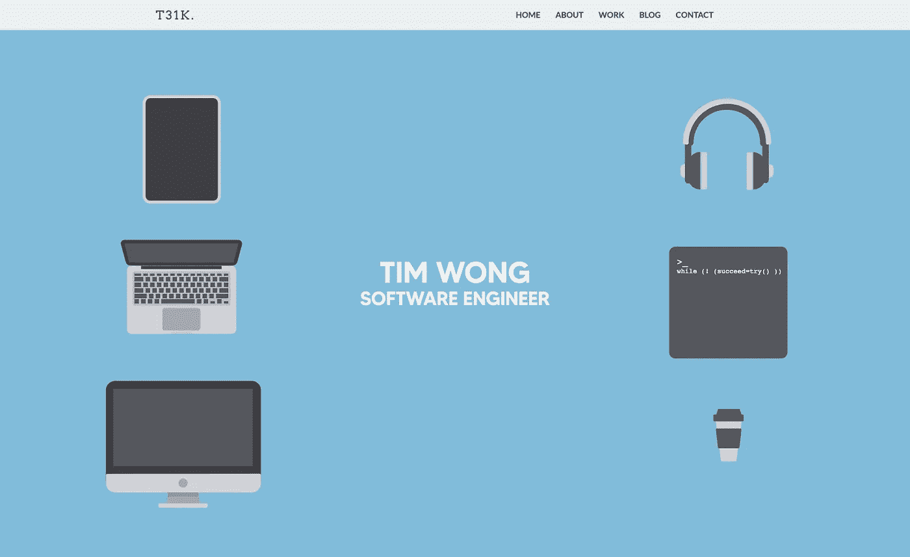
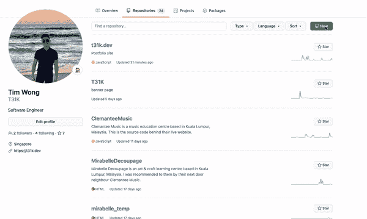
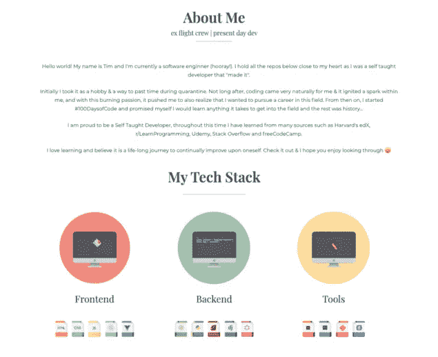
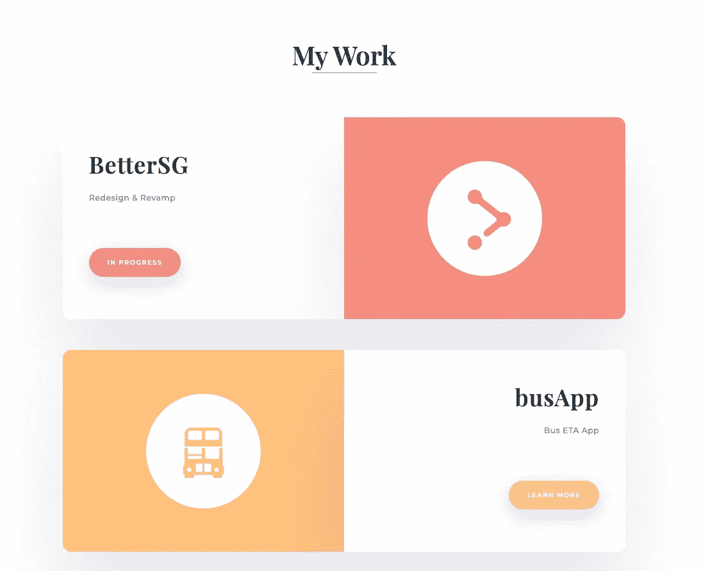
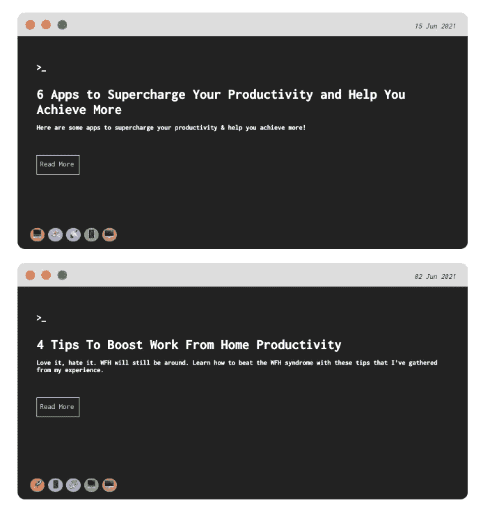
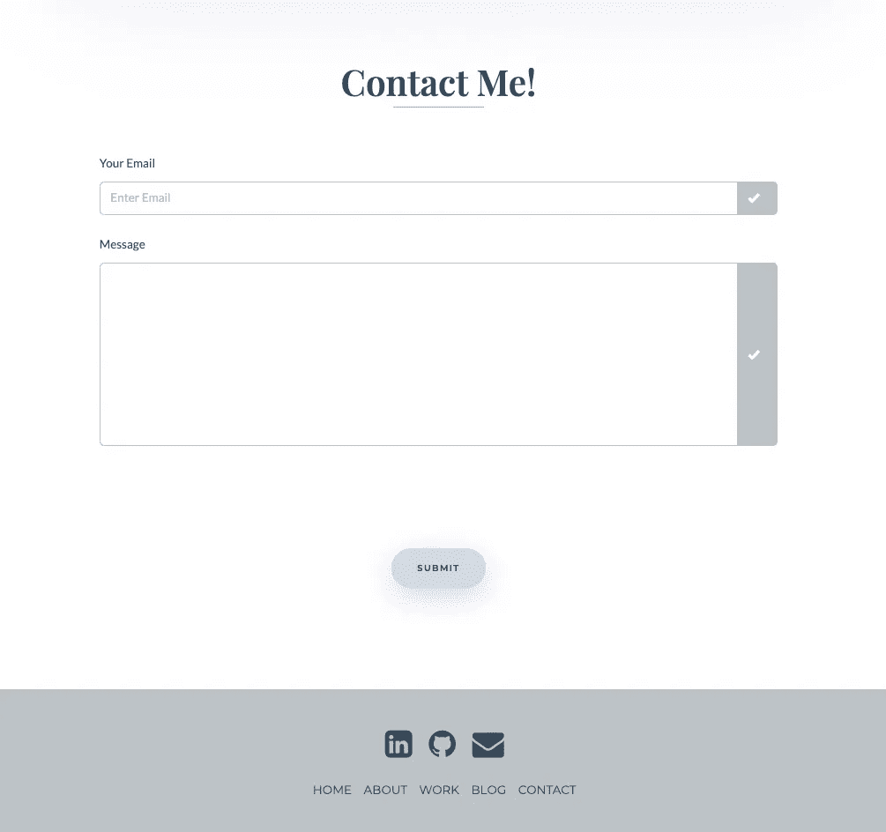
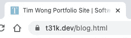
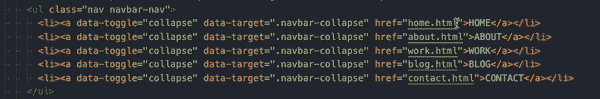
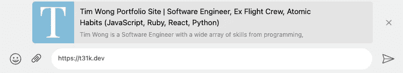
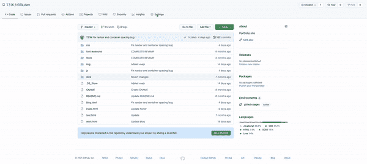

# 如何创建一个能让你的下一任雇主惊叹的优秀作品集网站

> 原文：<https://javascript.plainenglish.io/how-to-create-a-kick-ass-portfolio-site-that-will-wow-your-next-employer-5e5e2009222?source=collection_archive---------1----------------------->



作品集网站，任何优秀求职申请的基石。它们是培养你的个人品牌，向雇主和就业市场推销你和你的技能的一种方式。

今天我将带你浏览如何创建一个出色的投资组合网站，给你的下一任雇主留下深刻印象。所以事不宜迟，让我们开始吧！

来自未来🛸的❗️更新，以下是一些后续文章:
🚀 [*建立作品集网站时不要再犯这 4 个错误*](/top-4-mistakes-to-avoid-when-building-a-portfolio-site-57aab6572353)🚀 [*如何在你的网站上显示中型帖子*](https://t31k.medium.com/how-to-display-medium-posts-on-your-website-1be84713b4ce)

## 步骤 1—自定义域

首先，前往 [*Namecheap*](https://namecheap.com) 或 [*GoDaddy*](https://godaddy.com) 并花大量时间购买你想要的域名，这是重要的一步，因为这个域名将作为你个人品牌的名称**。**

你的域名最好应该是:

*   包含你的真实姓名
*   难忘(容易记住)
*   有意义的
*   易于阅读

如果你有一个相当普通的名字，你想要的域名可能会被世界上某个地方的一个二重身取去。不要害怕，尝试使用不同的 TLD，如。net |。gg |。dev |。cc |甚至|的。人工智能

这里有一些选择名字的好例子

约翰·史密斯—[https://the johnsmith . dev](https://alextiong.dev)

哈利·波特—[https://Harry Potter . gg](https://harrypotter.gg)

火影忍者 Uzumaki—[https://narutouz.com](https://narutouz.com)

## 步骤 2-托管您的投资组合网站

现在你有了一个万维网的地址，是时候选择一个主机提供商在那个特定的地址建一所房子了。

Wix、WordPress、Squarespace 都是很棒的网站建设者&我个人喜欢 WordPress *但是*当你在建立一个组合网站时:你应该展示你在建立一个应用程序/网站方面的技能。(不适用——如果你在找 WordPress/Wix/Squarespace 工作)

而是使用 GitHub 页面。它是完全免费的，你可以在你的 GitHub 个人资料上展示你的源代码。首先:

2.1 创建新账户

2.2 创建一个新的存储库(repo)——像这样👇



一旦我们准备好并设置好了，我们将需要把这个回购链接到自定义域。稍后会详细介绍。

## 步骤 3 —引导模板

有很多 CSS 框架，但是 Bootstrap 仍然是最流行的 CSS 框架，这是有原因的。web 上大约有 1800 万个站点是使用 Bootstrap 构建的，所以可以肯定的是，与其他框架相比，Bootstrap 会有更多的模板。

也就是说，找到一个好的引导模板对于建立一个漂亮而实用的作品集网站是至关重要的。以下是一些好的网站:

1.  [https://startbootstrap.com/themes](https://startbootstrap.com/themes)
2.  https://www.creative-tim.com/bootstrap-themes/free
3.  【https://themewagon.com/theme_tag/free/ 
4.  [https://themefisher.com/free-bootstrap-templates/](https://themefisher.com/free-bootstrap-templates/)

其中大部分是免费的，质量绝对不会打折扣。你也可以选择高级的，只要它们在你的预算之内。

你可能也想知道为什么我们使用一个引导模板，而不是从头开始写。事实上，你可以。但是我相信没有必要*重新发明轮子*，因为毕竟我们不只是下载模板并把它改成我们的名字。

相反，我们将把它作为一个基础来建立，因此消除了从零开始重新创建一切的需要。👍🏻

## 步骤 4 —内容规划

现在，我们已经从投资组合模板中获得了网站的框架，我们需要计划内容应该如何。基本上，你的作品集网站应该包含这些信息。排名不分先后，但我发现这种安排是最有效的，能提供最好的用户体验和阅读流量。

**4.1 简介**

这个介绍应该是关于你自己的简短的一句话，描述一下你的性格/兴趣/个性。下面是我的，供参考:左边是我的名字和工作职位，我最喜欢的苹果设备，右边是我的爱好。


你也不应该在第一页放弃太多，因为你想抓住用户的注意力，并鼓励他们向下滚动以了解更多。

**4.2 关于我**

在这里，我们可以写一篇关于我们自己、我们的过去和我们未来目标的短文。把你的技术资料包括进去也是不错的，这样任何人都可以大致了解你有什么技能(和没有什么技能)。



**4.3 项目**

很明显，但这是最重要的部分，也是最常被看到的部分。这一部分将介绍你做过的所有项目。你甚至可以包括工作中你真正感到自豪的项目，当然还有你个人的兼职项目。



**4.4 博客(可选)**

拥有一个博客是可选的，但强烈推荐，因为它创造了一个个人品牌。利用这一点，你可以用你的个人兴趣、奋斗和你如何克服它们，以及你未来的目标，在任何人的心中创造一个持久的效果。这里我有一些简单的 JavaScript 代码来从 Medium 中提取一组帖子。



**4.5 联系方式**

一个伟大的(投资组合)网站如果没有一个有效的行动号召(CTA)是不完整的，它可以让你的潜在雇主轻松地给你发邮件或打电话。一个定制的[表单](https://formspree.io/)允许你的用户给你发邮件，已经被证明是非常有效的。最重要的是，你还应该包括 LinkedIn/GitHub 链接，以便他们与你进一步互动。



## 步骤 5——清理

**5.1** `**.html**` **扩展**

如果你使用的是引导模板，那么所有的`href`都可能是另一个带有`.html`扩展名的 HTML 页面。这样会让你的链接丑成这样。



当然我们不希望这样，所以我们可以从每个`.html`文件中的所有`href`中移除`.html`扩展名&替换为使用`/`。这里有一个例子👇



不要担心无法访问`localhost`上的页面，因为 GitHub Pages 会为您处理所有的路由，这也是 GitHub Pages 令人惊叹的另一个原因。

**5.2 标题&描述标签**
在每个`.html`文件的顶部，确保包含这两行代码

```
<**title**>Tim Wong Portfolio Site | Software Engineer, Ex Flight Crew, Atomic Habits (JavaScript, Ruby, React, Python)</**title**><**meta** name="description" content="Tim Wong is a Software Engineer with a wide array of skills from programming, writing, design. Love to meet new people & learn all about startups and businesses.">
```

这样，当你分享你的投资组合网站的链接时，它将包括这样的细节，看起来更好，不是吗？😉



## 步骤 6—部署

现在我们准备好向世界展示你的杰作了。继续将您的文件夹初始化为 Git 存储库。回到 repo 链接，复制 GitHub 给出的命令行代码(参考步骤 2.2)。这些命令应该类似于以下内容:

```
git init
git add .
git commit -m "First commit"
git branch -M master
git remote add origin https://github.com/T31K/Portfolio-Site.git
git push -u origin master
```

如果你成功地做到了以上几点，你的 GitHub repo 应该是这样的。最后一步是告诉 GitHub 从您推送的文件中构建页面。

前往设置>页面和

1.  选择`master`或`main`分支来构建您的页面
2.  插入您在步骤 1 中设置的自定义域
3.  确保您选中了强制 HTTPS 以确保对您站点的安全浏览



## 第七步——敬畏你的杰作

恭喜你，你已经成功创建了*自己的*作品集网站！去现场，想看多久就看多久，感谢你付出的努力，给自己一个坚定的鼓励。

当然，这不是结束，但这是一个很好的开始。这只是一个开始，你应该*定期*回来更新它，这样你的内容会保持新鲜，你会对新的机会和寻找合适候选人的招聘人员敞开大门。

像往常一样，保重，下次再见。

定时（timing 的缩写）

如果你喜欢我的内容，请考虑给我买一杯☕️.咖啡
如果你想在我再次发帖时收到邮件通知，请考虑[订阅](https://t31k.dev/newsletter)。(是免费的)

*更多内容请看*[*plain English . io*](http://plainenglish.io/)