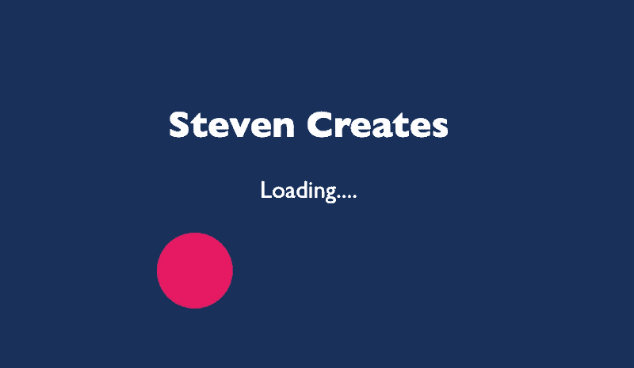

# 如何使用成帧器运动和反作用创建加载微调器

> 原文：<https://javascript.plainenglish.io/how-to-create-a-loading-spinner-with-framer-motion-and-react-70ee6d48b325?source=collection_archive---------5----------------------->

## 创建一个只带有成帧器运动和反作用的加载微调器


Photo by [James Owen](https://unsplash.com/@jhjowen?utm_source=medium&utm_medium=referral) on [Unsplash](https://unsplash.com?utm_source=medium&utm_medium=referral)

# 内容

*   介绍
*   成帧器运动
*   运动分量
*   入门指南
*   有生命的
*   过渡
*   最初的
*   装载状态
*   解决办法

# 介绍

在本文+ guide 中，我们将创建一个加载微调器，您可以用一百万种不同的方式对其进行定制。在成帧器运动和反应的帮助下，它变得前所未有的好。

如果这是您第一次使用 Framer Motion，这不是必需的，但我建议您先通读我的文章“如何使用 Framer Motion 进行反应”，以了解更多的基础知识。*底部链接。*

# 成帧器运动

让我们来谈谈 Framer Motion，它是什么，Framer Motion 提供了一个简单的应用编程接口，使过渡和动画功能强大。因为它让事情变得如此简单，你可以用它做一些非凡的事情，真正把动画带到一个新的水平。

# 运动分量

Framer Motion 为每个 HTML 和 SVG 元素提供组件。例如:motion.div、motion.header、motion.button、motion.circle 等。

这些组件的工作原理与它们的对应组件完全相同，但是通过将它们与 Framer Motion 一起使用，您可以访问允许您执行以下操作的道具:

*   添加拖动、平移、悬停甚至点击等事件手势。
*   用强大的动画回应这些手势。
*   最初动画元素，甚至无限动画元素。
*   通过变体在整个反应树中设置动画。

# 入门指南

*成帧器-Motion 要求您使用的是 React 版本 16.8 或更高版本。*

在你的反应应用程序中，运行以下命令来安装我们的成帧器运动依赖。

```
npm install --save framer-motion
```

现在它已经安装好了，您可以通过以下方式将 Motion 导入您的组件

```
 import { motion } from “framer-motion"
```

太棒了，在这一点上，我们增加了框架运动到我们的项目中。

我也将使用样式化的组件来使我的页面布局更漂亮。现在，这不是必需的，您可以很容易地在级联样式表中添加 CSS。但是如果你想要和我一样的代码，在你的项目中安装样式化的组件。

```
npm install --save styled-components
```

现在让我们得到一些入门代码，让它变得简单！我已经创建了这个 GitHub 要点，你可以复制。

不要为 CSS 感到压力，这只是为了重新开始并集中我们的内容，绝对不是必需的。如前所述，您可以将这个 CSS 加载到样式表中，并给它一个容器类，然后将其添加到 div 中。

一旦你复制并运行了它，我们就可以开始了！

# 有生命的

现在我们已经启动并运行了，我们已经安装了 Framer Motion，我们的起始代码也准备好了，我们可以开始制作动画了！这让我很兴奋！

如前所述，当创建运动元素时，就像我们在`motion.div`中所做的那样，我们现在可以使用道具来制作动画了！

因为我们正在创建一个旋转器，所以让我们旋转 div，享受半径的乐趣，让它看起来像是从屏幕的一边滚动到另一边。

我们可以通过传递`rotate`来做到这一点，它告诉我们将元素旋转 360 度。然后我们简单的`borderRadius`动画从一个圆回到它原来的半径。最后但同样重要的是，使用`x`在 x 轴上移动。

```
*animate*={{
       rotate: 360,
       borderRadius: [ "50% 50%", "2% 50%"],
       x: 75
}}
```

这有多简单？只需一个道具，你就可以做到这一切！

您会注意到，当您刷新页面时，这种情况发生得相当快，并且还没有完成我们希望它完成的所有事情。所以让我们进入过渡阶段。

# 过渡

过渡可以让你的动画从煤炭到钻石，让我们深入到过渡道具，让我们让这个动画重复和减速。

让我们来谈谈翻转属性，翻转使用像`rotate`或`scaleY`这样的变换自动将属性转换成高性能的动画。在我们的例子中，我们传递的是`Infinity`,它不是一个字符串，而是一个内置在全局 JavaScript 中的全局变量。`Infinity`的值大于任何其他数字。

```
*transition*={{
      flip: Infinity,
      duration: 2,
      ease: "easeInOut",
}}
```

这下更顺畅了。我们的动画现在无限地来回移动，就像在加载数据一样！

# 最初的

在我看来，我希望看到加载程序开始时稍微偏左一点，所以让我们给它添加一个初始状态。这个初始状态将在这个位置启动元素。

*注意:这个初始状态可以用于任何动画，我经常看到它和不透明一起使用。*

```
*initial*={{
x: -75
}}
```

太好了，这真是太好了。

# 装载状态

现在，由于我们不处理任何数据，我们将不得不模仿这个工作流程。我们可以从 React 导入`useState`，并使用 JavaScript 中的逻辑 AND `&&`将其设置为布尔值，以便只显示加载器。

接下来，我们将需要使用一个按钮或其他东西来将状态从`false`更改为`true`我将为我的 onClick 使用`h2`标题来保持它的整洁。这应该让您知道如何让这个加载器在等待数据时显示，然后在数据被检索到时隐藏它

```
import { useState } from 'react';const [isLoading, setIsLoading] = useState(true)const loading = () => {
    setIsLoading(!isLoading)
}{*/* CLICK ME!!! */*}<h2 *onClick*={loading}>Steven Creates</h2>{isLoading && ( <> <span>Loading....</span> <br/> <motion.div
```

现在，通过点击 H2，加载程序现在显示并开始动画，我想这给你的想法。😅

# 解决办法

你成功了！下面是最终代码！请随意复制和使用。

如果您一直这样做，您现在应该有一个如下所示的加载程序:



您现在有了一个可以修改并制作自己的示例！可能性是无限的。再次感谢你花时间阅读这篇文章，我希望它能帮助你。

查看我的其他关于框架运动的指南和其他文章:

[](https://medium.com/@steven_creates/how-to-use-framer-motion-with-react-a2639b6b9b6b) [## 如何将帧运动与 React 一起使用

### 本系列指南+文章将介绍 React + Styled 中使用的成帧器运动的示例和概念…

medium.com](https://medium.com/@steven_creates/how-to-use-framer-motion-with-react-a2639b6b9b6b) [](https://medium.com/@steven_creates) [## 史蒂文创造-中等

### 本系列指南+文章将介绍 React 和 React 中使用的成帧器运动的示例和概念…

medium.com](https://medium.com/@steven_creates) 

再次感谢阅读！