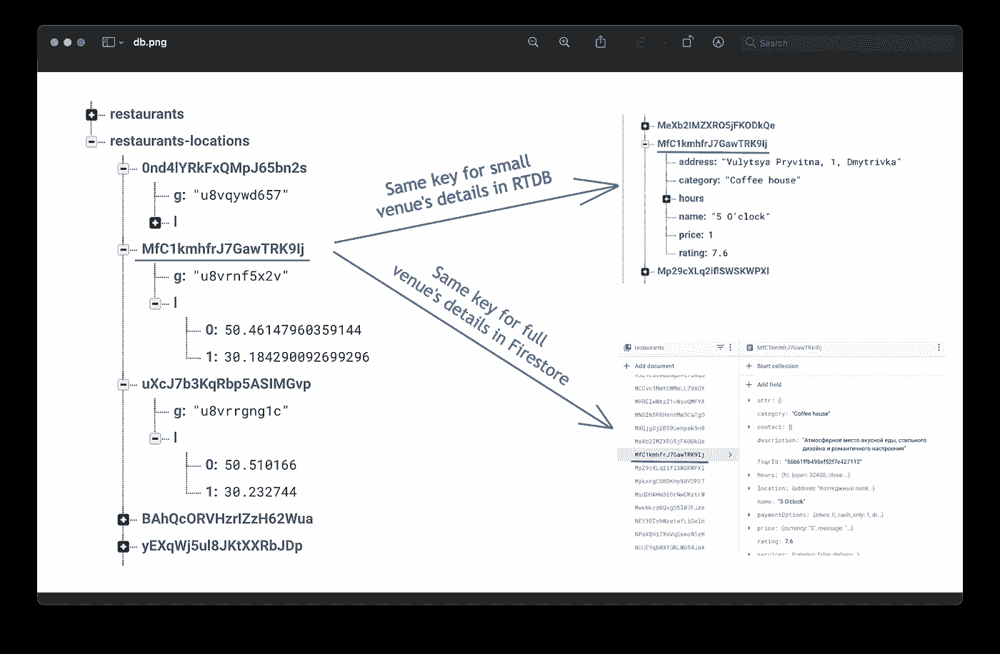
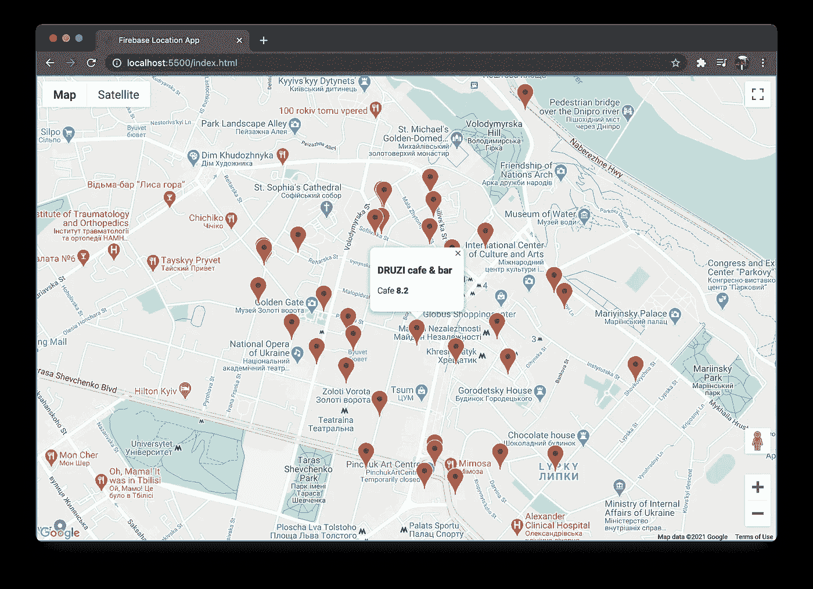

# 如何使用 Firebase 创建基于位置的应用程序

> 原文：<https://javascript.plainenglish.io/how-to-create-a-location-based-app-with-firebase-f8427d4bd6f7?source=collection_archive---------6----------------------->

## 使用 Firebase 实时数据库和 Firestore 浏览附近的地方


Photo by [CardMapr.nl](https://unsplash.com/@cardmapr?utm_source=medium&utm_medium=referral) on [Unsplash](https://unsplash.com?utm_source=medium&utm_medium=referral)

想象一下，你需要创建一个应用程序，在地图上显示用户周围的一些地方。比如 Foursquare 或附近有自动取款机的银行应用。这个应用程序的主要功能是地理查询。你可以在特定坐标周围的半径范围内搜索物体。


Firebase 可以解决这样的任务。你可以打开关于地理查询的[官方文档](https://firebase.google.com/docs/firestore/solutions/geoqueries)，按照说明进行操作。你会问，这篇文章的原因是什么？我会告诉你。为了合理的定价，构建一个可扩展的定位器应用程序并不是那么简单。

您可以对两个数据库使用地理查询:**实时数据库**和 **Firestore** 。但是他们两个都会有陷阱:

1.  用**实时 DB** 跑步需要支付流量。所以当用户观看关于这个地方的细节时，他加载了数据，你需要为这个(流量)付费。
2.  **Firestore** 数据库为您的读/写操作收费。因此，当用户浏览附近的地点时，即使他没有打开详细信息，每个地方都算作一个单独的文档阅读。

对于第一种观点，看起来他们两个都会榨干你的钱。但是这是一个很好的例子，它表明您并不局限于只为项目选择一个数据库。

选择这两个地点，使用实时数据库在地图上显示标记，使用 Firestore 数据库显示地点的详细信息。它将以合理的价格提供最佳的性能和可扩展性。

## 构建应用程序

让我向您展示一个简单的演示，并实现一个用户周围的位置应用程序。

首先，让我们定义最小的 HTML 和 CSS 文件。

在 HTML 中，我们从 CDN 加载了几乎所有的脚本，但是对于 GeoFire，我们需要用 npm 安装，从 node_modules 加载。

```
npm install geofire firebase
```

使用 google maps SDK，我们在查询参数中指定了回调名称。当 SDK 准备好时，Google maps 将调用它。让我们定义这个回调和其余的逻辑。

> **注意:** GeoFire 是 Firebase 的一个轻量级附加组件。GeoFire 在 Firebase 实时数据库中以其格式和位置存储数据，以保持简单。

因此我们可以将标记存储为 GeoFire 对象。在填充数据库期间，我们可以用相同的密钥保存 Firestore 中的文档的全部细节。如果我们需要在地图上显示小型场馆模型，我们可以在实时数据库中存储小型场馆的详细信息。向实时数据库发出几十个小请求是没问题的。它不会影响项目绩效。



Location app database structure

这是我们的简单演示看起来的样子。我们从查询地火接收标记。这个对象将包括坐标和一个键。通过按键，当用户点击场地时，我们可以从 Firestore 加载完整的细节。



Realtime location app demo

## 结论

这种架构使用户能够以非常高效和廉价的方式浏览附近的场馆。甚至可能是免费的。如果你的应用平均每次搜索显示 40-50 个位置，那么免费层将足够每天进行 50 000 次搜索。这足以启动一个 MVP，并以零成本测试你的项目。

感谢阅读！

*更多内容尽在*[*plain English . io*](http://plainenglish.io/)