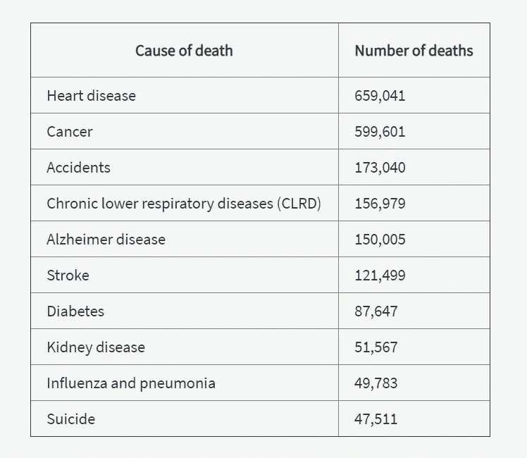
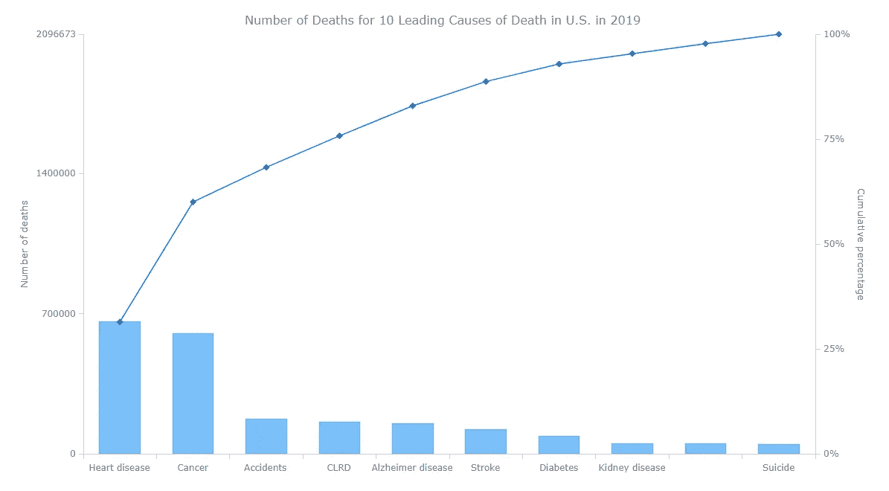
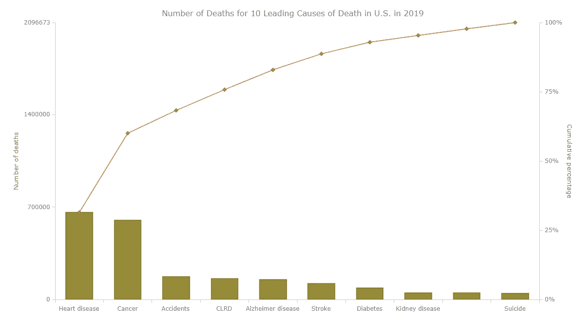
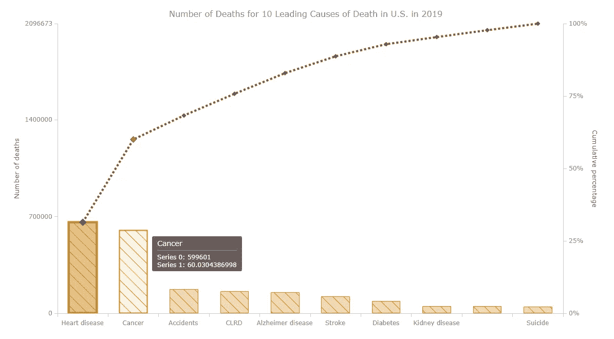
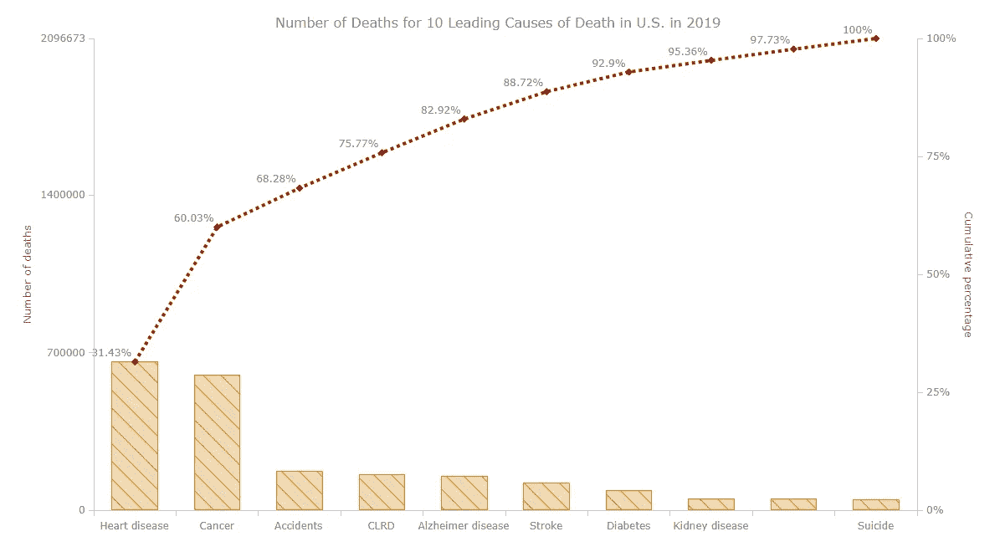
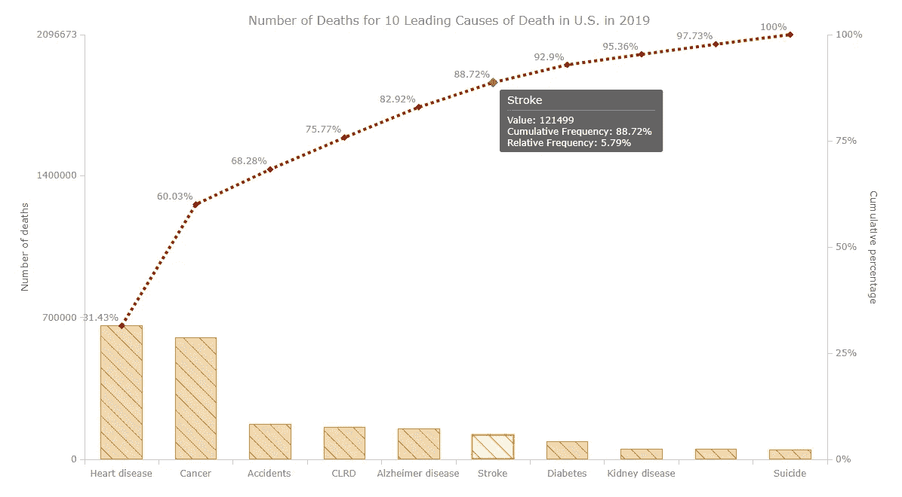
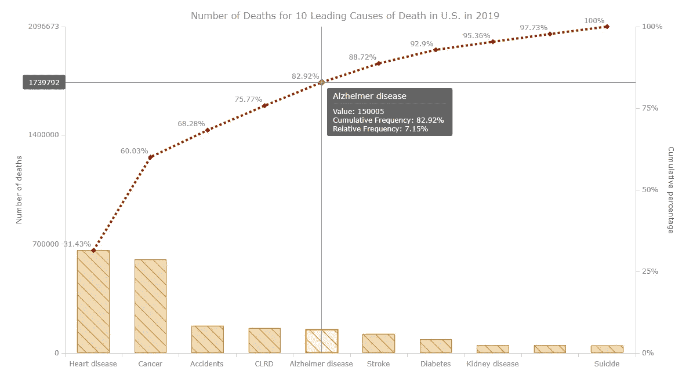

# 如何在 JavaScript HTML5 中构建帕累托图

> 原文：<https://javascript.plainenglish.io/how-to-create-a-pareto-chart-in-javascript-html5-3639e98e40e8?source=collection_archive---------9----------------------->


Pareto chart to be built

用 JavaScript 为 HTML5 应用和网站创建一个帕累托图根本不是一个复杂或忙乱的开发过程。获得本教程的实践经验，你会发现[数据可视化](https://www.anychart.com/blog/2018/11/20/data-visualization-definition-history-examples/)以这样一种形式令人愉快和兴奋！

在我们开始之前，让我们记住[帕累托图](https://www.anychart.com/chartopedia/chart-type/pareto-chart/)的样子以及它们的目的是什么，只是为了确保我们在同一页上。帕累托图，也称排列图，是竖线([列](https://www.anychart.com/chartopedia/chart-type/column-chart/))和线形图[)的组合。列用于描述值，从左到右按降序显示。帕累托图中的线条以百分比显示累计总数。这种可视化有助于数据科学家和分析师快速识别一组因素中最重要的因素，即那些以最大值为特征的因素，因此对所有表示的因素的总和做出最大贡献。](https://www.anychart.com/chartopedia/chart-type/line-chart/)

在这篇 JS Pareto 图表教程中，我们将可视化 2019 年美国主要死亡原因的统计数据，并根据官方数据找出当年夺走最多美国人生命的原因。

现在让我们转到 JavaScript 图表，更准确地说，是使用 JS 构建一个交互式的 Pareto 图表！

# 构建一个基本的 JS 帕累托图

JavaScript 图表中可视化数据的常见顺序基于以下四个步骤。要创建 JS 帕累托图，您也应该遵循以下步骤:

*   首先，生成一个包含显示图表的容器的 HTML。
*   第二，引用所有你要用的 JS 脚本。
*   第三，加载需要绘制图表的数据。
*   第四，编写可视化图表所需的 JavaScript 代码。

让我们通过每一个步骤来制作一个交互式的帕累托图，并了解整个过程，这是非常简单的。

# 第一步。创建 HTML 页面

下面的代码设置了一个 HTML 页面，其中包含一个保存我们的 Pareto 图的容器。

```
<!DOCTYPE html>
<html>
  <head>
    <title>Pareto Chart Example</title>
    <style>
      html, body, #container1 {
        width: 100%;
        height: 100%;
        margin: 0;
        padding: 0;
      }
    </style>
  </head>
  <body>
    <div id="container1"></div>
 ***// The Pareto chart code will be put here.***
  </body>
</html>
```

上面开发的 HTML 页面由两个主要部分组成:`<head>`和`<body>`。`<head>`部分包括两个子部分:`<title>`和`<style>`。此处页面的标题设置为“排列图示例”`<style>`元素用于将一个简单的样式表应用于 HTML 文档、`<body>`部分和 id 为“container1”的`<div>`容器(这是我们放置 Pareto 图的地方)。

# 第二步。连接脚本

然后，在`<head>`部分，我们应该将构建帕累托图时使用的所有脚本联系起来。

有许多 [JavaScript 图表库](https://en.wikipedia.org/wiki/Comparison_of_JavaScript_charting_libraries)你可以[选择](https://www.anychart.com/blog/2017/03/05/how-to-choose-the-right-javascript-charting-component-10-factors-you-have-to-consider/)来为你的网站或应用程序创建一个交互式的帕累托图。在本教程中，我将使用 [AnyChart](https://www.anychart.com) 。这是一个非常灵活的跨平台数据可视化的 JavaScript 库，丰富了大量的图表演示以及大量非常详细的文档和 API 参考，即使对于 web 开发和编程的初学者来说也很容易处理。

AnyChart 拥有一个[模块化](https://docs.anychart.com/Quick_Start/Modules)系统，它允许你最小化需要在你的页面上运行的 JavaScript 的数量，因为你不需要加载超过你实际需要的。要开发一个 pareto 图表，您只需要两个模块:包含所有 JS 图表库基础知识的“核心”模块和包含 Pareto 图表类型的“Pareto”模块。

```
<script src="https://cdn.anychart.com/releases/8.9.0/js/anychart-core.min.js"></script>
<script src="https://cdn.anychart.com/releases/8.9.0/js/anychart-pareto.min.js"></script>
```

现在让我们将这些模块添加到`<head>`部分，如下所示。

```
<!DOCTYPE html>
<html>
  <head>
    <title>Pareto Chart Example</title>
    <script src="https://cdn.anychart.com/releases/8.9.0/js/anychart-core.min.js"></script>
    <script src="https://cdn.anychart.com/releases/8.9.0/js/anychart-pareto.min.js"></script>
    <style>
      html, body, #container1 {
        width: 100%;
        height: 100%;
        margin: 0;
        padding: 0;
      }
    </style>
  </head>
  <body>
    <div id="container1"></div>
    <script>
 ***// The Pareto chart code will be put here.***    </script>    
  </body>
</html>
```

# 第三步。加载想要可视化的数据

为了这个 JavaScript 帕累托图教程，我决定采用 [CDC 的统计数据](https://www.cdc.gov/nchs/data/databriefs/db395-tables-508.pdf#page=4)，揭示 2019 年美国十大死亡原因。已知总共报告了 2854838 名居民死亡。前十位死因占全部死亡的 73.4%。帕累托图将按降序显示十大死亡原因以及每一种原因对死亡总数的贡献。

所以，我们先来看看数据集。



使用 AnyChart 的 JS Pareto 图表模块，您可以简单地以 JavaScript 对象的形式设置和提供数据集(如下所示)。该库将处理构建帕累托图所需的其余事情，例如对因子频率进行排序，将最高频率因子设置在左侧，最低频率因子设置在右侧，自动计算累积百分比，等等。

为了用我们的数据生成一个 JavaScript 对象，我们需要两个名为“x”和“value”的数据字段，如下所示:

*   “x”是需要在帕累托图中显示的因素的名称(在我们的例子中，是死亡原因的名称)，以及
*   “值”是相应因素的频率(在我们的例子中，是该原因导致的死亡人数)。

下面是我们的数据:

```
var data = [
  {x: 'Heart disease', value: 659041},
  {x: 'Alzheimer disease', value: 150005},
  {x: 'Cancer', value: 599601},
  {x: 'Accidents', value: 173040},
  {x: 'Kidney disease', value: 51567},
  {x: 'Suicide', value: 47511},
  {x: 'CLRD', value: 156979},
  {x: 'Stroke', value: 121499},
  {x: 'Diabetes', value: 87647},
  {x: 'Influenza and pneumonia', value: 49783}
];
```

# 第四步。编写 JS 帕累托图代码

到目前为止，我们已经获得了使用 JavaScript 生成交互式 Pareto 图的所有基础知识。所以，让我们整理一下达到目标所需的所有东西。

所有的 JavaScript 代码都应该放在`<script>`标签中。此外，如下面的代码片段所示，我们在`onDocumentReady`函数中编写了与 Pareto 图相关的 JS 代码行。这个函数一直等到 HTML 页面完全加载。

```
<script>
  anychart.onDocumentReady(function() {
 ***// The entire code of the Pareto chart will be here.***
  });
</script>
```

因此，在`onDocumentReady`函数中，像步骤 3 中解释的那样加载数据。

一旦创建了数据对象，就将其提供给 Pareto 图。

```
***// create a pareto chart***
var chart = anychart.pareto();
***// feed the data into the chart***
chart.data(data);
```

然后，设置主 Pareto 图标题，并添加两个 Y 轴标题，如下所示，以使其清晰可见:

```
***// set the chart title***
chart.title('Number of Deaths for 10 Leading Causes of Death in U.S. in 2019');
***// set the measure y axis title***
chart.yAxis(0).title('Number of deaths');
***// set the cumulative percentage y axis title***
chart.yAxis(1).title('Cumulative percentage');
```

最后一个动作是将生成的 Pareto 图提供给 id 为“container1”的部门，并提供根据给定配置绘制图形的命令:

```
***// set the chart container id***
chart.container('container1');
***// draw the chart***
chart.draw();
```

哇！这是我们用 JavaScript 创建的帕累托图最终的样子。它是互动的，有反应的！

> **见** [**AnyChart 游乐场**](https://playground.anychart.com/iithlO5T/) **上的这张基本帕累托图。)**



交互式 JS/HTML5 帕累托图的完整代码如下:

```
<!DOCTYPE html>
<html>
  <head>
    <title>Pareto Chart Example</title>
    <script src="https://cdn.anychart.com/releases/8.9.0/js/anychart-core.min.js"></script>
    <script src="https://cdn.anychart.com/releases/8.9.0/js/anychart-pareto.min.js"></script>
    <style>
      html, body, #container1 {
        width: 100%;
        height: 100%;
        margin: 0;
        padding: 0;
      }
    </style>
  </head>
  <body>
    <script>anychart.onDocumentReady(function () { ***// set data***  var data = [
    {x: 'Heart disease', value: 659041},
    {x: 'Alzheimer disease', value: 150005},
    {x: 'Cancer', value: 599601},
    {x: 'Accidents', value: 173040},
    {x: 'Kidney disease', value: 51567},
    {x: 'Suicide', value: 47511},
    {x: 'CLRD', value: 156979},
    {x: 'Stroke', value: 121499},
    {x: 'Diabetes', value: 87647},
    {x: 'Influenza and pneumonia', value: 49783}
  ]; ***// create a pareto chart***
  var chart = anychart.pareto();
 ***// feed the data into the chart***  chart.data(data); ***// set the chart title***  chart.title('Number of Deaths for 10 Leading Causes of Death in U.S. in 2019');
 ***// set the measure y axis title***  chart.yAxis(0).title('Number of deaths');
 ***// set the cumulative percentage y axis title***  chart.yAxis(1).title('Cumulative percentage'); ***// set the chart container id***  chart.container('container1');
 ***// draw the chart***  chart.draw();});
    </script>
  </body>
</html>
```

# 定制 JavaScript 帕累托图

你需要把图表做得更方便，更漂亮，可读性更好，还是用额外的细节来包装它？在 AnyChart JS API 的帮助下，您有很多选择可以做到这一点。您还可以对帕累托图进行许多可视化设计和功能更改。(更多详情请参考[排列图文档](https://docs.anychart.com/Basic_Charts/Pareto_Chart)。)

要获得更多灵感，你可以看看 AnyChart 的图库，里面有[帕累托图示例。](https://www.anychart.com/products/anychart/gallery/Pareto_Charts/)

现在，让我们对基于 JS 的 Pareto 图进行一些改进，使它看起来更棒——那就跟我来吧！

# 使用调色板更改帕累托图颜色

是否要根据您的偏好更改帕累托图的默认浅蓝色？如果是这样，有一个非常方便的方法——[调色板](https://docs.anychart.com/Appearance_Settings/Palettes)进行自动上色！

AnyChart JS 图表库中有许多预定义的调色板，使用它们非常简单。让我们举个例子，一个叫地球的:

```
***// use one of the pre-built palettes for coloring*** chart.palette(anychart.palettes.earth);
```

下面是新着色的帕累托图。

> **见上** [**AnyChart 游乐场**](https://playground.anychart.com/osIT4aKF/) **。**



大地色调的颜色舒缓自然，所以我喜欢。做出自己的选择吧，伙计们。如果您愿意，也可以从头开始创建自定义调色板。

# 排列图的列和行序列的格式

帕累托图由柱形图和折线图组成，它们是独立的系列，有自己的[视觉设置。](https://docs.anychart.com/Basic_Charts/Pareto_Chart#appearance)让我们对数据可视化的外观进行一些设计更改。

我们可以使用不同的内置方法来改变数据点的外观。基本上有三种状态:正常、悬停和选中。`normal()`方法用于在正常状态下设置点的外观，即当点上没有执行任何操作时。`hovered()`方法设计用于确定悬停状态下的外观，即当我们悬停在某个点上时。最后，`selected()`方法控制点被点击(选中)时的外观。

这三种方法可以与`fill()`、`hatchFill()`和`stroke()`方法结合使用。`fill()`方法用于用给定的颜色填充点。`hatchFill()`的方法是用条纹图案填充点。最后，`stroke()`是改变点轮廓的外观。

让我们首先对 Pareto 列系列进行全部更改:

```
***// configure the visual settings of the first (column) series***
chart.getSeries(0).normal().fill("#c98411", 0.3);
chart.getSeries(0).hovered().fill("#c98411", 0.1);
chart.getSeries(0).selected().fill("#c98411", 0.5);
chart.getSeries(0).normal().hatchFill("forward-diagonal", "#c98411", 1, 15);
chart.getSeries(0).hovered().hatchFill("forward-diagonal", "#c98411", 1, 15);
chart.getSeries(0).selected().hatchFill("forward-diagonal", "#c98411", 1, 15);
chart.getSeries(0).normal().stroke("#c98411");
chart.getSeries(0).hovered().stroke("#c98411", 2);
chart.getSeries(0).selected().stroke("#c98411", 4);
```

接下来，让我们定制系列产品:

```
***// configure the visual settings of the second (line) series*** chart.getSeries(1).normal().stroke("#991e00", 4, "4 4", "round");
```

以上代码更改了正常状态下的线条系列的轮廓。

具有这些新变化的交互式 Pareto 图如下所示。可视化现在看起来不是更有趣了吗？

> **见上** [**AnyChart 游乐场**](https://playground.anychart.com/mSLdM3g7/) **。**



# 配置帕累托图工具提示

你知道工具提示的目的是什么吗？当您将鼠标悬停在图表可视化上的某个点上时，它们会显示出来，以提供有关相应点的更多信息。

现在让我们用帕累托图的工具提示做更多的工作。默认情况下，它显示系列、行(累积百分比)和列(绝对数字)的值。让我们让它看起来更整洁，也包括相对百分比。

首先，我们访问列序列，并命令工具提示在实际值之前显示文本“Value:”。

```
***// configure the pareto column series tooltip format*** var column = chart.getSeriesAt(0);
column.tooltip().format('Value: {%Value}');
```

其次，我们访问行序列，在累积百分比前添加文本“累积频率:”并以同样的方式设置相对频率值的显示。' \n '字符用于换行。

```
***// configure the pareto line series tooltip format***
var line = chart.getSeriesAt(1);
line
  .tooltip()
  .format('Cumulative Frequency: {%CF}% \n Relative Frequency: {%RF}%');
```

看看我们的 JavaScript Pareto 图在工具提示如此改进后是什么样子。

> **见上** [**AnyChart 游乐场**](https://playground.anychart.com/JNVGvmq0/) **。**



# 设置帕累托图标签

将每个因素(在我们的案例中为死亡原因)的累积百分比显示在线序列的顶部，靠近每个数据点，这可能有助于使帕累托图一目了然，提供更多信息。看那个:

```
***// set the pareto line series labels***
var line = chart.getSeriesAt(1);
line.labels().enabled(true).anchor('right-bottom').format('{%CF}%');
```

我会很快解释的。

帕累托图的线条系列可以使用我们之前讨论过的`chart.getSeriesAt(1)`来获得。一旦我们得到了它，我们就可以启用线条系列对象的标签。为此，需要设置`labels().enabled()`方法，将“true”作为其参数。

`anchor()`功能用于设置标签想要显示的位置。

最后，我们使用`format()`方法来配置标签显示格式。

下面是新的交互式 JS 帕累托图，现在带有百分比信息标签。

> **见上** [**AnyChart 游乐场**](https://playground.anychart.com/qjgBK7Ii) **。**



# 启用帕累托图十字线

十字光标是跟随鼠标指针的相互垂直的水平线和垂直线。它们使查看任何数据点中的精确值变得容易。让我们为我们的帕累托图启用这些:

```
***// add and configure the crosshair***
chart.crosshair().enabled(true).xLabel(false);
```

您可以看到`xLabel`方法的参数被设置为‘false’因此，X 轴上不会显示十字准线标签。

下面是使用十字线时的帕累托图。

> **见上** [**AnyChart 游乐场**](https://playground.anychart.com/KGqzUmFh/) **。**



**这是本教程的最终交互式 JavaScript 帕累托图。看起来很棒，不是吗？**

让我们看看在这个帕累托图上我们能读到什么。例如，该图表非常清楚地表明，2019 年美国人的绝大多数死亡是由于心脏病和癌症——这两种主要死亡原因占前十名的 60%以上。

意外伤害导致 173，040 人死亡，成为第三大死因。

自杀案例显示在图表的最右边，这意味着在所有十个主要原因中，自杀案例所占的比例最小；尽管如此，这同时也是可怕的，并且肯定应该由美国当局和非政府组织在未来几年解决。

# 结论

如何在 JS 的帮助下创建一个交互式的帕累托图？很简单，对吧？实际上，我们只需要创建一个基本的 HTML 页面，引用必要的 JavaScript 脚本，加载一个数据集，并根据文档中的明确说明编写一些代码，这完全取决于我们希望从这样的数据可视化中获得什么。AnyChart API 基本上处理了所有的事情，并使它变得非常整洁。

接下来，您可以随意探索更多的帕累托图，并使用这些很酷的可视化工具继续学习。万事如意！

我们 AnyChart 很高兴感谢 Dilhani Withanage 编写了这篇精彩的 JS Pareto 图表教程。

【https://www.anychart.com】原载于 2021 年 2 月 16 日[](https://www.anychart.com/blog/2021/02/16/pareto-chart-javascript/)**。**