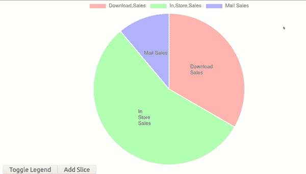

# 如何在 Angular 中创建饼图

> 原文：<https://javascript.plainenglish.io/how-to-create-a-pie-chart-in-angular-33cc0354bde7?source=collection_archive---------7----------------------->

## Angular 中的数据可视化入门


Photo by [Adeolu Eletu](https://unsplash.com/@adeolueletu?utm_source=medium&utm_medium=referral) on [Unsplash](https://unsplash.com?utm_source=medium&utm_medium=referral)

数据是 21 世纪的黄金，但要让数据有意义，必须很好地呈现给用户，让他们理解它。图表是展示数据的最佳方式之一。

在本指南中，我们将了解如何使用 Angular 中的饼图向用户展示您的数据。我们将在 ng2charts 图书馆的帮助下完成这项工作。

ng2charts 库基于著名的可视化库:chart.js。然而，与面向普通 JavaScript 的 chart.js 不同，ng2charts 是专门为 Angular 开发的，因此，在使用 Angular 框架时，它更容易实现和使用。

# 入门指南

我们将从使用 Angular CLI 在 Angular 中创建新项目开始。我将我的项目命名为饼图。只需运行下面的命令来创建新项目。

```
$ ng new pie-chart --defaults
```

# 向项目添加依赖项

在我们开始创建饼图之前。我们需要以 npm 包的形式添加绘制图表所需的三个依赖项。我们将要安装的 npm 包是 **ng2-charts** 、 **chart.js** 和**chart js-plugin-data labels**。

我们将用下面的一个命令安装所有三个依赖项。确保在应用程序的根文件夹中运行该命令。

```
$ npm install ng2-charts chart.js chartjs-plugin-datalabels --save
```

# 更新主模块文件

一旦你安装了上面需要的包，你需要从你的主模块文件中的 ng2charts 导入 ***ChartsModule*** 。在本例中， ***app.module.ts 文件*** 。

除了导入**图表模块**之外，将**图表模块**添加到导入模块的数组中。

您的***app . module . ts***文件现在应该如下所示。唯一添加的代码是粗体的代码。

```
import { BrowserModule } from '@angular/platform-browser';
import { NgModule } from '@angular/core';
import { AppComponent } from './app.component';
**import { ChartsModule } from 'ng2-charts';**@NgModule({
    declarations: [ AppComponent],
    imports: [ BrowserModule, **ChartsModule**],
    bootstrap: [AppComponent]
})export class AppModule { }
```

# 为图表创建画布

在 HTML5 中，canvas 元素用于绘制图形和表示动态或可脚本化的二维形状和图像。

因此，我们将创建的饼图将被放置在一个 ***<画布>*** 元素 ***中。***

转到项目中的***app.component.html***文件，删除模板中的所有代码，并用下面的样板代码替换。

除了 canvas 元素，我们还将创建两个按钮来切换图例，并创建另一个按钮来将额外的饼图数据添加到饼图中。

```
<div>
  <canvas class="chart" baseChart
   [data]="pieChartData"
   [labels]="pieChartLabels"
   [chartType]="pieChartType"
   [options]="pieChartOptions"
   [plugins]="pieChartPlugins"
   [colors]="pieChartColors"
   [legend]="pieChartLegend">
  </canvas>
</div><div>
   <button (click)="pieChartLegend=!pieChartLegend">Toggle  Legend</button>
   <button (click)="addSlice()">Add Slice</button>
</div>
```

在 canvas 元素中，我们使用模板表达式来绑定组件文件中的值。请注意，我们将在这里使用硬编码的值，但是这些值可以很容易地用来自一些 API 或任何其他来源的动态数据替换。

# 向组件添加图表逻辑

我们现在将添加处理按钮事件的逻辑，以及要在图表中表示的数据的硬编码值。

将下面的代码复制粘贴到组件文件中，即***app . component . ts .***

从下面的代码中可以看出，我创建了两个负责处理按钮点击事件的方法。此外，我们还将处理图表上的鼠标悬停事件，以向饼图显示相应的数据。

我还创建了几个公共变量，用于保存要在图表中表示的硬编码数据值。其他图表属性(如颜色和标签)也保存在这些变量中。

您的 ***app.component.ts*** 文件现在应该类似于下图。

```
import { Component } from '@angular/core';
import { ChartType, ChartOptions } from 'chart.js';
import { Label } from 'ng2-charts';
import * as pluginDataLabels from 'chartjs-plugin-datalabels';@Component({
    selector: 'app-root',
    templateUrl: './app.component.html',
})export class AppComponent {
    title = 'pie-chart';
    public pieChartOptions: ChartOptions = {
        responsive: true,
        legend: { position: 'top',},

       plugins: { 
          datalabels: { formatter: (value, ctx) => {
          const label = ctx.chart.data.labels[ctx.dataIndex];      return label;},
   },
  }
};public pieChartLabels: Label[] = [['Download', 'Sales'], ['In',   'Store', 'Sales'], 'Mail Sales'];
public pieChartData: number[] = [300, 500, 100];
public pieChartType: ChartType = 'pie';
public pieChartLegend = true;
public pieChartPlugins = [pluginDataLabels];public pieChartColors = [{ backgroundColor: ['rgba(255,0,0,0.3)', 'rgba(0,255,0,0.3)', 'rgba(0,0,255,0.3)'],
},];public chartHovered({ event, active }: { event: MouseEvent, active:   {}[] }): void { console.log(event, active);
}addSlice(): void {
    this.pieChartLabels.push(['Line 1', 'Line 2', 'Line 3']);
    this.pieChartData.push(400);
this.pieChartColors[0].backgroundColor.push('rgba(196,79,244,0.3)');  }
}
```

# 运行应用程序

如果您按照本指南中的说明连接了所有设备。现在，您可以测试并运行您的应用程序了。

要为应用程序提供服务，只需从应用程序的根文件夹中运行以下命令。我添加了`-o`标志，这样应用程序就可以在你的默认浏览器中自动打开。

```
$ ng serve -o 
```



# 最后的想法

在使用 Angular 框架时，可以使用许多库来增强对用户的数据表示。Chart.js 是一个强大的动态开源库，可以用来可视化数据。

*阅读更多尽在* [***说白了. io***](https://plainenglish.io/)