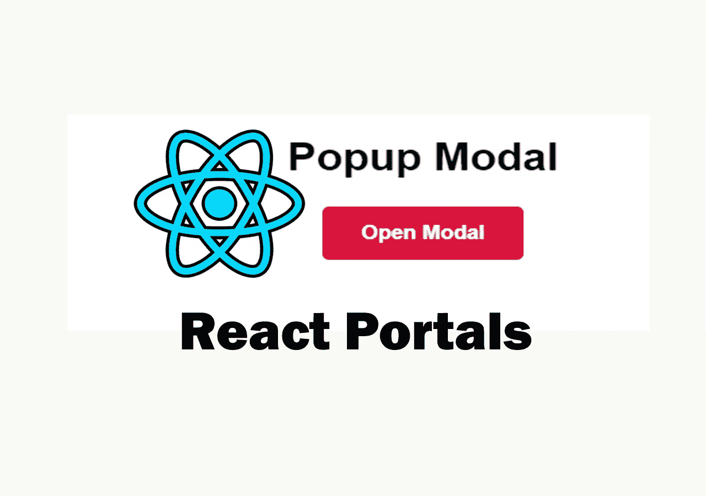
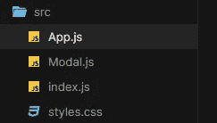

# 如何在 React 中创建弹出模式

> 原文：<https://javascript.plainenglish.io/how-to-create-a-popup-modal-in-react-39315907998e?source=collection_archive---------1----------------------->

## 了解如何使用 React 构建一个简单的弹出模式。



Image created with ❤️️ By author.

React 是一个非常有用的 JavaScript 库，它允许我们创建非常棒的用户界面。我们也可以称之为框架，因为有许多其他的库和包可以用来使 React 库像框架一样。所以你可以用 React 构建很多很棒的东西。但是我们今天的重点是构建一个简单的弹出模型。

如你所知，React 中的所有东西都嵌套在一个组件中，这使得完成某些任务变得很困难。其中一项任务就是弹出模式。它们需要在一个独立于我们的应用程序的组件中呈现。React 门户网站出来帮助解决这个问题。它们提供了一种在 React 中处理模态的简单方法。

因此，在本文中，我们将使用 React 门户创建一个非常棒的弹出模型。让我们开始吧。

# 项目设置

我们将使用 create-react-app 来设置我们的项目。因此，只需打开命令行(如果您安装了 Git，则打开 Git bash ),编写下面的命令来启动本地服务器，以便查看您的更改。

下面是一个例子:

```
npx create-react-app popup-modal
cd popup-modal
npm start
```

之后，您需要打开您的文本编辑器并删除`src`文件夹中所有不必要的文件。我们将只需要文件`index.js`、`App.js`和`styles.css`。然后我们将创建另一个名为`Modal.js`的文件来放置弹出模态组件。



Our files.

# 编写代码

在使用 create-react-app 进行项目设置之后，您已经拥有了在根元素中呈现您的应用程序的条目文件`index.js`。代码将是这样的:

```
//index.jsimport { StrictMode } from "react";
import ReactDOM from "react-dom";import App from "./App";const rootElement = document.getElementById("root");
ReactDOM.render(
  <StrictMode>
    <App />
  </StrictMode>,
  rootElement
);
```

如您所见，这只是导入 app 组件并在根元素上呈现它的基本 React 代码。

现在我们必须转到文件`App.js`，在这里我们将导入模态组件，并使用状态钩子来处理显示和隐藏模态组件的状态。

下面是代码示例:

```
//App.js**import React, { useState } from "react";**
import "./styles.css";
**import { Modal } from "./Modal";**export default function App() {
  **const [showModal, setShowModal] = useState(false);**const openModal = () => {
    setShowModal(true);
  };
  return (
    <div className="App">
      <h1>Popup Modal</h1>
      <button onClick={**openModal**}>Open Modal</button>
      **{showModal ? <Modal setShowModal={setShowModal} /> : null}**
    </div>
  );
}
```

如您所见，我们根据状态的值在应用程序中呈现模态组件。如果状态`showModal`是`true`，我们呈现模态组件，并将状态作为道具传递给它，这样我们就可以在文件`Modal.js`中使用它。如果状态是`false`，我们返回`null`(无)。我们还有一个按钮，单击它可以显示我们的模态。

现在，由于我们的模态将要弹出，我们需要在另一个 DOM 元素中呈现模态组件。默认情况下，它在根元素中呈现。所以我们必须转到 public 文件夹中的文件`index.html`并在根元素之后创建另一个 div 元素。确保给它一个 ID。

在下面的例子中，我们在`index.html`中创建了一个 div 元素，并给它一个名为`portal`的 ID。你想怎么叫都行。

下面是一个例子:

```
*<!--* index.html --><div id="root"></div>**<div id="portal"></div>**
```

现在我们必须在`Modal.js`中创建模态组件，并将其呈现在 ID 为`portal`的 DOM 元素中，而不是呈现在根元素中。为此，我们在模态组件中使用了方法`**ReactDom.createPortal()**`。

下面是代码示例:

```
//Modal.jsimport React, { useRef } from "react";
**import ReactDom from "react-dom";**export const Modal = (**{ setShowModal }**) => { // close the modal when clicking outside the modal.
  const modalRef = useRef();
  const closeModal = (e) => {
    if (e.target === modalRef.current) {
      setShowModal(false);
    }
  }; //render the modal JSX in the portal div.
  return **ReactDom.createPortal(**
    <div className="container" **ref={modalRef}** onClick={closeModal}>
      <div className="modal">
        <h2>This is a Modal</h2>
        <button onClick={() => **setShowModal(false)**}>X</button>
      </div>
    </div>,
    **document.getElementById("portal")**
  **)**;
};
```

如上所示，我们使用方法`**ReactDom.createPortal()**` 渲染了门户 div 中的所有模态 JSX。我们还使用我们传递的状态作为单击 x 按钮后模态组件关闭模态的道具。

这里的钩子`useRef`用于当我们在模态之外点击时关闭模态。正如您在示例中看到的，它允许我们引用 DOM 元素(容器 div)。

经过这一切，我们的模型现在工作正常。我们只需要添加造型，使它看起来真棒。

# 造型的模态

现在，我们需要做的就是转到文件`styles.css`并使用 CSS 样式化我们的 UI。

下面是代码示例:

```
.App {
  font-family: sans-serif;
  text-align: center;
}
.App button {
  padding: 13px 29px;
  font-size: 1rem;
  font-weight: bold;
  border-radius: 5px;
  border: none;
  outline: none;
  background: crimson;
  color: white;
  cursor: pointer;
}#portal .container {
  position: fixed;
  top: 0;
  left: 0;
  bottom: 0;
  right: 0;
  height: 100vh;
  display: flex;
  align-items: center;
  justify-content: center;
  background: rgba(0, 0, 0, 0.7);
}.container .modal {
  z-index: 1;
  width: 350px;
  height: 220px;
  background: white;
  display: flex;
  align-items: center;
  justify-content: center;
  border-radius: 5px;
  position: relative;
  animation: animate 0.3s;
}
.modal button {
  position: absolute;
  top: 7px;
  right: 7px;
  padding: 8px 11px;
  background: crimson;
  color: white;
  font-weight: bold;
  border: none;
  outline: none;
  border-radius: 2px;
  cursor: pointer;
}@keyframes animate {
  from {
    transform: scale(0.5);
  }
  to {
    transform: scale(1);
  }
}
```

现在，我们的模型已经完全正常工作，可以部署了。您可以通过使用`npm run build`来构建生产文件，并且您的模型在部署到 Netlify 或 GitHub 页面之后将是活动的。

# 项目演示

CodePen by author.

您也可以在 [codeSandBox](https://codesandbox.io/s/immutable-sea-dimm8?file=/src/Modal.js) 访问所有代码。

# 结论

正如你所看到的，这就是如何在 React 中创建一个弹出模态。它非常快，没有任何问题。这就是为什么 react portal 是 react 中处理模态的简单方法。

感谢您阅读这篇文章。希望你觉得有用。

**更多阅读**

[](/5-powerful-react-libraries-that-you-can-use-in-2021-496b975c7bef) [## 您可以在 2021 年使用的 5 个强大的 React 库

### React 库使开发应用程序变得更加容易

javascript.plainenglish.io](/5-powerful-react-libraries-that-you-can-use-in-2021-496b975c7bef) [](/5-useful-website-cheatsheets-for-all-web-developers-70290340385) [## 对所有网站开发者有用的 5 个网站备忘单

### 面向所有网站开发者的超赞网站备忘单。

javascript.plainenglish.io](/5-useful-website-cheatsheets-for-all-web-developers-70290340385) 

*更多内容看* [***说白了. io***](http://plainenglish.io)