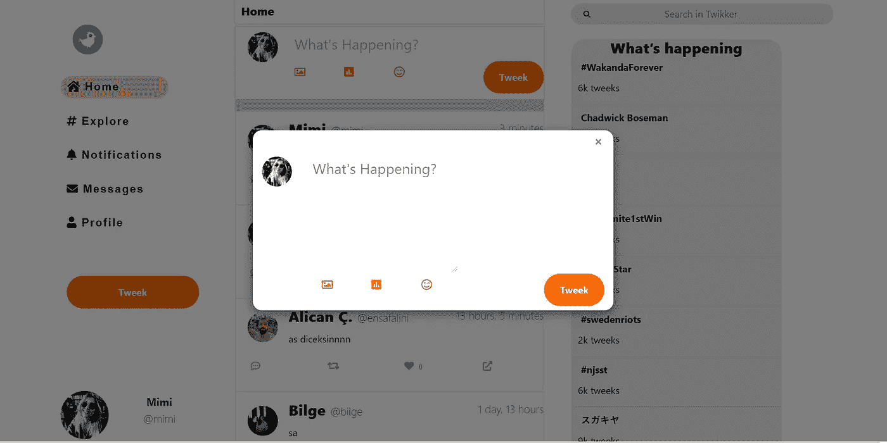

# 如何用 CSS + JavaScript 创建一个弹出模式

> 原文：<https://javascript.plainenglish.io/how-to-create-a-popup-modal-with-css-javascript-7e5d369ae6f?source=collection_archive---------6----------------------->


Photo by [Andrew Neel](https://unsplash.com/@andrewtneel?utm_source=unsplash&utm_medium=referral&utm_content=creditCopyText) on [Unsplash](https://unsplash.com/s/photos/europe-history?utm_source=unsplash&utm_medium=referral&utm_content=creditCopyText)

模态是当按下按钮时显示在当前页面前面的弹出窗口。

这是我的例子，我最近用 Django 创建了一个类似 Twitter 的网站。



## 第一步:设计父节的样式

你要做的第一件事是创建一个半透明的黑色背景。为此，您需要创建一个父元素来包装您的内容部分。

```
*<div class=”bg-modal”>
 <div class=”modal-content”>

 </div>
 </div>*
```

现在让我们来设计这个模态:

```
.bg-modal{
 width:100%;
 height:100%;
 background-color: black;
 }
```

你还需要告诉背景模态覆盖在内容之上。

```
position: absolute;
```

当你说绝对时，你需要说它在哪里。

```
top:0px;
```

这里的问题是，如果我们做`*opacity: 0.7*`来减少背景的不透明度，这个不透明度值将转移到子元素，不管你是否指定子元素的不透明度。解决方法不是在这里指定不透明度，而是在背景颜色中。

```
bacground-color: rgba(0,0,0,0.7) // the 4th number will be the opacity
```

**让我们看看目前为止我们有什么:**

```
.bg-modal{
 width: 100%;
 height:100%;
 background-color: rgba(0,0,0,0.5); /* make it half transparent */
 position: absolute;
 top:0px;
 z-index: 1;
 display: none;  /* It will remain invisible until you open */
 justify-content: center; /*center horizontally*/ 
 align-items: center ; /* center vertically */}
```

## 第二步:设计你的内容部分

这是我的。

```
.modal-content{
 width:600px;
 height:300px;
 background-color: white;
 border:none; 
 border-radius: 15px;
 padding:15px;
 position: relative;
 }
```

如果父元素的位置是*绝对*，这意味着您为元素选择了准确的位置。并且你需要设置你的子元素位置*相对于*。因此，当您指定元素的确切像素位置时，它会相应地将子元素放置在父元素的内部。

## 第三步:设置移除按钮的样式

现在你需要一个按钮来关闭你的模态。

```
<div class=”close”> + </div>
```

*   我更喜欢使用`+`并在 CSS 代码中旋转它，这将比只使用`X`更好看。然而，这取决于你。

我是这样设计的:

```
.close{
 position: absolute;
 top:5px;
 right: 10px;
 font-size:25px;
 transform: rotate(45deg); /* will make it look like x */
 cursor: pointer;
 }
```

让我们添加一些 JavaScript 来使这个按钮实际工作。现在我们的模态是隐藏的。我们所要做的就是点击一个按钮并打开弹出窗口。

```
const openButton = document.getElementById('myBtn')
const modal =  document.querySelector('.bg-modal')openButton.addEventListener('click', () => {
  modal.style.display ='flex'
}
```

点击一个按钮并隐藏弹出窗口。

```
const closeBtn =  document.querySelector('.close')
const modal =  document.querySelector('.bg-modal')closeBtn.addEventListener('click', () => {
  modal.style.display ='none'
})
```

## 结论

这是一个简单的 JS，CSS 代码，可以帮助你调整和设计你的网站。你可以随意填写内容部分。希望这有所帮助！