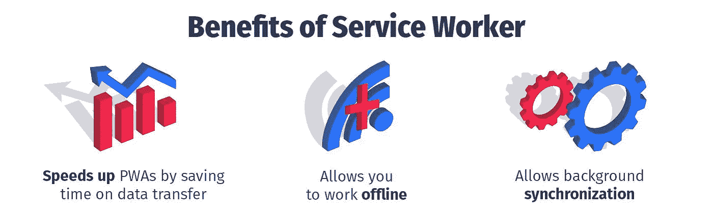
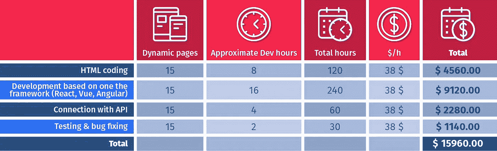

# 如何创建渐进式 Web 应用程序(PWA):完整指南

> 原文：<https://javascript.plainenglish.io/how-to-create-a-progressive-web-application-complete-guide-a44d3040ae41?source=collection_archive---------18----------------------->

如今，企业可以利用移动应用程序最重要的优势:推送通知、个性化广告以及无需太多成本就能接近用户。PWA 技术(渐进式网络应用程序)可以将一个普通的网站变成一个移动应用程序，只需要一个浏览器，这就可以让你接触到最广泛的客户群。

在本文中，我们将了解什么是 PWA，渐进式 Web 应用程序的主要优点和缺点是什么，以及是否值得为商业组织开发 PWA 应用程序。

# 什么是 PWA？

在谷歌的要求下，渐进式网络应用程序(PWA)于 2015 年开始流行。这是一个通过浏览器 API 在设备上运行的网络应用程序。对用户来说，它看起来越自然越好。当在桌面浏览器中打开时，该网站看起来正常，但在移动版本中，它变成了一个应用程序。

与普通网站不同，渐进式网络应用程序不仅依赖于浏览器，还依赖于用户的缓存，因此它们不怕高负载。不管有多少人决定同时使用你的服务，PWAs 都能搞定。此外，即使用户没有网络连接，他们也可以使用 PWA 的一些功能，这与普通的 web 应用程序不同。

网站或 web 应用程序可以转换为 PWA。下面我们会告诉你怎么做。现在，让我们来回答这个问题“为什么？”PWA 的主要优势是什么？

# PWA 的好处

PWA 应用程序速度很快，不需要稳定的网络连接，不受操作系统和设备资源的限制。PWA 应用程序工作非常简单方便。当客户访问公司网站时，系统会将其添加到主屏幕。

只要接受报价，网站图标就会立即出现在主屏幕上。安装该应用程序只需点击两次。没必要去玩市场或者 AppStore。安装 PWA 应用程序是为了绕过禁止从未知来源启动文件的防病毒程序。

# 对用户的好处

*   用户友好的界面:页面即时切换，导航和控制按钮按照原生标准布局；
*   PWA 适用于移动设备、平板电脑、笔记本电脑和 PC 屏幕；
*   与慢速互联网和离线工作；
*   通过安全协议——HTTPS 交换数据；
*   在您的设备上占用很少的内存—平均高达 1mb；
*   PWA 图标可以与 AppStore 和 Google Play 的应用一起添加到智能手机的主屏幕上。

# 商业利益

*   有可能为所有平台开发一个解决方案:Android、iOS、Windows、macOS 和 Linux
*   通过推送通知实施营销策略；
*   PWA 在搜索引擎中被索引；
*   易于分发—只需共享链接；
*   据谷歌称，50%的用户认为在网站上购买比下载应用程序更方便。

所有的用户利益也可以添加到这里。归根结底，公司的利润直接取决于客户的用户体验。

从 PWA 应用程序实施的成功例子中，您可以看到它们对业务的重要性和实用性:

*   得益于 PWA 技术,《华盛顿邮报》的访问量增加了 12%,网页加载时间不到 0.8 秒。
*   受欢迎的零售商[沃尔玛](https://developers.google.cn/web/showcase/2018/asda-george?hl=hi-IN&skip_cache=true)设法将转化率提高了 31%。
*   [拥有 5000 万观众的印度著名公司 Book My Show](https://developers.google.cn/web/showcase/2017/bookmyshow?hl=hi-IN&skip_cache=true) ，转化率提高了 80%。
*   在 Google Maps 中引入 [PWA 之后，地图可以更快地下载，并且可以离线使用，这增加了用户的忠诚度。](https://play.google.com/store/apps/details?id=com.google.android.apps.mapslite&hl=en_ZA&gl=US)
*   已经拥有大量客户的全球领导者[全球速卖通](https://developers.google.cn/web/showcase/2016/aliexpress?hl=hi-IN&skip_cache=true)，在引入 PWA 后，其转化率提高了 104%。
*   由于这项技术，Tinder 将页面加载时间从 11.9 秒减少到了 4.69 秒。PWA Tinder 比他们的原生应用“轻”90%。

# PWA 应用程序有助于解决哪些任务

*   咖啡馆和餐馆可以使用 PWA 来创建电子菜单、处理订单、协调快递递送等等。这也是促销邮件的一个很好的渠道。
*   酒店行业可以使用 PWA 及时通知用户有关可用房间和热门交易的信息。该应用程序还可以用于预订。
*   在医学上，PWAs 可以成为全天候支持患者的有效工具。这种工具将迅速提供关于药房药品供应情况或专家预约时间表的信息。推送通知可用于提醒患者服药。
*   在线商店可以用 PWAs 建立一个产品目录，用户即使不访问网络也可以使用它。订单接受和目录更新将在连接恢复后进行。此外，通过该应用程序，商店可以通过通知定期提醒顾客:通知他们促销、折扣和新货。
*   在线媒体可以使用 PWA 作为网站的快速替代，以及推广用户感兴趣的故事和突发新闻。
*   服务行业可以提醒用户需要定期服务(给汽车换油、打扫办公室、去美容院等)。
*   教育服务可以提醒用户需要定期上课，通知他们新课程和有利可图的订阅。作为一个销售工具，PWA 在用户懒得安装原生应用的领域完美地展示了自己。在这里，一键订购服务或购物的能力尤为重要。最重要的是不要给客户端发送侵扰性的推送通知。邮件应该尽可能有用和及时。那么如何创造这一科技奇迹呢？

# 如何开发 PWA？

PWA 开发流程经历标准阶段:

*   研究。假设检验，市场调查，设定商业目标。
*   技术要求。在这个阶段，你需要确定要构建什么类型的应用程序:网站、PWA、原生移动应用程序或为多个平台开发产品。
*   设计。创建应用程序的架构和界面，以解决项目任务。
*   风格发展。批准高精度布局，创建徽标、按钮、横幅和其他图形。
*   编程。为前端、工作台和后端编写代码。
*   前端是用 HTML，CSS，Javascript 写的。
*   服务工作器是一个 javascript 文件。这就是为什么它是用 JavaScript 框架开发的。
*   后端可以用任何合适的语言开发。
*   检查用户是否获得优质产品；
*   在修复错误的成本相对较小的阶段发现错误；

简而言之，PWA 基于 4 种技术:服务工作者、应用外壳、HTTPS 和 Web 应用清单。

# 服务行业人员

典型的 web 应用程序有两层:前端和后端。第一层是用户在浏览器中看到的；第二层负责服务器上的数据处理逻辑。

在 PWA 中，我们有第三层，即服务人员。这是一个由浏览器处理的 javascript 文件，就像前端一样。但是它也可以执行传统上需要连接到服务器的任务。Service Worker 为您提供了发送推送通知、使用缓存或执行复杂数据操作的能力。

服务人员将请求和数据存储在设备的缓存中。这提供了 3 个好处:

这里用一个例子来解释最后一项技术。

要在普通的 web 应用程序中发送消息，您必须单击发送按钮并等待服务器运行。如果连接不好，你得等很长时间。如果关闭选项卡，邮件仍不会发送。

即使浏览器关闭，PWA 网站仍会继续处理您的请求。只要连接出现，应用程序就会自动发送消息(资金转移、文件)。这是后台同步。该服务受到主要浏览器的支持:Chrome、Firefox、Edge、Safari 和 Opera。

# 应用程序外壳

应用外壳是一种架构，其中 PWA web 应用页面的外壳在第一次访问时被加载到设备缓存中。在进一步使用时，页面的框架从本地缓存中取出，只有内容本身从服务器中加载。

这种架构使得 PWA 接口在速度上可与本地应用相媲美。

# HTTPS

PWA 只在一个叫做 HTTPS 的安全协议上工作。数据以加密形式通过 HTTPS 传输。因此，黑客访问它的难度更大。

要使 web 应用程序在 HTTPS 上工作，您必须在您的虚拟主机设置中启用 SSL 证书。

#Web App manifest 这是一个包含应用程序数据的文件:窗口模式、名称、图标。

现有场地必须满足实施 PWA 的要求:

*   通过 HTTP 协议访问。
*   适应性或反应能力。
*   每个页面都有单独的 URL(如果你的网站是 SPA，这一点很重要)。

PWA 开发和创建一个正规网站没有太大区别。常见的编程语言和框架有 Vue、React、Angular 等。没有必要创建额外的 API，因为渐进式 Web 应用程序使用相同的代码。虽然这项技术相对较新，但已经有专家掌握了这项技术，并准备提供高质量的商业产品。只剩下一个问题。开发 PWA 要花多少钱？

# 开发 PWA 要花多少钱？

渐进式 web 应用程序开发成本是由不同类型的屏幕和功能的数量构成的。开发成本包括应用程序管理系统的设计、布局和组装。每个人允许的开发预算是不同的，他们创建的目标也是不同的。

这是渐进式应用程序的基本功能。它适合小企业。但是，最有可能的是，小企业不需要过渡到渐进式移动应用程序，因为对他们来说，这是一项昂贵的技术。反过来，大型企业需要尚未为 PWA 开发的广泛功能。附加功能是自定义开发。定制渐进式 web 应用程序开发需要大量的时间和金钱。

基本价格由雇佣 React、Vue 或 Angular 工程师的成本构成。由于这些技术是 PWA 应用程序开发的基础，并且由于市场对这些工程师的高需求，开发一个 PWA 应用程序的成本起价为 1.5 万美元。

计算示例假设:

*   你已经有了一个工作网站和 API
*   您已经准备好了设计，这同样适用于平板电脑和移动设备。
*   一名工程师将完成所有开发工作。

(这个估计是非常近似的，完全取决于任务的复杂性、预期功能和动画级别)

如果你的申请量很大，只需要一个额外的专家来做布局就更合理了。他的时薪将会更便宜，这将对项目的总成本产生积极的影响。

# 与 PWA 相关的风险

除了大量的优点，PWA 应用也有一些缺点。PWAs 和本机应用程序之间的功能和可用性差异仍然存在。iOS 更是如此。

如果 PWA 利用设备的硬件能力，它比普通网站耗电更快。PWAs 不能通过 app stores 推广。

# iOS 的限制

苹果正逐步在渐进式网络应用中引入功能支持。但目前，iPhone 和 iPad 上的 pwa 有其局限性。

特别是，iOS 上的 pwa 不支持:

*   蓝牙，包括 iBeacon 定位技术；
*   TouchID 指纹扫描仪；
*   FaceID 面部识别技术；
*   ARKit 增强现实应用框架；
*   高度计；
*   电池信息；
*   iOS 最多给 PWA 缓存分配 50 MB(大多数情况下，这就够了)；
*   7 天不使用，缓存被擦除，需要重新加载 app
*   苹果的浏览器 Safari 不支持从运动传感器获取数据。
*   iOS 上的 PWA 有后台同步和推送通知的问题。后者通过整合短信通知来解决。

同样在 iOS 上，不支持来自相机的实时数据流处理。这在扫描二维码时造成了一些困难。

然而，这一切可能很快就会改变。考虑到进步的 Web 应用程序技术在不久前已经成为高需求，在不久的将来，开发人员可能会设法消除这一缺点。

# 结论

PWAs 的潜力是巨大的，高峰发展还在后面。目前，网站和移动操作系统应用程序的“混合体”似乎是 IT 产品开发最合理的方式。这一行最主要的是找到高质量的专家，他们会为你开发出高质量的 PWA。

而 [UNITEDCODE](http://unitedcode.net) 快递公司会帮你搞定这个。通过我们独特的交付服务，您将接触到数百名专业前端和后端工程师、设计师、项目经理、业务分析师等。你将与东欧最好的专家合作，价格非常优惠。如果处理得当，你的 PWA 投资可以成功应对一系列挑战:保留率、品牌认知度和转化率。

此外，我们将承担所有繁琐的人事管理问题，并确保所有专家对您的项目感到舒适。团队建设、合同签订、人员更换和其他工作项目由我们负责，而您可以专注于战略规划。联系我们，我们将一起开始 PWA，但要快，因为我们一次只能为有限数量的客户工作。

*原载于 2021 年 12 月 15 日*[*【https://unitedcode.net】*](https://unitedcode.net/blog/trends/how-to-create-a-progressive-web-application-complete-guide/)*。*

*更多内容看* [***说白了. io***](http://plainenglish.io/) ***。*** *报名参加我们的* [***免费每周简讯这里***](http://newsletter.plainenglish.io/) ***。***