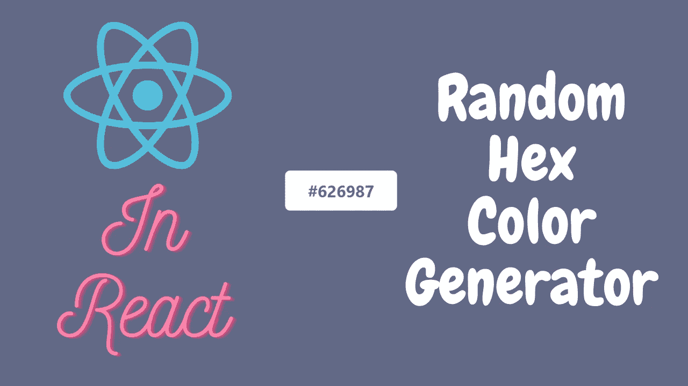
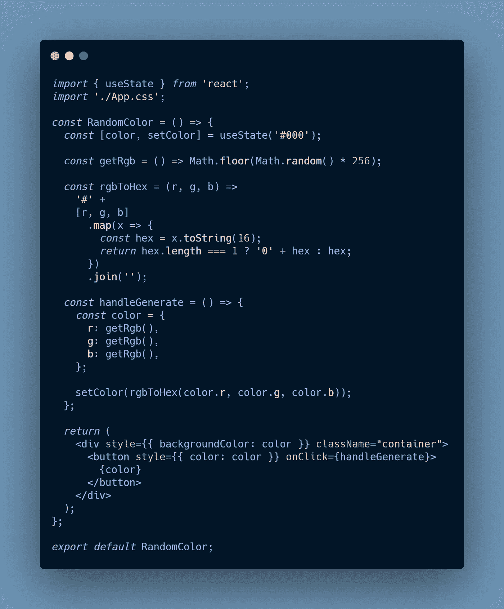
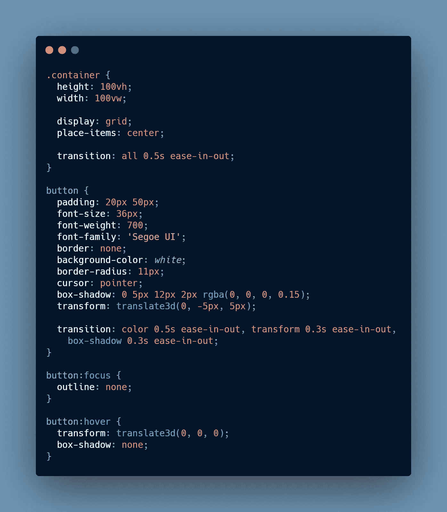
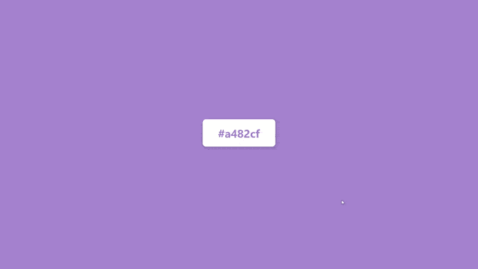

# 如何在 React 中创建一个随机的十六进制颜色生成器

> 原文：<https://javascript.plainenglish.io/how-to-create-a-random-hex-colour-generator-in-react-b9a46e3f4bb6?source=collection_archive---------7----------------------->

如果你正在寻找源代码，那么它在视频中是可用的。

在这里，我们将看到如何创建一个全屏十六进制颜色生成器，随机生成颜色。

我们将创建一个单独的组件来生成这种颜色，并将其命名为 **RandomColor。**

## **使用状态**

它用于存储生成的颜色，也用于在点击按钮时更新颜色。这将帮助我们反应性地更新页面的颜色。😏

## **获取 Rgb**

*   这个函数用于获得一个随机值。该函数的范围是 0 到 255(因为 RGB 的范围是 0 到 255 🧐).
*   `Math.random`生成 0 到 1 之间的浮点值。与 **n** 相乘，我们将得到在 **0 和 n — 1** 范围内的值。
*   但是它仍然是十进制的，所以我们可以使用`Math.floor`来获得下限舍入值。

## **rgbToHex**

*   该函数用于根据**红、**和**绿**三个值生成颜色的十六进制代码。
*   我们对这 3 个值进行映射，并对其应用`toString()`函数。我们可以给这个函数提供一个**基数**参数，它根据提供的基值转换数字。在这里，我们使用的是代表十六进制数的 **16** ，因为十六进制码的颜色是由十六进制数**🧐.组成的**
*   然后我们检查结果的长度是否为 1 或更大，如果是 1，那么我们在它前面加上 **0** 来规范化它。
*   最后，我们加入数组并在生成的字符串前添加一个`#`。

## **处理生成**

每当我们点击按钮时，这个函数就会被调用。它创建一个颜色对象，然后将这些红色、蓝色和绿色值传递给 **rgbToHex** 函数。返回值用于更新颜色。

最后，我们给**容器**的`backgroundColor`和**按钮的`color`设置颜色。**

应用程序的样式部分是这样完成的。

**容器**类只是为了确保整个屏幕区域都被使用并且按钮被放置在中间。**过渡**只是在生成新颜色时提供颜色的平滑过渡。

**纽扣**造型为了好看。**变换**和**框阴影**用于每当我们悬停在按钮上时为按钮提供 3D 效果。

通过这样做，我们将最终完成我们的随机全屏颜色生成器。它看起来会像这样🤩👇🏻

就这样，这就是我们旅程的终点。我希望你能达到这一点。😃

谢谢！

*更多内容请看*[***plain English . io***](http://plainenglish.io/)