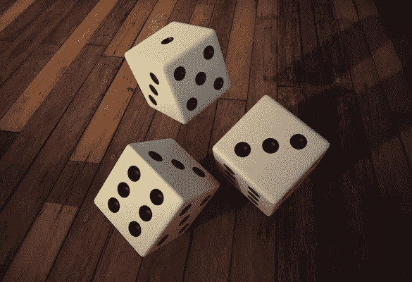

# 如何在 JavaScript 中创建一个随机整数

> 原文：<https://javascript.plainenglish.io/how-to-create-a-random-whole-number-in-javascript-71f39e5c193?source=collection_archive---------18----------------------->



在编程中创建随机整数是一项相对常见的任务。一旦你知道如何去做，就变得又快又简单…只需要一行代码。在这个快速教程中，我们将向您展示如何操作。我们将建立代码，以确保您理解每个部分的含义。

为了帮助理解上下文，假设我们想要创建一个大于或等于 1 且小于或等于 20 的随机整数。我们希望将数字存储为一个名为。

# 第一步。生成一个随机数

JavaScript 有一个创建随机数的简单方法。“太好了！这将是容易的！”你可能会想。虽然你可能是对的(毕竟这只是我们正在建立的一条线)，但也不是那么简单。返回的随机数将是大于等于 0 且小于 1 的**。当我们试图生成一个介于 1 和 20 之间的整数时，效果并不好！这是我们必须开始的地方。**

```
const number = Math.random();
```

**“**数学**”是 JavaScript 给我们的一个**对象**。它有许多我们可以使用的内置**方法**。方法之一是 **random()** 。因为方法基本上是函数的一种类型，所以它后面有括号。**

**上面那行字在说的是:*“给我做一个名为* **number** *的变量，让它的值是 0(含)到 1(不含)之间的随机数。”***

# **第二步。乘以 20**

**我们需要做的第一件事是增加随机数的大小。为此，我们将它乘以我们期望达到的最大数字。在我们的例子中，我们希望我们的最大数量是 20，所以这就是我们要乘的。这意味着我们代码行的下一次迭代是:**

```
**const** number = Math.random()*20;
```

**上面那行是在说:*“给我做一个变量叫* **号** *。从 0(含)到 1(不含)之间取一个随机数，然后用这个数乘以 20，计算出它的值。”***

**当我们这样做时，我们正在创建一个介于 0(含)和 20(不含)之间的随机数。这个随机数后面可能会有一个**大的小数位数**。虽然我们离最终目标越来越近，但仍有一些工作要做。**

# **第三步。去掉小数位**

**我们的随机数( ***号*** )现在可以定义如下:**

****0 < =带任意小数位数的数字<20**。**

**然而，这还不够好，因为我们的最终目标是:**

****1 < =数字< =小数位数为零的 20****

**去掉小数位并不太难，因为 **JavaScript 已经用它的内置工具覆盖了**。**

```
**const** number = Math.trunc(Math.random()*20);
```

**与数学中的等式一样，JavaScript 将通过**先进行括号中的计算**然后进行下一部分来计算数值。**

**所以首先计算 **Math.random()*20** 。 **Math.trunc()** 将对结果数进行运算。与步骤 1 一样，以**数学**为对象，本例中以 **trunc()** 为方法。**

**上面一行是说:*“给我一个变量，叫做* **号** *。为我计算它的值，取一个介于 0(包括)和 20(不包括)之间的随机数，然后将其截断，去掉小数点。”***

**该行将生成一个介于 0(含)和 19(含)之间的整数(整数)。快到了。**

# **第四步。将范围提高 1**

**这可能是构建我们的代码行最简单的一步。也许你们中的一些人甚至可以自己解决这个问题。如果你没有，不要担心……已经有很多**可以吸收**并且可能**有新的东西可以让你看到和学习**。事实上，您已经完成了教程的这个阶段，这意味着您正在做所有正确的事情来成为一个伟大的 JavaScript 开发人员。**

**上一步得到了一个介于 0 和 19 之间的整数。我们需要它是 1 和 20，所以我们简单地添加 1 如下。**

```
**const** number = Math.trunc(Math.random()*20) + 1;
```

**上面一行是说:*“让我成为一个变量，叫做* **号** *。为我计算它的值，取一个介于 0(含)和 19(含)之间的随机整数，然后将 1 加到这个随机数上。”***

**加 1 之前生成的最低随机数将是 0，这意味着我们的最低数字将是 1。加 1 之前的最高随机数是 19，这意味着我们的最高数字是 20。我们不会有任何小数位数，所以我们都完成了！**

## **TL；速度三角形定位法(dead reckoning)**

**要生成 1 到 20 之间的随机整数，请使用下面一行代码:**

```
const number = Math.trunc(Math.random()*20) + 1;
```

***如果你觉得本教程有用你可以* [*查看我们其他人*](https://welcm.uk/blog) *查看*[*welcm . uk*](https://welcm.uk/blog)**