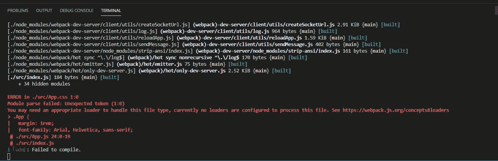

# 如何使用 Babel 和 Webpack 从头开始创建一个 React 应用程序

> 原文：<https://javascript.plainenglish.io/how-to-create-a-react-application-from-scratch-with-babel-and-webpack-a5524ee8c8b3?source=collection_archive---------12----------------------->

Photo by [Sun Lingyan](https://unsplash.com/@sunlingyan?utm_source=medium&utm_medium=referral) on [Unsplash](https://unsplash.com?utm_source=medium&utm_medium=referral)

如果您曾经创建过 react 应用程序，那么您可能已经使用 create-react-app 或 Gatsby 创建了您的 React 应用程序。虽然这对于创建应用程序来说很棒，但它并没有真正帮助我们理解什么样的底层机制允许将 react 应用程序编译成浏览器能够理解的普通 JavaScript。

为了真正理解发生了什么，我们将从头开始学习创建 react 应用程序的教程。

该设置实际上有两个部分:

*   巴比伦式的城市
*   网络包

在我们浏览教程之前，让我们简单地看一下这些是什么。

# 巴比伦式的城市

Babel 是一个 JavaScript 编译器，它将较新的 JavaScript 语法转换成较旧的 JavaScript 语法(又名 ES5 语法)。它还包括可以将 JSX 转换为 JavaScript 语法的预设。

# 网络包

Webpack 是一个模块捆绑器，它获取项目中的所有文件，并输出表示这些文件的静态资产。这些静态资产由包组成，其中一个包实际上在浏览器上运行。它由几样东西组成:

*   入口点:webpack 应该解析哪个文件并生成包
*   输出:编译后最新的包将位于何处
*   加载器:支持附加功能，允许 webpack 将其他类型的文件解析成浏览器可以理解的内容(例如，css-loader、style-loader)。
*   插件:webpack 编译过程的关键部分，可以帮助优化应用程序的性能

# 辅导的

步骤 1:设置一个目录，并将其命名为 webpackReactSetup。在同一目录中，添加一个 public 文件夹和一个 src 文件夹。

步骤 2:在公共文件夹中，创建一个包含以下内容的 index.html:

第三步:现在我们需要安装一些巴别塔软件包。如前所述，这些巴别塔库将帮助把 ES6 和 JSX 逻辑转换成浏览器可以理解的东西。在终端上，运行 NPM install—save-dev @ babel/core @ 7 . 1 . 0 @ babel/CLI @ 7 . 1 . 0 @ babel/preset-env @ 7 . 1 . 0 @ babel/preset-react @ 7 . 0 . 0。

预设库(preset-react 和 preset-env)帮助我们将 JSX 和 ES6 语法转换成浏览器能够理解的原始风格的 JavaScript。

步骤 4:现在在项目根目录下添加一个. babelrc 文件，内容如下:

现在我们已经设置了 babel，让我们来看看 webpack 包。

第 5 步:让我们安装 webpack 包。在您的终端上，运行 NPM install-save-dev web pack @ 4 . 19 . 1[web pack-CLI](https://webpack.js.org/api/cli/)@ 3 . 1 . 1[web pack-dev-server](https://github.com/webpack/webpack-dev-server)@ 3 . 1 . 8[babel-loader](https://github.com/babel/babel-loader)@ 8 . 0 . 2。

我们安装这些软件包是为了捆绑不同种类的文件。此外，为了让我们的浏览器在每次 React 应用程序发生变化时重新加载，我们需要安装 webpack-dev-server 作为库。

Photo by [Alexandre Debiève](https://unsplash.com/@alexkixa?utm_source=medium&utm_medium=referral) on [Unsplash](https://unsplash.com?utm_source=medium&utm_medium=referral)

第 6 步:在根目录下，创建一个名为 webpack.config.js 的文件，内容如下:

这里发生了很多事情，所以让我来总结一下这个文件中最重要的几点:

*   入口点:这告诉 Webpack 应该从哪里开始捆绑。
*   模块:告诉 Webpack 在转换文件时如何处理不同种类的文件。例如，在第 10 行到第 13 行，它包含了使用 babel loader 将 JSX 和 ES6 语法转换成浏览器可以理解的内容的规则。
*   输出:这告诉我们放置捆绑文件夹的位置。它还告诉我们的 webpack-dev-server 在哪里提供我们的文件。

步骤 7:现在我们需要安装两个非常重要的 React 包。运行 npm 安装-保存`[react](https://reactjs.org/)@16.5.2` `[react-dom](https://www.npmjs.com/package/react-dom)@16.5.2.`

第 8 步:转到项目下的 src 文件夹，用以下内容创建一个 index.js:

这是 webpack 的入口点。因此，为了让 babel 和 webpack 发挥它们的魔力，它需要一个 App.js，并在浏览器上将它转换为纯 JavaScript 和 CSS。

为了继续，让我们用以下内容创建一个 App.js:

第 9 步:使用最后一部分，让我们添加一个 package.json，内容如下:

npm 或 yarn(实际上取决于您的偏好)将使用这个 JSON 文件来管理您的项目的包/依赖项。

现在您可以运行 npm start，您的应用程序应该在 localhost:3000 上启动。

Photo by [krakenimages](https://unsplash.com/@krakenimages?utm_source=medium&utm_medium=referral) on [Unsplash](https://unsplash.com?utm_source=medium&utm_medium=referral)

等等！我们怎么没讲 CSS 预处理？发生了什么事？

这是因为我们还没有为 CSS 设置加载器。事实上，让我们再做一件事。

转到 src 目录，添加以下 CSS 文件:

现在返回到您的 app.js，并取消对用于导入 app.css 文件的行的注释。尝试重新运行 npm start，会出现这种情况:

哦不！那我们该怎么办？

这是我们将来要讨论的话题。

编码快乐！

*更多内容尽在*[plain English . io](http://plainenglish.io/)