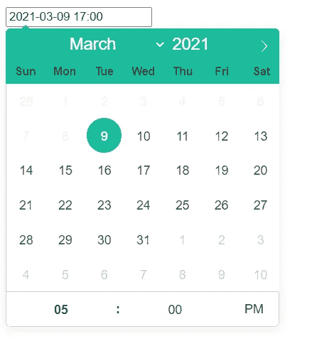

# 如何创建一个反应日期选择器

> 原文：<https://javascript.plainenglish.io/how-to-create-a-react-datepicker-c2fd3ef11369?source=collection_archive---------12----------------------->


想象一下。

客户可以选择约会日期和时间的表单。

无需来回发送电子邮件，只需客户自己选择的预设预约时间。

输入 React datepicker [Flatpikr](https://flatpickr.js.org/) 。

# **什么是 Flatpickr？**

Flatpickr 是一个轻量级、UX 驱动的 JavaScript 库，兼容 Angular、Vue、Ember 和 React。

它是其他日期时间库的一小部分，并且在 IE9、Edge、Chrome、Safari 和 Firefox 浏览器上受支持。

功能包括:

*   日期/时间输入
*   8 个彩色主题
*   人性化的形式
*   禁用日期范围和时间

# **如何创建一个 React datepicker**

1.  创建您的 React 应用程序
2.  安装`react-flatpickr`
3.  在你的应用中导入 Flatpickr
4.  导入 Flatpickr 主题
5.  添加一个`constructor()`方法
6.  添加一个`render()`方法
7.  将状态变量传递给 Flatpickr 组件
8.  添加一个`OnChange()`事件挂钩
9.  反应 FlatPickr 格式

# **创建您的 React 应用**

*Windows 命令提示符*

```
C:\Users\Owner\desktop\react> npx create-react-app react-example

C:\Users\Owner\desktop\react> cd react-example

C:\Users\Owner\desktop\react\react-example> npm start
```

首先，如果你还没有创建你的 [React 应用](../../../blog/article/reactjs-beginners-tutorial)。

**在浏览器中打开 React 应用**


运行开发服务器，查看 React 应用程序在开发服务器上的运行情况。

# **配置 React 文件**

*react-example>src>index . js(更新)*

```
import React from 'react';
import ReactDOM from 'react-dom';
import App from './App';

ReactDOM.render(<App />, document.getElementById('root'))
```

*react-example>src>app . js(更新)*

```
import React, { Component } from 'react';

class App extends Component {
  render() {
    return (
      <div className="App">

        <h1>Hello World</h1>

      </div>
    );
  }

}

export default App;
```

如果您还没有配置 React 应用程序，请进行配置。

**删除**src 文件中除 *index.js* 和 *App.js* 文件以外的所有内容。然后添加一个基本的类组件。

# **安装 React 日期选择器**

**安装 Flatpickr**

*Windows 命令提示符*

```
(command + C)
Terminate batch job (Y/N)? y

C:\Users\Owner\desktop\react\react-example> npm install react-flatpickr

C:\Users\Owner\desktop\react\react-example> npm start
```

终止批处理作业，然后安装`react-flatpickr`包，链接的 [React flatpickr](https://github.com/haoxins/react-flatpickr) 来自官方 [flatpickr Github 库](https://github.com/flatpickr/flatpickr)。

安装完成后，再次运行服务器。

# **配置 React 日期选择器**

**导入 Flatpickr**

*react-example>src>app . js*

```
import React, { Component } from 'react';
import Flatpickr from "react-flatpickr";

class App extends Component {
  render() {
    return (
      <div className="App">

        <h1>Hello World</h1>

      </div>
    );
  }

}

export default App;
```

从页面顶部导入`Flatpickr from "react-flatpickr"`开始。

**载入你选择的 flat pickr CSS**

*react-example>src>app . js*

```
import React, { Component } from 'react';
import Flatpickr from "react-flatpickr";
import "flatpickr/dist/themes/material_green.css";

class App extends Component {
  render() {
    return (
      <div className="App">

        <h1>Hello World</h1>

      </div>
    );
  }

}

export default App;
```

此外，导入您选择的 CSS 文件。这些选项包括:

*   material_green.css
*   material_blue.css
*   material_red.css
*   material_orange.css
*   dark.css
*   airbnb.css
*   五彩纸屑

**添加构造函数()方法**

*react-example>src>app . js*

```
import React, { Component } from 'react';
import Flatpickr from 'react-flatpickr';
import "flatpickr/dist/themes/material_green.css";

class App extends Component {
  constructor() {
    super();

    this.state = {
      date: new Date()
    };
  }

  render() {
    return (
      <div className="App">

        <h1>Some Text</h1>

      </div>
    );
  }

}

export default App;
```

现在在`render()`方法之前添加一个`constructor()`方法。

*`*constructor()*`*法是什么？**

*一个`constructor()`方法初始化一个在类组件中创建的对象。*

*在组件的`constructor()`方法中调用`super()`。*

**什么是* `*super()*` *法？**

*`super()`让我们可以访问父组件，现在我们可以使用`this`。*

**什么是* `*this.state*` *？**

*`this.state`是渲染值(即当前屏幕上的内容)。*

*然后我们将创建一个等于`new Date()`的状态变量`date`。*

**什么是* `*new Date()*` *？**

*`new Date()`作为 JavaScript 构造函数调用时，返回当前日期和时间的新字符串表示。*

***添加常量变量***

**react-example>src>app . js**

```
*import React, { Component } from 'react';
import Flatpickr from 'react-flatpickr';
import "flatpickr/dist/themes/material_green.css";

class App extends Component {
  constructor() {
    super();

    this.state = {
      date: new Date()
    };
  }

  render() {
    const { date } = this.state;
    return (
      <div className="App">

        <h1>Some Text</h1>

      </div>
    );
  }

}

export default App;*
```

*现在转到`render()`方法，将`const { date }`设置为`this.state`，首先在`constructor()`中初始化。*

**什么是* `*const*` *变量？**

*`const`变量是对一个值的常量引用。该值是一个原始值，不能因为被赋值为常数而改变。*

***将状态变量传递给 Flatpickr***

**react-example>src>app . js**

```
*import React, { Component } from 'react';
import Flatpickr from 'react-flatpickr';
import "flatpickr/dist/themes/material_green.css";

class App extends Component {
  constructor() {
    super();

    this.state = {
      date: new Date()
    };
  }

  render() {
    const { date } = this.state;
    return (
      <Flatpickr
        data-enable-time
        value={date}
        onChange={date => {
          this.setState({ date });
        }}
      />
    );
  }
}

export default App;*
```

*现在我们可以将状态变量`date`作为`value`传递给子组件 Flatpickr。*

*我们还将添加一个`OnChange`事件挂钩，它将使用箭头函数传递参数`date`。*

**什么是* `*OnChange*` *钩？**

*当用户选择日期或更改时间时，触发`OnChange`事件挂钩。*

**什么是* `*setState*` *？**

*`setState()`方法改变组件状态，告诉 React 用更新后的状态重新渲染组件和子组件。*

# ***在浏览器中查看 React 日期时间选择器***

****

*是时候在浏览器中看到我们的工作了。*

*重新加载页面，嘣！*

*您将看到带有当前日期和时间的输入。*

*现在点击输入。*

*应该会出现一个带有日期和时间选项的日历。*

*您可以更改日期和时间。*

# ***附加的 React Datepicker 选项***

*现在来看定制选项。*

***React Flatpickr: minDate***

**

**react-example>src>app . js**

```
*import React, { Component } from 'react';
import Flatpickr from 'react-flatpickr';
import "flatpickr/dist/themes/material_green.css";

class App extends Component {
  constructor() {
    super();

    this.state = {
      date: new Date()
    };
  }

  render() {
    const { date } = this.state;
    return (
      <Flatpickr
        data-enable-time
        value={date}
        options={{
              minDate: 'today',
            }}
        onChange={date => {
          this.setState({ date });
        }}
      />
    );
  }
}

export default App;*
```

*将最小日期设置为“今天”，这样就没有人能够选择已经发生的约会日期。*

***React Flatpickr: minTime***

**

**react-example>src>app . js**

```
*import React, { Component } from 'react';
import Flatpickr from 'react-flatpickr';
import "flatpickr/dist/themes/material_green.css";

class App extends Component {
  constructor() {
    super();

    this.state = {
      date: new Date()
    };
  }

  render() {
    const { date } = this.state;
    return (
      <Flatpickr
        data-enable-time
        value={date}
        options={{
              minTime: "08:00",
            }}
        onChange={date => {
          this.setState({ date });
        }}
      />
    );
  }
}

export default App;*
```

*设置最小时间，这样任何人都不能选择办公时间之前的时间。这需要在军事时间串集。*

***React Flatpickr: maxTime***

**

**react-example>src>app . js**

```
*import React, { Component } from 'react';
import Flatpickr from 'react-flatpickr';
import "flatpickr/dist/themes/material_green.css";

class App extends Component {
  constructor() {
    super();

    this.state = {
      date: new Date()
    };
  }

  render() {
    const { date } = this.state;
    return (
      <Flatpickr
        data-enable-time
        value={date}
        options={{
              maxTime: "17:00",
            }}
        onChange={date => {
          this.setState({ date });
        }}
      />
    );
  }
}

export default App;*
```

*设置一个最大时间，这样就没有人可以选择下班后的时间。*

***React flat pickr:altFormat***

**

**react-example>src>app . js**

```
*import React, { Component } from 'react';
import Flatpickr from 'react-flatpickr';
import "flatpickr/dist/themes/material_green.css";

class App extends Component {
  constructor() {
    super();

    this.state = {
      date: new Date()
    };
  }

  render() {
    const { date } = this.state;
    return (
      <Flatpickr
        data-enable-time
        value={date}
        options={{
              altFormat: "m/d/Y h:i K",
              altInput:true,
            }}
        onChange={date => {
          this.setState({ date });
        }}
      />
    );
  }
}

export default App;*
```

*现在设置一种更便于客户阅读的替代格式。更多日期/时间格式见[格式化文档](https://flatpickr.js.org/formatting/)。*

***React Flatpickr:禁用一周中的某一天***

**

**react-example>src>app . js**

```
*import React, { Component } from 'react';
import Flatpickr from 'react-flatpickr';
import "flatpickr/dist/themes/material_green.css";

class App extends Component {
  constructor() {
    super();

    this.state = {
      date: new Date()
    };
  }

  render() {
    const { date } = this.state;
    return (
      <Flatpickr
        data-enable-time
        value={date}
        options={{
              disable: [
              function(date) {
                  // return true to disable
                  return (date.getDay() === 0 || date.getDay() === 6);}],
            }}
        onChange={date => {
          this.setState({ date });
        }}
      />
    );
  }
}

export default App;*
```

*最后，将上述功能添加到选项中，禁用一周中的某些天。*

*此功能禁止选择星期日和星期六。*

*这些只是一些基本的例子。查看[flatpickr.js.org](https://flatpickr.js.org/options/)了解更多定制选项。*

**原载于*[*https://www.ordinarycoders.com*](https://www.ordinarycoders.com/blog/article/react-datepicker)*。**