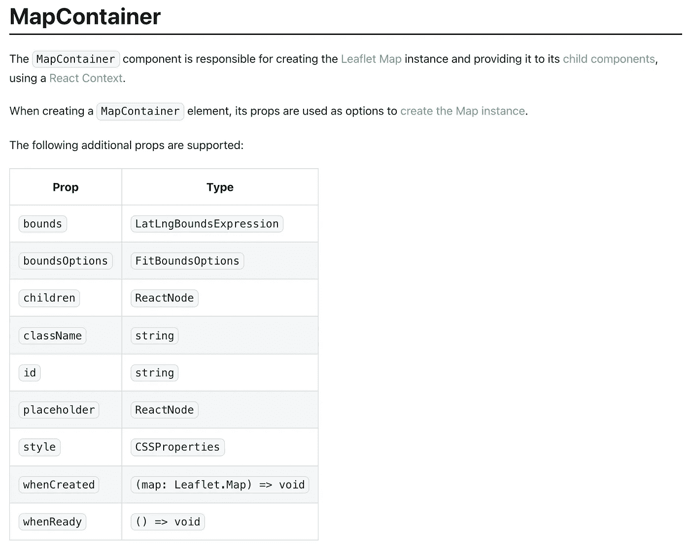
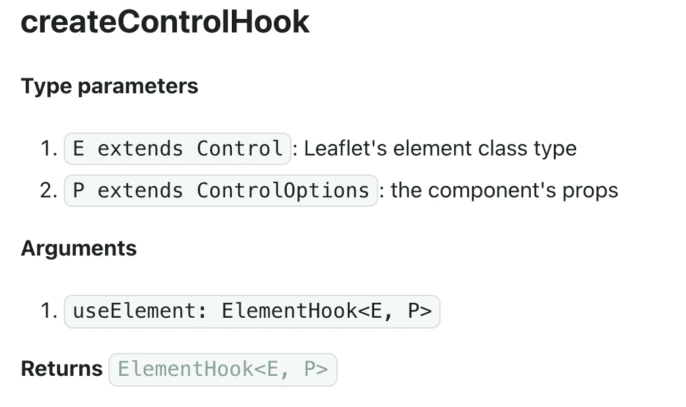

# 如何使用活页路由机器创建反应式活页控制组件

> 原文：<https://javascript.plainenglish.io/how-to-create-a-react-leaflet-control-component-with-leaflet-routing-machine-8eef98259f20?source=collection_archive---------2----------------------->

Photo by [henry perks](https://unsplash.com/@hjkp?utm_source=unsplash&utm_medium=referral&utm_content=creditCopyText) on [Unsplash](https://unsplash.com/s/photos/maps?utm_source=unsplash&utm_medium=referral&utm_content=creditCopyText)

[***跟随本沙盒一起上栈***](https://stackblitz.com/edit/react-leaflet-routing-machine-starter?file=src%2FMap.jsx)

当[使用 React-Leaflet](/react-leaflet-v3-creating-a-mapping-application-d5477f19bdeb) 时，有时我们会想在地图上添加我们自己的自定义控件。假设我们想向用户展示如何从 A 点到 b 点。[React-传单](https://react-leaflet.js.org/)没有开箱即用的路由功能，但我们可以使用[第三方插件](https://leafletjs.com/plugins.html)快速轻松地完成这项工作。[传单发送机](http://www.liedman.net/leaflet-routing-machine/)给了我们想要的功能，但是我们如何让这个普通的传单控制插件与我们的 React-Leaflet 应用程序一起工作呢？

# 使用 React 的 useRef 钩子

重要的是要记住，即使我们使用 React， [Leaflet 也将为我们的地图](https://react-leaflet.js.org/docs/start-introduction#dom-rendering)处理 DOM 渲染。这意味着我们可以通过使用 [React 的](https://reactjs.org/docs/hooks-reference.html#useref) `[useRef](https://reactjs.org/docs/hooks-reference.html#useref)` [钩子](https://reactjs.org/docs/hooks-reference.html#useref)来访问我们的传单元素。

如果我们看一下 MapContainer 组件的[文档，我们会看到它有一个`whenCreated`属性:](https://react-leaflet.js.org/docs/api-map#mapcontainer)

Map Container Props list from the documentation

这是我们访问地图实例的方式。这个`whenCreated`道具是一个函数，它接收传单地图实例，并允许我们将地图实例设置为渲染后的状态。这样我们就可以访问它，这样我们就可以在实例中添加和删除层。这是我们在演示中设置的地图:

## Map.jsx

现在我们已经将地图保存到了 state，我们可以使用它来添加传单-路由-机器控制。为了实例化[传单路由机器](http://www.liedman.net/leaflet-routing-machine/#getting-started)，我们将需要调用`L.Routing.control(<[RoutingControlOptions](http://www.liedman.net/leaflet-routing-machine/api/#routingcontroloptions)> options?)`，它接受一个[选项对象](http://www.liedman.net/leaflet-routing-machine/api/#l-routing-control)。出于我们的目的，我们将只使用`position`、`waypoints`和`lineOptions`选项。我们将使用 [React 的](https://reactjs.org/docs/hooks-reference.html#useeffect) `[useEffect](https://reactjs.org/docs/hooks-reference.html#useeffect)` [钩子](https://reactjs.org/docs/hooks-reference.html#useeffect)来确保在我们尝试实例化我们的控件之前已经渲染了地图。一旦控件被实例化，我们可以用`useRef`钩子将这个实例分配给一个 React ref，并保存 ref 到状态以观察更新。然后，在一个单独的`useEffect`函数中，我们将使用`.addTo(map)`将控件实例添加到我们的地图中。

## Map.jsx

我们现在应该有两个路点，华盛顿 DC 和三藩市，由一条蓝线连接。在地图的左侧还应该有一个方框，标明 A 点和 B 点的往返方向。在下面的演示中尝试一些选项和方法！

# react-活页 v3 核心 API

第二种方法是使用 React-Leaflet 核心 API 创建一个定制的 React 组件。如果您不熟悉 React-传单的这一部分，请查看此处的[介绍部分](https://react-leaflet.js.org/docs/core-introduction)。只要确保你已经安装了`@react-leaflet/core`。如果我们看一下核心 API 文档的[钩子工厂部分，我们会发现一堆 React-Leaflet 钩子，它们允许我们创建各种定制的 React-Leaflet 组件。在这里，我们将找到](https://react-leaflet.js.org/docs/core-api/#hook-factories)`[createControlHook](https://react-leaflet.js.org/docs/core-api/#createcontrolhook)` [钩子](https://react-leaflet.js.org/docs/core-api/#createcontrolhook)，它接受一个小叶控件的实例并返回一个小叶元素。

createControlHook from the documentation

让我们使用我在本文开头提供的[初学者沙箱](https://stackblitz.com/edit/react-leaflet-routing-machine-starter?file=src/Map.jsx)。在项目的 src 目录下创建一个名为`RoutingControl.jsx`的新文件，并从传单、反应传单和传单路由机器中导入必要的项目。

## RoutingControl.jsx

在我们的导入下，我们将创建一个函数，它接收`props`，实例化我们的路由控制，并返回该实例。它看起来非常类似于我们在前一个例子中为控件创建的 ref。

## RoutingControl.jsx

然后我们取这个函数，把它传递给`createControlHook`，并把它赋给一个变量。最后，我们导出这个新的定制控件组件，将其导入到我们的`Map.jsx`文件中，并将其放在`MapContainer`中。

## RoutingControl.jsx

## Map.jsx

仅此而已。虽然 React-Leaflet 核心 API 文档起初看起来有点吓人，但使用它可以使事情变得非常简单。现在，我们在 React-fleet map 中有了一个定制的全功能传单路由机器实例。[用完成的代码](https://stackblitz.com/edit/react-leaflet-routing-machine-core-api?file=src/RoutingControl.jsx)来看看这个真实的沙盒。

React-Leaflet 核心 API 提供了各种各样的钩子和函数，它们在几乎每个项目中都非常有用。一定要通读文档，看看哪个对你的地图有用！你也可以 [**看看这篇文章**](/creating-an-ellipse-in-react-leaflet-72e2c5beff03) 如何使用 leafle-Ellipse 和 React-leafle 核心 API 创建一个自定义标记层组件。感谢阅读！

## 乔希·哈里斯报道:

*   [在 React 项目中使用 fleet . js:构建一个地图应用](/using-leaflet-js-in-a-react-project-6b23c30ed464)
*   [React-传单 v3:创建地图应用](/react-leaflet-v3-creating-a-mapping-application-d5477f19bdeb)
*   [如何在反应传单中创建椭圆](/creating-an-ellipse-in-react-leaflet-72e2c5beff03)
*   [如何在 Ag-Grid/React 中创建日期时间过滤器](/how-to-create-a-datetime-filter-in-ag-grid-react-e2e1ba2fc80)

*更多内容请看*[*plain English . io*](http://plainenglish.io/)