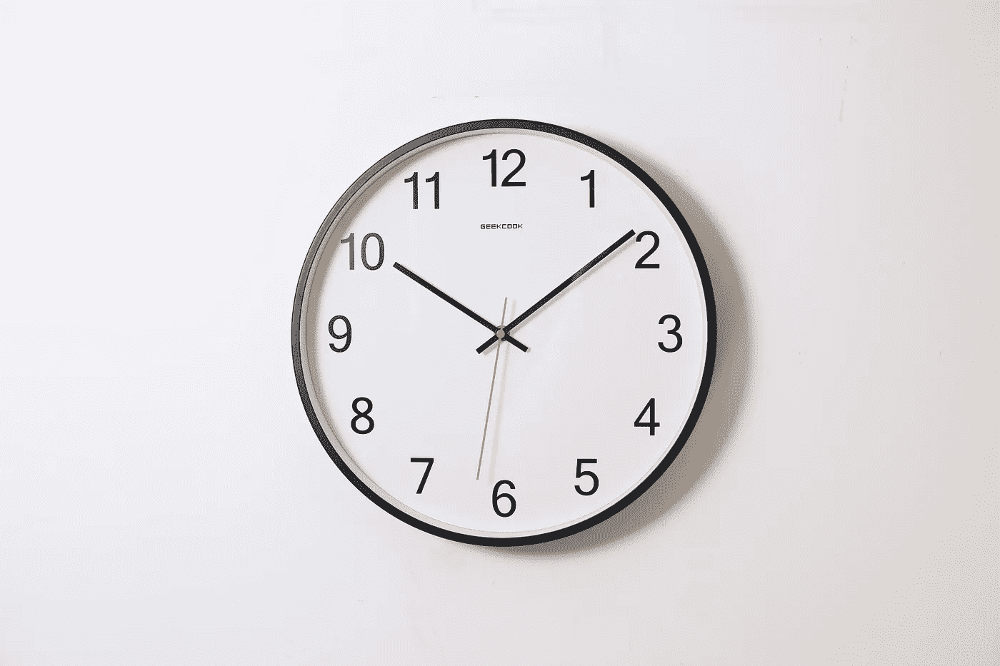

# 如何为 Web 应用程序创建实时时钟

> 原文：<https://javascript.plainenglish.io/how-to-create-a-real-time-clock-for-web-applications-3cf7a9cf6500?source=collection_archive---------6----------------------->

## 使用 JavaScript 为你所有的网络应用开发一个实时时钟



Photo by [Ocean Ng](https://unsplash.com/@oceanng?utm_source=unsplash&utm_medium=referral&utm_content=creditCopyText) on [Unsplash](https://unsplash.com/s/photos/clock?utm_source=unsplash&utm_medium=referral&utm_content=creditCopyText)

在本教程中，我将讨论为 web 应用程序创建一个实时时钟。这基本上是使用 **HTML** 、 **CSS、**和 **JavaScript** 开发的，因此，即使你是 web 开发的初学者，这对于你来说也不难理解，并在将来为你的 web 应用程序添加这个时钟。

我将用一个例子来讨论每一步，这样你就可以在本教程结束时继续和我一起创建一个漂亮的实时时钟。在开始编码之前，请确保选择一个与 HTML、CSS 和 JavaScript 配置文件兼容的文本编辑器。

我更喜欢 VS 代码，您可以相应地选择任何代码编辑器*【如果您想下载 VS 代码，请单击下面的链接并将其安装到您的计算机上】*。

[](https://code.visualstudio.com/download) [## 下载 Visual Studio 代码- Mac、Linux、Windows

### Visual Studio 代码是免费的，可以在您喜欢的平台上获得——Linux、macOS 和 Windows。下载 Visual Studio…

code.visualstudio.com](https://code.visualstudio.com/download) 

让我们首先创建**index.html**文件。这是一个基本的配置文件，其中包含了所有基本的 HTML 标签。我使用了一个< div >标签来放置我的时钟，这样我可以在以后需要的时候将它移动到其他地方。这是我的*index.html*。

接下来，您可以添加 **styles.css** 文件，并将您的所有样式放入其中。一旦你完成了，你可以把它添加到*index.html*文件中，就像上面的代码片段一样。在本教程中，我使用了一个基本的样式，因为我需要把我的时钟放在网页的右上角，我更喜欢蓝色。下面是我的 *styles.css* 。

```
.topcorner{
  position:absolute;
  top:10;
  right:10;
  color: blue;
}
```

你可以通过这个文件给你的时钟添加任何额外的样式，并且可以随意地在你的网页上定制一个更好的视图。

接下来，我们将开发实时时钟。为此，我们可以在 JavaScript 中使用**日期对象**。通过使用 new Date()构造函数，我们可以用当前日期和时间创建一个新的 Date 对象。让我们在 JS 函数中创建它，如下所示。

```
function showTime(){var d = new Date();
}setInterval(showTime,1000);
```

我们还需要一个 JavaScript `setInterval()`方法，它被设置为 1 秒钟，以便在每秒钟调用`showTime`函数。因此，时钟将每秒更新一次，我们将能够看到我们的时钟一直在走。为了获得更多的细节，比如年、月、日、日以及时钟中的时、分、秒，我们可以更新函数如下。

```
function showTime(){var d = new Date();
var year = d.getFullYear();
var month = d.getMonth();
var date = d.getDate();
var day =d.getDay();
var hour = d.getHours();
var min = d.getMinutes();
var sec = d.getSeconds();}setInterval(showTime,1000);
```

上面的代码将给出一个完整的日期和时间，并且由于使用了`setInterval()`方法，它一直在滴答作响。此时，如果你输入一个`console.log()`,你会看到一个数字输出，比如一月的数值为 1，二月的数值为 2，星期一的数值为 1，星期二的数值为 2，依此类推。此外，您将获得 24 小时格式的当前时间。

因此，下一个任务将是将这个输出配置为一个更舒适的视图。

让我们将月份的数值改为一个字符串，这样您就可以在日历中看到它了。JavaScript **Switch** 语句对于这个任务来说是最方便的，它可以配置如下。

```
switch(month){case 1:
month="January";
break;case 2:
month="February";
break;case 3:
month="March";
break;case 4:
month="April";
break;case 5:
month="May"
break;case 6:
month="June"
break;case 7:
month="July"
break;case 8:
month="August"
break;case 9:
month="September"
break;case 10:
month="October"
break;case 11:
month="November"
break;case 12:
month="December"
break;default:}
```

让我们再次使用 **Switch** 语句将日期转换为字符串值。

```
switch(day){case 1:
day="Monday";
break;case 2:
day="Tuesday";
break;case 3:
day="Wednesday";
break;case 4:
day="Thursday";
break;case 5:
day="Friday";
break;case 6:
day="Saturday";
break;case 7:
day="Sunday";
break;default:}
```

现在，您可以获得字符串格式的月份和日期。您可以通过在代码中运行`console.log()`来检查它。接下来，我想让时钟采用 **12 小时**格式，而不是默认的 **24 小时**格式*【基本上，当您使用新的****Date()****object】*时，您会得到 ***24 小时*** *格式的时间。*

我使用了一个基本的 **IF** 语句来获取 12 小时格式的时间，语句末尾有**" AM "**&**" PM "**字符串。您可以在下面找到我用于这种转换的代码。

```
var MV = "AM";
if(hour == 12){
MV = "PM";
}if(hour > 12){
hour = hour % 12;
MV = "PM";
}
```

现在你已经准备好在浏览器上打开你的时钟了。让我们使用 DOM `getElementById()`方法打开它。让我们配置如下，一旦你完成了，在浏览器上打开你的 index.html 文件。

```
document.getElementById("clock").innerHTML = "<b>Today is:</b> "+day+" "+date+"th "+month+" "+year+", "+hour+":"+min+":"+sec+" "+MV;
```

现在，您将获得一个完整的时钟，其中包含当前的日期和时间，它会在您的应用程序中持续运行。

让我们做一个小小的改变，这将在时钟的开头添加一个**【0】**来表示小时、分钟和秒钟，而每个部分只有一个数字。

```
hour = ("0" + hour).slice(-2);min = ("0" + min).slice(-2);sec = ("0" + sec).slice(-2);
```

确保将该部分添加到`showTime()`功能的末尾，它将检查每个部分并在必要的地方添加一个**“0”**。

这里 可以找到完整的 JavaScript 代码 [**。**](https://github.com/randiltennakoon/Real-time-clock-for-web-app/blob/master/app.js)


Screenshot by Author

# 结论

***恭喜*** 🎉

您已经成功开发了您的实时时钟，并可以随意将其添加到您的 web 应用程序中*【您可以通过下面的链接找到该项目的源代码】*。

**源代码:** [**GitHub**](https://github.com/randiltennakoon/Real-time-clock-for-web-app)

感谢阅读！

*更多内容看* [***说白了就是***](http://plainenglish.io/) ***。*** *报名参加我们的* [***免费每周简讯这里***](http://newsletter.plainenglish.io/) ***。***