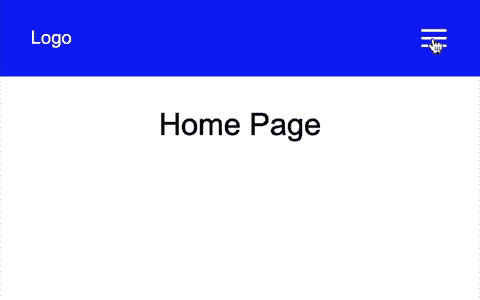
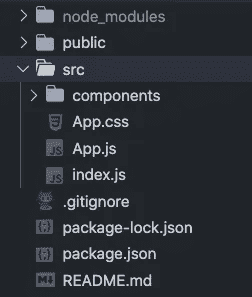
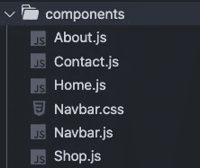
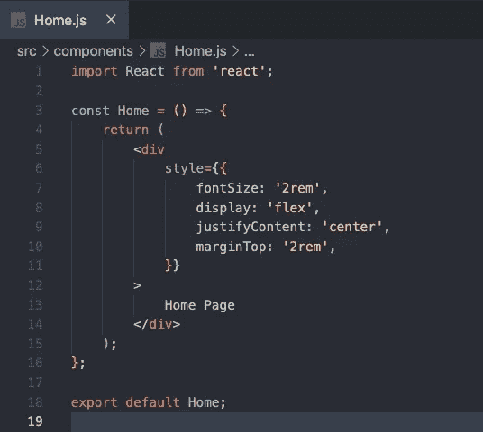
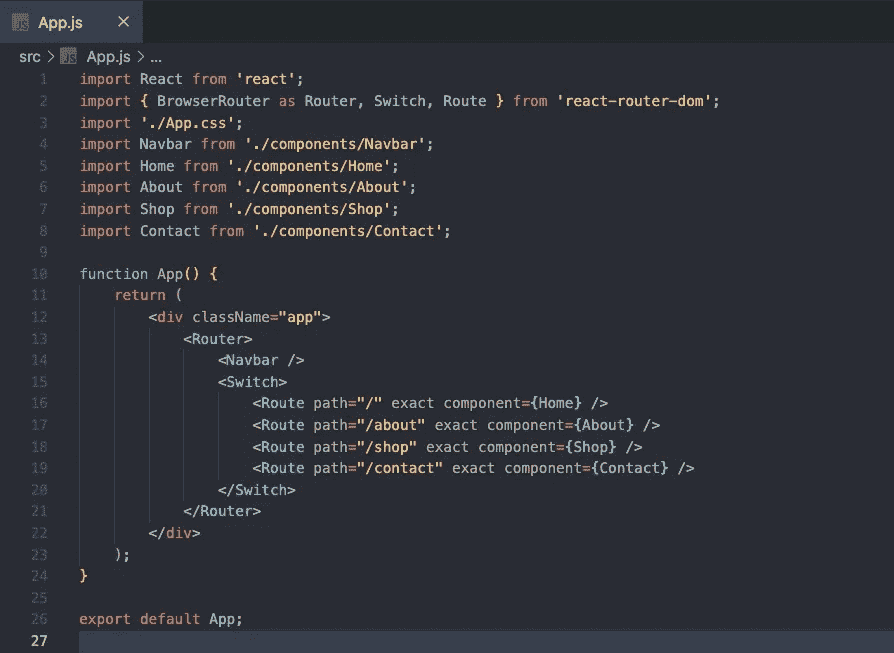
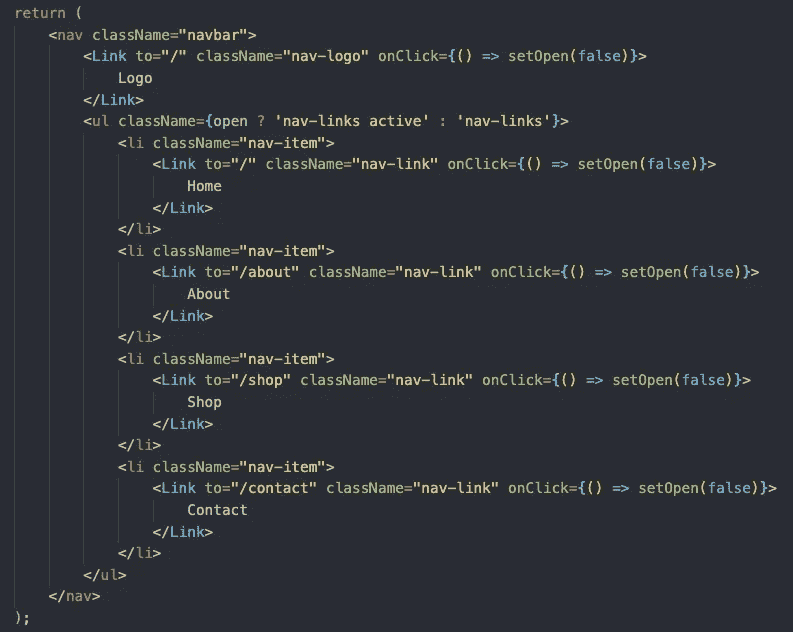
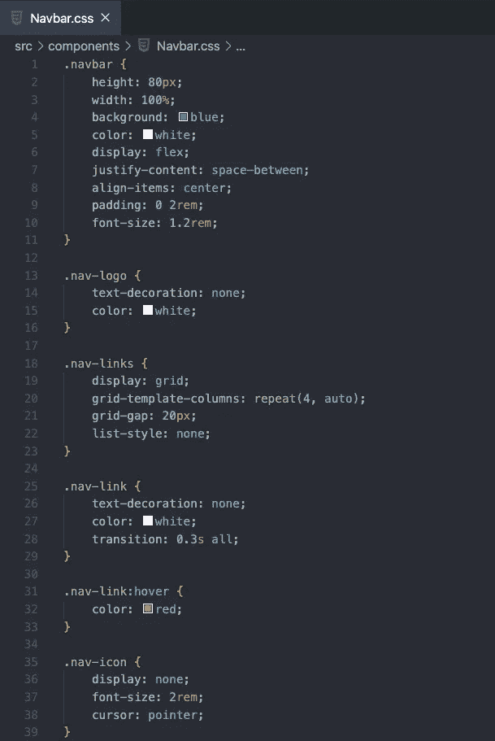
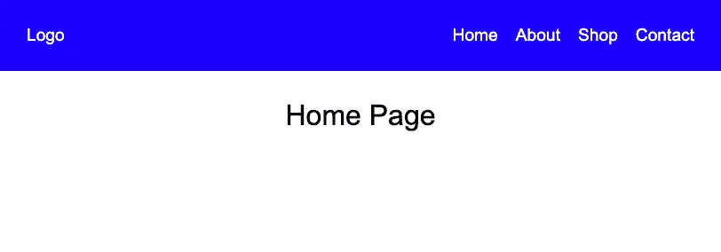
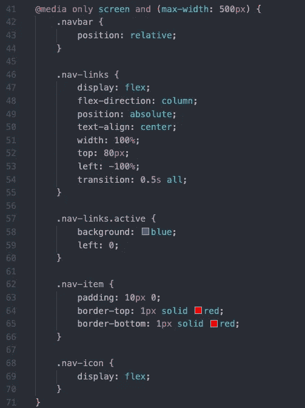

# 如何用 React 创建一个响应式导航栏

> 原文：<https://javascript.plainenglish.io/how-to-create-a-responsive-navbar-with-react-bb9ce4cebddd?source=collection_archive---------0----------------------->

## 从桌面视图平稳过渡到移动视图


Photo by [Maxim Ilyahov](https://unsplash.com/@glvrdru?utm_source=medium&utm_medium=referral) on [Unsplash](https://unsplash.com?utm_source=medium&utm_medium=referral)

现在所有的网站都需要在不同的设备上响应良好。创建一个响应式网站可以增强用户体验，甚至可以对 SEO 产生影响。

在本文中，我将向您展示如何使用 React 创建一个响应式导航条。这是我们将要构建的预览。



Mobile View

我们将使用 React、CSS 和 react-icons 创建导航栏。我们还将使用 react-router 设置基本路由。这可以作为你下一个网站的布局。享受添加 CSS 和构建页面的乐趣。

# 入门指南

让我们从初始化一个样板文件`create-react-app`开始。我们将清理一些我们不使用的文件，并为我们的应用程序重置一些样式。在`App.css`文件中，添加以下代码。

```
* {
  margin: 0;
  padding: 0;
  box-sizing: border-box;
  font-family: Arial, Helvetica, sans-serif;
}
```

接下来，创建一个 components 文件夹，我们的文件结构将如下所示。



在我们的应用程序中，我们将有一个导航栏显示在每个页面上。我们还将使用 react-router 来设置我们可以导航到的不同路由。我们将创建四个不同的页面，主页，关于，商店和联系。

在我们的组件文件夹中，让我们创建如下所有需要的文件。每个页面组件一个文件，navbar 一个文件，navbar CSS 一个文件。



主页、关于、商店和联系页面将在每个页面上显示一个`div`。您可以随心所欲地创建和设计这些页面。在我们的示例中，每个页面组件都将显示文本，如下所示。



# 使用 React 路由器设置路由

现在我们已经创建了页面组件，让我们使用 react-router 设置路由。我们将首先安装 [react-router-dom](https://www.npmjs.com/package/react-router-dom) 。

```
npm install react-router-dom
```

如果您是 react-router 的新手，可以看看下面的文章开始使用。

[](https://medium.com/javascript-in-plain-english/tutorial-and-beginners-guide-to-react-router-ee19ca31d7d) [## React 路由器教程和初学者指南

### 如何在 React web 应用程序中使用客户端路由

medium.com](https://medium.com/javascript-in-plain-english/tutorial-and-beginners-guide-to-react-router-ee19ca31d7d) 

在您的`App.js`文件中，导入导航栏、主页、关于、商店和联系人组件。您还需要从 react-router 库中导入`BrowserRouter`、`Switch`和`Route`组件。设置到不同页面的路径并保存文件。您的`App.js`文件将如下所示。



App.js

正如你在上面看到的，为了让 navbar 出现在每个页面上，我们将 Navbar 组件放在了`Switch`组件之外。

# 创建导航栏

接下来，我们将创建并设计导航条的样式。

导航栏将在左侧包含一个标志，在右侧包含 4 个链接到我们的页面。在移动视图中，这 4 个链接会变成一个汉堡菜单图标。现在，让我们关注桌面视图。

在`Navbar.js`文件的返回语句中，我们将添加一个保存徽标的`nav`标签和一个保存页面链接的`ul`。我们的标志将链接到主页。在`ul`中，创建 4 个`li`元素，每个元素都有一个到相关页面、主页、关于、商店和联系人的链接。



Navbar.js

在`Navbar.css`文件中，添加下面的代码来设置导航条的样式。



整个`.navbar`类将显示为 flex，其中`justify-content`设置为`space-between`。这将创建标志之间的空间，和 4 个链接。

`.nav-links`类显示为网格，均匀地显示页面链接。我们可以通过将`grid-template-columns`设置为`repeat(4, auto)`来实现这一点。

目前，导航条应该是这样的。



Desktop View

# 使导航条响应迅速

为了创建导航栏的响应性，我们将隐藏链接，当页面宽度低于 500 像素时，显示汉堡菜单图标。

我们将使用 [react-icons](https://www.npmjs.com/package/react-icons) 包中的几个图标。让我们先把它安装到我们的项目中。

```
npm install react-icons
```

如果你以前从未使用过反应图标，看看下面的文章开始吧。

[](https://medium.com/javascript-in-plain-english/tutorial-and-beginners-guide-to-using-react-icons-77c614696301) [## 使用 React 图标的初学者指南

### 在一个地方获得您需要的所有图标

medium.com](https://medium.com/javascript-in-plain-english/tutorial-and-beginners-guide-to-using-react-icons-77c614696301) 

首先，从 react-icons 库中导入两个图标到`Navbar.js`。

```
import { FiMenu, FiX } from 'react-icons/fi';
```

我们还使用`useState`钩子来确定在移动视图中导航条链接是打开还是关闭。

```
const [open, setOpen] = useState(false);
```

接下来，向 return 语句添加菜单和关闭图标。我们将添加一个`onClick`属性来设置状态，并显示正确的图标。如果 state 设置为 true，这意味着显示将是打开的，所以我们希望显示关闭图标。如果设置为 false，我们将希望显示菜单图标。

```
<div onClick={() => setOpen(!open)} className="nav-icon">
  {open ? <FiX /> : <FiMenu />}
</div>
```

我们还将为每个链接设置一个`onClick`属性，每当我们选择一个页面时，它将关闭导航栏显示。每个链接应该看起来像这样。

```
<Link to="/" className="nav-link" onClick={() => setOpen(false)}>
  Home
</Link>
```

最后，我们将更新`ul`标签上的`className`。如果 open state 设置为 true，我们将添加一个显示导航栏链接的活动类。

在`Navbar.css`文件中，我们现在为 500px 的`max-width`创建媒体查询。

我们需要将`.navbar`类的位置设置为相对位置，这样我们就可以将`.nav-links`类设置为绝对位置。我们将为从左侧进入视图的链接创建一个简单的过渡。为此，我们将`.nav-links`类上的`left`属性设置为`-100%`，将`.nav-links.active`类上的`left`属性设置为`0`。



# 包扎

你现在可以把它作为你下一个网站的模板。摆弄 CSS，随心所欲地构建页面！

如果你想查看完整的代码，可以看看下面的 GitHub 库。

[](https://github.com/chadmuro/react-responsive-navbar) [## Chad muro/react-responsive-navbar

### 在 GitHub 上创建一个帐户，为 Chad muro/react-responsive-navbar 的开发做出贡献。

github.com](https://github.com/chadmuro/react-responsive-navbar) 

感谢阅读！让你的网站具有响应性是非常重要的，我希望这篇文章对你使用 React 创建一个响应性的导航条有所帮助。