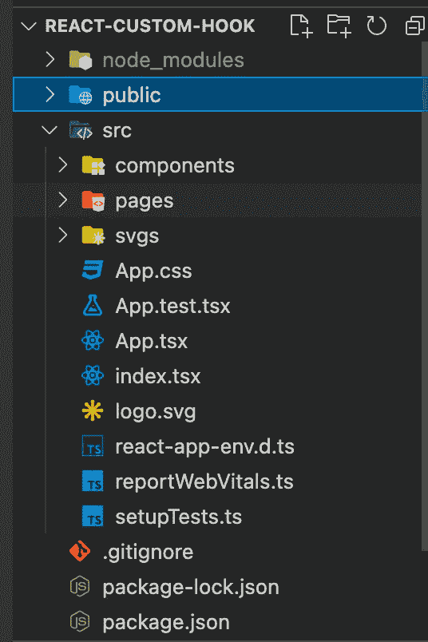
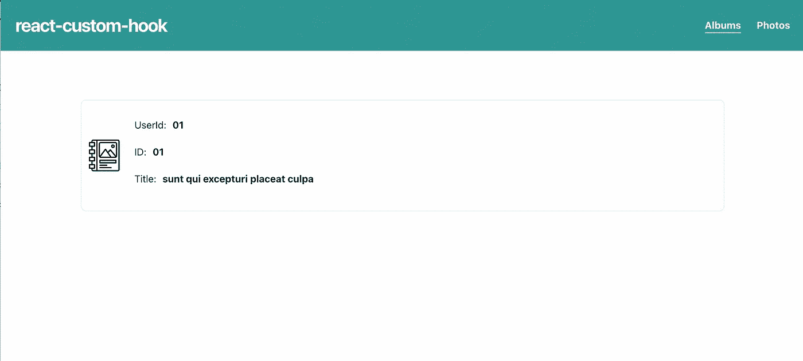
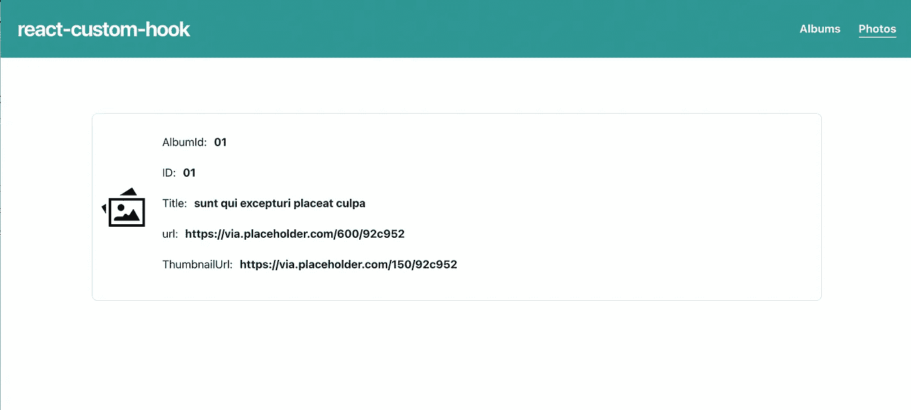
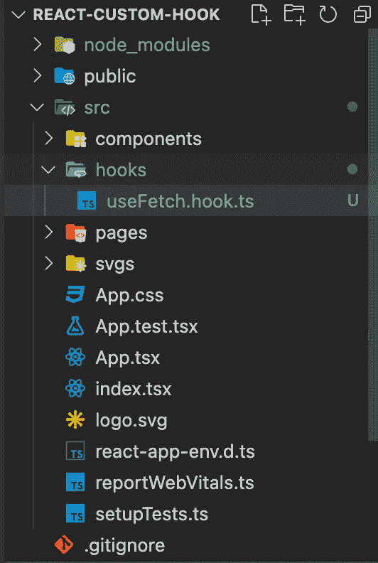

# 如何用 React 和 TypeScript 创建一个可重用的定制钩子

> 原文：<https://javascript.plainenglish.io/how-to-create-a-reusable-custom-hook-with-react-js-and-typescript-6e5ef8340e1?source=collection_archive---------2----------------------->

[Jonny Caspari](https://unsplash.com/@jonnysplsh?utm_source=unsplash&utm_medium=referral&utm_content=creditCopyText) on [Unsplash](https://unsplash.com/s/photos/hook?utm_source=unsplash&utm_medium=referral&utm_content=creditCopyText)

代码可重用性是指在多个地方使用一个代码来执行相同或相似的功能。它提供了更短的开发时间、更好的最终产品等优势，并且消除了代码冗余([不要重复](https://en.wikipedia.org/wiki/Don%27t_repeat_yourself))。

在本教程中，我们将学习如何用 TypeScript 编写一个可重用的自定义钩子。

对于后端服务，我们将使用[**JSONPlaceholder**](http://jsonplaceholder.typicode.com/)**相册和照片端点。[**JSONPlaceholder**](http://jsonplaceholder.typicode.com/)**是一个免费的在线 API 服务。****

****您可以通过克隆这个存储库(**main branch**)
[here](https://github.com/Mr-Malomz/react-custom-hook)
)来进行编码(如果您更喜欢查看完整的代码，请查看同一个存储库的 **dev** 分支。)****

****在本教程中，我们将只关注实现。项目 UI 已经设置了 [**脉轮 UI**](https://chakra-ui.com/) 。****

# ****文件夹结构****

********

****project folder structure****

****让我们看看上面的一些关键目录和文件:****

*   ****存储我们应用程序构建模块的文件夹。****
*   ****`pages:`存储我们应用程序页面的文件夹。****
*   ****`App.tsx:`连接所有组件的文件。****

# ****运行项目****

****导航到项目位置，打开您的终端并安装项目依赖项****

****install project dependency****

****然后使用下面的命令运行项目****

****Start project****

> *****您的项目应该在*上弹出`[*http://localhost:3000*](http://localhost:3000/)`****

********

****albums page****

********

****photos page****

# ******创建自定义挂钩******

****随着项目的启动和运行，我们可以创建一个可重用的钩子来对[**JSONPlaceholder**](http://jsonplaceholder.typicode.com/)端点进行 API 调用。我们将使用 [**axios**](https://github.com/axios/axios) 在这个应用程序中进行 API 调用。Axios 是一个基于 promise 的 HTTP 客户端，用于浏览器和 node.js。****

******步骤 1** 在`src`目录下创建一个`hooks`文件夹，并在该文件夹下创建一个`useFetch.hook.ts`文件。****

********

****Updated folder structure****

******第二步** 创建一个`useFetch`函数如下图所示:****

****useFetch.hook.ts****

****`useFetch.hook.ts`文件执行以下操作:****

*   ****导入所需的依赖项。****
*   ****创建一个`useFetch`函数，它接受一个[泛型](https://www.typescriptlang.org/docs/handbook/2/generics.html)类型的`T`数组和一个`url`参数。泛型允许我们创建一个可以在以后指定的类型，并在需要时实例化。****
*   ****用于存储响应、加载状态和错误的状态变量。我们也为我们的状态指定类型。****
*   ****使用`useEffect`钩子进行 API 调用。然后，我们用响应和捕捉错误(如果有)来更新应用程序状态。****
*   ****将`responses`、`isLoading`和`isError`作为常量断言返回。Const 断言确保变量是只读的，不能被重新赋值。****

# ****使用 useFetch 自定义挂钩****

******相册页面** 利用我们之前创建的 TypeScript 泛型。我们需要检查[**JSONPlaceholder**](http://jsonplaceholder.typicode.com/albums)端点的响应类型，并创建一个接口来表示响应类型。****

****albums response type.****

****知道这些后，我们可以更新`pages/Albums.tsx`文件，如下所示:****

****Albums.tsx****

****`Albums.tsx`文件执行以下操作:****

*   ****导入`useFetch`****
*   ****创建一个`IAlbum`接口来表示响应类型****
*   ****析构来自定制钩子的状态，并将`IAlbum`接口作为钩子接受的泛型进行传递****
*   ****当应用程序进行 API 调用时显示加载****
*   ****设置一个错误界限，并显示一条适当的消息(如果有的话)。然后我们循环遍历`responses`数组并显示专辑细节。****

******照片页面** 我们可以重用我们的自定义钩子来查询照片的[**JSONPlaceholder**](http://jsonplaceholder.typicode.com/photos)端点。正如我们对**相册页面**所做的一样，我们也需要创建一个接口来表示响应类型并发出请求:****

****Photos response type****

****Photos.tsx****

****这样，您现在可以通过检查相册和照片路径来测试应用程序。****

# ****结论****

****这篇文章讨论了如何在 React 项目中创建一个可重用的定制钩子。我们还学习了如何将用户界面从逻辑中分离出来。****

****您可能会发现这些资源很有用:****

*   ****[类型脚本泛型](https://www.typescriptlang.org/docs/handbook/2/generics.html)****
*   ****[反应过来的钩子](https://reactjs.org/docs/hooks-overview.html)****

*****更多内容尽在*[***plain English . io***](http://plainenglish.io/)****