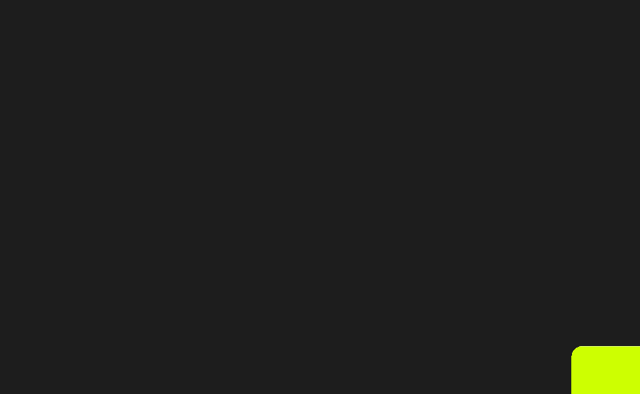

# 如何创建带有帧运动和反应的滚动进度动画

> 原文：<https://javascript.plainenglish.io/how-to-create-a-scroll-progress-animation-with-framer-motion-and-react-b98754cd8638?source=collection_archive---------2----------------------->

## 一篇关于如何使用带有 React 的帧运动创建自己的滚动进度动画的文章。


Photo by [Martin Jernberg](https://unsplash.com/@martinjernberg?utm_source=medium&utm_medium=referral) on [Unsplash](https://unsplash.com?utm_source=medium&utm_medium=referral)

# 内容

*   介绍
*   框架运动
*   入门指南
*   useViewPortScroll()
*   使用弹簧()
*   useTransform()
*   解决办法

# 介绍

在这篇文章+指南中，我们将介绍创建一个动画所需的所有必要的工具和技术，当用户在浏览器上向下滚动网页时，该动画可以跟踪用户位置的进展。这将包括当前百分比以及百分比的动画视觉表示。

如果这是你第一次使用 Framer Motion，这不是必需的，但我建议先阅读我的文章“如何使用 Framer Motion with React”以了解更多的基础知识。*底部链接。*

# 框架运动

让我们来谈谈帧运动和它是什么，帧运动提供了一个简单的 API，使过渡和动画功能强大。因为它使事情变得如此简单，你可以用它做一些非凡的事情，真正把动画带到一个新的水平。

# 入门指南

我们开始吧！首先，我们需要将依赖项安装到 React 项目中。

*Framer-Motion 要求您使用 React 版本 16.8 或更高版本。*

在 react 应用程序中运行以下命令来安装我们的成帧器运动依赖。

```
npm install --save framer-motion
```

现在它已经安装好了，您可以通过

```
import { motion } from “framer-motion"
```

我也将使用样式组件，使我的页面布局更漂亮。现在，这不是必需的，你可以很容易地在层叠样式表中添加 CSS。但是如果你想拥有和我在你的项目中安装样式组件一样的代码。

```
npm install --save styled-components
```

完善您的 React 项目现在拥有了编码所需的一切。如果你想跟我一样，克隆我的启动文件。这包括一堆使页面滚动的元素。

```
git clone [https://github.com/StevenCreates/framer-motion-scroll-progress-starter-files.git](https://github.com/StevenCreates/framer-motion-scroll-progress-starter-files.git)
```

如果你不想克隆这里是没有额外的内容使其可滚动的启动文件。

# useViewportScroll()

## W 这是什么帽子？

useViewportScroll 是一个类似于任何 React 钩子的钩子。使用时，它返回视口在浏览器中滚动时更新的值或运动值。

这些是钩子将返回的运动值:

*   scrollX —以像素为单位的水平滚动距离。
*   scrollY —以像素为单位的垂直滚动距离。
*   scrollXProgress —在 0 和 1 之间水平滚动进度。
*   scrollYProgress —在 0 和 1 之间垂直滚动进度。

重要的是要注意，你不能设置你的身体或 HTML 高度为 100%或类似，因为这打破了浏览器精确测量页面长度的能力。

## 现在我们正在使用它

对于我们的用例，我们将利用返回的 scrollYProgress 值，因为我们希望跟踪 0 和 1 之间的进度。

```
const { scrollYProgress } = useViewportScroll();
```

# **使用 Spring()**

## W 是什么帽子？

“使用弹簧成帧器运动”挂钩将创建一个新的 MotionValue，该值将使用弹簧动画来制作新状态的动画。
要使用 useSpring，你只需要通过(source，config)，奇迹就发生了。

## 现在我们正在使用它

源将是我们从 useViewportScroll 中提取的 scrollyYProgress。

因为 useSpring 正在制作一个弹簧动画，并保持动画之间的速度，以创建一个更有吸引力的动画。我们可以通过在配置中添加不同的值来控制这一点。

让我们给弹簧增加一些硬度，更高的值会产生更突然的运动，默认情况下，硬度设置为 100。

现在，在我们的配置中增加一些阻尼将决定反作用力的强度。如果阻尼设置为 0，弹簧将增强反作用力。如果设置为 0，弹簧将无限振荡。

```
const pathLength = useSpring(scrollYProgress, { stiffness: 400, damping: 90 });
```

# useTransform()

## 这是什么帽子？

useTransform 转换/通过简单地将另一个运动值的输出从一个值范围映射到另一个值范围来转换另一个运动值，从而创建一个运动值。

为此，您需要向它传递下面的 **(value，inputRange，outputRange，options)** 。

输入范围只能是一系列线性数字。相比之下，输出范围可以是成帧器 Motion 支持的任何值。

*   数字
*   颜色；色彩；色调
*   阴影
*   等等

## 现在我们正在使用它

我们现在的目标是将从 useViewportScroll 获得的数据转换成百分比来显示。

要分解 useTransform():

如果你还记得的话，这个值就是我们的 scrollYProgress，它给出了我们在数字 0 和 1 之间的滚动进度。例如:0.2857。

inputRange 将是[0，1]，而我们的输出应该表示类似于[0，100]的百分比。

```
const yRange = useTransform(scrollYProgress, [0, 1], [0, 100]);
```

现在滚动时，我们的输出应该在 0 到 100 的范围内。

让我们使用 reactions use effect 钩子从起始文件中获取 yRange 并更新百分比状态。

使用 onChange 在 yRange 每次更改时获取它的当前位置。这仍然没有给我们一个完美的百分比。数字被输出，就像 34.9084，我们只需要小数之前的数字。通过添加 Math.trunc，我们可以删除小数点后的任何数字，从而得到一个完美的百分比数字。

```
useEffect(() =>
     yRange.onChange((v) => {
     setCurrentPercent(Math.trunc(yRange.current))
}),[yRange]);
```

# 解决办法

现在我们有了需要 SVG 来完成动画的所有值，我将使用一个圆。

Framer Motion 使 SVG 和任何 HTML 元素变得生动起来，Framer Motion 有一个元素，它通过在 SVG 中添加成为`motion.path`的`motion.element`来添加额外的功能。

在我们的`motion.path`中，我们将利用 style 标签和 pathLength 样式来实现这一点。只需在 style 标签中添加我们的 useSpring 钩子中已经创建的 pathLength。这个东西将完成我们的 SVG 上的大部分动画。这将使我们的圆圈环或中风去所有的方式，直到我们到达页面的底部完成环。

如果我们让它像这样，它已经是一个惊人的动画，但我们可以做得更多，为什么不呢？

我将再次传递 pathLength，但作为一个不透明的样式，这将使用户越靠近页面底部，进度圈就变得越直观。

现在我们需要利用存储在`currentPercent`中的百分比。我们可以添加一个三元到我们的填充中，一旦百分比达到 100，将使圆充满而不仅仅是一个环。

```
*fill*={currentPrecent === 100 ? "#CDFF00" : "none"}
```

现在我们对帧运动元素稍微熟悉了一点，让我们创建一个`motion.div`，给它一个孩子的`currentPercent`，给它一些样式，把它放在我们计时器的中心。

```
<motion.div
*style*={{
position: "-webkit-sticky",
position: "absolute",
top: "40px",
left: "40px",
width: "120px",
height: "120px",
opacity: pathLength,
}}
>
{currentPrecent}
</motion.div>
```

最后但同样重要的是，让我们添加一些颜色和流行到我们的加载动画取决于它的百分比。创建一个 useState 变量`currentProgressColor`将其传递给我们的`stroke`属性，并添加一个带有三元逻辑的 useEffect，它将根据百分比改变笔画颜色。

随意摆弄这些不同的东西，创建自己的滚动进度动画！

以下是最终代码:

这是最终产品的样子。



## 结论

感谢阅读“如何用成帧器运动和反应创建滚动进度动画”。

查看我关于框架运动的其他文章:

[](/how-to-create-an-animated-countdown-timer-with-framer-motion-and-react-75035d13309c) [## 创建一个动画倒计时定时器与帧运动和反应

### 一个指南，建立自己的动画倒计时定时器与帧运动，反应，并使用倒计时钩。

javascript.plainenglish.io](/how-to-create-an-animated-countdown-timer-with-framer-motion-and-react-75035d13309c) [](/how-to-create-a-loading-spinner-with-framer-motion-and-react-70ee6d48b325) [## 如何创建带有成帧器运动和反应的加载微调器

### 创建仅具有帧运动和反应的加载微调器

javascript.plainenglish.io](/how-to-create-a-loading-spinner-with-framer-motion-and-react-70ee6d48b325) [](https://medium.com/@steven_creates/how-to-use-framer-motion-with-react-a2639b6b9b6b) [## 如何将帧运动与 React 一起使用

### 本系列指南+文章将介绍 React + Styled 中使用的成帧器运动的示例和概念…

medium.com](https://medium.com/@steven_creates/how-to-use-framer-motion-with-react-a2639b6b9b6b) 

再次感谢阅读！