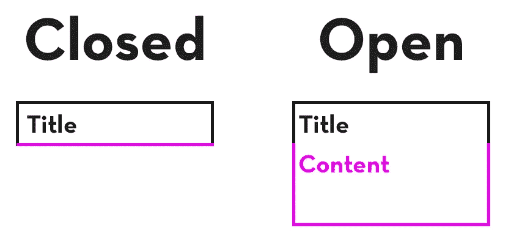
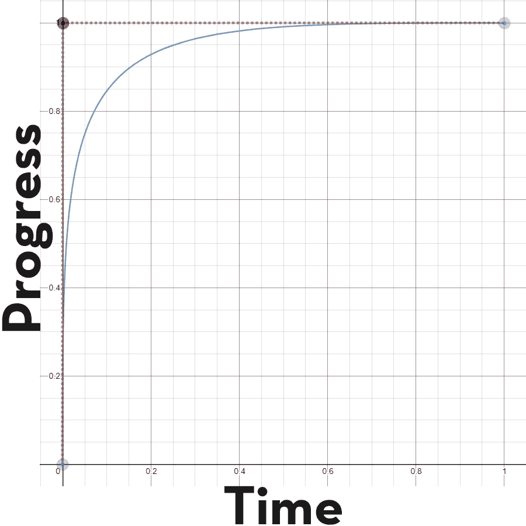
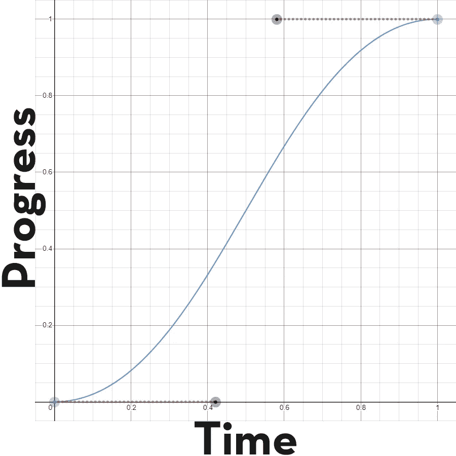

# 如何在 React 中创建一个简单的动画手风琴

> 原文：<https://javascript.plainenglish.io/how-to-create-a-simple-animated-accordion-in-react-303567a4ca9f?source=collection_archive---------0----------------------->

## 只需几个 CSS 动画

Photo by [fatty corgi](https://unsplash.com/@fattycorgi?utm_source=medium&utm_medium=referral) on [Unsplash](https://unsplash.com?utm_source=medium&utm_medium=referral)

只用 CSS 动画，我们将创建一个简单的下拉手风琴。这些手风琴可以通过点击容器来切换，然后容器会自动扩展/收缩以显示/隐藏内容。

Accordion Example

# 基本结构

我们将有一个容器，它将保存标题和内容 div。

通过修改 max-height 属性将隐藏内容 div。

当点击 accordion 时，我们将更新内容 div 上的 aria-expanded 属性，这将触发 CSS 动画。

Open/Closed states for accordion.

因此，我们的准系统 react 组件将接受一个标题属性，然后呈现内容容器中的任何子元素。

Basic Accordion Component

# 添加切换状态

通过向我们的标题容器添加一个`onClick`事件，我们可以触发一个函数来更新状态，这反过来将触发我们的内容容器上的一个`aria-expanded`属性。

我还添加了一个小的 v 形图标，我们将使用它在动画显示状态变化时为用户提供进一步的反馈。FlatIcon 是一个寻找定制图像图标的好网站。

Accordion Component

# 给手风琴造型

现在我们有了一个功能组件，让我们给它添加一些样式。

Accordion Styling

# 动画

让我们仔细看看我们是如何表演动画的。

对于 CSS 动画，你有两种不同的状态，你可以使用`transition`属性来指定这些状态之间的动画。

## chevron

在人字形的例子中，我们有一个默认状态，然后是一个修改过的状态，其中设置了`aria-expanded=true`属性，并且旋转了 90 度。我们指定要过渡到哪个属性，动画的持续时间，最后是它的计时功能，以给出平滑的旋转效果。

## 内容

动画显示内容窗格的扩展和收缩并不简单。

在其默认状态下，最大高度和`overflow:hidden`被设置为 0，因此内容对于用户**不可见**。

当手风琴打开时，我们将 max-height 设置为某个任意大的值，以便可以看到内容。

在这个例子中，我选择了`1000px`作为最大高度。你的最大高度应该总是大于你的手风琴内容的最终高度。所以如果你在里面放了很多内容，你可能要增加这个值。

我们使用 max-height 而不是 height 的原因是我们不知道容器需要多高。通过使用 max-height，我们允许浏览器在打开时动态调整高度。

## 最大高度动画

你可能已经注意到，当内容可见时，我们使用三次贝塞尔曲线过渡，但当内容隐藏时，我们使用渐出过渡。我们为什么需要这个？

当集装箱打开时，其最大高度将比实际高度大**。请记住，容器的高度永远不能超过最大值，我们只需设置最大高度，这样我们的容器就可以自动扩展到所需的高度。**

如果我们的最大高度是 2000 像素，我们的内容高度是 500 像素，那么当动画从 2000 像素下降到 500 像素时，我们将会经历一个延迟。只有在动画的最后 500 像素，我们才会看到视觉差异，因为只有在这一点上，容器的实际高度才会改变！

为此，我使用了一个定制的三次贝塞尔计时函数。这在开始时动画非常快，向结束时减少，这消除了关闭手风琴时感觉到的延迟。

请注意，使用标准的缓动函数打开容器是可以的。在动画过程中，让最大高度继续增长到比实际高度更大并没有视觉效果，也不会被注意到。

Easing Functions. Cubic-Bezier(0, 1, 0, 1) left, Ease-In-Out right.

# 把所有的放在一起

现在我们有了 accordion 组件和 CSS 样式，我们可以创建一个简单的页面来演示它。利用组件上的`children` prop，我们可以轻松地将所需的内容传递给 accordion。

Index page

我希望这有助于演示如何将 react 状态与 CSS 动画结合起来，并提供一点关于何时需要自定义动画计时的见解。

如果你喜欢这篇文章，并且愿意支持我成为一名作家，考虑注册[成为](https://adam-galtrey.medium.com/membership)的媒体成员。每月只需 5 美元，你就可以无限制地阅读 Medium 上的所有文章。如果你[用我的链接](https://adam-galtrey.medium.com/membership)注册，我也会赚一小笔佣金。