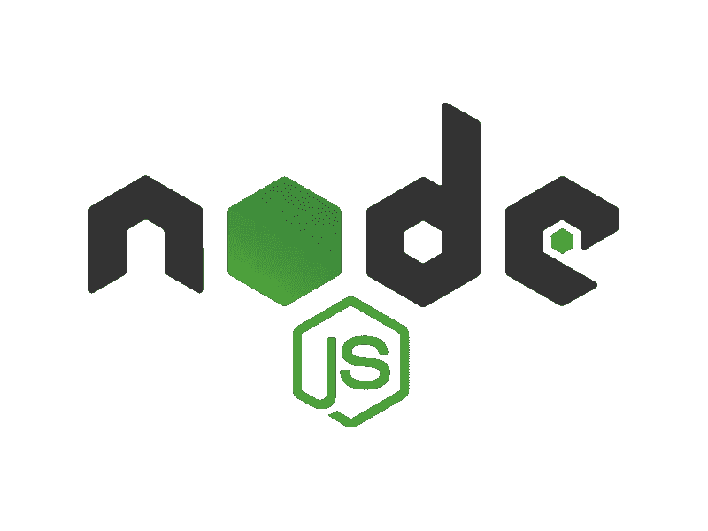
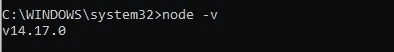
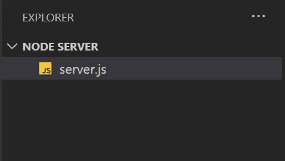
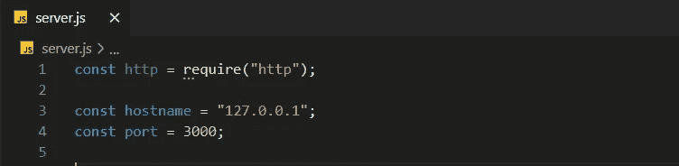
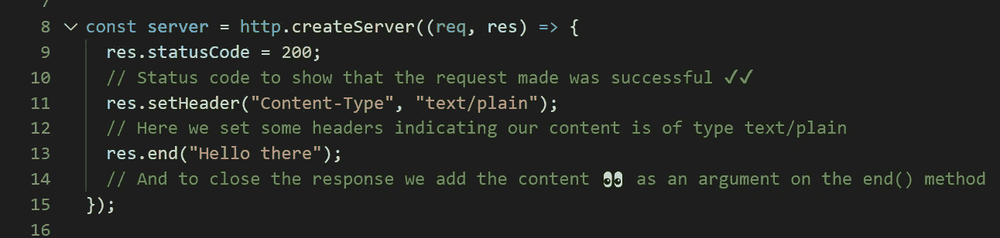
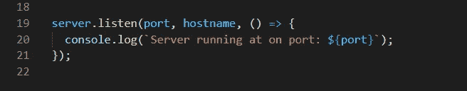
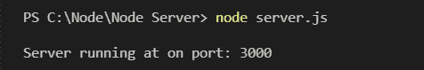
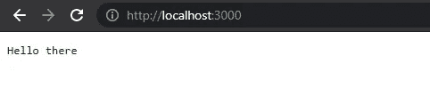

# 如何使用 Node.js 创建一个简单的 Web 服务器

> 原文：<https://javascript.plainenglish.io/how-to-create-a-simple-web-server-using-node-js-2021-5c3e89833128?source=collection_archive---------10----------------------->

Node.js

## 使用 Node.js 创建 web 服务器——2021 年的简单教程。

这是一个简单的教程，教你如何使用 Node.js 创建自己的 web 服务器。我们不会为此使用任何花哨的框架，只使用优秀的旧 js。对于那些没有使用过像 [Express](https://expressjs.com/) 这样的框架的人来说，这也是一个复习。

对于那些不知道 Node.js 到底是什么的人来说，Node.js 是一个基于 Chrome 的 V8 JavaScript 引擎的 JavaScript 运行时。—如他们的[网站](https://nodejs.org/en/)所述

开始之前，我们需要:

1.  确保我们已经在本地计算机上下载了 Node，这里是到下载页面的[链接](https://nodejs.org/en/download/)。有几个不同的版本，请确保为操作系统(macOS、Linux、Windows)选择正确的版本..)您正在使用的。
2.  安装过程相当简单，因为这是一个关于创建 web 服务器的教程，所以我不想把它变成 Node.js 安装教程。但是，要检查我们是否成功安装了 Node，您可以在命令行界面上执行以下操作:

3.手边有一个文本编辑器，我在本教程中使用 VS 代码

**我们开始吧！**

Creating a new file in VS Code

首先创建一个新的 JS 文件，通常的命名约定是 server.js 或 index.js，就这样，只需要一个文件。

打开文件，让我们开始创建我们的 web 服务器。

Declaring variables

首先，我们要导入一个名为 HTTP 的模块，这是 Node.js 的核心模块，这就是为什么我们可以将它导入到我们的文件中。

接下来，我们创建了两个变量`hostname` & `port`，我们也将它们声明为`const`，因为我们不会再改变它们的值。

*   主机名:“127 . 0 . 0 . 1”——在使用 web 开发技术时，你会经常看到这个词，它的基本意思是`[localhost](https://www.howtogeek.com/126304/why-is-the-localhost-ip-127.0.0.1/)`
*   端口:3000 或设备上的任何可用端口
*   基本上，这些数据是你和我以后访问网络服务器的方式。

Creating a server-class using createServer()

接下来，我们声明一个名为`server`的新变量，这里是我们使用导入的`http`模块的地方，我们在`http`模块上使用`createServer`方法。这个方法接受一个回调，这个回调将处理通过我们的服务器的每一个请求。

最后，我们希望启动并运行服务器，为此我们只需执行以下操作:

Getting our server up and running

现在这是我们使用`port`和`hostname`的地方。我们需要使用位于我们之前创建的服务器类上的`listen`方法，这个方法可以接受 3 个参数，一个端口，一个主机名和一个回调。

这将使我们的服务器侦听以下请求:

*   主机:127.0.0.1 或本地主机
*   端口:3000 或您使用的任何可用端口

最后，在回调中，我们只是将一些文本记录到控制台，让我们知道我们的服务器已经启动并正在运行，在哪个端口上。

要启动我们的服务器，打开您的命令行并确保您在您的`server.js`文件的目录中。

使用以下命令:`node server.js`

您现在应该看到了:

Command to start our server

恭喜你。您使用 Node.js 成功启动了自己的 web 服务器

现在去`http://localhost:3000`或`http://127.0.0.1:3000`看看它的效果

Our web server is up and running

你做到了，只用几行代码就创建了一个非常基本的 web 服务器。这是一个非常简单的网络服务器，你可能不会在很多项目和网络应用中看到它。这只是为了帮助您理解如何使用普通的 Node.js 而不使用框架来完成。

当然，我推荐使用框架，因为它将加速开发并允许您更有效地创建更复杂的 web 服务器。

谢谢你留到最后，我希望你喜欢它。

*更多内容请看*[***plain English . io***](http://plainenglish.io/)