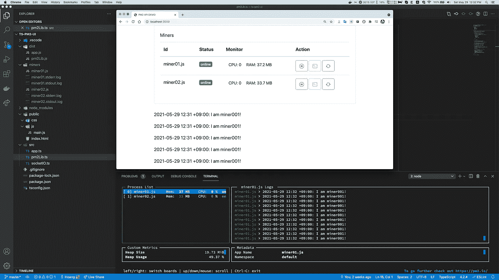
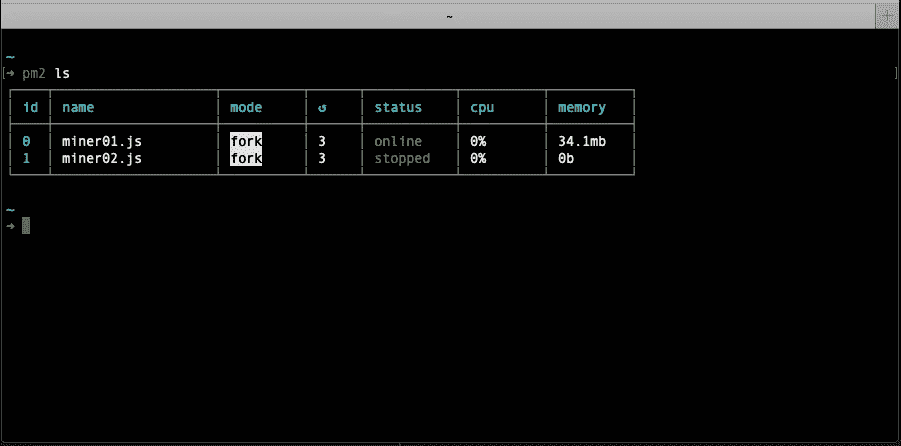

# 如何使用 PM2 API 创建一个简单的 Web UI 来管理 Node.js 流程

> 原文：<https://javascript.plainenglish.io/how-to-create-a-simple-web-ui-to-manage-nodejs-process-with-pm2-api-132986fe3fed?source=collection_archive---------0----------------------->



> [PM2](https://pm2.keymetrics.io/) 是 Node.js 应用程序的生产流程管理器，内置负载均衡器。它允许您永远保持应用程序的活力，在不停机的情况下重新加载应用程序，并简化常见的系统管理任务。

使用 PM2 CLI，您可以在本地服务器上管理 Node.js 进程。如果你有一个在线服务器(公共互联网)，你可以使用 [keymetrics](https://id.keymetrics.io/) 服务来管理你的进程。

也许这些特性对于“正常”的情况已经足够了。但是有时，您的项目需要一个简单的 web 界面来管理本地服务器中的所有 Node.js。或者项目需要将流程管理器模块作为项目的一部分。PM2 提供 [PM2 API](https://pm2.keymetrics.io/docs/usage/pm2-api/) 解决此类情况。

> PM2 可以以编程方式使用，这意味着您可以在代码中直接嵌入一个进程管理器，生成进程，即使退出主脚本也能让它们保持活动状态。

在这个故事中，我将向您展示如何构建一个简单的 web 服务来自己管理 Node.js 进程。项目栈:TypeScript，Express，pm2 API，socket.io。

# 初始项目

确保您已经将 pm2 作为全局软件包安装:

```
$ npm install pm2@latest -g
```

用 TypeScript 开始一个简单的 express 项目:

```
$ mkdir ts-pm2-ui # Create project directory
$ cd ts-pm2-ui$ npm init -y # Inital a nodejs project$ npm install express pm2 -S # Install dependencies
$ npm install @types/express ts-node-dev typescript # Install dev dependencies$ npx tsc --init # Create tsconfig.json file
```

更新`tsconfig.json`:

```
{
  "compilerOptions": {
    "target": "es6",
    "module": "commonjs",
    "sourceMap": true,
    "outDir": "./dist",
    "strict": true,
    "moduleResolution": "node",
    "esModuleInterop": true,
    "skipLibCheck": true,
    "forceConsistentCasingInFileNames": true
  },
  "include": [
    "./src"
  ]
}
```

将`dev`脚本添加到`package.json`

```
...
  "scripts": {
    "test": "echo \"Error: no test specified\" && exit 1",
    "dev": "ts-node-dev --respawn --transpile-only ./src/app.ts"
  },
...
```

创建一个简单的 express 服务器，为某人访问`GET /`路由器的`index.html`文件提供服务。

```
// ./src/app.tsimport express from 'express';const app = express();app.use(express.static('public'));app.get('/', (req, res) => {
  res.redirect('/index.html');
});const PORT = process.env.PORT || 3000;app.listen(PORT, () => {
  console.log(`[Server] Listening on :${PORT}`);
});
```

并创建一个简单的 HTML 页面，该页面将显示 Node.js 进程列表:


Pm2 simple GUI

`./public/index.html`

此外，创建`./public/js/main.js` —脚本文件将控制 HTML 内容。

```
// ./public/js/main.js
(function ($, window, document) {
  $(async function () {
    console.log('The DOM is ready!');
  });
}(window.jQuery, window, document));
```

启动开发服务器:

```
$ npm run dev
```

然后，让我们使用您的浏览器并访问[http://localhost:3000](http://localhost:3000)URL。

# PM2 API

假设我们有一个 JavaScript 文件列表。我们需要做的是控制每个 JavaScript 文件的进程。

我们需要的所有行动是:

*   向 PM2 注册流程并启动它
*   停止该过程
*   重新开始该过程
*   停止该过程
*   获取所有进程状态

创建一个包装类，通过 PM2 API 连接到 PM2 守护进程。

`./src/pm2Lib.ts`

我用两个 JavaScript 脚本来演示— `miner01.js`和`miner02.js`。脚本存储在`process.env.SCRIPT_PATH`中。

`pm2`包提供了一些使用 PM2 守护程序的方法(描述、启动、停止、重启……)。但是，它们都是回调函数，那么我们会尝试将它们转换成之前的`Promise`风格。为此，我们可以将它们包装成一个新的 Promise，或者只使用`util.promisify`实用程序(需要 Node.js 版本≥ 8)。 ***重要提示:当你通过*** `***promissify***` ***变换 pm2 的方法时，记住将*** `***pm2***` ***绑定为*** `***this***` ***。***

我们有一个私人方法——`getStartOptions`。当您提供一个 JS 文件名作为`filename`参数时，它返回 [PM2 的 start 选项对象](https://pm2.keymetrics.io/docs/usage/pm2-api/#programmatic-api)。确保您的文件存在于`${this.SCRIPT_PATH}/${filename}`。我们还设置`filename`作为流程名称，然后在另一个函数中，我们将使用`filename`作为流程标识符。

`getProcesses`方法尝试遍历`this.MINERS`变量中的所有 JS 文件名，并获取每个进程的状态。这意味着，我们只是得到我们的脚本的状态，而不是所有由 PM2 管理的脚本。如果 JavaScript 文件的流程不存在，我们返回一个状态为`stopped`的“假”流程对象。

其他方法:`startProcess`、`restartProcess`、`stopProcess`我们只是将参数转发给 pm2 的方法。

我们正在构建一个 web 服务，然后在下一步，我们将导出一些 API，这些 API 可以帮助客户端与后端一起工作。

我们在 express 应用程序中注册了 2 个 API:

*   `GET /miners`:返回流程状态列表
*   `PUT /miners/:filename/:action`:控制过程

只需调用`pm2Lib`的相关方法。

对于后端来说，这已经足够了，让我们调用客户端的 API。

# 更新客户端

1.  获取所有过程状态
    调用`GET /miners` API 并循环通过 API 响应来更新过程表内容。
2.  处理动作按钮的事件。
    用正确的`filename`和`action`调用`PUT /miners/:filename/:action` API，然后刷新工艺表内容。

`./public/js/main.js`

我们还每 15 秒更新一次进程表。

当状态为`online`时我们显示`stop`动作，当状态为`stopped`时我们显示`start`动作。`restart`动作按钮始终显示。

现在，停止您的开发服务器(如果正在运行)，在终端中提供`SCRIPT_PATH`，然后再次启动开发服务器:

```
$ export SCRIPT_PATH=you/scripts/directory
$ npm run dev> ts-pm2-ui@1.0.0 dev
> ts-node-dev --respawn --transpile-only ./src/app.ts[INFO] 16:47:15 ts-node-dev ver. 1.1.6 (using ts-node ver. 9.1.1, typescript ver. 4.2.4)
[Server] Listening on :3000
```

对我来说，`miner01.js`和`miner02.js`都是简单的脚本:

```
// miner01.js
setInterval(() => {
  console.log('I am miner001!');
}, 1000);// miner02.js
setInterval(function () {
  console.log("I am miner002!");
  for (var i = 0; i < 9999; i++) {
    Math.random();
  }
  console.log("Detect a block on chanel: " + Math.random());
}, 2000);
```

访问 [http://localhost:3000](http://localhost:3000) ，在正常情况下，您会看到如下内容:


Process status table

试着“开始”一个过程:


Process started

查看 PM2 国家气候中心

```
$ pm2 ls
```



这就是全部！

如果你需要一个更方便的特性，我们来看下一部分。

# 使用套接字显示进程日志。超正析象管(Image Orthicon)

在这一部分中，我们将尝试将一个进程 stdout 日志流发送到客户端。

我们将使用`socket.io`将日志实时发送到客户端。

```
$ npm install socket.io -S
$ npm install @types/socket.io -D
```

使用 PM2 的 launchBus 获取进程 stdout 日志:更新`./src/pm2Lib.ts`

创建`./src/socketIO.ts`创建 socket.io 服务器:

从`pm2Lib.onLogOut`获取任何日志事件时始终发出`process_name:out_log`事件。

用 express 服务器启动 socket.io 服务器:更新`./src/app.ts`

然后，更新客户端以连接到套接字服务器:

`./public/index.html`

`./public/js/main.js`

重新加载浏览器，并尝试跟踪进程日志:


Show process logs

# 摘要

我们完成了一个使用 PM2 API 构建过程管理器 web 应用程序的示例。我希望我的文章能为你提出一些“关键词”，你能更好地在你的系统中实现这些东西。

本项目已完成的规范已在 [Github](https://github.com/codetheworld-io/ts-pm2-ui) 上发布。

感谢阅读！

*更多内容参见* [*通俗易懂*](http://plainenglish.io/)