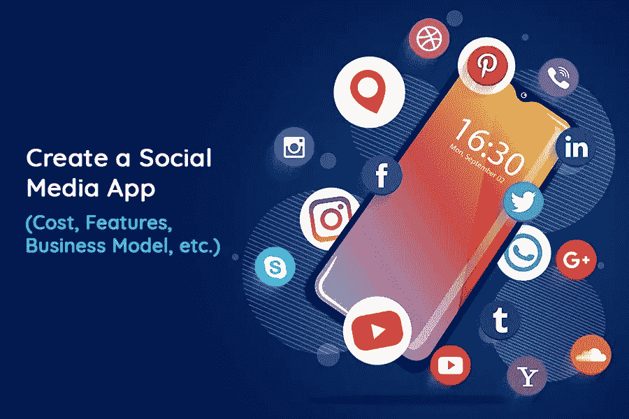
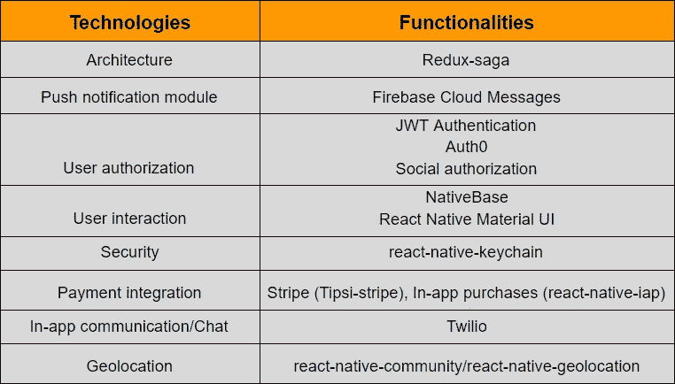
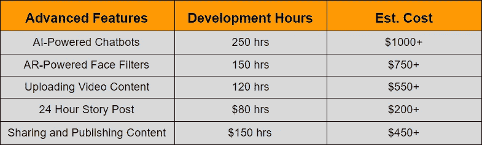
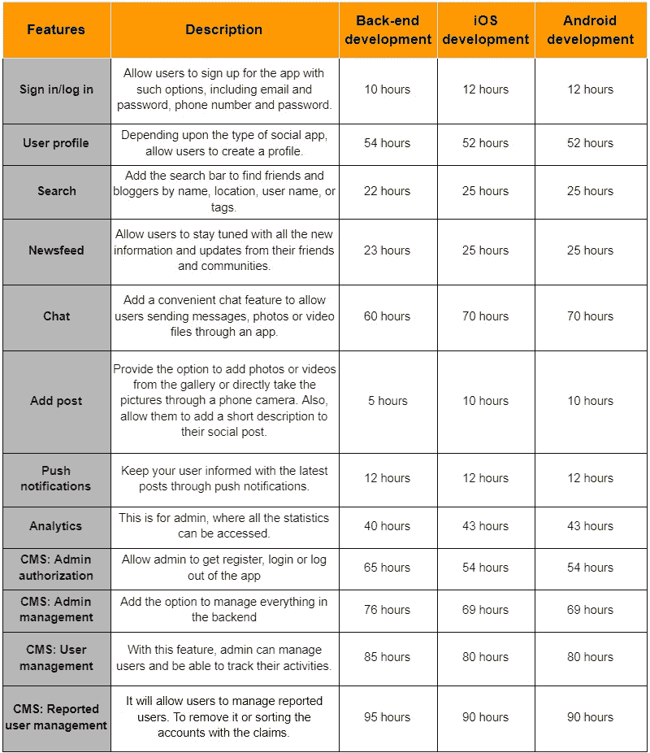
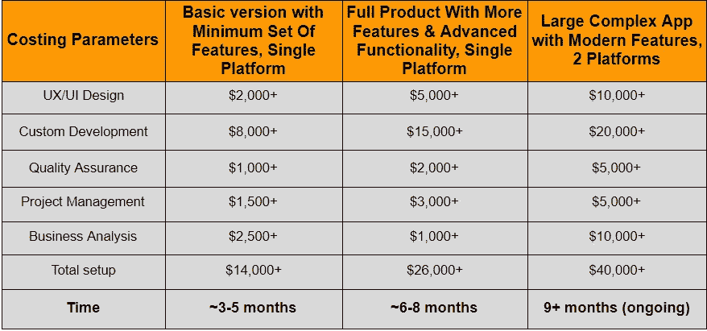

# 如何使用 React Native 创建社交媒体应用程序

> 原文：<https://javascript.plainenglish.io/how-to-create-a-social-media-app-with-react-native-403a2158fb8d?source=collection_archive---------4----------------------->

说大多数人把他们最喜欢的时间花在社交媒体平台上并不夸张，尤其是在当今世界。

随着时间的推移，脸书、Instagram、Messenger、Twitter 等社交媒体应用已经成为人们生活和日常事务中不可或缺的一部分。人们已经变得如此沉迷于此，以至于他们醒来后最想做的第一件事就是查看他们的社交媒体反馈。

拥有数十亿注册账户和数万亿年活跃用户的社交媒体应用已经成为企业与目标受众保持联系的绝佳机会。

今天，在新冠肺炎疫情把企业推向毁灭，人们被孤立的地方，传统的老式但面对面的交流已经几乎不可能了。这也是社交网络和社交媒体应用脱颖而出的地方，成为新兴企业家创造更好商业机会的最具潜力的平台。

如果你也属于其中之一，那么你来对地方了。在这里，我们将回答您所有迫切的问题，并带您完成实现这一目标所需的每一步。

## 以下是我们将要介绍的内容:

*   *市场统计:不断增长的社交媒体应用前景*
*   *为什么企业应该投资社交媒体应用？*
*   *你应该开发什么类型的社交媒体应用程序及其成本？*
*   *可以用来开发社交媒体应用的技术栈*
*   *您可以将当前趋势整合到您的社交媒体应用中*
*   *创建社交媒体应用时需要考虑的必备功能*
*   *创建社交媒体应用的分步指南*
*   *创建一个社交媒体应用需要多少成本？*
*   *如何从社交媒体应用中赚钱？*

因此，在你开始雇佣最好的移动应用程序开发公司之前，有必要深入了解每一点，并仔细理解这些参数…

## **市场统计:不断增长的社交媒体应用前景**

因为开发一个应用程序就像开始另一项业务，需要同样的努力和预算。所以在做出一个开创性的东西之前，有必要评估一下市场，分析一下领先者。

*以下是一些反映社交媒体应用发展前景的统计数据:*

*   [根据研究](https://techjury.net/blog/time-spent-on-social-media/#gref)，社交网络和社交媒体应用的前景正在迅速扩大，据观察，2020 年社交媒体用户比去年增长了 10%，2020 年第一季度全球用户总数达到 39.6 亿。
*   2020 年，用户平均花费 2 小时 33 分钟进行在线社交，主要是在脸书、YouTube、Messenger、Whatsapp、Instagram、Twitter 或 Snapchat 上。
*   根据 [eMarket 调查报告](https://www.emarketer.com/content/messaging-apps-and-marketing-2018)显示，仅在美国，到 2022 年，该应用程序的美国用户增长将达到 1180 万，预计将达到 1.381 亿。

**简而言之**，公平地说，第一次，超过一半的世界人口现在使用社交媒体，99%的社交媒体用户在某个时候通过智能手机访问这些平台。

这提供了一个巨大的机会来扩大你的社区，并利用你自己独特的社交媒体应用来为你的目标受众赚钱。诚然，社交媒体应用是一个很好的交流和保持联系的平台。但是它如何能使你的企业受益呢？

## **为什么企业应该投资社交媒体应用？**

最初，社交网络服务的目标是创建一个平台，帮助用户找到彼此并在线交流。但是今天，社交媒体应用程序不仅仅是朋友和亲戚之间交流的媒介。让我们来理解社交媒体应用与新时代商业的相关性。

*以下是新兴创业者在社交媒体应用开发中可以利用的一些好处:*

*   **更容易接触到您的目标受众！**

100%使您能够接触到您的目标受众，因为您可以在应用程序上发布任何内容时使用多个搜索过滤器，选择位置、性别、年龄、类别、兴趣等。

*   **与社区建立更直接、更深入的关系！**

定制的社交媒体应用有助于与用户建立更直接、更深入的关系和互动。与传统的营销活动不同，应用程序所有者可以直接与社区互动，并能够根据用户的需求改变他们的服务或产品。

*   **获取完整数据，让用户关注您的内容！**

更深入地了解你的社区，因为现有的社交媒体平台只能访问你的社区的一小部分数据。但是，当你拥有自己的应用程序时，你将有权访问全部数据，了解人们的兴趣领域，以及他们最喜欢你的应用程序中的哪种社交活动，这对你的业务来说是一个很好的线索。

*   **带来更好的变现机会！**

社交媒体应用可以通过提供在你的应用下构建数字市场选项的机会来获得更好的利润。

*   **告别聪明的算法！**

在自己的应用上推广服务时，你不需要追逐那些棘手的算法来导航或争取新闻订阅空间。这只是你和你的观众。你所需要的就是 [**雇佣一个应用开发者**](https://www.xicom.ae/solutions/hire-developers/) 来创建一个全功能的应用。但当你在现有的社交媒体平台上推广它时，有成千上万的人、创作者和企业要与之竞争，算法将决定向谁展示哪些内容。

*   **全天候与用户保持联系！**

社交媒体应用程序开发为您的企业建立了一个渠道，以推广某个产品、品牌或服务，并与用户保持全天候联系。

*   **创建一个私人用户社区！**

这是一个独特但领先的机会，让品牌爱好者聚集在你的应用程序上，并与志同道合的人形成一个圈子。

简而言之:通过创建自己的社交网络，你将从所有这些麻烦中解脱出来，并抓住你的产品和服务的用户的注意力。通过雇佣软件开发人员，你可以轻松创建一个社交媒体应用程序，为你的业务增添优势。但核心问题是，你应该为你的企业开发什么类型的应用？

> 让我们在下一节回答这个问题吧！

# **你应该开发什么类型的社交媒体应用程序及其成本？**

在你直接进入应用程序开发流程之前，让我们先了解一下所有社交媒体应用程序都分为哪些主要类别。这将有助于您决定哪种应用程序类型更适合您的业务目标，并缩小您与成功之间的差距。

> 以下是你需要了解的常见社交媒体应用类型:

**媒体共享网络:**这是一种应用程序或平台，允许用户共享所有类型的媒体文件，包括照片、视频、GIF 文件等。可以考虑的完美例子是 Vimeo、YouTube、Snapchat 或 Instagram。*根据应用的特性和功能，应用开发的平均成本可能在 15，000 美元到 25，000 美元以上。*

社交网络应用:像脸书、Twitter 或 Linkedin 这样的应用是个人和职业社交网络应用的完美例子。拥有数百万月活跃用户的脸书正强烈地影响着商业，以至于 [**雇佣移动应用开发者**](https://www.xicom.ae/services/mobile-app-developers/) 来构建这种类型的应用。*应用程序开发的估计成本可以从 2 万美元以上开始，到任何昂贵的价格。*

**消费者评论网络:**这种类型的应用程序用于客户验证他们所体验过的企业的评论和评级。Yelp 是这一类别中最突出的例子之一。*开发这类应用的平均价格从 15000 美元到 18000 美元以上不等。*

**社区和论坛:**这是一个很棒的平台，志同道合的人可以来到同一个平台上提问、获得答案、分享新闻、想法、见解和经验。Quora 和 Reddit 是社交媒体应用领域的巨头。*开发这类应用的起价从 15000 美元到 20000 美元不等。*

**博客和发布平台:**像 Medium 这样的应用程序可以是这种社交媒体应用程序的完美例子，它允许用户创建他们的博客，发布他们的内容，并每天更新他们关于任何技术、服务、产品或任何东西的信息。这个应用程序的平均预算不能从 12，000 美元到 15，000 美元以上。

*正如你所注意到的，有许多类型的社交媒体应用可供选择。有各种各样的应用程序在他们的领域处于领先地位。因此，无论你选择开发哪种类型的应用程序，重要的是，你要雇佣最好的* [***应用程序开发公司***](https://www.xicom.ae/services/mobile-app-development/) *，在你有限的预算下，将你的应用程序创意转化为强大、可扩展和灵活的数字解决方案。*

## **您可以选择用于跨平台社交媒体应用开发(iOS/ Android)的技术堆栈**

如果您有兴趣创建一个在多个平台上运行但行为像本机应用程序的社交媒体应用程序，那么这里有一些技术堆栈，包括 Flutter、React Native 等，您可以使用它们来构建跨平台应用程序

> 因为我们的目标是用 React Native 构建一个社交媒体应用程序，所以这里有一些工具可以用来构建一个全功能的社交媒体应用程序。

因为 React Native 是该框架的首选之一，尽管大多数 IT 公司倾向于使用 React Native 作为移动应用程序开发解决方案。RN 不仅很容易适应预算，而且使开发人员能够选择各种特性，使开发过程加快 10 倍，并减少对预算的影响。

> 现在的问题是，在使用 React Native 进行开发的同时，您可以将什么样的现代趋势集成到社交媒体应用程序中？

## **您可以将当前趋势融入您的社交媒体应用**

年复一年，社交媒体平台带来了最新的趋势，让他们的用户参与并沉迷于他们的应用程序。对于我们中的一些人来说，这个话题似乎是老生常谈，但事实上并非如此，因为开发一个具有陈旧、乏味功能的应用程序只会带来失败。

*因此，在你雇佣一个跨平台的应用开发者来构建一个优秀的社交媒体应用之前，这里有几个趋势需要注意:*

*   **人工智能和聊天机器人**

当涉及到在社交媒体应用程序上提供出色的客户晚餐时，人工智能和聊天机器人正在发挥重要作用。通过社交媒体运营的企业可以使用人工智能聊天机器人来立即回答客户的查询。集成人工智能的聊天机器人可以有效地与消费者进行对话，并通过理解他们的查询立即为他们提供解决方案。

*   **AR 供电面部滤镜**

像 Snapchat 和 Instagram 一样，你也可以成为社交媒体应用领域的潮流引领者。人们仍然喜欢有趣的过滤器，并经常访问该应用程序，每天检查新的更新。

*   **实时视频流**

这可能是你的社交媒体应用程序最吸引人和最有吸引力的功能，因为用户喜欢在社交媒体上观看直播视频或阅读下面的评论。

*   **上传视频内容**

与图片相比，视频内容最能吸引用户的注意力，让他们在你的帖子上停留更长时间。但是因为每个人都有快节奏的生活，所以保持简单，简短，吸引人，让你的用户定期回到你的帖子。

*   **24 小时故事贴**

这是一种趋势，允许你在 Instagram 上发布一个 24 小时直播的故事，之后它就会消失。人们广泛使用这个功能来让他们的朋友了解他们的日常生活活动。

*   **在社交媒体上分享和发布内容**

而越来越多的人希望与尽可能多的用户共享他们的内容。虽然给你的用户提供一个平台，让他们发布内容，扩大用户群，这很好。

一旦你决定了自己的定位，并了解了制作社交媒体应用程序的趋势，是时候 [**雇佣跨平台应用程序开发人员**](https://www.xicom.ae/services/hire-cross-platform-app-developers/) 并粗略估计一下你的项目所需的时间和成本了。

到目前为止，你已经知道了可以整合哪些趋势来让你的社交媒体应用程序顺利运行。但是如果你选择 MVP，你的应用程序应该具备哪些基本特性呢？

因此，在这里，我们已经记下了 iOS 和 Android 的必备功能列表以及预计开发成本。

# **创建社交媒体应用的必备功能**

构建一个社交媒体应用并不简单。因此，为了让你的应用程序发挥作用，你可能想知道你应该为一个基于互联网的网络考虑什么功能？

因此，这里有一个信息图表列表的功能，以及估计的开发成本和开发时间。要让它发展起来，你所需要的只是雇佣一个在定制社交媒体应用程序方面经验丰富的应用程序开发人员。

**注:**这里所说的都是通过简单评估市场调查报告得出的粗略估计。真实的估计可能会根据业务需求和您感兴趣的应用程序类型而有所不同。

## **2022 年如何打造社交媒体 App？**

虽然建立一个社交媒体应用程序是一项复杂的任务，需要专业技能来编码这个应用程序的想法。因此，值得一提的是，编码工作将留给专家 [**应用开发公司**](https://www.xicom.ae/services/mobile-app-development/) ，而你将专注于为 iOS 和 Android 构建应用的各个方面。为了确保阅读这一部分实际上是值得的，因此我们保持事情简单，并帮助您在开发人员得到项目之前设置好所有的东西。

*现在是时候了解一下为 Android 和 iOS 制作社交应用的所有细节了:*

## **第一阶段:Android/iOS 社交媒体应用开发的一般信息**

*   **架构:** MVVM(模型-视图-视图模型)架构模式。
*   **编程语言:**以前我们只用 Java 来开发 Android native，但现在开发者们在新项目中使用 Kotlin。对于 iOS 原生应用，可以使用 Swift 或者 Object C++。但要让它在使用相同编程语言的 web、Android 和 iOS 上工作，你可以选择 React Native 进行应用开发。
*   **框架:**在 Android 的情况下，Google Play 服务主要用作框架，因为它提供了对谷歌服务的广泛选择，包括应用内购买、地理定位、云消息、Firebase 等等。对于 iOS，Dip 框架被用作服务定位器。
*   **库:**分别用于 Android 和 iOS 的 RxJava2 和 RxSwift。

## **第二阶段:应用程序 UI 层使用的技术堆栈**

*   **recycle view:**它是一个原生的 Android 组件，用于以列表的形式向用户展示可滚动的内容，并允许与列表上的项目进行交互。而 DTTableViewManager/DTCollectionViewManager 用于在 iOS 应用程序中构建类型安全的表视图和集合视图。
*   **片段:**这是一个原生的 Android 容器，包含其他视图和小部件，它们有自己的生命周期。在 iOS 中，LoadableViews 用于创建可重用的视图组件。

## **第三阶段:网络层需要技术实现**

> **针对安卓原生应用**

*   针对网络要求的改进
*   用于 JSON 解析的 GSON
*   用于加载图像和缓存的滑动

> **对于 iOS 原生应用:**

*   TRON/Alamofire 用于构建网络抽象。
*   用于解析 JSON 响应的 Codable/SwiftyJSON。
*   AlamofireImage 用于从网络上加载和缓存图像。

# **创建一个社交媒体应用需要多少成本？**

现在，当你理解了社交媒体应用程序开发所需要的重要技术时，让我们来谈谈成本。无论你是创业公司还是企业家，财务方面对你来说总是很重要的！

> 因此，我们将为您提供三个应用版本的计算结果，以帮助您决定哪个应用版本最适合您的业务需求和预算:

1: **基础版**，是第一个可以启动基本功能和特性集的 app 版本的最佳选项。

2: **具有高级特性的完整产品**和额外的功能，使您的应用程序适应市场不断增长的需求。

3: **现代大型应用程序，具有复杂的结构**和功能，为您的产品增加竞争优势。

注意:在你雇佣一家 [**移动应用开发公司**](https://www.xicom.ae/services/mobile-app-development/) 之前，了解这些价格估计是基于市场调查是至关重要的。它可能因公司和开发者而异。

> 但主要问题仍然没有答案:你将如何从应用程序中赚钱？

# **如何在 2022 年将你的社交媒体应用货币化？**

如果你想知道如何将你的社交媒体应用货币化，并从你的投资中获得丰厚的利润，那么你可以尝试以下几种策略来实现这一点:

*   **付费订阅:**只要你的内容对社区有真正的价值，会员们都会很乐意付费订阅。你可以提供一个有好内容的免费层，对于有深度和高价值的内容，你可以提供一个付费层。此外，苹果和谷歌的支付系统使订阅更加容易和简单。
*   **实物购买:**从创新的人脸滤镜到带有时髦口号的酷炫商品，你可以直接向用户出售股票。所以利用这个平台赚钱是一个很好的方法。
*   **赞助内容:**如果你的应用利用了优秀的社区成员，那么你可以通过付费赞助计划为其他企业提供接触他们的机会。
*   **活动和活动:**通过您的社区平台推广活动和在线体验，并开始赚钱。

> 让我们总结一下这篇博客吧！

# **结论**

所以我们在这里结束这个博客！尽管如此，如果你坐在那里，认为完成这个项目需要大量的预算和时间，那么我们建议你雇佣一个移动应用程序开发公司，它总是能提供最好的替代方案。尽管如此，我们已经涵盖了你需要知道的关于从头开始构建一个社交媒体应用 的一切——技术细节、特性、功能、成本、盈利策略等等。我们试图帮助你开始数字连接，没有任何附加条件。

*如果您对任何地方有任何疑问，那么您可以在评论框中提出疑问！专家将用他们的专家建议来回答这个问题。*

*更多内容看* [***说白了. io***](http://plainenglish.io)