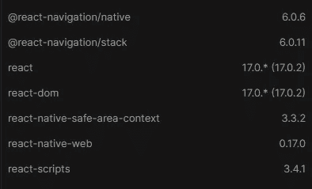
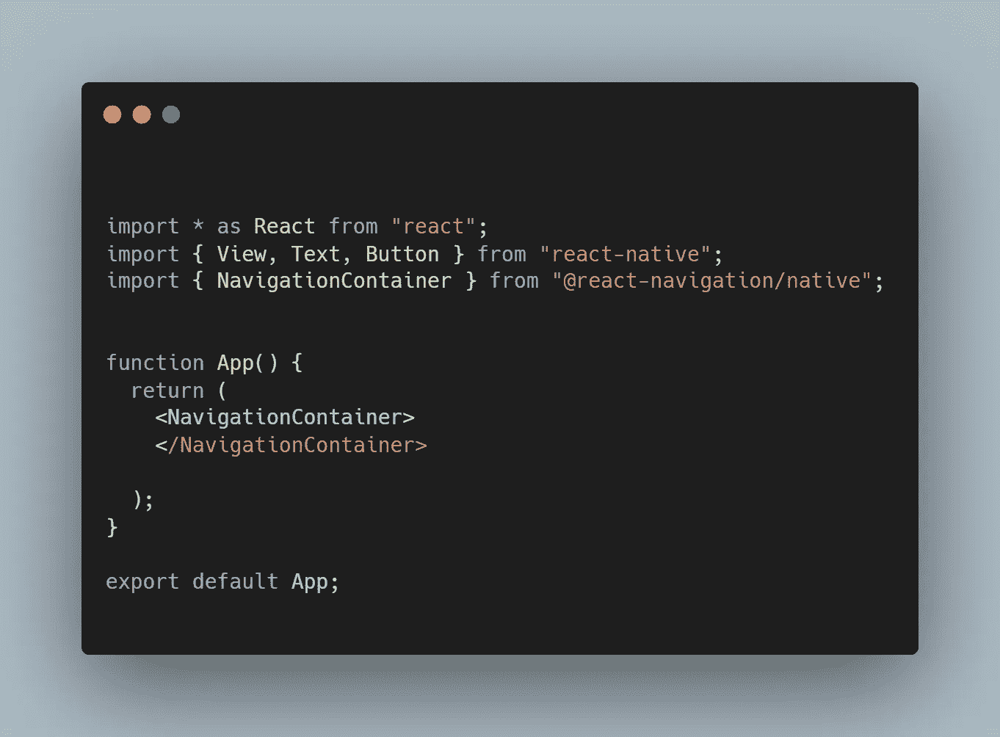
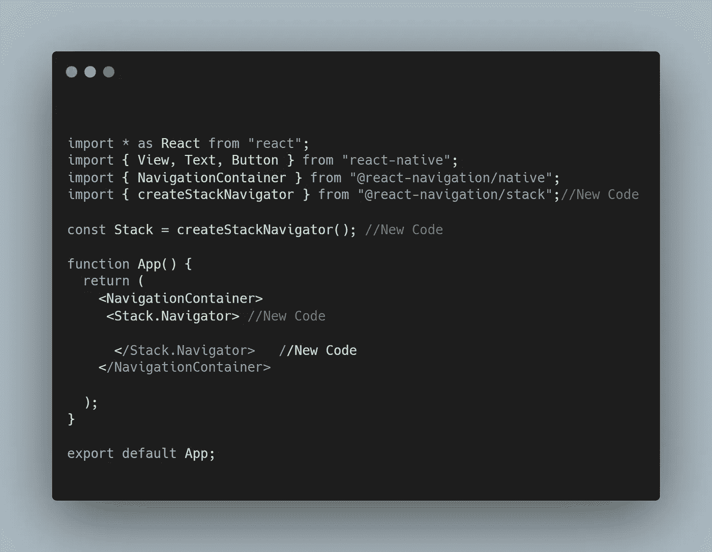
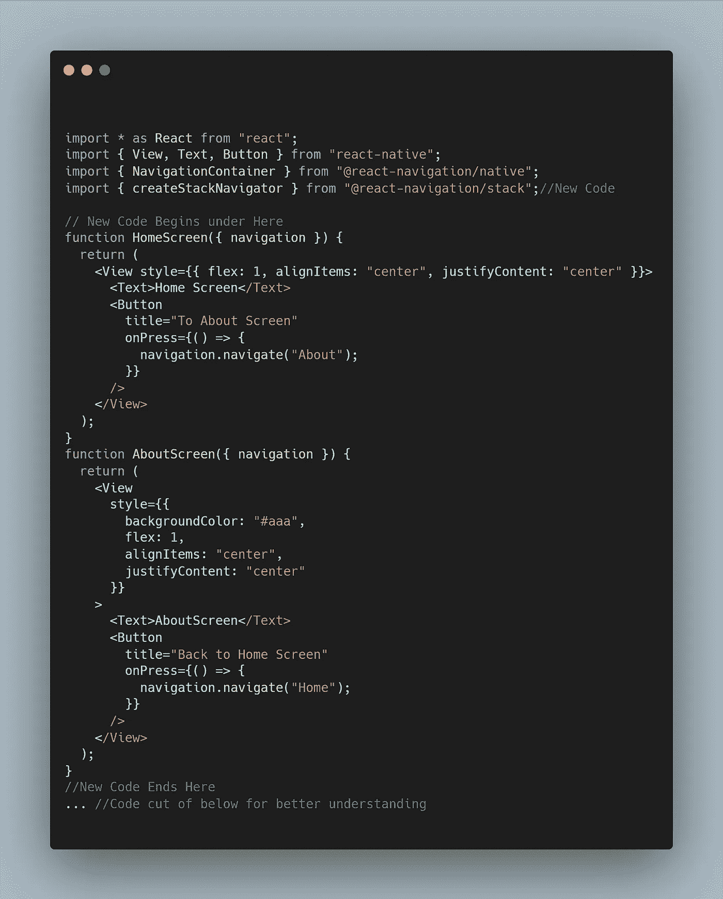
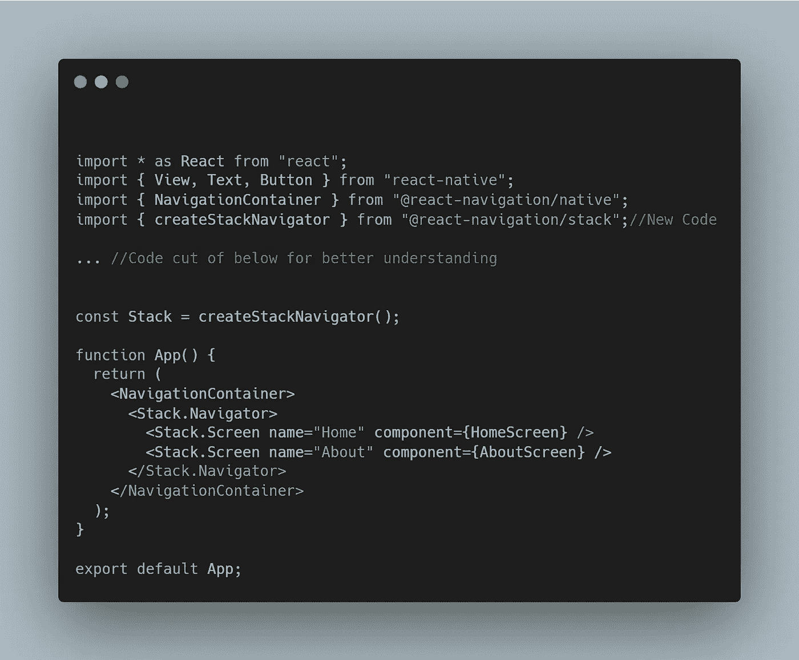

# 如何在 React 导航中创建堆栈导航器

> 原文：<https://javascript.plainenglish.io/how-to-create-a-stack-navigator-in-react-navigation-66556b70a137?source=collection_archive---------3----------------------->

## 在 React 本机应用程序中设置导航的快速简单的方法

Photo by [Azamat E](https://unsplash.com/@esen_aza?utm_source=medium&utm_medium=referral) on [Unsplash](https://unsplash.com?utm_source=medium&utm_medium=referral)

当构建一个 React 本地应用时，你迟早会需要某种形式的导航。

当谈到实现这种导航时，库 [React Navigation](https://reactnavigation.org/docs/hello-react-navigation) 是实现这一点的最简单的方法。

React Navigation 拥有丰富的文档和 API，可以轻松设置和定制导航。

在本文中，我将教您如何使用 React 导航设置堆栈导航器。

# 什么是堆栈导航器？

在我们开始构建堆栈导航器之前，我们必须先了解什么是堆栈导航器*和*。

React 导航中的堆栈导航器是应用程序在屏幕之间切换的一种方式。这并不是 React 导航的全部功能，因为它创建了以前访问过的屏幕的历史记录。

这类似于在网络上管理导航的方式。

当你点击一个网站上的链接时，新页面会被*推到浏览器历史堆栈的顶部。*

但是，当您点按“后退”按钮时，当前网页会从堆栈顶部弹出，允许显示上一个网页。

在我的文章 [4 每个开发人员都应该知道的数据结构中，我更深入地讨论了堆栈。](https://bookeraziz.medium.com/4-data-structures-every-developer-should-know-368d156ea384)

***注意:*** *我将使用 CodeSandbox 来创建堆栈导航器，但是您可以使用任何运行 react 本地项目的环境。*

# 添加依赖项

在创建堆栈导航器之前，我们必须向项目添加必要的依赖项。

依赖关系如下:

Dependencies Needed

# 添加样板代码

在开始创建堆栈导航器之前，我们必须先添加一些样板代码。

我们需要做的第一件事是将 **NavigationContainer** 组件导入并添加到我们的应用程序中。

NavigationContainer 必须包装在我们的整个应用程序中，并且在使用 React 导航时是必需的。

这方面的代码如下所示:

Step 1

在我们的 **NavigationContainer 中，**我们将添加另一个导航器。

这个导航器将允许我们创建堆栈导航器。

这方面的代码如下所示:

Step 2

# 创建我们的屏幕

信不信由你，我们几乎已经完成了堆栈导航器的创建。但是我们有一个问题…

我们没有屏幕可显示！

下面的屏幕只是我们的 stack navigator 工作所需的虚拟屏幕。

代码如下:

Step 3

***注意:*** *不要担心导航道具传入屏幕，现在只需理解那是为了让你在屏幕间转换。我将很快创建一个关于导航道具的帖子。当它启动时我会在这里链接它*

# 完成我们的堆栈导航器

既然我们已经完成了占位符屏幕和样板代码的创建，是时候完成堆栈导航器了。

添加屏幕就像添加堆栈一样简单。Stack.Navigator 中的屏幕组件

这方面的代码如下:

*注意:如果您在任何时候遭受损失，您可以在 CodeSandbox 链接* [*这里*](https://codesandbox.io/s/clever-sea-df865?file=/src/App.js) *查看完整代码。*

# 结论

感谢您阅读完我的文章**“如何在 React Navigation 中创建堆栈导航器”**。我希望你有美好的一天。如果你是中级新手，你可以点击这里的链接[加入](https://bookeraziz.medium.com/membership)

 [## 你绝对需要了解的 8 个 React 原生库

### 当谈到使用 React Native 创建应用程序时，找到正确的库可以使开发过程变得更加…

javascript.plainenglish.io](/8-react-native-libraries-you-absolutely-need-to-know-about-28f6038d0b76)  [## 如何在 React 和 React Native 中以正确的方式实现条件呈现

### 在 Web 和移动应用中使用动态用户界面

javascript.plainenglish.io](/how-to-implement-conditional-rendering-in-react-and-react-native-the-right-way-f00e2fa7a730)  [## 如何使用 TypeScript 创建堆栈

### 关于斯塔克斯你需要知道的一切。

javascript.plainenglish.io](/how-to-create-a-stack-using-typescript-2d53e563ca41) 

*更多内容看* [***说白了。报名参加我们的***](http://plainenglish.io/) **[***免费周报在这里***](http://newsletter.plainenglish.io/) *。***