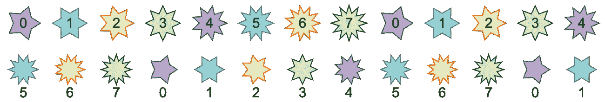

# 如何使用 JavaScript 和 Canvas 创建星形图案

> 原文：<https://javascript.plainenglish.io/how-to-create-a-star-pattern-using-javascript-and-canvas-322f8af61ce1?source=collection_archive---------10----------------------->


An enlarged version of the star pattern we will create in this tutorial. (Image by Author)

在本教程中，我们将使用 JavaScript 和 HTML5 Canvas API 创建上述横幅的星形图案。因为即使创建一颗星星也需要很多行代码，所以我们将使用[drawJS](https://gist.github.com/nevkatz/cd6ed0b44c45d7adfa2d013e6fcf6296)——我构建的一个迷你库，用于处理星星形状的渲染。在这个过程中，我们将使用[对象文字](https://developer.mozilla.org/en-US/docs/Web/JavaScript/Guide/Grammar_and_types#object_literals)、[嵌套 for 循环](https://www.freecodecamp.org/news/nesting-for-loops-in-javascript/)和[余数操作符](https://developer.mozilla.org/en-US/docs/Web/JavaScript/Reference/Operators/Remainder)来创建这个模式——以及一个 CSS [媒体查询](https://www.w3schools.com/cssref/css3_pr_mediaquery.asp)来使横幅在狭窄的屏幕宽度上调整大小。

下面是利用 drawJS 的星形模式演示。

The star pattern demo.

## 画星法

通过为图案中的每个星形调用 drawJS 库中名为`drawStar`的方法来创建图案。假设我们只想创建图案中的第一颗星星，如下所示。


A single star created with the drawStar method.

在这种情况下，我们可以用下面的代码调用`drawStar`一次。

Calling drawStar to create one purple star.

现在，由于我们想要创建多个，我们最终将编写一些更复杂的 JavaScript。但是首先，让我们编写 HTML 和 CSS，并仔细考虑模式的特征。

# 奠定基础

让我们从一些标记和样式开始。

## HTML 和 CSS

相关的 HTML 只是`<canvas>`元素。

```
<canvas id="myCanvas" width="1300" height="600"></canvas>
```

我们的第一点 CSS 将使它成为一个块元素，并使它居中。

```
canvas {
  display: block;
  margin: 10px auto;
}
```

为了使画布具有响应性，让我们添加一个媒体查询，将屏幕宽度低于`1200px`的`width`设置为`100%`。我们还将使用`height: auto`来帮助我们的画布在调整大小时保持其纵横比。

```
[@media](http://twitter.com/media) screen and (max-width: 1200px) {
  canvas {
    width: 100%;
    height: auto;
   }
}
```

## 规划模式

在我们开始编写最初的 JavaScript 之前，让我们再看一下星型模式，考虑一下需要什么来创建它。下面是该模式的顶部两行。


The star pattern’s first two rows.

。为了以这种方式排列星星，我们需要编写设置几个值的逻辑:

*   隔开星星
*   一排星星的数量
*   行数

我们的程序还需要设置每个恒星的独特属性，包括以下内容:

*   点数
*   笔画颜色
*   填充颜色

这些恒星还有一些共同的特性:

*   边界线宽度
*   *内半径*，即从恒星中心到每个角的距离
*   *外半径*，或从恒星中心到每个外点的距离


The inner and outer radii of a star.

最后，我们需要落实以下事项:

*   第一颗恒星的位置
*   描边和填充颜色的调色板(每种颜色四种)
*   最小和最大数量的星点

既然这是一种模式，那就应该有变化的恒星特性的周期性重复。例如，你会注意到点数从 5 开始，然后从一颗星到下一颗星增加 1，直到达到 12 点。一旦出现这种情况，下一颗星就会有 5 分。

这些是我们需要翻译成代码的模式属性。

# 设置模式属性

现在我们已经概述了模式的需求，让我们卷起袖子，用两个函数为它编写逻辑:

*   `getPatternProps`，它建立了星形模式的属性
*   `init`，它将遍历每个星星的位置，设置每个星星的属性，并调用`drawJS.drawStar`方法

`getPatternProps`函数将返回一个包含我们模式属性的对象。

The complete getPatternProps function.

让我们来看看发生了什么:

*   `start`将第一颗星的`x`和`y`坐标设置为(50，50)。

```
start: { x:50, y:50 }
```

*   `numPoints`将使一颗星可以获得的最少点数为 5，同时将最大点数设置为 12。

```
numPoints: { min:5, max:12 }
```

*   `space`将使星星垂直和水平相隔 100 个像素。

```
space: {x: 100, y: 100 }
```

*   `count`讲的是一排(`x`)和六排(`y`)12 颗星。

```
count: { x: 12, y: 6}
```

*   `fills`将确定作为重复序列出现的四种填充颜色。

```
fills: ['#b8a9c9', '#98d1d6', '#fed8b1', '#cff7d5']
```

*   `strokes`以同样的方式工作，使用一个数组来设置星形边框颜色的重复序列。

```
strokes: ['#622569', '#4C858A', '#f06d06', '#00ff00']
```

# 启动我们的初始化函数

我们的`init`函数将执行以下操作:

*   设置图案的背景颜色
*   检索模式属性
*   遍历每个起始位置
*   设置每个星形的属性
*   为每颗星星调用`drawJS.drawStar`

让我们启动我们的`init`函数并调用`setBackground`，一个用于设置画布背景颜色的`drawJS`方法。

```
function init() { drawJS.setBackground('#215875');}
```

这个`setBackground`方法使用 Canvas API 的 [rect](https://www.w3schools.com/tags/canvas_rect.asp) 和 [fill](https://www.w3schools.com/tags/canvas_fill.asp) 方法，并且是您将在[库](https://gist.github.com/nevkatz/cd6ed0b44c45d7adfa2d013e6fcf6296)中看到的第一个方法。

现在我们已经有了背景颜色，让我们通过调用`getPatternProps`来获得我们的星形模式的属性。

```
function init() { drawJS.setBackground('#215875'); **let props = getPatternProps();**}
```

## 设置循环

在我们的`init`函数中，让我们创建一个填充星星的嵌套循环。我们将一步一步地建立这个体系。

让我们首先遍历这些行。我们可以用`props.count.y`值访问行数。

```
let props = getPatternProps();**for (var y = 0; y < props.count.y; ++y) {****}**
```

现在让我们看看在`props.count.x`中发现的每行星星的数量。

```
for (var y = 0; y < props.count.y; ++y) { **for (var x = 0; x < props.count.x; ++x) {** **}** }
```

我们现在拥有的这些`x`和`y`指标会派上用场。

下面是我们的`init`函数的开始:

A start to the init function

好了，这是`init`功能的一个良好开端。到目前为止，我们已经设置了背景色，定义了模式属性，并设置了循环。

# 确定每颗星星的位置

在这个嵌套循环中，让我们想象它正在绘制的当前恒星。要确定这颗星的位置，必须使用`props`中的`start`和`space`属性。我们的目标是计算恒星的中心坐标，并存储在两个变量中:`cx`和`cy`。

先说明星的左上位置:`props.start.x`和`props.start.y`。那是在旗帜的左上角，第一颗星的中心在那里。

接下来，让我们找出每颗星相对于第一颗星的位置应该在哪里。这取决于它在序列中的位置(`x`和`y`)以及星间距(`props.space.x`和`props.space.y`)。为了找出离第一个位置有多远，让我们将当前的`x`或`y`指数乘以相应的`space`值。

```
props.space.x * xprops.space.y * y
```

下面的表达式将`props.space.x`和`x`的乘积加上`props.start.x`，得到当前恒星的水平位置。

```
let cx = props.start.x + props.space.x * x;
```

这个表达式以同样的方式给出了垂直位置。

```
let cy = props.start.y + props.space.y * y;
```

我们现在可以获得每颗恒星的中心。

# 找出每颗星星的点数

在图案中，点数增加到 12。之后，我们回到 5。然后我们又开始增加。但是我们如何确定每颗星星上的点数呢？为了找到这个，我们首先需要知道每颗恒星在序列中的位置。如果我们把整个图案想象成一个数组，这个位置就可以想象成恒星的索引。

## 寻找恒星指数

下面你可以看到在图案的前两行中每个星星的索引应该是什么。


Stars labeled with their index

我们可以在循环之外声明一个计数器变量，每次递增它，但是让我们用数学方法找到索引，这样我们可以更深入地研究这些`x`和`y`值。

我们先找出当前星所在行上面的*行数*，也就是`y`。现在让我们用前面的行数乘以每行的星星数。

```
y * props.count.x
```

如果我们现在的明星在第三排呢？

*   我们知道`props.count.x`永远是 12。
*   在我们的第三行中，`y`是 2。
*   所以上面几行的星星数是 122 = 24。

然后我们应该加上`x`，这是当前行中*前面的星的数量。然后我们可以用这个等式定义`star_idx`。*

```
let star_idx = x + props.count.x + y;
```

## 寻找点的范围

当我们从一颗星到下一颗星时，我们希望点数从 5 增加到 12，然后从 5 开始重复。

要知道*什么时候*从 5 开始，我们必须知道我们可以有多少个不同的点数。所以让我们找出最小和最大点数之间的范围，包括 5 和 12。在代码中，我们将此称为`diff`。

```
let diff = props.numPoints.max - props.numPoints.min + 1;
```

因为`star.numPoints.max`是 12 而`star.numPoints.min`是 5，所以在这种情况下`diff`最终是 8。

## 使用余数运算符

现在让我们找出每颗星星的点数。每颗星星最少有五个点，但有些可能有更多的点。

为了计算出还有多少，我们将使用`num`、恒星指数和我们刚刚计算的`diff`。我们使用[余数运算符](https://developer.mozilla.org/en-US/docs/Web/JavaScript/Reference/Operators/Remainder)来寻找`num`除以`diff`的余数。

```
let morePoints = num % diff;
```

最高`morePoints`可以拿到 7。例如，`15 % 8`，15 除以 8 得到的余数是 7。如果我们增加到 16，那么`16 % 8`重置为零。下面是这种重复增加在两行中的表现:



Over the course of this pattern, the value increases from 0 to 7 and then repeats.

为了得到当前恒星上的点数，我们取`morePoints`并加上最小点数`props.numPoints.min`——也就是`5`。

```
let numPoints = props.numPoints.min + morePoints
```

这是两行中的点数:


Using the remainder operator, we can have cyclic increases and resets in the number of points.

万岁！已经找到了每颗星星上的点数。

# 让星星变小

为了让星星的尺寸变小，让我们设置一个乘数，从 1 开始，每行之后逐渐变小。

```
let multiplier = (props.count.y - y) / props.count.y;
```

因为我们的行索引`y`是从零开始的，`props.count.y — y`是`6 — 0`，或者是我们第一行**的 **6** 。**

结果，`props.count.y — 1 / props.count.y` = 6/6 = **1。**

但是在*第二排*，`y`是 1。

所以`props.count.y — y`就是`6 — 1`，或者说 **5。**

因此，如果我们四舍五入到最接近的百分之一，则`props.count.y — 1 / props.count.y`=**5/6**=**0.83**。


我们现在可以使用乘数来调整恒星的`outerRadius`和`innerRadius`，我们将首先分别初始化为`35`和`20`。

```
let outerRadius = 35, innerRadius = 20;
```

现在让我们用乘数改变每一个。

```
outerRadius *= multiplier;
innerRadius *= multiplier;
```

完整的乘法器逻辑如下所示:


Our logic for the multiplier.

# 查找颜色、线宽和旋转

现在我们想要一个重复的颜色图案。记住我们有四种描边颜色和四种填充颜色，正如在`stars`对象的数组中所指定的:

```
fills: ['#b8a9c9', '#98d1d6', '#fed8b1', '#cff7d5'],
strokes: ['#622569', '#4C858A', '#f06d06', '#008000']
```

为了确定 fill 和 stroke，我们将再次使用余数操作符，但是这一次是为了确定我们在`strokes`和`fills`数组中应该有什么索引，我们将假设它们具有相同的长度。我们将把这个值称为`color_idx`。

```
let color_idx = num % props.fills.length
```

我们的`props.fills`数组的长度为`4`，它成为我们的除数——所以我们可能的余数值在`0`和`3`之间。

为了得到`fill`和`stroke`，我们用`color_idx`索引每个数组。

```
let fill = props.fills[color_idx];let stroke = props.strokes[color_idx];
```

一旦一颗星星用数组中的最后一种颜色渲染，程序将使用下一颗星星的第一种颜色。

最后，让我们设置`lineWidth`和`rotate`，它们对每个星星都是一样的:

```
const lineWidth = 4, rotate = 0;
```

至此，我们需要的所有属性都已经设置好了！

# 打包我们的资产

让我们回顾一下我们现在拥有的九个房产。

*   `cx`和`cy`是恒星中心点的坐标。
*   `outerRadius`和`innerRadius`决定星星的大小。
*   `fill`和`stroke`是星星的颜色。
*   `lineWidth`和`rotate`对每颗星保持不变。
*   `LnumPoints`决定了每颗星星上的点数。

现在让我们把所有这些打包成一个对象，并直接传递给`drawStar`方法。

```
drawJS.drawStar({
     cx,
     cy,
     outerRadius,
     innerRadius,
     numPoints,
     lineWidth,
     stroke,
     fill,
     rotate
});
```

因为在这个对象中，每个键都有与其值相同的名称，所以我们可以用一个术语来表示键和值——例如，用`cx`代替`cx:cx`，用`rotate`代替`rotate:rotate`。

这是完成后的`init`函数的样子。

The finished init function.

就是这样！这就是代码。下面是我们的演示，所以你可以看到一切是如何组合在一起的。

The star demo.

# 后续步骤

如果你已经完成了这篇教程，那么恭喜你！您已经成功地使用了大量的 JavaScript 概念以及大量的数学知识来创建这个星形模式。如果你想在这方面了解更多，下面是我推荐的一些后续步骤:

*   修改`getPatternProps`这样你就可以想出一个不同的模式。
*   尝试制作一颗星星的动画——然后尝试将多颗星星排列成一个图案。
*   尝试使用`Math.random()`和一些图案修改来创建一个夜空。
*   看看你能从我的另外两篇关于用 JavaScript 和 Canvas 绘制星星的文章中收集到什么。

[](/how-to-draw-stars-with-javascript-and-html5-canvas-33ece95c19bf) [## 如何用 JavaScript 和 HTML5 画布画星星

### 让我们创建一个处理细节的库，这样我们就可以专注于大局。

javascript.plainenglish.io](/how-to-draw-stars-with-javascript-and-html5-canvas-33ece95c19bf) [](/the-math-behind-stars-rendered-with-javascript-94d4dee2754a) [## 用 JavaScript 渲染星星背后的数学

### 三角学如何引导数字笔？

javascript.plainenglish.io](/the-math-behind-stars-rendered-with-javascript-94d4dee2754a) 

感谢阅读！

# 参考

[](https://www.freecodecamp.org/news/nesting-for-loops-in-javascript/) [## JavaScript 中的循环嵌套

### 如果你在理解 freeCodeCamp 的循环嵌套挑战时有困难，不要担心。我们支持你。在…

www.freecodecamp.org](https://www.freecodecamp.org/news/nesting-for-loops-in-javascript/) [](https://www.w3schools.com/tags/canvas_rect.asp) [## HTML 画布 rect()方法

### 组织良好，易于理解的网站建设教程，有很多如何使用 HTML，CSS，JavaScript 的例子…

www.w3schools.com](https://www.w3schools.com/tags/canvas_rect.asp) [](https://www.w3schools.com/tags/canvas_fill.asp) [## HTML 画布填充()方法

### 组织良好，易于理解的网站建设教程，有很多如何使用 HTML，CSS，JavaScript 的例子…

www.w3schools.com](https://www.w3schools.com/tags/canvas_fill.asp) [](https://developer.mozilla.org/en-US/docs/Web/JavaScript/Reference/Operators/Remainder) [## 余数(%) - JavaScript | MDN

### 余数运算符(%)返回一个操作数除以第二个操作数所得的余数。它总是…

developer.mozilla.org](https://developer.mozilla.org/en-US/docs/Web/JavaScript/Reference/Operators/Remainder) 

*更多内容看* [***说白了. io***](http://plainenglish.io/) ***。*** *考虑注册*[***Medium***](https://medium.com/@nevkatz/membership)*无限制访问我以及其他作者的文章。*