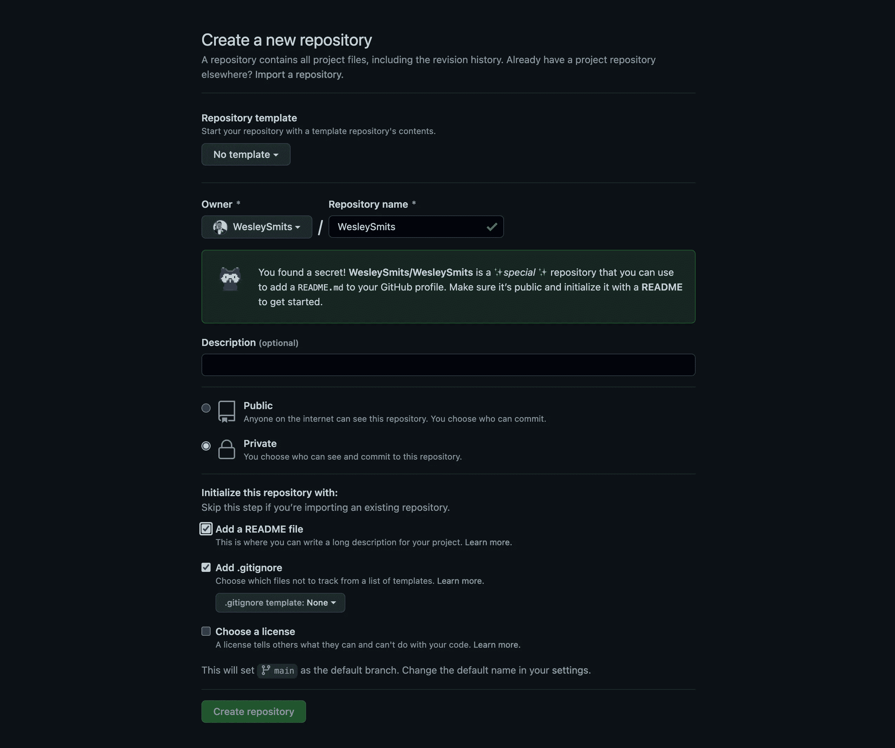

# 如何创建一个优秀的 GitHub 档案，让你成为一名 Web 开发人员

> 原文：<https://javascript.plainenglish.io/how-to-create-a-stellar-github-profile-that-gets-you-hired-as-a-web-developer-bf2264c7a48a?source=collection_archive---------8----------------------->

## WEB 开发职业

## 用这些简单的建议增加你在就业市场的变化

如果你正在找一份开发人员的工作，竞争会很激烈，你想尽可能地脱颖而出。最近，我发表了一篇关于如何建立你的 LinkedIn 个人资料以脱颖而出并被录用的文章，现在让我们来看看我们如何才能改善你的 GitHub 个人资料。

 [## 如何设置你的编程 LinkedIn 个人资料

### 无论你是这个领域的新手，正在寻找你的第一份发展工作，还是寻找新机会的老手，你都需要一个 LinkedIn 档案来获得正确的接触。javascript.plainenglish.io](/how-to-set-up-your-programming-linkedin-profile-1c8322c24a72) 

## 您的 GitHub 个人资料

Example of my own GitHub profile

如果你正在读这篇文章，很有可能你已经有了一个 GitHub 账户。(如果没有，[现在就创建一个](https://github.com/join))确保所有重要信息都已填入您的[个人资料](https://github.com/settings/profile)。

当有人在看你的个人资料时，让他们觉得和你有直接的联系是很重要的。因此，你的个人资料需要让人觉得你是一个人，而不仅仅是另一页。

## 个人资料照片

使用你的真实照片，而不是 GitHub 默认，不是假头像，也不是插图。就像在 LinkedIn 上一样，你需要一张专业的照片，人们可以看到他们正在看一个他们可以联系到的人。

## 个人信息

填写您的个人信息，如您的姓名和位置，决定是否要公开显示您的电子邮件地址，填写个人网址和 Twitter 用户名(如果有)。

对于您的个人网址，您可以使用另一个平台上的投资组合网站或帐户。我选择在这里链接到我的中等简介，因为我认为我的写作补充了我的专业简介。

## 个人简历

填写一份好的简历，记录你和你的工作。保持简单明了。这可能是你现在的工作头衔，也可能是显示你是谁的其他东西。我的简历很简单:“*资深前端开发者@ Nature。屋*”。

当然，你可以根据自己的个性来增加趣味。以下是 GitHub 对生物领域的思考。"*多亏了@mentions 和表情符号，你可以把你现在或以前工作过的地方、你做什么工作，甚至你喝什么样的咖啡等信息包括进去。*”

## 您的项目

项目部分可能是你的 GitHub 档案中最重要也是最困难的部分。如果你工作的组织有一个或几个你已经定期贡献的公共库，那就太好了。

如果你和我一样，你大部分时间都在私有库上工作，从你日常工作的角度来看，你的 GitHub 档案几乎是空的。但是，通过执行以下任一操作，可以轻松解决这一问题:

*   将您的作品集网站列为资料库之一
*   为开源项目做贡献
*   创建小型项目，如新项目的起始模板

这样，您就展示了成为专业开发人员的几个重要方面:

*   您的技术技能在您提交的代码中表现出来
*   您的工作过程显示在提交历史、代码架构和发布/标签中
*   非工作项目显示你对发展的热情
*   根据项目的不同，你也可以通过拉式请求反馈和讨论来展示你擅长与他人合作。

## 您的个人资料自述文件

GitHub 有一个众所周知的特性，你可以在一个项目中包含一个 README 文件，这个文件显示在存储库主页上。自述文件可以包含关于项目的任何内容:如何安装，它做什么，为什么做出决策，项目背后的使命是什么。

GitHub 还为您提供了创建个人资料自述文件的选项，您可以使用该文件来定制包含更多信息的个人资料页面。

这是我的个人资料，有和没有个人资料自述文件。

GitHub profile without a profile repository

GitHub profile with a profile repository

## 如何创建配置文件存储库

Creating a GitHub profile repository

登录你的 GitHub 账户，然后[创建一个新的库](https://github.com/new)。填写您的用户名作为存储库名称，然后会弹出一条消息，说明您正在创建一个配置文件存储库。参见上面的截图示例。

为了使自述文件显示在您的个人资料中，存储库需要是公开的。现在，保持存储库私有。一旦我们完成所有设置，我们会将它设置为公共。

勾选方框以包含自述文件并创建存储库。

您现在可以克隆存储库了。克隆完成后，您可以根据自己的喜好编辑自述文件，并将其推回到存储库中。一旦完成，我们将公开存储库，但首先，我们将检查您可能想要添加到自述文件中的内容。

## 封面图像

虽然不是必需的，但我建议在您的自述文件顶部添加一张封面图片。我重复使用了我的 LinkedIn 封面图片，尺寸如下: *1584x396px* 。

封面图片可以是视觉上令人愉悦的、娱乐性的或与众不同的。一定要保持专业。

## 关于文本

由于 GitHub 默认只允许你在你的简历中写 160 个字符，这是一个向人们讲述更多关于你自己和你的旅程的完美地方。你是做什么的，为什么这么做，你是怎么走到今天的？

## 你的技能

您的个人资料自述文件是突出您的技能的绝佳位置，这些技能在您的 GitHub 个人资料中并不明显。我决定使用 HTML5 `
`标签突出显示我最擅长的三项技能，并将其余的隐藏在一个开关下。

因为自述文件被解析为 Markdown，所以您可以在文件中使用 HTML 而不会有问题。这让我可以在技能部分使用 [shields.io](https://shields.io/) 徽章，在我看来这比简单的无序列表要好。

## 社交媒体渠道

我选择将我的 Twitter、Medium 和 LinkedIn 个人资料放在 GitHub 上。LinkedIn 似乎是一个与志同道合的人建立联系的显而易见的选择，我的媒体和 Twitter 链接是人们关注我写作的好地方。

你也可以包括其他适合你的频道。

## 通过 GitHub 操作自动添加您的最新内容

我决定在我的 GitHub 个人资料上添加 5 篇最新的博客文章。由于我积极地在 Medium 上写作，我想我的文章在我的 GitHub 个人资料上会很好看。

有趣的是，博客文章会自动添加到我的 GitHub 个人资料中。也许你不写博客，但是你有作品集或者其他可以在这里展示的东西。

为了自动获取最近的几篇博文，我使用 GitHub actions 在每晚 00:00 更新我的最新博文列表。这需要做两件事:

## 1.在自述文件中包含开始和结束注释，因此列表可以放在两者之间

## 2.添加要自动执行的操作

在您的配置文件存储库中创建一个名为`.github`的文件夹，并在其中创建另一个名为`workflows`的文件夹。

这里，我们将创建一个名为`blog-post-workflow.yml`的文件，并粘贴以下代码。

## 结论

GitHub 是一个强大的平台，它补充了你作为开发者的在线身份。通过创建一个展示你的技能、兴趣、过去的工作和个性的专业档案，你一定会脱颖而出，找到你想要的工作！

感谢阅读。如果你对此有想法，或者认为我遗漏了什么，一定要留下评论。

如果你愿意，你可以在 [LinkedIn](https://www.linkedin.com/in/wesley-robert-smits/) 或 [Twitter](https://twitter.com/iamwesleysmits) 上联系我！

*更多内容请看*[***plain English . io***](http://plainenglish.io/)