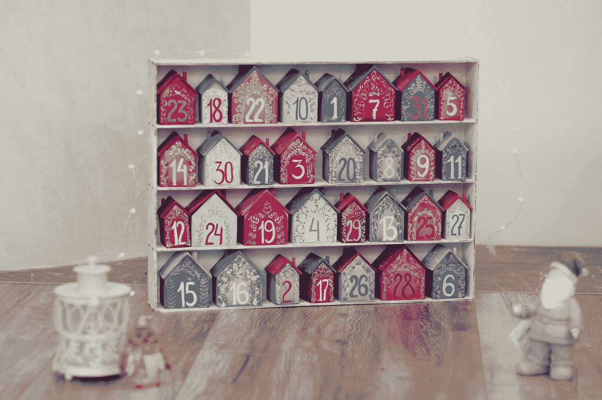

# 如何用 JavaScript 创建一个填充有重复字符的变长字符串？

> 原文：<https://javascript.plainenglish.io/how-to-create-a-string-of-variable-length-filled-with-a-repeated-character-with-javascript-aba83e922f9?source=collection_archive---------9----------------------->



Photo by [Elena Mozhvilo](https://unsplash.com/@miracleday?utm_source=medium&utm_medium=referral) on [Unsplash](https://unsplash.com?utm_source=medium&utm_medium=referral)

有时，我们想在 JavaScript 中创建一个填充了重复字符的可变长度字符串。

在本文中，我们将研究用 JavaScript 创建这种字符串的方法。

# 使用数组构造函数和 Arra.prototype.join 方法

我们可以用`Array`构造函数创建一个数组。

然后我们可以调用`join`将数组条目连接成一个字符串，用给定的字符作为分隔符。

例如，我们可以写:

```
const len = 10
const character = 'a'
const str = new Array(len + 1).join(character);
console.log(str)
```

我们创建一个长度为`len + 1`的`Array`。

然后我们用我们想要重复的`character`呼叫`join`。

所以，`str`就是`'aaaaaaaaaa’`。

# 使用 String.prototype.repeat 方法

创建具有重复字符的可变长度字符串的另一种方法是使用字符串的`repeat`方法。

例如，我们可以写:

```
const len = 10
const character = 'a'
const str = character.repeat(len);
console.log(str)
```

然后我们得到和以前一样的结果。

# 使用 for 循环

我们还可以使用一个`for`循环将同一个字符连接成一个字符串，直到它达到给定的长度。

为此，我们写道:

```
const len = 10
const character = 'a'
let str = ''
for (let i = 1; i <= len; i++) {
  str += character;
}
console.log(str)
```

我们有一个`for`循环，从索引变量 1 开始，当它到达`len`时停止。

在循环体中，我们将`character`连接到`str`。

所以我们得到了和以前一样的结果。

# 结论

通过使用数组方法、字符串方法或循环，我们可以创建一个长度可变的字符串，其内容由一个重复的字符组成。

*更多内容看* [***说白了. io***](http://plainenglish.io)