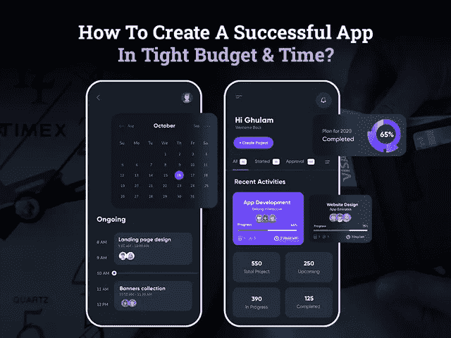

# 如何在预算和时间紧张的情况下创建一个成功的 App？

> 原文：<https://javascript.plainenglish.io/how-to-create-a-successful-app-in-tight-budget-and-time-8fb9d29a5158?source=collection_archive---------12----------------------->

## 如何在有限的预算下打造一款功能强大的手机 App？

在当今技术驱动的世界，每个人都在寻找智能和完美的技术解决方案来简化他们的日常任务。美国智能手机用户数量的快速增长清楚地表明了移动应用下载量的上升。预计到 2020 年，智能手机用户将达到约 2.5 亿，这将最终影响全球各地的企业投资移动应用。

无论你是经营零售店还是杂货店，如果你真的想在未来几十年留在市场上，拥有一个移动应用程序已经成为当务之急。

因此，如果你已经认识到在数字平台上移动业务的重要性，并希望完成一个百万美元的行业，那么你需要的只是一个出色的应用程序开发想法。

有了优秀的应用程序开发理念，你就能成为下一个行业巨头。

为了将您的应用程序想法转化为完美的解决方案，早期企业必须确定其目标受众的痛点，并需要决定适合其业务需求的应用程序开发平台。

一旦你完成了，下一步是什么？

*当然，你肯定会问开发一个移动应用程序需要多少成本？*

许多科技创业公司和商业爱好者认为，构建一个具有高度吸引人的设计的移动应用程序是一个过高的过程，需要大量的预算，然而，事实并非如此。在进入应用程序开发流程之前，了解每个特性和功能对应用程序开发成本的影响非常重要。这将让你对为 Android 或 iOS 创建移动应用程序的预算和时间有一个现实的想法。你可以通过雇佣移动应用程序开发公司来开发功能性应用程序，因为他们有一个应用程序开发团队，在承诺的时间表下工作，并确保你的解决方案质量。但问题是如何在有限的预算和时间内建造它。

事实上，对于初创公司来说，这是最令人心痛的问题，因为人们普遍认为开发移动应用是一项非常累人的任务。

如果对投资移动应用程序开发的担忧限制了你继续使用移动应用程序开发解决方案，那么这篇博客就是为你准备的。通过这篇博客，你将了解如何在有限的预算下创建一个移动应用程序？

现在，让我们用这些技巧来指导你，让你不用倾家荡产就能构建一个强大的移动应用。

## **1。为移动应用开发设定明确的期望和目标**

重要的事情先来，为了控制应用程序开发成本，有必要清楚地了解你对推出移动应用程序的期望。仔细考虑，因为缺乏远见会让你对从哪里开始和如何结束感到困惑，最终增加成本。

当然，为你的企业开发一款移动应用将是一项令人兴奋的任务，但如果你不确定推出应用背后的原因，你的目标是谁，以及推出应用需要什么，这种兴奋很快就会变成一个错误。许多企业会找 [**应用程序开发公司**](https://www.xicom.ae/services/mobile-app-development/) 寻求专家建议如何进行市场调查或如何评估他们的应用程序创意。但是如果你有兴趣了解到底是什么帮助你变得简单，那么请阅读下面的内容:

> 为了让你的应用目标更加清晰，你可以简单地列出这些问题的答案:

*   谁将是您的最终用户？
*   你想提供什么样的服务和产品？
*   如何让自己的产品与众不同？
*   它将如何解决您客户的问题？
*   你需要实现什么功能和特性？
*   你的竞争对手采取什么策略来留住用户？

在最早阶段定义你的目标将帮助你在应用程序开发时间、预算和质量上有很大的不同。

## **2。为移动应用开发选择合适的平台**

随着移动应用开发领域技术和创新的进步，推出一款移动应用对创业公司来说不再是一件遥不可及的事情。但选择一个合适的平台来创建一个移动应用程序，会带来应用程序开发成本的巨大变化。

*如何？*

在你开始移动应用开发之前，你需要决定你的目标用户群是 App Store 还是 Play Store？这里来了一个商业爱好者的综合体！

如果你想瞄准更广阔的市场，那么你必须开发一个同时适用于 Android 和 iOS 的应用程序。然而，当在预算和时间紧张的情况下推出应用程序时，最好选择 Android 原生或 iOS 原生应用程序。

原生应用是用特定于平台的编程语言开发的，需要专门的开发方法。如果你正在考虑开发两个本地应用，那么你将需要 [**雇佣两种不同编程语言的移动应用开发者**](https://www.xicom.ae/services/mobile-app-developers/) 。开发两个本地应用程序将花费更多的时间，最终会在口袋里留下一个烧钱的洞。

通过适当的市场调查，您可以轻松分析竞争对手，并做出明智的决策，选择最适合您的最终用户的最佳平台，并帮助您将创建移动应用程序的平均成本保持在尽可能低的水平。在你考虑雇佣一个移动应用程序开发者之前，请记住，考虑推出一个用单一代码库构建的跨平台应用程序是创业公司最节省预算的方法之一。这是构建应用程序的最经济的方法之一，该应用程序为您提供了与不同平台兼容性的无缝集成。

通过使用单一代码库，你可以创建一个无缝运行在多个平台上的应用程序。这降低了开发成本，因为您不需要为不同的平台开发应用程序。像 React Native、Flutter 和 PhoneGap 等跨平台框架提供了使用多个 API 定制应用程序的灵活性。

## **3。特性和功能选择**

的确，特性和功能是任何移动应用开发的最大成功决定因素。但是，如果创建应用程序主要功能的成本超过了您的理想预算限制，该怎么办？在这种情况下，一开始就匆忙创建一个成熟的应用程序将是一项耗费预算的任务。

节省应用程序开发成本的最佳方式是寻找 MVP 开发。

最低可行产品(MVP)是一个基本的应用程序版本，具有基本的功能和特性。对于初创公司来说，MVP 应用是理想的解决方案，因为这允许他们从用户那里收集有价值的反馈，根据市场需求验证应用想法，分析受众需求，然后向投资者推销应用。

简而言之，通过 MVP 解决方案，您可以降低在应用程序开发方面进行巨额投资的风险，并能够通过选择特性和功能来扩展应用程序，从而确保更高的投资回报率。

## **4。选择合适的应用开发合作伙伴**

不管你有多么好的应用想法，也不管你选择将什么功能集成到你的应用中。你的应用程序能否成功，很大程度上取决于应用程序开发人员的技能，以及他们将应用程序创意转化为强大解决方案的方式。所以选择 [**app 开发公司**](https://www.xicom.ae/) 会对解决方案的质量和成本造成很大的影响。

当涉及到开发移动应用程序时，有两种主要的方式——要么你选择与内部应用程序开发团队一起自己创建，要么外包给应用程序开发公司或自由职业者。两种选择各有利弊，很难做出最终决定。

一方面，雇佣内部应用程序开发团队将确保开发者之间的无缝沟通，但会造成月薪、办公室租金、账单等负担。然而另一方面，外包应用程序开发人员将使您能够自由地为特定项目雇用一支技术高超的工程师团队，并在严格的时间表内交付项目，而不必与工程师团队打交道。您将拥有一个专家团队，负责不同的开发领域，提供最佳可行的解决方案。

然而，如果你有足够的理由外包一家移动应用程序开发公司，那么请记住，根据地点、技能、知识和经验的不同，应用程序开发人员的每小时成本从 20 美元到 150 美元不等。

## **5。不要忘记应用程序维护和更新**

应用程序开发的成本不会随着一个应用程序的推出而结束。事实上，在你的应用程序上市之前，你需要为应用程序的每月或每年更新留出预算，以使其运行完美，没有任何错误。

请记住，应用维护是应用中最重要的部分之一，会影响应用开发的预算，但升级应用以使其与最新技术兼容也很重要。

当谈到为应用程序维护留出预算时，你需要明白它将占总应用程序开发成本的大约 20%,或者它将取决于更新的复杂性。你也可以考虑在迪拜雇佣一个移动应用程序开发者，他可以分析你的应用程序结构，并会建议额外功能、改进、升级、修复错误等所需的估计成本。

## **6。追求简单的用户界面/UX 设计**

应用程序设计是你的应用程序的核心和灵魂。这有助于你抓住用户的注意力，让他们更长久地参与到应用中。但有时，商业爱好者试图让它看起来太花哨，以至于用户感到困惑，失去对应用程序的兴趣。

其次，开发具有复杂 UI/UX 设计的应用程序会增加开发时间，并对性能造成很大影响。

如果你曾经访问过亚马逊、易贝、塔拉巴特、优步等应用，你一定会注意到它们拥有简单、明快、易于导航的设计，总能确保出色的用户体验。

当在预算和时间紧张的情况下开发一个成功的移动应用程序时，寻找一个简单、独特和吸引人的 UI/UX 设计总是值得的，这需要一个简单的方法来构建它。

## **总结:准备好在预算紧张的情况下发布你的应用，同时保持质量**

随着这篇博客的结束，你一定已经明白为你的企业提供一个移动应用程序已经成为这个城市的迫切需要。但是，如何在预算和时间紧张的情况下为您的企业创建一个强大的移动应用程序是企业的主要约束之一。虽然这篇博客列出了一些节省预算和时间的好方法，但更好的选择是聘请一家 [**移动应用开发公司**](https://www.xicom.ae/) ，他们可以通过遵循标准的应用开发方法，在有限的预算和严格的时间表内构建移动应用。通常，他们拥有多年的经验，这有助于他们寻找最佳替代方案，以节省研究时间、技术等，最终降低应用程序开发成本。

如果你有一个出色的应用程序想法，并正在寻找专家来估计你的成本和时间，以及建立一个应用程序的最佳合适方法是什么，那么你可以 [**联系我们**](https://www.xicom.ae/contact/) 并获得你的免费估计或在下面提出疑问。

*更多内容请看*[***plain English . io***](http://plainenglish.io/)