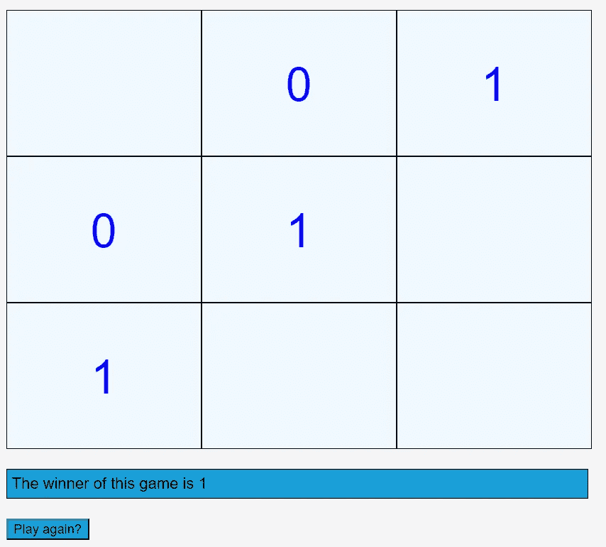

# 如何使用 React 创建井字游戏？

> 原文：<https://javascript.plainenglish.io/how-to-create-a-tic-tac-toe-game-using-react-js-2c560fe9e282?source=collection_archive---------5----------------------->



到本文结束时，你将拥有一个和上面一样的井字游戏。

让我们从将问题陈述分成子集开始，然后我们将一个接一个地挑选。

我们需要创造一个井字游戏。这个游戏有哪些不同的方面？

1.  它有一块 3 x 3 的板。
2.  有两个玩家。
3.  游戏从一个空棋盘开始。
4.  每个玩家只能走一步，然后跟着下一个玩家走。
5.  水平、垂直或对角覆盖三个后续方块的玩家获胜。

以上是一款井字游戏必须满足的基本要求。

现在让我们着手解决每个问题子集。

# **1。一块 3 x 3 的木板—**

如果您曾经遇到过类似棋盘的结构，那么创建它最简单的方法就是使用一个`**display:grid**` 属性作为这些条目的父 div。对于给定的，我们想要实现一个 3 x 3 的板，它可以被创建如下(容器是父 div 的类):

```
***.container{
    display: grid;
    grid-template-columns: 200px 200px 200px;
    grid-template-rows : 150px 150px 150px;
   }***
```

现在到了你必须选择如何渲染你的棋盘的时候了。如果你做对了，程序的其余部分会找到自己的路。

网格中的每个 div 最初都是空的，然后用玩家的值(1 或 0)替换 div 中的空内容。现在是时候使用 React 的力量了。React 允许你将一个状态附加到一个元素上，并且当你改变附加到元素上的状态时，它会重新渲染这个元素！

```
***class TictacBoard extends Component {
    initialState = {
        value : {
            '00' : '',
            '01' : '',
            '02' : '',
            '10' : '',
            '11' : '',
            '12' : '',
            '20' : '',
            '21' : '',
            '22' : ''
        }
    };
    state = this.initialState;
    boardItems = [];
    createBoardDivs() {
        this.boardItems  = [];
        for (let i = 0; i < 3; i++) {
            for (let j = 0; j < 3; j++) {
                let key = i.toString() + j.toString();
                this.boardItems.push(<div xaxis={i} yaxis={j} key=    {i.toString() + j.toString()} onClick={this.showValue}>{this.state.value[key]}</div>);
            }
        }
        return this.boardItems;
    }******render() {
    return (
        <React.Fragment>
            <div className={styles.container}>
                {this.createBoardDivs()}
            </div>
        </React.Fragment>

    );
   }******}***
```

我们在这里创建了棋盘组件，棋盘看起来像一个大小为 3 x 3 的矩阵。每个 div 都有一个 x 轴和一个 y 轴属性，这将使我们更容易跟踪 div 上的值。

# **2。有两个玩家—**

为了跟踪玩家，我们在组件的状态中创建了一个键，我们可以在每次移动时切换这个键。currentPlayer 对象最初被设置为“0 ”,以后当用户单击任何 div 时将被切换。

```
***class TictacBoard extends Component {
    initialState = {
        currentPlayer : 0,
        value : {
            '00' : '',
            '01' : '',
            '02' : '',
            '10' : '',
            '11' : '',
            '12' : '',
            '20' : '',
            '21' : '',
            '22' : ''
        }
      };
    state = this.initialState;
}***
```

# 3.游戏从一个空棋盘开始—

要在所有 div 中以空内容开始游戏，我们可以创建一个对象来跟踪每个 div 的状态，并用一个空值初始化所有键，以便在第一次加载页面时启动一个空网格。

我已经在组件的状态中创建了一个值对象。为了保持每个 div 的唯一性，value 对象中的每个键都是每个 div 的 x 轴值和 y 轴值的组合，作为一个字符串，我们已经用空值初始化了这个字符串，以启动一个空网格。现在，当您想要更改 div 上的值时，您所需要做的就是更改组件状态的 value 对象中相应键的值

```
***class TictacBoard extends Component {
    initialState = {
        value : {
            '00' : '',
            '01' : '',
            '02' : '',
            '10' : '',
            '11' : '',
            '12' : '',
            '20' : '',
            '21' : '',
            '22' : ''
        }
    };
    state = this.initialState;
    boardItems = [];
    createBoardDivs() {
        this.boardItems  = [];
        for (let i = 0; i < 3; i++) {
            for (let j = 0; j < 3; j++) {
                let key = i.toString() + j.toString();
                this.boardItems.push(<div xaxis={i} yaxis={j} key=    {i.toString() + j.toString()} onClick={this.showValue}>{this.state.value[key]}</div>);
            }
        }
        return this.boardItems;
    }******render() {
    return (
        <React.Fragment>
            <div className={styles.container}>
                {this.createBoardDivs()}
            </div>
        </React.Fragment>

    );
   }******}***
```

# **4。每个玩家只能走一步，然后跟着下一个玩家走。**

为了确保这一点，我们现在深入研究处理每个 div 上的点击的函数。

```
***showValue = (event) => {
    let xAxis = event.target.getAttribute("xaxis");
    let yAxis = event.target.getAttribute("yaxis");
    let keyToChange = xAxis + yAxis;

   const newValue = {...this.state.value};
      newValue[keyToChange] = this.state.currentPlayer ? '0' : '1';
   this.setState((prevState) => {
      return {
        currentPlayer: prevState.currentPlayer ? 0 : 1,
        value: newValue
    }
  });
  this.checkWinner(xAxis, yAxis, newValue[keyToChange], newValue);
}***
```

当玩家点击一个 div 时，我们首先通过从 div 中获取`**xaxis**` 和`**yaxis**` 属性来找出哪个 div 被点击了。现在，我们在值对象中生成想要更改的键，并用新的值对象在组件上设置新的状态。此外，每当我们单击一个 div 时，div 上呈现的值就会在 0 和 1 之间切换。

# 5.找到赢家—

让我们创建一个函数来查找获胜者。这个函数必须在每个 div 被点击后被调用。你也可以通过在第 5 步之后开始调用来减少调用这个函数的次数，因为在至少 6 步之前，任何一个玩家都不能赢。

现在有 4 个玩家可以获胜的条件:

从玩家的当前位置/当前点击的 div 跟踪以下内容:

假设单击的 div 是(1，2) — 1 是 div 的 x 轴，2 是 y 轴。

1.  跟踪所有水平 div 到这个 div — ( 1，0)，(1，1)
2.  跟踪到这个 div 的所有垂直 div — (0，2)，(2，2)

你能看到上面两个案例中的模式吗？对于第一种情况，x 轴与被单击的 div 的 x 轴保持不变，y 轴从 0 变为 2。类似地，对于第二种情况，y 轴与被单击的 div 的 y 轴保持不变，而 x 轴从 0 变为 2。

3.跟踪从棋盘左上角开始到棋盘右下角的所有对角线 div(仅当所单击的当前 div 的 x 轴和 y 轴相等时)。

这是因为下面是这条对角线上的 divs，0)，(1，1)，(2，2)。

4.跟踪从棋盘右上角到左下角的所有对角线 div(仅当所单击的当前 div 的 x 轴和 y 轴之和等于 2 时)。

这是因为下面是这条对角线上的 divs，2)，(1，1)，(2，0)。

```
***checkWinner(xAxis, yAxis, currentValue, values) {
    let allValues = {...values};
    let won = true;
    let x = 0, y = 0;

    //case 1 : check horizontally*** ***while(x >= 0 && x < 3) {
        if(allValues[x.toString() + yAxis.toString()] !== currentValue) {
            won = false;
            break;
        }
        x++;
    }*** ** *//case 2 : check vertically*** ***if(!won) {
        won = true;
        while(y >= 0 && y < 3) {
            if(allValues[xAxis.toString() + y.toString()] !== currentValue) {
                won = false;
                break;
            }
            y++
        }
    }*** ** *//case 3 : check top-left to bottom-right diagonal*** ***if(!won && xAxis === yAxis) {
        won = true;
        x = 0;
        y = 0;
        while(x < 3 && y < 3) {
            if(allValues[x.toString() + y.toString()] !== currentValue) {
                won = false;
                break;
            }
            x++;
            y++;
        }
    }*** ***//case 4: check top-right to bottom-left diagonal*** ***if(!won && (Number.parseInt(xAxis) + Number.parseInt(yAxis) === 2)) {
        won = true;
      for(let i = 0; i < 3; i++) {
          for(let j = 0; j < 3; j++) {
              if(i + j === 2) {
                  if(allValues[i.toString() + j.toString()] !== currentValue) {
                      won = false;
                      break;
                  }
              }
          }
      }
    }
    if(won) {
        this.setState({winner : `The winner of this game is ${currentValue}`});
     }

}***
```

而且你还有自己的井字游戏可以玩！

您可以对该代码添加其他一些修改，例如:一旦发现获胜者，禁用网格，为游戏添加计时器，添加“谁先走”选项，添加 SVG 标签以显示穿过获胜者 div 的线。

如需完整代码，请访问 GitHub 链接:

[](https://github.com/SaloniMishra/Tic-tac-toe-) [## SaloniMishra/井字游戏-

### React.js 中的一个基本井字游戏。通过在…上创建一个帐户来促进 SaloniMishra/井字游戏的发展

github.com](https://github.com/SaloniMishra/Tic-tac-toe-) 

*更多内容尽在*[plain English . io](http://plainenglish.io/)