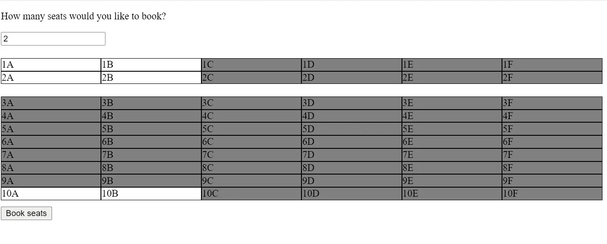
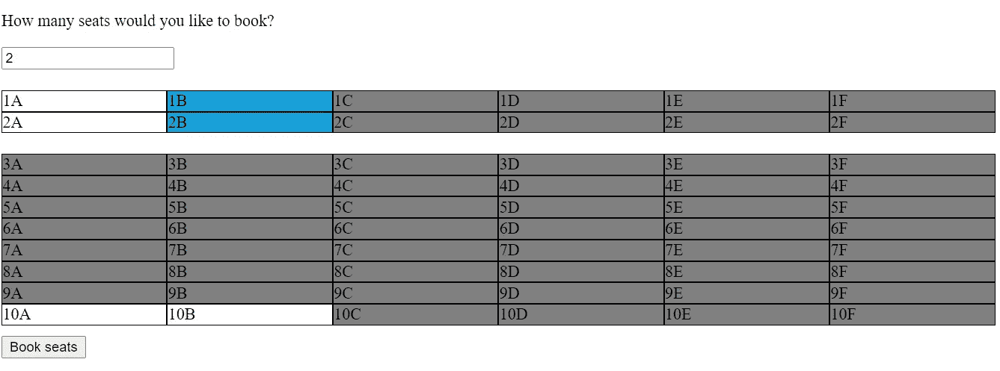
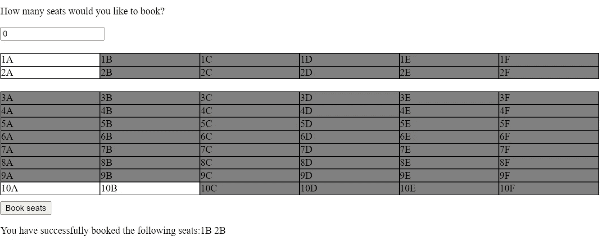

# 如何用 React 创建订票界面

> 原文：<https://javascript.plainenglish.io/how-to-create-a-ticket-booking-interface-using-react-js-a2df17184f8?source=collection_archive---------1----------------------->



**A Ticket Booking Interface**

我这里有一个新的问题陈述，让我们今天讨论一下。在我们的日常生活中，我们都在从事高度复杂的设计，但令人惊讶的是，当时钟滴答作响，一个人不断盯着我们的代码，我们一直知道的一切突然决定在黑洞中漫步时，我们往往会陷入构建最简单的设计。🤭

这就是问题所在。但是解决方案是我们感兴趣的。

解决方法是一个非常著名的，被广泛宣扬的概念——实践！

让我们继续下一个问题。我们从哪里开始练习？因为互联网是一个无穷无尽的知识宝库，找到合适的和最有用的学习资源是一项艰巨的任务。考虑到我曾经被这些琐事困扰过，我想分享一些重要的问题陈述和人们处理它们的方法。记住，解决 1000 个相似的问题不会让一个人变得更好，而是解决 10 个不同的问题！我将在一系列文章中向您展示几个不同的问题案例，如果加以实践，可以极大地提高您的机器/现场编码技能。

# 每日问题陈述:

希望你用过 Bookmyshow。试着做一个订票界面，考虑和你的参考一样。

如果在面试中，你应该采取的第一步是告诉面试官关于这个界面你已经可以假设的事情。你是否使用过这个特定的应用程序/网站并不重要。作为一名 UI 开发人员，你应该能够想象出任何被要求的界面。(在你开始提问以进一步澄清之前，提出你的假设是加分的)

**关于这个接口，我们很容易假设:**

1.  ***座位号会不断递增。***
2.  ****
3.  ***某些座位将不可用，某些座位可用，用户只能从可用座位列表中选择。***
4.  ***一旦预订，所选座位也将变为不可用。***

我认为我们已经向采访者展示了一些观察结果。现在，让我们进一步了解他希望我们添加到列表中的任何要求。

**附加要求—**

比方说，应该首先提示用户输入他想要选择的座位数。如果他的选择超出了他要求的席位总数，我们将取消选择第一个选择的席位，并选择新选择的席位。例如:假设用户想要选择两个座位。他已经选择了 2E 和 2F。现在，如果他继续选择 2G，那么 2E 应该会自动取消选择，新的一组选定席位是 2F 和 2G。

现在，总是把你的问题分成子集。然后逐一挑选每个子集。

1.  两部分座椅(为简单起见)
2.  有座位和无座位，两者有所区别
3.  选择座位的处理程序
4.  预订座位的管理人员

我们现在已经确定了我们的子集。让我们逐一解决。

# 两部分座椅—

我们知道，除了每个部分的座位数量之外，这些部分彼此完全相似。因此，我们可以为座椅创建一个可以生成两个部分的组件。React 带来了创建可重用组件的特性，我们必须使用它来使我们的代码紧凑并利用库的优势。

```
***const Seats = (props) => {
  return (
      <div>
          {props.values.map(seat => {
             return <div key={seat}>{seat}</div>;
          })}
      </div>
    );
}
export default Seats;***
```

这就是我们的座位组件的样子。一个简单的组件，它为我们传递给它的所有值生成 div。每个 div 类似于一个座位。所以下一步是将座位值传递给这个组件，并生成我们想要的两个部分。此外，使用这种方法，您的代码是一个可伸缩的片段。通过多次调用该组件，可以在界面中添加大量的部分。

```
***const createSeats = (rows, startIndex) => {
    let i = 0;
    let j = startIndex;
    let k = 'A';
    const section = [];
    while(i < 6 && j <= rows) {
        if(k > 'F') {
            k = 'A';
            j++;
        }
        if(j < rows + 1) {
            section.push(j + k);
            k = String.fromCharCode(k.charCodeAt(0) + 1);
        }
    }
    return section;

}
const BookMySeats = () => {
  const premiumSeats = createSeats(2, '1');
  const normalSeats = createSeats(10, '3');
  return (
        <React.Fragment>
          <Seats values={premiumSeats}/>
          <Seats values={normalSeats}/>
        </React.Fragment>

    );
}

export default BookMySeats;***
```

让你的代码尽可能的可重用和简洁。记住这一点，我创建了一个函数，它接受某些参数并生成每个部分的座位。函数`**createSeats()**` 接受两个参数，即您希望在一个节中创建的行数和该节中第一行的 startIndex。然后，生成的座位作为`**prop**` 传递给`**Seats**` 组件，该组件对所有生成的座位运行一个循环，并为每个座位创建一个 div。

要在类似网格的结构中安排座位，只需将父部分的显示类型设置为网格，并添加您希望它拥有的列数——

```
***.section {
    margin-top: 20px;
    display: grid;
    grid-template-columns: repeat(6, 1fr);
}***
```

# 有座位和无座位，两者有所区别

要实现这一点，您可以维护一组可用座位。要添加分隔，您可以相应地设置座位的背景颜色。

```
***const BookMySeats = () => {
  const premiumSeats = createSeats(2, '1');
  const normalSeats = createSeats(10, '3');
  const [availableSeats, setAvailableSeats] = useState(['1A', '1B', '2A', '2B', '10A', '10B']);
  const [bookedSeats, setBookedSeats] = useState([]);
  const [bookedStatus, setBookedStatus] = useState('');
  const [numberOfSeats, setNumberOfSeats] = useState(0);

  return (
        <React.Fragment>
            <p>How many seats would you like to book?</p>
            <input value={numberOfSeats} onChange={(ev) => setNumberOfSeats(ev.target.value)}/>
            <Seats values={premiumSeats}
                   availableSeats={availableSeats}
                   bookedSeats={bookedSeats}/>
            <Seats values={normalSeats}
                   availableSeats={availableSeats}
                   bookedSeats={bookedSeats}/>
       </React.Fragment>

    );
}

export default BookMySeats;***
```

我现在已经在 BookMySeats 组件中添加了几个状态，它是 Seats 组件的父组件。一个阵列可以容纳可用的座位，另一个阵列可以容纳预定的座位。我还添加了一个输入，以接受用户想要预订的座位数量。输入的值受状态值控制，状态值为`**numberOfSeats**` 。然后，我们将可用和预定的座位数组传递给我们的两个座位组件，以此为基础在组件中添加样式。

```
***import React from 'react';
import classes from './BookMySeats.css';

const Seats = (props) => {

    return (
      <div className={classes.section}>
          {props.values.map(seat => {
              const isAvailable =   props.availableSeats.includes(seat);
              const isBooked = props.bookedSeats.includes(seat);
              let seatClass;
              if(!isAvailable) {
                  seatClass = classes.disabled;
              }
              if(isBooked) {
                  seatClass = classes.booked;
              }
              return <div className={seatClass}key={seat}>{seat}  </div>;
          })}
      </div>
    );
}
export default Seats;***
```

这就是我们的座椅组件在接受道具后的样子。基于道具的价值，我们为每个座位区添加了不同的类别。这些类持有某些暗示分离的背景颜色。

# 选择座位的处理人员

仅允许对可用座位进行选择。所以记住不要选择不可用的座位。

```
***.section > div:hover {
    cursor: pointer;
}
.section .disabled:hover {
    cursor: not-allowed;
}***
```

假设我们将`**disabled**` 类附加到所有被禁用的 div，我们可以依靠类选择器结合伪类`**:hover**`来禁用光标。

下一步是添加一个选择座位的功能。

```
***const addSeat = (ev) => {
    if(numberOfSeats && !ev.target.className.includes('disabled')) {
        const seatsToBook = parseInt(numberOfSeats, 10);
      if(bookedSeats.length <= seatsToBook) {
          if (bookedSeats.includes(ev.target.innerText)) {
              const newAvailable = bookedSeats.filter(seat => seat !== ev.target.innerText);
              setBookedSeats(newAvailable);
          } else if(bookedSeats.length < numberOfSeats) {
              setBookedSeats([...bookedSeats, ev.target.innerText]);

          } else if (bookedSeats.length === seatsToBook) {
              bookedSeats.shift();
              setBookedSeats([...bookedSeats, ev.target.innerText]);
          }
      }
    }
  };***
```

我已经处理了这里所有的案子。

只有当用户输入了他预定的座位数，并且目标没有类名`disabled.`时，才允许选择

当预订的座位少于用户想要选择的座位数时——

1.如果用户第一次点击这个 div(它还不是 bookedshats 的一部分)，将其添加到 bookedshats 数组中。

2.如果用户再次点击选定的 div，他试图取消选择它。因此，将其从 bookedSeats 数组中移除。

当预定的座位数等于用户想要选择的座位数时，从阵列中移除第一个座位，并推送新选择的座位。



**Screen post selection of seats**

# 预订座位的工作人员

现在是最后一步了。座位已经选定了。预订必须确认。

添加一个按钮进行确认，点击该按钮，应该会发生这种情况——

```
***const confirmBooking = () => {
    setBookedStatus('You have successfully booked the following seats:');
    bookedSeats.forEach(seat => {
         setBookedStatus(prevState => {
             return prevState + seat + ' ';
         })
    });
    const newAvailableSeats = availableSeats.filter(seat => !bookedSeats.includes(seat));
    setAvailableSeats(newAvailableSeats);
    setBookedSeats([]);
    setNumberOfSeats(0);
};***
```

我还创建了一个额外的状态来显示底部的布克状态。一旦用户确认了预订，我们就将所有的座位从 bookedSeats 数组添加到 bookedStatus 字符串中。布克状态数组和行数都应该重新初始化为[]和 0，以便下一步进行新的选择。新选择的座位必须从可用座位列表中删除。

就这样！您拥有功能齐全的订票界面！



**Seats booked and unavailable for the next user**

让我们修改一下步骤——

1.  屏幕上的多个部分非常相似，因此我们决定为此创建一个可重用的组件。
2.  我们为父组件中的每个部分创建了一个座位数组。
3.  我们创建了一个可用座位的模拟数组、一个预订座位的空数组和一个座位的点击处理程序，将所有这些值作为道具传递给座位组件。
4.  在 seats 组件中，我们分别检查了 available/booked seats 数组和 attached styles 中每个座位的可用性。
5.  我们创建了一个处理程序来管理每个 div 的点击，并在同一个。
6.  我们创建了一个 final 处理程序来管理 Confirm Booking 按钮的点击，并将预订的座位和要选择的座位数重新初始化为初始值，将新选择的座位从可用座位列表中删除。

你肯定可以对这个项目进行修改——

1.  当然是更好的造型！目前所有的元素都是左对齐的，这是可以改进的。这些部分可以具有指示部分名称的标题。在座位之间增加一些空隙。
2.  每次选择后所选的座位可以保存在浏览器的本地存储器中。当页面重新呈现时，将保留以前的选择。
3.  当所有的座位都被选中时，会显示“满座”的信息。
4.  如果用户试图在不提供座位数的情况下选择座位，输入框周围会出现一条错误消息。
5.  预订确认后，禁用进一步的选择。
6.  仅当有效状态改变时，useEffect()钩子可用于重新呈现组件。可以在函数周围添加 useCallBack()，以防止在每次重新渲染时重新创建函数。

想想这些修改，把它们添加到你的项目中，好好练习，不断让你的代码变得更好。

要获得完整代码，请访问 GitHub 链接:

[https://github.com/SaloniMishra/Ticket-booking-interface](https://github.com/SaloniMishra/Ticket-booking-interface)

*更多内容尽在*[plain English . io](http://plainenglish.io/)