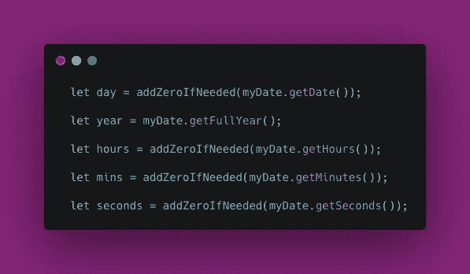
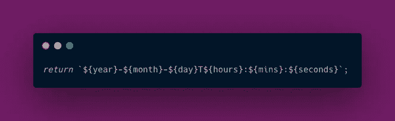
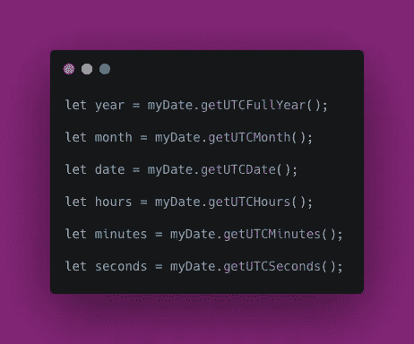

# 如何用 JavaScript 创建一个可读的时间戳

> 原文：<https://javascript.plainenglish.io/how-to-create-a-timestamp-from-a-date-object-in-javascript-760d58a3511f?source=collection_archive---------1----------------------->


Photo by [Aron Visuals](https://unsplash.com/@aronvisuals?utm_source=unsplash&utm_medium=referral&utm_content=creditCopyText) on [Unsplash](https://unsplash.com/s/photos/clock-time-coding-programming?utm_source=unsplash&utm_medium=referral&utm_content=creditCopyText)

我们的代码经常需要创建特定格式的时间戳——或者是为了显示，或者是为了向 API 发送数据。幸运的是，一个构建良好的 JavaScript 函数可以做到这一点。

JavaScript 允许您创建存储创建时间的`Date`对象，并拥有自己独特的方法集。您可以使用关键字`new`像实例化另一种类型的对象一样实例化一个对象。

```
let currentDate = new Date();
```

假设我们想要获取这个`Date`对象，并以下面的格式提取一个时间戳，用`T`分隔日期和时间。

```
2021-07-28**T**13:45:30
```

一种方法是调用一个函数，该函数将`currentDate`对象作为参数并返回时间戳。

```
let timestamp = get_date_format(currentDate);
```

这个`get_date_format`函数如何从`currentDate`对象中提取它需要的东西并返回一个时间戳？

考虑一下一般的方法，当你准备好了，看看下面的函数。

# 时间戳函数

下面是我们将要研究的时间戳函数。它接受一个名为`myDate`的`Date`对象作为其参数，并最终使用它创建一个标准日期格式的字符串。

A function that takes a Date object and returns a timestamp in standard date format.

我们一眼还会注意到什么？

首先，获取一个 [getMonth](https://developer.mozilla.org/en-US/docs/Web/JavaScript/Reference/Global_Objects/Date/getMonth) 方法的结果，并向其中添加`1`。它还有一个[箭头函数](https://developer.mozilla.org/en-US/docs/Web/JavaScript/Reference/Functions/Arrow_functions)，带有一个[三元运算符](https://developer.mozilla.org/en-US/docs/Web/JavaScript/Reference/Operators/Conditional_Operator)和一点点[类型强制](https://developer.mozilla.org/en-US/docs/Glossary/Type_coercion)。然后它使用一系列[日期方法](https://www.w3schools.com/js/js_date_methods.asp)。最后，它在末尾使用一个[模板文字](https://developer.mozilla.org/en-US/docs/Web/JavaScript/Reference/Template_literals)来构建时间戳字符串。

现在我们已经有了一个概述，让我们深入这个函数，看看它是如何工作的。

## 功能签名

我们知道该函数带一个名为`myDate`的参数，它是一个传入的`Date`对象。

```
function get_date_format(myDate) {
```

## 获取月份

作为一个`Date`对象，`myDate`也有[方法](https://www.w3schools.com/js/js_date_methods.asp)，用于返回封装在其中的日期和时间信息的特定方面。其中一个方法是`getMonth()`，它将当前时区中的月份作为一个*零顺序整数返回。*这意味着一月的值将是`0`——而七月是第七个月，`getMonth()`返回的七月的数字将是`6`。因为我们的最终格式需要一个有序的月份，所以我们通过下面的行添加了`1`来用`7`表示七月。

```
let month = myDate.getMonth() + 1;
```

## 加零辅助函数

接下来我们看到的是一个叫做`addZeroIfNeeded`的辅助函数。我们为什么需要这样的东西？

虽然`month`是一个`Number`数据类型，但它最终将是字符串的一部分。如果这个数字小于 10，那么它的左边应该有一个零。如果我们把数字转换成一个字符串，我们就可以做到这一点。例如，数字`7`可以转换成字符串`'07`，它成为下面更大的字符串的一部分。

```
2021-**07**-28T13:45:30
```

因此，我们需要一种方法来获取我们获得的每个一位数，将其转换为字符串，并在前面加上一个零。幸运的是，我们可以编写一个助手函数，一步完成。

```
const addZeroIfNeeded = (num) => {
     return (num < 10) ? '0' + num : num.toString();
}
```

## 三元运算符

此函数使用三元运算符，其格式可以用伪代码捕获:

```
condition ? result if true : result if false
```

在实际的代码行中，条件是`num < 10`。

```
return **(num < 10) ? '0' + num : num.toString();**
```

如果`num`确实小于十，我们的函数会将`'0'`加到`num`上，以补偿缺少的十位数字。

这就是类型强制的用武之地:因为`'0'`是一个字符串，它强制`num`自身在被添加时从`Number`变为`String`数据类型。

如果我们`num`大于 10，我们使用`num.toString()`来保持事情的可预测性。所以不管怎样，函数都会返回一个字符串值。

有了这个方法，我们可以在`month`上调用它，如下所示:

```
let month = myDate.getMonth() + 1;**month = addZeroIfNeeded(month);**
```

## 获取其他值

下面是从`Date`对象中获取其他日期和时间值的其他方法。如您所见，这些比提取月份更直接，大多数使用`addZeroIfNeeded`。



The other date methods.

注意，我们没有在任何地方添加`1`，就像我们对`getMonth`所做的那样。这是因为日期是有序的，按照标准惯例，时间单位——小时、分钟和秒钟——都从零开始，就像秒表在启动之前显示`00:00:00`一样。

## 构建字符串

现在，我们使用模板文本将所有值打包成一个字符串。反斜杠```用于开始和结束字符串，带花括号的美元符号`${}`用于变量。我们立即返回结果字符串。



Combining all our values into a single string.

# 演示时间

下面是一个快速演示我们的函数用于一个使用我们的日期格式的数字钟。

A timestamp function test

## 更新时间

除了`get_date_format`，这个演示还有一些额外的逻辑，所以你可以看到它是如何被使用的。当 JavaScript 在页面上启动时，`setInterval`用于每秒调用一个`updateTime`函数，该函数执行以下操作:

*   用保存当前时间的`Date`对象初始化一个`currentDate`变量。
*   调用`get_date_format(currentDate)`来获取时间戳字符串。
*   在页面上打印时间戳字符串。

这里是`updateTime`功能。

The updateTime function.

下面是我开始这段时间所做的一切。

```
function init() {
  window.setInterval(updateTime, 1000);
}
init();
```

# 捕捉世界时

除了标准的日期方法之外，您还会发现用通用时间(UTC)返回相同值的等效方法。您可以使用这些方法来代替我介绍的特定于时区的方法，它们将以相同的方式工作。下面是如何使用这些方法的一个基本例子。



UTC methods for capturing date and time in JavaScript.

UTC 时间的时间戳有时在末尾有一个字母 Z，代表祖鲁语时间。

```
2021-07-30T13:45:30**Z**
```

要实现这一点，您可以简单地在模板文字的末尾添加一个`Z`。

```
return `${year}-${month}-${day}T${hours}:${mins}:${secs}Z`;
```

下面是演示的一个快速变体，显示了 UTC 时间。

# 更进一步

您可以使用这种通用方法来创建各种不同格式的时间戳。看看下面的格式，并考虑如何编写自己的函数，以一种或多种格式输出时间字符串。

```
7/30/20212021/07/30
```

还有另一个叫做`toLocaleString`的`Date`方法，在 Flavio Copes 的教程中有很好的介绍，如果你需要下面的格式，它会给出月份的名称。

```
July 30, 2021July 30, 2021 - 1:15PM
```

通过使用`getDay`或`getUTCDay`方法以及我们已经研究过的其他方法，您实际上可以获得如下格式的星期几:

```
Monday, June 15, 2009 1:45 PM
```

# 概括起来

在深入研究了这个`get_date_format`函数之后，我们还看到了调用它的方法。然后我们看了一个演示，一种创建 UTC 时间变量的方法，以及一些尝试其他日期格式的想法。

我希望这篇文章为您提供了一些开始生成自己的时间戳的便利工具。感谢阅读！

# 参考

 [## 日期和时间格式

### 这个版本:http://www.w3.org/TR/1998/NOTE-datetime-19980827 最新版本:http://www.w3.org/TR/NOTE-datetime…

www.w3.org](https://www.w3.org/TR/NOTE-datetime)  [## 如何从 JavaScript 日期中获取月份名称

### 给定一个 JavaScript Date 对象实例，如何获得表示月份名称的字符串？换句话说，从…

flaviocopes.com](https://flaviocopes.com/how-to-get-month-from-javascript-date/) [](https://docs.microsoft.com/en-us/dotnet/standard/base-types/standard-date-and-time-format-strings) [## 标准日期和时间格式字符串

### 标准日期和时间格式字符串使用单个字符作为格式说明符来定义文本…

docs.microsoft.com](https://docs.microsoft.com/en-us/dotnet/standard/base-types/standard-date-and-time-format-strings) 

# 在别处

下面是一些你可能会觉得有趣的其他 JavaScript 文章。

[](/how-to-build-complex-dom-elements-quickly-b3ead8e09647) [## 如何快速构建复杂的 DOM 元素

### 让我们构建一个消除重复的 JavaScript 方法。

javascript.plainenglish.io](/how-to-build-complex-dom-elements-quickly-b3ead8e09647) [](/from-camel-case-to-dash-syntax-in-javascript-c685206ee682) [## JavaScript 中从骆驼大小写到破折号的语法

### 仔细看看一个概念丰富的代码片段。

javascript.plainenglish.io](/from-camel-case-to-dash-syntax-in-javascript-c685206ee682) 

*更多内容请看*[***plain English . io***](http://plainenglish.io)