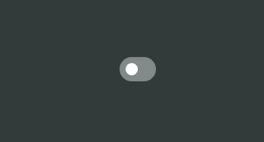
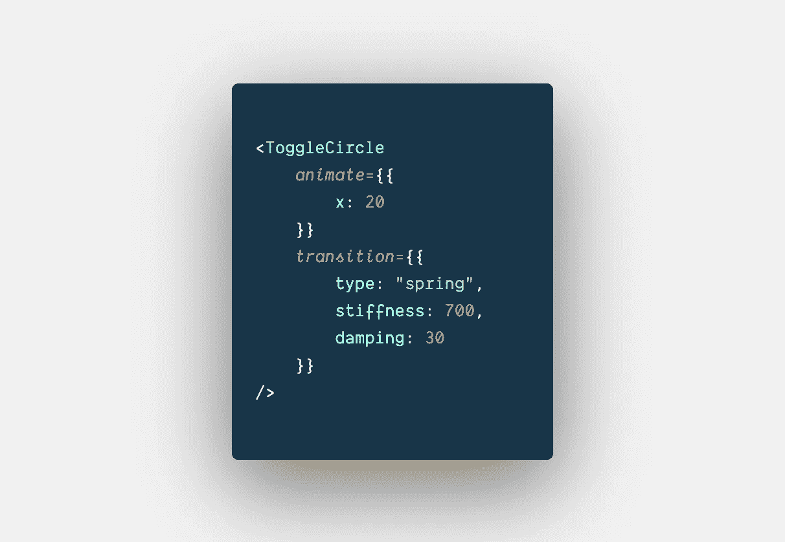
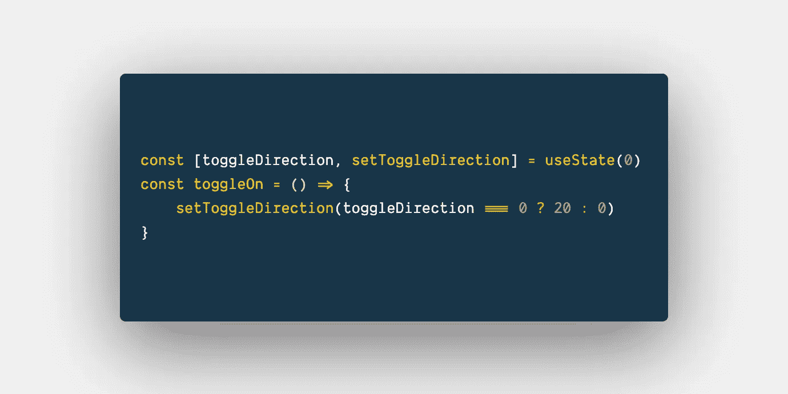
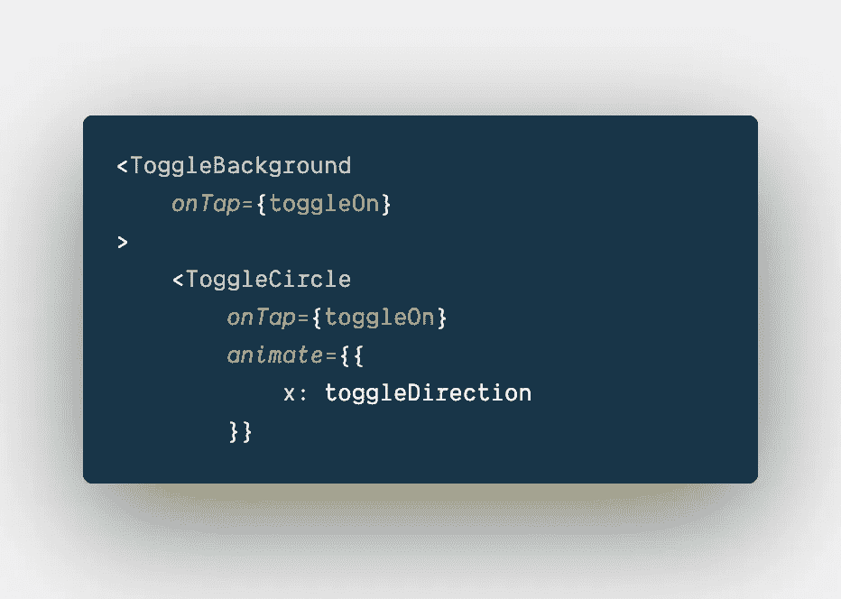
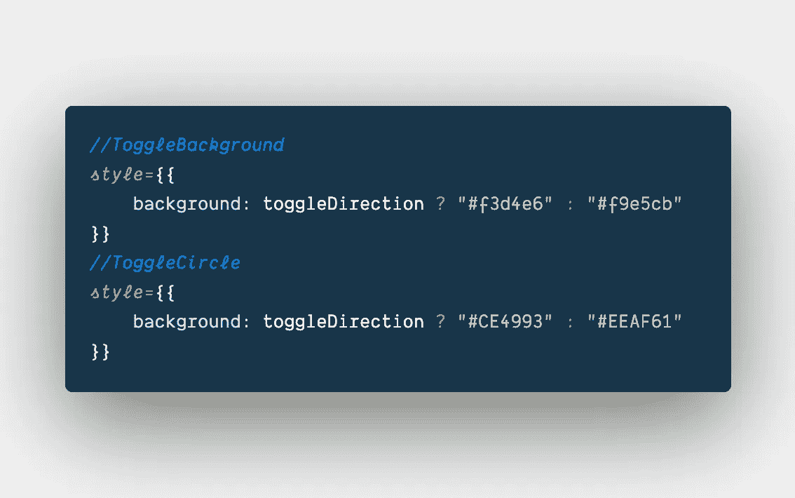

# 如何创建带有帧运动和反应的切换动画

> 原文：<https://javascript.plainenglish.io/how-to-create-a-toggle-animation-with-framer-motion-and-react-20ac3dae110f?source=collection_archive---------3----------------------->

## 一篇关于如何使用带 React 的帧运动创建自己的动画切换的文章。


Photo Owner: Steven Creates

# 内容

*   介绍
*   框架运动
*   入门+入门文件
*   手势
*   动画+过渡
*   onTap()
*   颜色过渡
*   解决办法

# 介绍

在这篇文章+指南中，我们将涵盖创建动画切换所需的所有必要步骤、知识和技术。这将包括从切换的一侧到另一侧的平滑过渡，甚至根据位置更新切换的颜色。

# 框架运动

让我们来谈谈帧运动和它是什么，帧运动提供了一个简单的 API，使过渡和动画简单而强大。因为它使事情变得如此简单，你可以用它做一些非凡的事情，真正把动画带到一个新的水平。

如果这是你第一次使用 Framer Motion，这不是必需的，但我建议先阅读我的文章“如何使用 Framer Motion with React”以了解更多的基础知识。*底部链接。*

# 入门指南

我们开始吧！首先，我们需要将依赖项安装到 React 项目中。

*Framer-Motion 要求您使用 React 版本* ***16.8*** *或更高版本。*

如果你想跟我一样，克隆我的启动文件。这包括没有任何动画的切换元素。

**起始文件:**

```
git clone [https://github.com/StevenCreates/framer-motion-toggle-starter-files.git](https://github.com/StevenCreates/framer-motion-toggle-starter-files.git)
```

启动文件会给你这个开关(见图片),它还没有起作用。这就是 Framer-Motion 和我给你的工具发挥作用的地方。



如果你没有使用我的启动文件，你需要用帧运动来设置你的 react 项目。但是，如果您正在使用我的 starter 文件，您现在可以移到本文的手势部分。

在 react 应用程序中运行以下命令来安装我们的成帧器运动依赖。

```
npm install --save framer-motion
```

安装完成后，您可以通过以下方式将 motion 导入到组件中:

```
import { motion } from “framer-motion"
```

我也将使用样式组件，使我的页面布局更漂亮。现在，这不是必需的，你可以很容易地在层叠样式表中添加 CSS。但是，如果您想拥有和我一样的代码，就继续将样式化的组件安装到您的项目中。

```
npm install --save styled-components
```

完善您的 React 项目现在已经拥有了编码和制作动画所需的一切。

# 手势

手势是用户与你的网页或应用程序互动的方式。手势的一个简单解释是，当用户在你的网页上，悬停在页面上的元素上时，你让你的代码在他们悬停在该元素上时做一些事情。比如改变背景颜色或者显示工具提示。

Framer Motion 与 Reacts 事件无缝协作，并支持一系列手势(悬停、点击、平移和拖动)。

我们将使用点击(单击)手势来激活我们的切换。当用户轻击(点击)我们的开关时，我们将捕获该事件并激活我们的开关。

# 动画+过渡

现在，我们可以创建一个从一边移动到另一边的开关，但是我们想要一个有活力的开关，带来一种体验。

我已经在我的其他文章中谈到了动画和过渡，但如果这是你的第一篇由我撰写的框架运动文章，让我们再次触及它。

## 动画片

动画是当你有一个元素被赋予生命，并以遵循物理定律的方式移动。

帧运动使动画简单，因为通过动画道具到您的 JSX 元素。一旦有了这些道具，framer motion 就会为你生成动画。

## 过渡

动画播放时会发生过渡。这真的可以成就或破坏你的动画。

如果您不喜欢来自 framer motion 的默认动画，您可以传递您的元素或 SVG 过渡道具并自定义它。

让我们添加一些到我们的切换中，让它以一种清晰的切换方式从左向右流动。



从 animate 开始，我要告诉它在 x 轴 20 上移动。

如果我们只添加 x 轴的动画，你可以看到它从左到右移动的速度。这并不是我们真正想要的动画。

为了解决这个问题，我们需要修改过渡，正如之前所说的，过渡是动画发生的时间。添加下面的代码，看看我们是如何把它变成现实的。

为了分解我们在转换中正在做的事情，让我们看一下我们正在传递的每个道具。

## 春天

在动画中加入刺激的物理和真实的运动。

Framer-Motion 将其动画默认为物理值，如`x`、`y`、`scale`和`rotate`。

## 僵硬

增加刚度会影响弹簧的运动，根据该值有多高，弹簧的运动会更加突然。
默认设置为 100。

## 阻尼

阻尼提供了对抗力的阻力或强度(实质上减慢了它的速度)。如果阻尼设置为 0，弹簧将无限振荡，帧运动将其默认设置为 10。

我强烈建议你把这些都弄乱，以全面了解正在发生的事情。也让它成为你自己的。

# onTap()

*onTap(event，info): void*

现在我们有了切换动画，问题是它在加载时是动画，当我们点击时没有任何变化。让我们用 Framer-Motions onTap() prop 解决这个问题。

当点击手势在元素上成功结束时，该属性提供回调。本质上与 onClick()是一样的。

要完成 onTap()并激活我们刚刚创建的切换，我们需要做一些事情。



首先，让我们使用 React 钩子 useState 来保存当前位置值。

然后让我们创建一个函数，当被调用时，它将位置值从 0 更新到 20，反之亦然。



现在，我们需要使用我们刚刚学习过的 onTap()属性，并将我们刚刚创建的 toggleOn()函数传递给<togglebackground>和<togglecircle>，这样做的原因是，我希望无论您在开关的哪个位置单击，它都会显示动画。</togglecircle></togglebackground>

最后但并非最不重要的是，我们现在需要改变我们的动画道具来使用新的使用状态值`toggleDirection`而不是我们之前传递的 20。

恭喜我们的切换现在正在激活 onTap/onClick！

# 颜色过渡

现在，这一步不是必需的，如果你对现在的切换方式满意，那就太棒了！但我想加入一点额外的天赋。

现在我们有了 toggleDirection 值，我们可以在切换的其他方面使用它。

我要用风格道具和三元来完成这个。



现在，当点击切换按钮时，根据切换方向，颜色会发生变化。

# 解决办法

这就是你的开关现在应该如何工作！


如果您错过了任何代码，这里是最终文件！编码朋友们快乐！

感谢阅读“如何创建带有成帧器运动和反应的切换动画”。

查看我关于框架运动的其他文章:

[](/how-to-create-a-scroll-progress-animation-with-framer-motion-and-react-b98754cd8638) [## 如何创建带有帧运动和反应的滚动进度动画

### 一篇关于如何使用带有 React 的帧运动创建自己的滚动进度动画的文章。

javascript.plainenglish.io](/how-to-create-a-scroll-progress-animation-with-framer-motion-and-react-b98754cd8638) [](/how-to-create-an-animated-countdown-timer-with-framer-motion-and-react-75035d13309c) [## 创建一个动画倒计时定时器与帧运动和反应

### 一个指南，建立自己的动画倒计时定时器与帧运动，反应，并使用倒计时钩。

javascript.plainenglish.io](/how-to-create-an-animated-countdown-timer-with-framer-motion-and-react-75035d13309c) [](/how-to-create-a-loading-spinner-with-framer-motion-and-react-70ee6d48b325) [## 如何创建带有成帧器运动和反应的加载微调器

### 创建仅具有帧运动和反应的加载微调器

javascript.plainenglish.io](/how-to-create-a-loading-spinner-with-framer-motion-and-react-70ee6d48b325) [](https://medium.com/@steven_creates/how-to-use-framer-motion-with-react-a2639b6b9b6b) [## 如何将帧运动与 React 一起使用

### 本系列指南+文章将介绍 React + Styled 中使用的成帧器运动的示例和概念…

medium.com](https://medium.com/@steven_creates/how-to-use-framer-motion-with-react-a2639b6b9b6b) 

再次感谢阅读！

*更多内容尽在*[***plain English . io***](http://plainenglish.io)