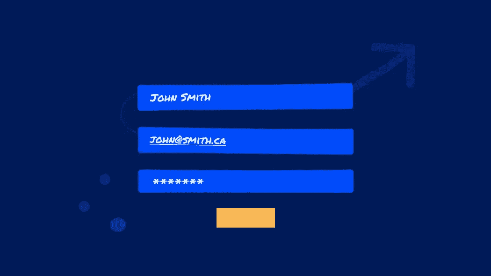
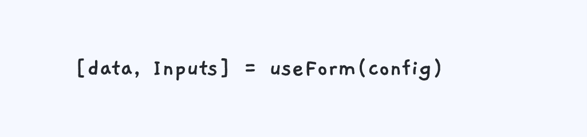
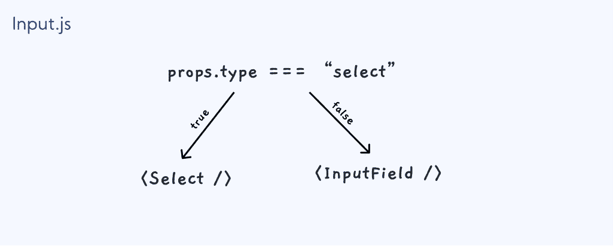
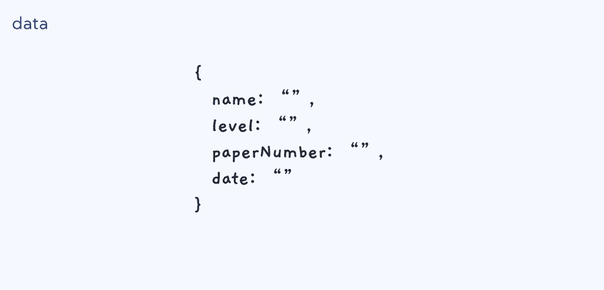
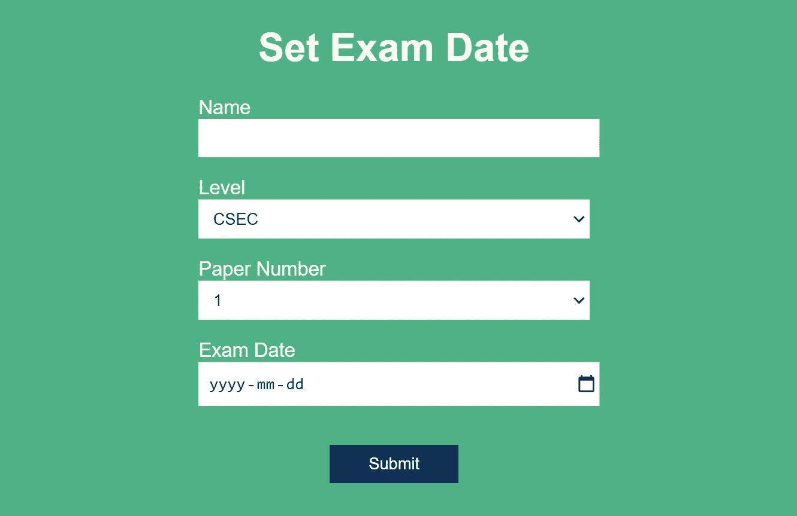

# 如何用 React 创建一个 useForm 钩子

> 原文：<https://javascript.plainenglish.io/how-to-create-a-useform-hook-with-react-bd183a54890e?source=collection_archive---------4----------------------->

## 彻底简化表单处理

作为一名前端开发人员，您知道使用表单可能有点令人头疼。在这篇文章中，我们将介绍如何创建一个钩子来简化应用程序中的表单处理。

我们将使用[控制的组件](https://reactjs.org/docs/forms.html)来管理表单状态，所以请随意复习一下。

# 目标

我们的目标是抽象出创建表单的重复部分。

钩子允许我们快速创建一个新的表单组件，方法是接受一个配置数组并免费提供给我们以下内容:

*   数据—包含用户输入数据的对象。
*   输入—预先设置事件处理的输入字段。

如果你想玩一个表单的例子，你可以[查看实时沙盒。](https://codesandbox.io/s/useform-example-ozoh6?file=/src/App.js)

# 目录

我们马上就要开始了，所以如果你在任何地方迷路了，我会列出一个路线图来帮助你。

*   创建配置阵列
*   创建新的输入组件
*   构建使用表单挂钩
*   使用形式(全钩)
*   用钩子做一个样板
*   需要改进的地方

# 创建配置阵列

要使用钩子，唯一需要的参数是配置数组——但是我们要配置什么呢？

表单只是由输入组成。因此，我们需要传递为每个输入字段设置属性所需的信息。

钩子应该给我们 4 个输入:

*   名称—文本字段
*   级别—选择菜单
*   纸张编号—选择菜单
*   日期—日期选择器

# 创建新的输入组件

原生的 [html 输入标签](https://www.w3schools.com/html/html_form_input_types.asp)允许我们选择不同的输入类型，比如:文本、数字、日期、时间等等。然而，如果你需要一个下拉菜单，你需要一个[选择标签](https://www.w3schools.com/tags/tag_select.asp)。

让我们制作新的`Input`组件，它可以根据给定的 props 类型呈现输入或选择。

## 选择并输入字段组件

新的 Input 组件应该呈现 HTML input 元素，并且已经有了事件处理和其他属性。为此，我们将读入属性作为道具，并将它们放在 Select 和 InputField 组件的输入元素上。

`Select`组件非常相似，但是它将接受一个下拉菜单选项数组，并创建一个选项元素列表。

# 构建使用表单挂钩

## 初始化数据

我们需要做的第一件事是使用 useState 钩子初始化我们的数据对象。

*   创建空对象 initialData
*   遍历配置数组中的每个输入，并根据输入名将空字符串分配给一个新的键

初始数据对象应该是这样的:

## 更新密钥更改的数据

该功能将传递给每个`Input`。它根据输入名称更新存储在数据中的值。

## 创建输入

现在我们映射 config 数组中的输入配置，并将它们与 handleChange 函数和值一起应用到`Input`。

# 使用形式

完整的情况如下:

# 用钩子做一个样板

使用钩子非常简单，你需要做的就是插入你的配置数组。

然后，您可以在表单元素中放置输入。最后，您可以通过使用数据对象将信息发送到任何您想要的地方——我将在提交时简单地将它记录到控制台。

您可以根据需要更改 handleSubmit。还有很大的改进空间，比如添加表单验证等等——但我希望这足以让您入门:)

嗨，感谢阅读！我是一名前端开发人员，在加拿大攻读 GATech 的计算机科学硕士学位。

请随时在 LinkedIn #ONO 上与我联系

 [## 约万·梅德福德—佐治亚理工学院—加拿大| LinkedIn

### 我喜欢设计和制造漂亮的产品，用起来是一种享受。作为一名设计师，我可以为现代和…

www.linkedin.com](https://www.linkedin.com/in/jovanmedfordwebdev/) 

资源

*   [https://academind . com/tutorials/react js-a-custom-use form-hook](https://academind.com/tutorials/reactjs-a-custom-useform-hook)
*   [https://dev . to/seven zark/why-you-should-writing-react-Custom-hooks-5egl #:~:text = Custom % 20 hooks % 20 are % 20a % 20 handy，a % 20 super % 2d powered % 20 helper % 20 function](https://dev.to/sevenzark/why-you-should-be-writing-react-custom-hooks-5egl#:~:text=Custom%20hooks%20are%20a%20handy,a%20super%2Dpowered%20helper%20function)。
*   [https://reactjs.org/docs/forms.html](https://reactjs.org/docs/forms.html)

*更多内容请看*[***plain English . io***](http://plainenglish.io/)