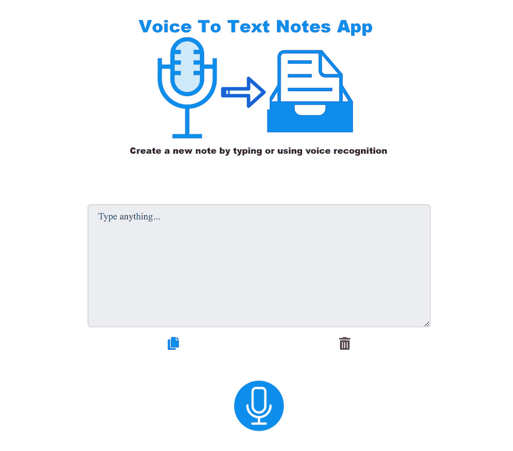

# 如何创建一个简单的语音转文本应用程序

> 原文：<https://javascript.plainenglish.io/how-to-create-a-voice-to-text-application-2cb12e6b50fd?source=collection_archive---------15----------------------->

Photo by [Maxwell Nelson](https://unsplash.com/@maxcodes?utm_source=unsplash&utm_medium=referral&utm_content=creditCopyText) on [Unsplash](https://unsplash.com/s/photos/code-mic?utm_source=unsplash&utm_medium=referral&utm_content=creditCopyText)

我们生活在一个非常忙碌的世界，多任务处理是一天的命令。你有没有发现自己在手机上做笔记的同时还在进行一些其他的随机活动？很累吧？是的，它是！嗯，感谢网络提供了一个功能，让我们可以读出单词/句子，而我们的设备为我们做笔记。

在本文中，我们将了解 **SpeechRecognition Web API** ，这是 **Web 语音 API** 的另一个组件，用于将**的语音转换为文本**，然后构建一个简单的 Web 应用程序，将我们的单词/句子转换为文本格式。

根据[维基百科对 API 的定义](https://en.wikipedia.org/wiki/Application_programming_interface):*“API(应用编程接口)是定义多个软件应用之间交互的接口。它定义了可以发出的请求的种类、如何发出请求、应该使用的数据格式、应该遵循的约定等等。它还可以提供扩展机制，以便用户能够以各种方式扩展现有的功能。”*

不同类型的 API 有**开放 API**、**内部 API**、**伙伴 API**、**复合 API**、 **RESTFUL** 、 **JSON-RPC** 、 **XML** -RPC、 **SOAP** 。

*Web API 经常使用基于机器的交互比如****REST****和****SOAP****。*

在本文中，我们主要关注的是 **Web 语音 API** ，它属于**Web/浏览器 API** ，而其他 API 将在另一篇文章中详细讨论。

# 什么是 Web/浏览器 API？

**浏览器 API**(或 web**API**)是内置在**浏览器**中的**API**。他们能够从浏览器和周围的计算机环境中公开数据，这有助于开发人员执行复杂的操作。有了这些 API，我们可以构建利用通知、振动等本地特性的应用程序。你可以在这里获得更多信息

# 网络语音 API

根据 [*MDN*](https://developer.mozilla.org/en-US/docs/Web/API/Web_Speech_API) *，****Web 语音 API 是一个** web api 使您能够将语音数据合并到 Web 应用程序中。Web 语音 API 有两个部分:**语音合成(文本到语音)**和**语音识别(异步语音识别)。)***

*在这篇文章中，我们将看看**语音识别(语音转文本)**的强大功能以及如何使用它。*

# *演讲人识别*

*根据 [*MDN*](https://developer.mozilla.org/en-US/docs/Web/API/SpeechSynthesis) ，`**SpeechRecognition**`是识别服务的控制器接口；这可用于检索有关设备上可用的合成语音、开始和暂停语音以及其他命令的信息。这仍然是一个实验性的技术，在撰写本文时，还没有完全稳定。*

***属性** *继承自其父接口，EventTarget:**

*`[**SpeechRecognition.grammars**](https://developer.mozilla.org/en-US/docs/Web/API/SpeechRecognition/grammars)`该属性返回并设置一组`[SpeechGrammar](https://developer.mozilla.org/en-US/docs/Web/API/SpeechGrammar)`对象，这些对象代表当前`SpeechRecognition`将理解的语法。*

*`[**SpeechRecognition.lang**](https://developer.mozilla.org/en-US/docs/Web/API/SpeechRecognition/lang)`该属性返回并设置当前`SpeechRecognition`的语言。如果没有指定，默认为 HTML `[lang](https://developer.mozilla.org/en-US/docs/Web/HTML/Element/html#attr-lang)`属性值，或者用户代理的语言设置(如果没有设置的话)。*

*`[**SpeechRecognition.continuous**](https://developer.mozilla.org/en-US/docs/Web/API/SpeechRecognition/continuous)`用于控制每次识别是返回连续结果还是只返回一个结果。默认为单个(`false`)。)*

*`[**SpeechRecognition.interimResults**](https://developer.mozilla.org/en-US/docs/Web/API/SpeechRecognition/interimResults)`这控制是否应该返回中期结果(`true`)或不返回(`false`)。)中间结果是尚未最终确定的结果(例如，`[SpeechRecognitionResult.isFinal](https://developer.mozilla.org/en-US/docs/Web/API/SpeechRecognitionResult/isFinal)`属性是`false`)。)*

*`[**SpeechRecognition.maxAlternatives**](https://developer.mozilla.org/en-US/docs/Web/API/SpeechRecognition/maxAlternatives)`该属性设置每个结果提供的`[SpeechRecognitionAlternative](https://developer.mozilla.org/en-US/docs/Web/API/SpeechRecognitionAlternative)`的最大数量。默认值为 1。*

*`[**SpeechRecognition.serviceURI**](https://developer.mozilla.org/en-US/docs/Web/API/SpeechRecognition/serviceURI)`指定当前`SpeechRecognition`用来处理实际识别的语音识别服务的位置。默认值是用户代理的默认语音服务。*

***方法** *继承自其父接口，* `[*EventTarget*](https://developer.mozilla.org/en-US/docs/Web/API/EventTarget)` *:**

*`[**SpeechRecognition.abort()**](https://developer.mozilla.org/en-US/docs/Web/API/SpeechRecognition/abort)`停止语音识别服务侦听传入的音频，并且不尝试返回`[SpeechRecognitionResult](https://developer.mozilla.org/en-US/docs/Web/API/SpeechRecognitionResult)`。*

*`[**SpeechRecognition.start()**](https://developer.mozilla.org/en-US/docs/Web/API/SpeechRecognition/start)`启动语音识别服务，监听输入音频，以识别与当前`SpeechRecognition`相关的语法。*

*`[**SpeechRecognition.stop()**](https://developer.mozilla.org/en-US/docs/Web/API/SpeechRecognition/stop)`停止语音识别服务侦听输入的音频，并尝试使用目前捕获的音频返回一个`[SpeechRecognitionResult](https://developer.mozilla.org/en-US/docs/Web/API/SpeechRecognitionResult)`。*

**现在是时候构建我们简单的文本到语音转换应用程序了。**

*演示链接:[https://nonsodaniel.github.io/voice-to-speech/](https://nonsodaniel.github.io/voice-to-speech/)*

**

*Our complete Voice-to-Text application*

## ****第一步****

*创建一个文件夹，在文件夹中，创建一个 index.html 文件，并将下面的代码粘贴到其中。下面的代码片段包含用于构建应用程序布局的 HTML 代码**和一些用于设计应用程序样式的 CSS 样式。我还嵌入了一个到 **app.js** 的链接，这是我们的 JavaScript 文件。***

## *■T21**TEP 2***

*创建一个 JavaScript 文件 **main.js** 并将下面的代码粘贴到其中。*

*在上面的代码中，我们声明了表示 HTML 元素的变量，我们用它们来触发应用程序中的各种事件监听器。*

## *■第三步*

*在 **app.js** 文件中，复制并粘贴下面的代码*

*上面的代码包含负责识别我们声音的`SpeechRecognition`对象，以及包含可用语法列表的`SpeechGrammarList`。*

*Chrome 目前支持带有前缀属性的语音识别，因此，我们包括了`webkitSpeechRecognition`和`webkitSpeechGrammarList.`，我们还有`grammar`变量，它定义了我们希望我们的应用程序识别的语法。*

*`recognition`定义了一个`SpeechRecognition`实例来控制我们的应用程序的识别。最后，我们将使用`[SpeechGrammarList()](https://developer.mozilla.org/en-US/docs/Web/API/SpeechGrammarList/SpeechGrammarList)`构造函数创建一个新的语音语法列表来包含我们的语法。*

## *S ***tep 4****

*在 **app.js** 文件中，复制并粘贴以下代码*

*在上面的代码中，我们使用`[SpeechGrammarList.addFromString()](https://developer.mozilla.org/en-US/docs/Web/API/SpeechGrammarList/addFromString)`方法将`grammar`添加到列表中。它接受我们要添加的字符串作为参数，并可选地加上一个权重值，该值指定该语法相对于列表中其他可用语法的重要性(可以从 0 到 1，包括 0 和 1)。).添加的语法作为一个`[SpeechGrammar](https://developer.mozilla.org/en-US/docs/Web/API/SpeechGrammar)`对象实例出现在列表中。*

*我们还向`recognition`对象属性添加了一些值。`onresult`一旦收到成功的结果，就触发事件，这仅仅意味着用户开始说话。*

*在这一阶段，我们获得包含语音结果的数组，然后提取文本格式的语音结果，即我们的笔记/消息。当这个过程中出现错误时，触发`onerror`事件。*

## *■第五步**第二十二步第二十四步】***

*在 **app.js** 文件中，复制并粘贴以下代码:*

*上面的代码包含两个函数:`copyPasteText`，当用户想要复制笔记/消息的内容时，会调用这个函数。这可以通过单击复制图标来完成。*

*`clearNote`功能主要是重新加载页面，重新设置`onresult`事件处理程序中的语音结果。但是，这在生产环境中并不是一种明智的做法。*

## *■第六步*

*在 **app.js** 文件中，复制并粘贴以下代码:*

*最后，上面的代码包含当用户决定开始说话时触发的事件监听器，以文本格式复制转换后的声音，并清除可用的注释。*

*完整的 index.html 代码在上面(*步骤 1* )，而完整的 **app.js** 代码应该是这样的:*

*我们做到了！我们刚刚创建了一个简单的语音到文本应用程序，使用户能够大声说话，并在他们的设备上将他们所说的话转换为笔记/消息。*

# *结论*

*在本文中，我们已经了解了`SpeechRecognition` Web Speech API 以及如何利用它来构建我们想要的应用程序。请随意使用它，并构建比我们目前拥有的更好的东西。还有很重要的一点要注意，t **his 是一个** [**实验技术**](https://developer.mozilla.org/en-US/docs/MDN/Guidelines/Conventions_definitions#experimental)
在生产中使用这个之前可以仔细查看[浏览器兼容性表](https://developer.mozilla.org/en-US/docs/Web/API/SpeechRecognition#browser_compatibility)。*

# *相关主题*

*   *[了解浏览器 API](https://nonsodaniel.medium.com/understanding-browser-apis-83a570a62840)*
*   *[如何创建简单的文本到语音转换应用](https://nonsodaniel.medium.com/how-to-create-a-simple-text-to-speech-web-application-2a8fdb9ccbcc)*

# *进一步的解释/参考*

*   *[网络语音 API](https://developer.mozilla.org/en-US/docs/Web/API/Web_Speech_API) ，“Mozilla 开发者网络*
*   *[“speech recognition”Mozilla 开发者网络](https://developer.mozilla.org/en-US/docs/Web/API/SpeechRecognition)*
*   *[网络语音 API 规范:编辑稿](https://dvcs.w3.org/hg/speech-api/raw-file/tip/webspeechapi.html)，“W3C*

**更多内容请看*[***plain English . io***](http://plainenglish.io)*