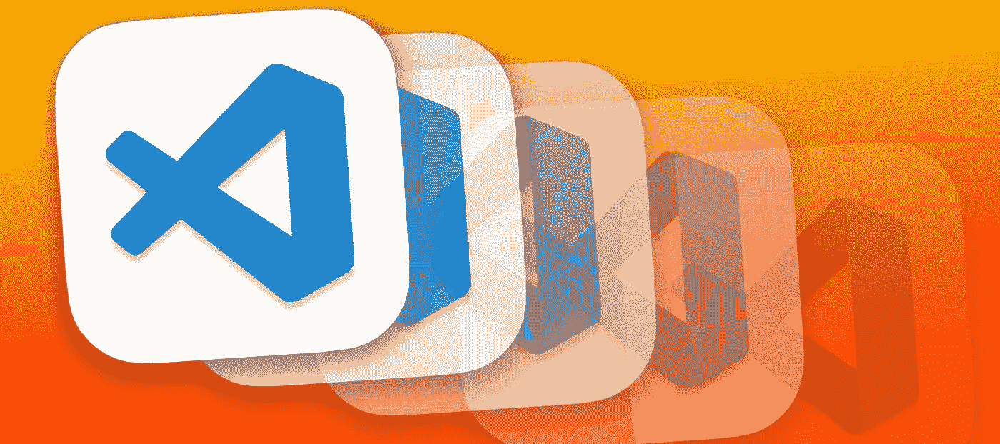

# 如何用 JavaScript 创建 VSCode 扩展

> 原文：<https://javascript.plainenglish.io/how-to-create-a-vscode-extension-with-javascript-4e466c58274e?source=collection_archive---------18----------------------->

Visual Studio 代码使通过您自己的扩展添加功能变得很容易！



Photo Illustration by David Fekke

*最初发布于*[*https://fek . io*](https://fek.io/blog/how-to-create-a-vs-code-extension-with-java-script/)*。*

我最近写了关于使用 [Node.js](https://nodejs.org) 创建自己的工具。现在有很多基于 Node.js 的应用程序，您可以使用 JavaScript 对其进行扩展。其中一个应用程序就是我写这篇文章时正在使用的 Visual Studio 代码。

# VS 代码

如果你不熟悉 Visual Studio Code，简称 VSCode，那就是微软的开源代码编辑器。它用于许多不同类型的应用程序开发，从 C++到 Salesforce。从一开始，VSCode 就是可扩展的。换句话说，您可以通过扩展非常容易地向它添加功能。这些扩展是用 JavaScript 编写的。

VSCode 代码构建在 [Electron](https://www.electronjs.org/) 之上，后者是 GitHub 基于 Chromium 和 Node.js 的框架，创建 Electron 是为了让 web 开发人员更容易地创建桌面应用程序。Web 开发人员可以使用他们现有的技能来创建基于 HTML、CSS 和 JavaScript 等 web 技术的应用程序。这些电子应用程序可以在 Windows、MacOS 和 Linux 上跨平台运行。

# 创建插件

几年前，我创建了一个用于生成新博客帖子的命令行工具，名为“blogpostgenerator”。你可以在 NPM 上找到它。该工具创建一个以当前日期命名的文件夹，然后创建一个带有一些元数据的 frontmatter 的 markdown 文件。

微软有关于如何为 VSCode 创建扩展的很好的文档，但是我正在考虑创建一个扩展，它可能需要用户输入一些我试图创建的文件名。下面是我如何创建我的扩展。

您可以使用 [Yoeman](https://yeoman.io/) 和一个名为“generator-code”的 VSCode 生成器创建一个 hello world 扩展。

```
npm install -g yo generator-code 
yo code
```

运行这个程序时，我选择了 JavaScript 而不是 TypeScript。如果要添加模块，您需要添加一个捆绑器，如 esbuild 或 webpack。如果您使用 TypeScript 选项，它将为您提供一个与 webpack 一起安装的选项。

这将生成一个新的扩展项目。这个新搭建的扩展可以在 Visual Studio 代码中打开和调试。

```
code .
```

您将在项目中看到许多文件，包括“extension.js”、“jsconfig.json”和 package.json 文件。打开“extension.js”文件。

`activate`函数是扩展的主要入口点。它用`vscode.commands.registerCommand`功能登记一个命令。该命令对应于 package.json 文件中“contributes”键中列出的命令。

我们可以通过按 F5 键在 VSCode 中运行并测试它，这将启动一个扩展主机。然后，我们可以在 MacOS 上按下“command-shift-P ”,或者在 Windows 或 Linux 上按下“control-shift-P”。这将向用户提示命令面板。在这里我们可以输入`Hello World`。这将显示信息框，其中包含来自我们命令的消息。

让我们修改它来创建一个可以用来添加到我们的博客的降价文件。

将以下要求添加到我们文件的开头，在带有`const vscode = require('vscode')`的行下面。完成后，它应该是这样的。

“path”和“fs”模块免费包含在 VSCode 中，但我们需要将“lodash”安装到我们的开发依赖项中。我们可以在与我们的项目相同的路径中的命令行中这样做。

```
npm install lodash --save-dev
```

这将把‘lodash’添加到‘package . JSON’文件的‘dev dependencies’部分，并把实际的模块添加到‘node _ modules’文件夹。这里需要注意的重要一点是，在打包和发布我们实际的扩展时,' node_modules '文件夹将被排除在外。我们将需要添加一个捆绑器，以确保我们需要的来自 lodash 的功能包含在我们最终的扩展中。在这篇文章的最后，我们将详细介绍如何添加和配置捆绑器。

现在，让我们将以下函数添加到我们的“extension.js”文件的末尾。

这里的第一个函数“startInputProcess”实际上会提示用户给他们的文章指定一个标题。一旦标题被捕获，它调用“createMarkdownFolder”函数，这将为我们的内容和 markdown 文件创建子目录。文件夹名称将基于当前日期，我们使用两个函数' getDateString '和' addLeadingZeros '来创建文件夹名称。最后一个函数“createMarkdownFile”将在我们刚刚创建的文件夹中创建 markdown 文件。

现在让我们改变“activate(context)”函数，以便它使用我们添加到“extension.js”文件中的代码。

这个扩展还使用一个我们可以分配给它的设置，最终用户可以修改这个设置。我们需要修改 package.json 文件来添加这些设置选项。我们可以通过在“package.json”的“contributes”部分添加一个“configuration”键来做到这一点。

这将添加一个可以在我们的代码中查找的设置。在这里，我们将它默认为“src ”,但是用户可以将其更改为他们希望的项目下的任何路径。

# 捆绑我们的扩展

我之前提到过，因为我们使用外部模块‘lodash ’,所以我们需要捆绑这个扩展。无论如何，捆绑您的扩展是一个好习惯。我们将使用“esbuild”来捆绑我们的扩展。让我们再次进入项目的命令行，添加以下模块。

```
npm i --save-dev esbuild
```

我们需要将以下脚本属性添加到“package.json”文件的“scripts”部分。

我们还需要更改“main”属性，使其指向‘out’子目录中的‘main . js’文件。

```
"main": "./out/main.js"
```

现在，我们可以在命令行中使用下面的 npm 脚本来捆绑我们的扩展。

```
npm run esbuild
```

# 包装我们的扩展

将我们的扩展打包供本地使用或发布到他们的市场需要添加和使用“vsce”命令行工具，并在 Azure DevOps 上注册为一个组织。我们先安装‘vsce’吧。

```
npm i -g vsce
```

如果你在 Azure DevOps 上没有组织，你可以按照这里的中的[说明来做。创建组织后，您将需要创建个人访问令牌。创建该令牌时，它需要具有以下详细信息。](https://docs.microsoft.com/en-us/azure/devops/organizations/accounts/create-organization?view=azure-devops)

*   指定一个名字
*   确保所有组织都可以访问该组织
*   将范围设置为“自定义”，并确保分配市场>管理范围

创建个人访问令牌后，请将它复制到一个安全的地方，因为在使用“vsce”命令行工具登录时会用到它。

现在您有了公共访问令牌，我们可以登录并使用“vsce”打包我们的扩展。

```
vsce login <YourOrgName>
```

它将提示您输入个人访问令牌。成功登录“vsce”后，您可以使用以下命令打包您的扩展。

```
vsce package
```

这将创建一个. vsix 文件。通过输入以下命令，可以共享该文件并将其本地安装到 VSCode。

```
code --install-extension <yourExtensionName>-0.0.1.vsix
```

# 结论

VSCode 的一个奇妙之处是我们可以使用 JavaScript 和 TypeScript 来扩展它。这使得创建我们自己的开发工具作为发布扩展变得非常容易。感谢微软为开发者赞助了这么棒的工具！

[](https://code.visualstudio.com/api/get-started/your-first-extension) [## 你的第一次延期

### 在这个主题中，我们将教你构建扩展的基本概念。确保你有 Node.js 和 Git…

code.visualstudio.com](https://code.visualstudio.com/api/get-started/your-first-extension) [](https://code.visualstudio.com/api/working-with-extensions/bundling-extension) [## 捆绑扩展

### 将 Visual Studio 代码扩展(插件)与 webpack 绑定。

code.visualstudio.com](https://code.visualstudio.com/api/working-with-extensions/bundling-extension) [](https://code.visualstudio.com/api/working-with-extensions/publishing-extension) [## 发布扩展

### 一旦你完成了一个高质量的扩展，你可以把它发布到 VS 代码扩展市场，这样其他人就可以…

code.visualstudio.com](https://code.visualstudio.com/api/working-with-extensions/publishing-extension) 

*更多内容尽在*[plain English . io](http://plainenglish.io/)