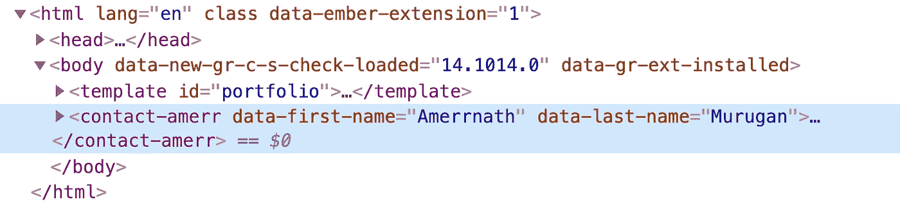
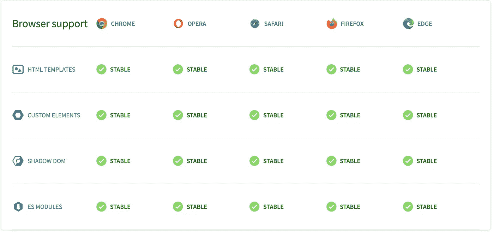
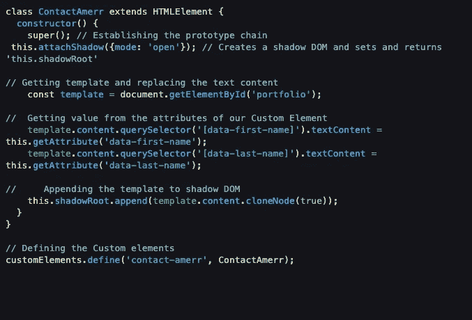

# 如何使用单个标签创建网站

> 原文：<https://javascript.plainenglish.io/how-to-create-a-website-using-a-single-tag-a29dd31d77ee?source=collection_archive---------13----------------------->

## 由网络组件支持的网络应用的未来

Photo by [Viva Luna Studios](https://unsplash.com/@vivalunastudios?utm_source=medium&utm_medium=referral) on [Unsplash](https://unsplash.com?utm_source=medium&utm_medium=referral)

是的，我知道这听起来好得难以置信，如果你认为这是关于[**【YAFS】**](https://medium.com/tastejs-blog/yet-another-framework-syndrome-yafs-cf5f694ee070)**或库的，不，这纯粹是使用**标准** ( *它被强调是有原因的，阅读整篇文章* ) HTML 和 JavaScript。**

**如果你不相信我，看看我的钢笔:**

**使用开发人员工具检查页面并检查 **DOM 树。****

****

**所以，现在你可能像个孩子一样想知道如何破解这个魔术。我将列出所有可能的实现方式。**

**花点时间想想(🤔)关于它，如果您的大脑想到框架、组件、W3C 提案、自定义元素等术语，那么您就已经知道了这个魔术。是的，它是使用 **Web 组件**完成的(如果您想知道这是什么[疯狂的东西](https://www.urbandictionary.com/define.php?term=batshit%20crazy))。**

# **网络组件**

> **W eb 组件是一组 web 平台 API，允许您创建新的定制的、可重用的、封装的 HTML 标签，以在网页和 web 应用程序中使用。自定义组件和小部件建立在 Web 组件标准的基础上，将在现代浏览器中工作，并且可以与任何使用 HTML 的 JavaScript 库或框架一起使用。(来源:[https://www.webcomponents.org/introduction](https://www.webcomponents.org/introduction))**

**这个概念是封装一个功能设计，以便多次呈现自定义用户界面。这些为框架(Angular、reactor、Vuejs 等)及其流行的子组件**和**的发展奠定了基础，但是现在它们可以在所有使用 HTML 的流行浏览器中使用，而不依赖于第三方库。**

****

**[https://www.webcomponents.org/](https://www.webcomponents.org/)**

**在我们深入研究如何创建您自己的 Web 组件之前，先了解这三个主题**

*   **自定义元素: *JavaScript API，用于定义自定义元素及其行为。***
*   **影子 DOM: *定义您的风格，独立于主文档 DOM***
*   **HTML 模板:*可重用的 HTML 模板，可在创建自定义元素时使用。***

**我不打算对这个话题进行深入的解释(这篇文章中不会)。结账 [MDN](https://developer.mozilla.org/en-US/docs/Web/Web_Components) )**

**让我们基于以上三个概念来分解我的代码[https://codepen.io/amerr/pen/qBZVNZr](https://codepen.io/amerr/pen/qBZVNZr)**

****

*   **我的类`ContactAmerr`将用于定义我的自定义元素的行为**
*   **`this.attachShadow({mode: 'open'})`将我的自定义元素附加到 **shadowDOM** 和`open` [选项](https://developer.mozilla.org/en-US/docs/Web/API/Element/attachShadow#parameters)以使用`element.shadowRoot`访问 shadowDOM**
*   **剩下的代码使用来自 DOM 的**模板**，并用来自定制元素属性的值替换文本内容。您可以想象这类似于通过 props 将数据发送到框架组件以及在组件模板中呈现这些值的方式。**
*   **最后一步是使用[**CustomElementRegistry**](https://developer.mozilla.org/en-US/docs/Web/API/CustomElementRegistry)**`define`方法注册您的**自定义元素**，该方法可通过`window.customElements`获得。Define 方法需要自定义元素的名称(确保名称用连字符连接)****

****按照上面的步骤🪄尤里卡，你已经创建了自己的 Web 组件。****

****现在，您可以在文档的任何地方使用该组件****

****`<contact-amerr data-first-name="Elon" data-last-name="Musk" />`****

> *****注意:如果模板代码中的 CSS & HTML 对你来说太难理解，忽略它，这只是为了让这个演示更有趣。在大多数情况下，web 组件是简单的，如果它变得复杂就拆分成多个 web 组件。*****

****我希望这篇文章能让您对 Web 组件有所了解。我也建议你看看这个视频****

****Web components powering the web****

****这些框架****

**** [## 蜡纸

### 神奇的、可重用的 web 组件编译器。几秒钟内开始构建。通过有意设计的小工具、小 API…

stenciljs.com](http://stenciljs.com/)  [## 苗条的

### Svelte 是构建用户界面的一种全新方法。而像 React 和 Vue 这样的传统框架…

苗条的人](https://svelte.dev/) 

谢谢你。如果我做错了，请批评。我很乐意纠正它。

*更多内容请看*[***plain English . io***](http://plainenglish.io/)****