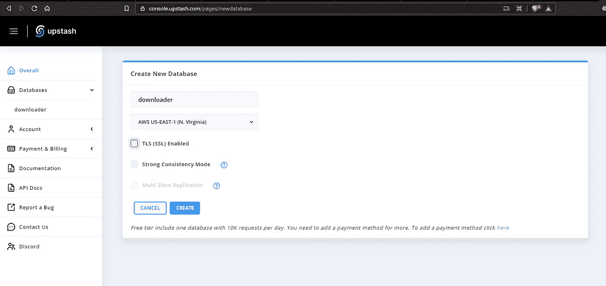
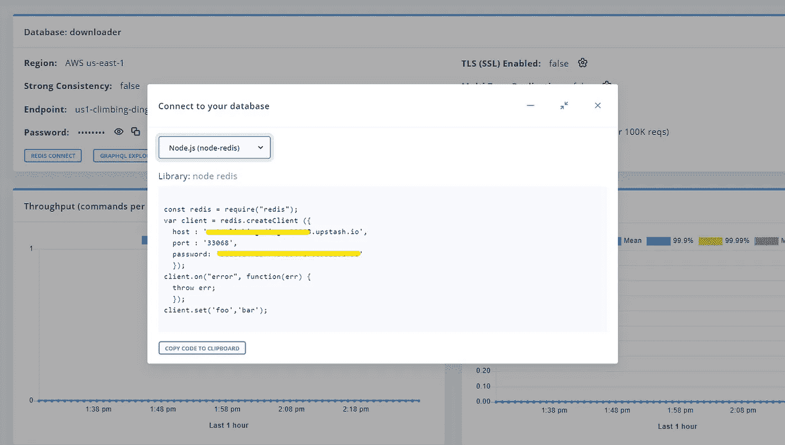
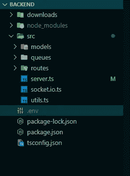
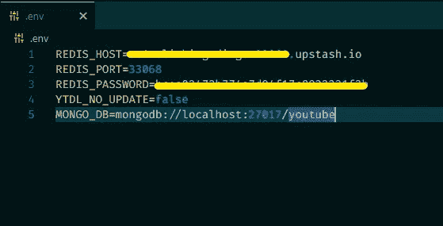
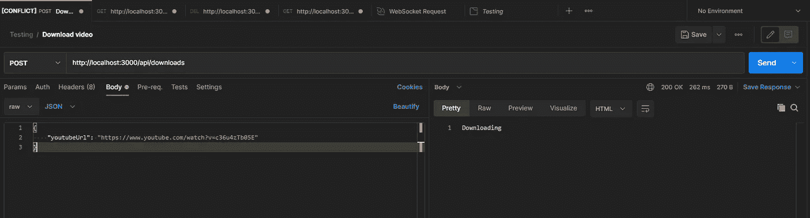
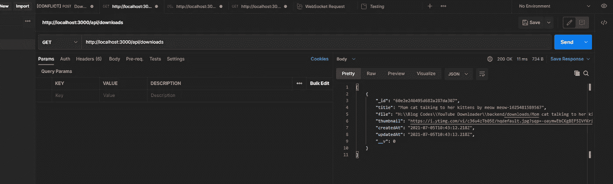
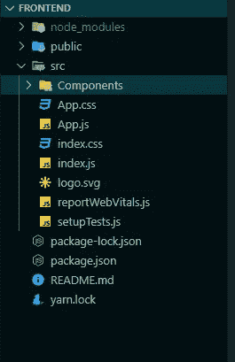
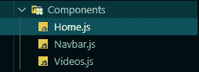
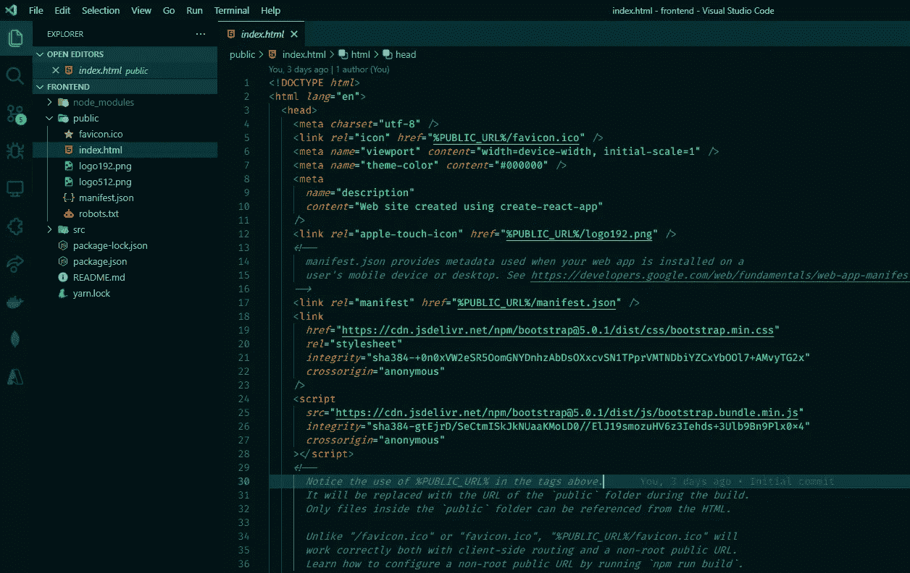
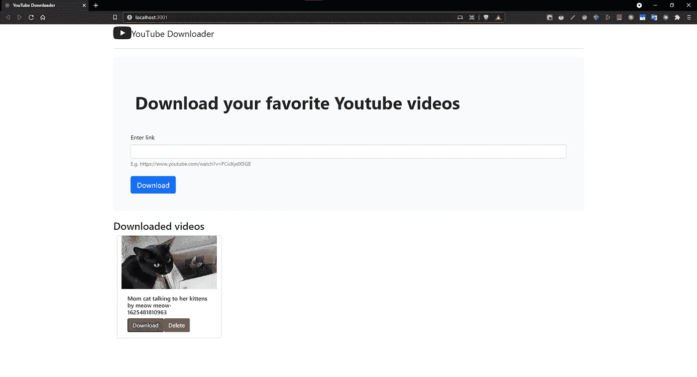

# 如何用 Node.js 和 React.js 创建 YouTube 下载器

> 原文：<https://javascript.plainenglish.io/how-to-create-a-youtube-downloader-with-node-js-and-react-a86d7586fcc8?source=collection_archive---------1----------------------->

在本教程中，我们将构建一个 YouTube 下载器，后端在 Express 中实现，前端在 React 中实现。


Photo by [Szabo Viktor](https://unsplash.com/@vmxhu?utm_source=medium&utm_medium=referral) on [Unsplash](https://unsplash.com?utm_source=medium&utm_medium=referral)

**app 的基本流程:**

1.  用户将提供一个 YouTube 视频链接
2.  后端服务器将在队列中推送该视频链接以处理下载
3.  当作业从队列中弹出进行处理时，后端为客户机发出事件
4.  客户端监听事件并显示适当的消息
5.  用户可以从服务器上下载视频

我们将使用 [Socket.io](https://socket.io/) 进行发射事件和处理作业，我们将使用 [Bull](https://github.com/OptimalBits/bull) 包。

# 我们开始吧

在本地机器上安装所需的软件和软件包

**软件要求:**

1.  [Node.js](https://nodejs.org/en/) — Node.js 是基于 [Chrome 的 V8 JavaScript 引擎](https://v8.dev/)构建的 JavaScript 运行时。
2.  [Postman](https://www.postman.com/) —一个 API 开发的协作平台。

**所需包:**

后端软件包:

```
npm i typescript express mongoose cors express-validator mongoose morgan socket.io ytdl-core bull dotenv
```

前端包:

```
npm i axios js-file-download socket.io-client
```

# **设置后端**

我们将使用`MongoDB`数据库，所以请确保您将它安装在本地，或者您可以使用 MongoDB 的免费[云](https://www.mongodb.com/cloud/atlas)服务。

用 Upstash 设置 Redis 数据库:

是 Redis 的一个无服务器数据库。对于服务器/实例，您通常按小时或固定价格付费。使用无服务器，你按请求付费。

这意味着当数据库没有被使用时，你是免费的。Upstash 为您配置和管理数据库。

首先在 [**上创建一个账户，抢在**](https://upstash.com/) **之前。**

现在设置 Redis 数据库实例



Create new database



Connect to your database

让我们初始化基于 TypeScript 的 Node.js 项目:

```
tsc --initthen donpm init -y
```



Root Directory Structure

不要忘记添加`.env`文件及其内容。



.env file

如上图所示，在项目的根目录下创建一个新的`src`目录。

创建一个简单的服务器并连接到本地或远程 MongoDB 数据库:

现在让我们创建一个`socket`的单例实例

现在，为存储视频元数据创建一个 mongoose 模型，这个文件将驻留在`src/models`中。

**REST API**

```
REST APIs Routes
1\. GET => /api/donwloads => Get all downloads
2\. GET => /api/donwloads/:id => Get a single download
3\. POST => /api/downloads => Push new download
4\. DELETE => /api/downloads/:id => Remove a single download
5\. GET => /api/downloads/:id/downloadfile => Download a single file
```

让我们为 API 实现控制器和路由，

现在最重要的任务来了，

本节将使用 Bull 队列实现一个下载队列。

但是，每个队列实例都需要新的 Redis 连接，

该队列将逐一处理所有下载。

在每个作业过程中，我们为客户端发出事件，

每当用户试图下载视频时，我们首先推送该作业，即`download queue`中的链接。

然后我们请求 Socket.io 实例和视频的元数据，如`title`和`thumbnail`。

```
*//Get existing instance* const socket **=** SocketInit**.**getInstance();const info **=** **await** ytdl**.**getBasicInfo(youtubeUrl);const thumbnail **=** info**.***videoDetails***.***thumbnails*[0]**.***url*;
```

使用`ytdl`包，我们开始下载文件，并将其存储在项目根目录下的一个名为`downloads`的目录中。

当下载开始时，我们发送带有标题的事件`VIDEO_STARTED`作为数据。

当下载完成时，我们发送事件`VIDEO_DOWNLOADED`。

当下载由于私人视频或版权内容等原因失败时，我们会发送事件`VIDEO_ERROR`。

现在在控制器中导入这个队列模块，我们还在请求体上添加了一些验证。

A final code for all routes and controllers

最后，我们可以在`server.ts`文件中添加这个控制器，

最后，修改`package.json`中的脚本:

```
"scripts": {   
   "start": "ts-node src/server.ts",
   "dev": "ts-node-dev src/server.ts"
}
```

现在测试邮递员:

`POST => /api/downloads`



Push new download

`GET => /api/downloads`



Request all videos

# 设置前端

通过运行以下命令为 React 创建样板代码:

`npx create-react-app fronend && cd frontend`

运行命令后，文件夹结构看起来像这样，



Folder Structure for React.js app

然后我们刚刚添加了`Components`目录，我们有这三个组件



Three components

现在为 UI 添加引导程序:



Bootstrap

设计基本导航条:

现在将所有下载 API 集成到`Home.js`组件中。

在这里，我们使用`socketio-client`为事件建立与服务器的连接，并发出 HTTP 数据请求。

现在，让我们实现`Video.js`组件来渲染每一个视频和相关操作，

现在让我们运行前端和后端代码，

后端将在 3000 端口上运行=> npm 运行开发

前端将在 3001 端口上运行=> npm 启动



Final YouTube Donwloader

代号:[https://github.com/pprathameshmore/youtube-downloader-app](https://github.com/pprathameshmore/youtube-downloader-app)

***检出*** [***新贵***](https://upstash.com/) ***进行生产。***

*更多内容看*[***plain English . io***](http://plainenglish.io/)