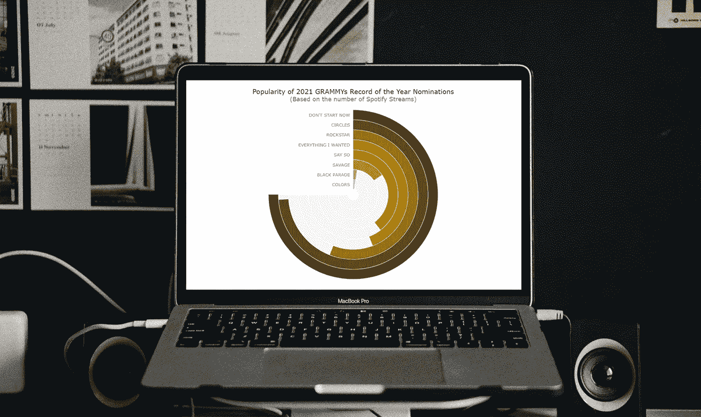
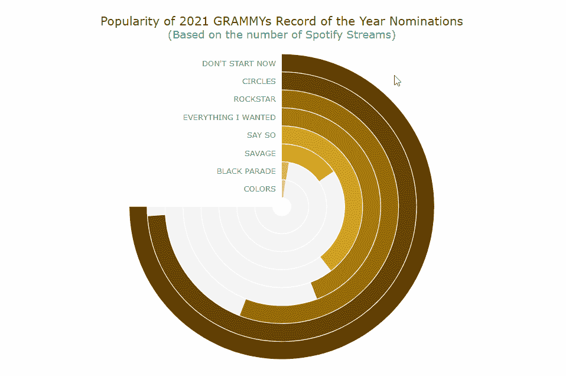
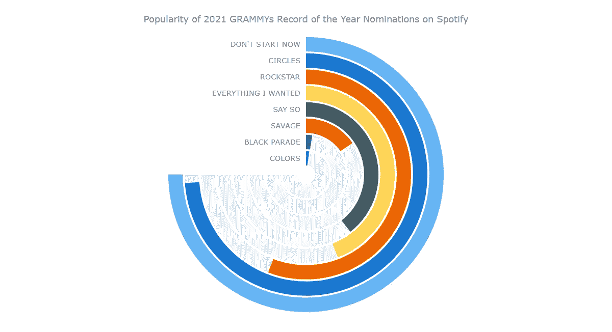
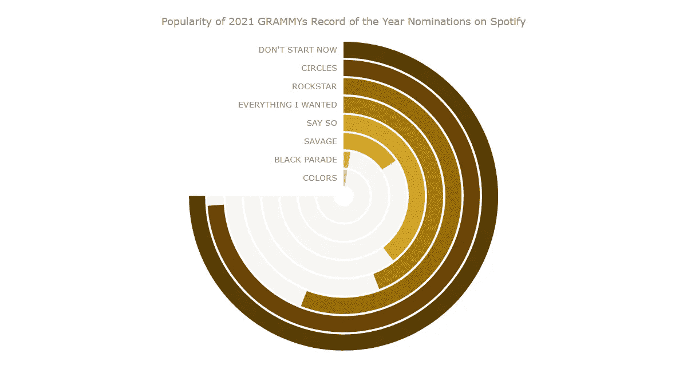
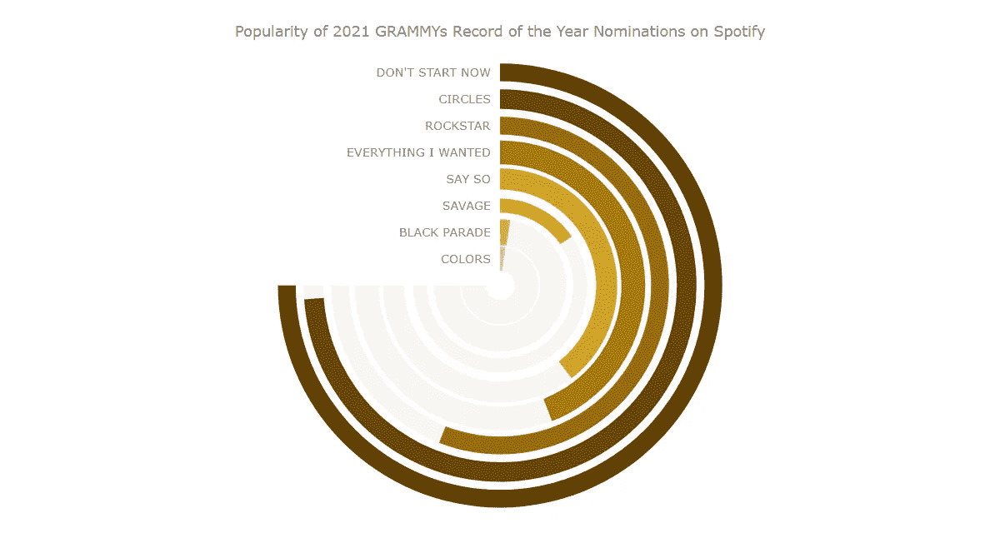
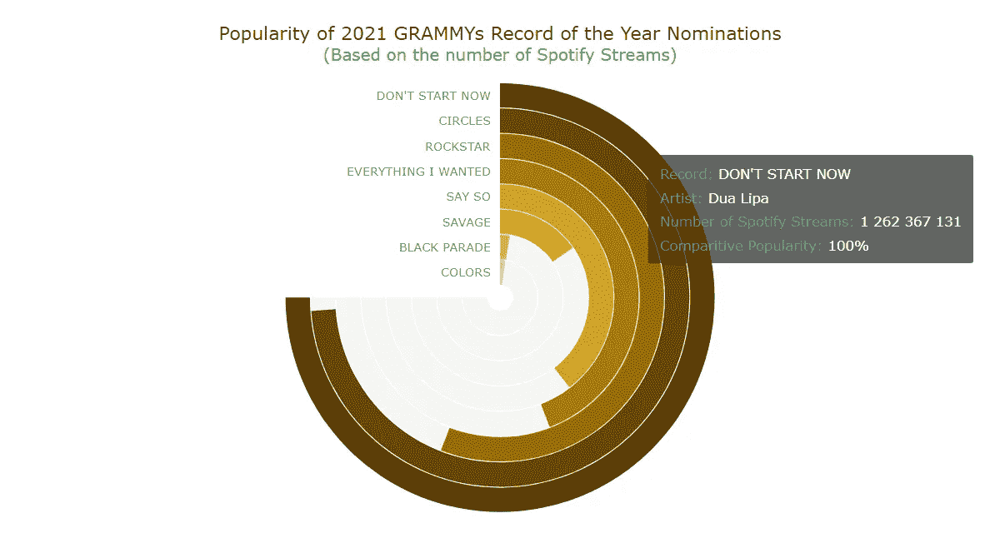

# 如何使用 JavaScript 创建角规

> 原文：<https://javascript.plainenglish.io/how-to-create-an-angular-gauge-using-javascript-d96b4cbd76ba?source=collection_archive---------13----------------------->



角规，也被称为圆形规，是一种带有径向刻度的规线图。这种可视化可以很好地显示一个范围内的值，并广泛用于各种仪表板。

最近关于疫苗的好消息对我们来说就像音乐。所以，我想为什么不在本教程中使用一些有趣的音乐数据进行可视化呢！第 63 届年度格莱美颁奖典礼将于 2021 年 3 月举行，当我翻阅年度最佳唱片提名名单时，我想知道这些歌曲有多受欢迎。为了找出答案，我决定在世界领先的音乐流媒体平台之一 Spotify 上查看他们的流媒体数量，并认为 Solid Angular Gauge 可以很好地进行这种视觉分析。它也像一个乙烯唱片，这使得它成为一个特别有趣的图表类型选择时，代表这样的数据！

因此，在教程中，我将在 JS 角度测量表中**可视化 Spotify 流对每首 2021 年格莱美提名歌曲的计数。那会很有趣的！上船啦**

在我们进入下一个过程之前，先看看最终的交互式 JavaScript 角度仪表图会是什么样子:



网络开发和诸如 HTML 和 JavaScript 技术的技能总是有助于交互式数据可视化。但事实上，在这里您甚至不需要太多技术知识和经验。问题是，为一个网站或应用程序创建 JS 角度测量仪不是火箭科学。

基本上，有 4 个基本步骤来使用 JavaScript 构建角度标尺:

1.  创建一个 HTML 页面。
2.  包括必要的 JavaScript 文件。
3.  连接数据。
4.  为图表编写 JS 代码。

## 1.创建一个基本的 HTML 页面

要做的第一件事是制作一个 HTML 页面，在那里将呈现角度标尺可视化。

我们添加了一个`div`元素来保存图表，并为其提供一个 id，以便以后正确引用该`div`。

```
<!DOCTYPE html>
<html>
  <head>
    <title>JavaScript Angular Gauge</title>
    <style type="text/css">
      html,
      body,
      #container {
        width: 100%;
        height: 100%;
        margin: 0;
        padding: 0;
      }
    </style>
  </head>
  <body>  
    <div id="container"></div>
  </body>
</html>
```

这里，`div`图块元素被赋予 100%的宽度和高度，以使仪表图显示为全屏。当然，也可以根据您的要求定制。

## 2.包括必要的 JavaScript 文件

第二步是在`<head>`部分参考您将要使用的必要脚本。

一些 [JavaScript 图表库](https://en.wikipedia.org/wiki/Comparison_of_JavaScript_charting_libraries)可以很容易地创建令人惊叹的图形和图表来可视化数据。在本教程中，我使用的是 [AnyChart](https://www.anychart.com/) ，这是一个轻量级、灵活且易于使用的 JavaScript 图表库。它支持开箱即用的角度规，并拥有丰富的[文档](https://docs.anychart.com/)。此外，AnyChart JS 提供了一个很酷的[代码平台](https://playground.anychart.com/)用于测试。

因此，让我们从这个库的 [CDN](https://www.anychart.com/download/cdn/) 中包含必要的文件。为了创建角度量规，我们需要添加所有类型图表所需的[核心模块](https://docs.anychart.com/Quick_Start/Modules#core)和角度量规专用模块。

```
<!DOCTYPE html>
<html>
  <head>
    <title>JavaScript Venn Diagram</title>
    <script src="https://cdn.anychart.com/releases/8.9.0/js/anychart-core.min.js"></script>
    <script src="https://cdn.anychart.com/releases/8.9.0/js/anychart-circular-gauge.min.js"></script>
    <style type="text/css">
      html,
      body,
      #container {
        width: 100%;
        height: 100%;
        margin: 0;
        padding: 0;
      }
    </style>
  </head>
  <body>  
    <div id="container"></div>
    <script>
 ***// All the code for the angular gauge chart will come here***    </script>
  </body>
</html>
```

## 3.准备和连接数据

第三步是关于数据。

我通过整理从格莱美官方网站和 Spotify 应用程序获得的数据，手动创建了这个可视化数据。我输入了歌曲名称、艺术家姓名、Spotify 流的数量以及每首歌曲的时长。

然后，我根据流的数量对数据进行了降序排序，并添加了一个百分比字段。最高流式记录被赋予 100%,并且与最高流式记录相比较来计算以下记录的百分比。

最后，我创建了一个 JSON 文件，你可以在这里下载。

在 AnyChart 中加载 JSON 数据可以借助于[数据适配器](https://docs.anychart.com/Working_with_Data/Data_Adapter/Overview)来完成，这是一个额外的有用脚本，可通过专用模块获得。让我们参考一下`<head>`中的所有 JS 脚本。

接下来，我们在 HTML 页面主体的`<script>`标签中使用`loadJsonFile`方法来加载 JSON 文件。

```
<!DOCTYPE html>
<html>
  <head>
    <title>JavaScript Angular Gauge</title>
    <script src="https://cdn.anychart.com/releases/8.9.0/js/anychart-core.min.js"></script>
    <script src="https://cdn.anychart.com/releases/8.9.0/js/anychart-circular-gauge.min.js"></script>
    <script src="https://cdn.anychart.com/releases/8.9.0/js/anychart-data-adapter.min.js"></script>
    <style type="text/css">
      html,
      body,
      #container {
        width: 100%;
        height: 100%;
        margin: 0;
        padding: 0;
      }
    </style>
  </head>
  <body>  
    <div id="container"></div>
    <script>
      anychart.data.loadJsonFile('{JSON data file location here}', function (data) {
        ***// The angular gauge's JS code will come here* **      });
    </script>
  </body>
</html>
```

现在我们已经完成了所有的预备步骤，让我们兴奋起来，开始添加代码，在一个基于 JS 的交互式角度测量仪中可视化数据！

## 4.添加仪表的 JS 代码

要构建任何 JS 图表或标尺，有必要添加一个包含所有代码的函数，这将确保其中的整个代码只在页面准备就绪时执行。

我们现在正在创建的立体角度规比其他图表类型(如[条形图](https://www.anychart.com/blog/2017/10/25/javascript-bar-chart-tutorial/)、[饼图](https://www.anychart.com/blog/2017/12/06/pie-chart-create-javascript/)或[面积图](https://www.anychart.com/blog/2017/10/28/create-javascript-area-chart/))要稍微复杂一些。但是，不要担心，因为所有的代码都有注释，我还会指导您完成代码片段。如果仍然感到困惑，只要按照步骤做，你马上就能做出一个可爱的图表。如果有问题，请在帖子评论中提问。

首先，我们提取径向条所需的数据值，创建角度标尺，并将提取的数据传递给图表。

```
<script>anychart.onDocumentReady(function () {anychart.data.loadJsonFile('https://gist.githubusercontent.com/shacheeswadia/9e4598a73bb86180f1726daf9de8062f/raw/b258e93e1f9db37da6847eb05a230afcb64446d5/circularGaugeData.json', function (data) { ***// Get the names of the records*** var recordNames = data.map(function(d){
    return d.Record;
  }); ***// Get the percent values*** var recordPercentValue = data.map(function(d){
    return d.percent;
  }); ***// Add the 100% value to signify the max value for each of the radial ring*** recordPercentValue.push(100); ***// Set the data to indicate the percent values*** var dataSet = anychart.data.set(recordPercentValue); ***// Create the angular gauge*** var gauge = anychart.gauges.circular(); ***// Set the data for the angular gauge*** gauge.data(dataSet);});});</script>
```

我希望每个数据点有不同的颜色。所以，让我们建立一个调色板。最初，我们可以使用 AnyChart JavaScript 图表库的默认颜色。

接下来，我们指定仪表的属性并创建轴。我不想显示轴标签和刻度，所以让我们隐藏它们。

```
***// Set the colors based on the default palette*** var palette = anychart.palettes
  .distinctColors()
  .items([
    '#64b5f6', '#1976d2', '#ef6c00', '#ffd54f', '#455a64', '#dd2c00', '#00838f', '#00bfa5', '#96a6a6', '#ffa000'
  ]);***// Specify the attributes of the angular gauge chart*** gauge
  .fill('#fff')
  .stroke(null)
  .padding(25, 100, 25, 100)
  .margin(0)
  .startAngle(0)
  .sweepAngle(270);***// Create the angular gauge axis*** var axis = gauge.axis().radius(100).width(1).fill(null);***// Set the minimum and maximum values for the axis*** axis
  .scale()
  .minimum(0)
  .maximum(100);***// Hide the axis labels and ticks*** axis.labels().enabled(false);
axis.ticks().enabled(false);
axis.minorTicks().enabled(false);
```

现在是创建角规径向条的主要部分。我们创建了一个函数，它接受每个径向条的规格、索引以及半径和宽度作为参数。然后，我们根据数据点构建每个条形，以及这些点的背景径向条形。

接下来，我们设置标签并对齐它们以对应每个径向条。函数中的最后一件事是为每个数据点返回一个标尺。

```
***// Create a function to make radial bars for each data point*** var makeBarWithBar = function (gauge, radius, i, width) { ***// Create the radial bars based on the data*** gauge
    .bar(i)
    .dataIndex(i)
    .radius(radius)
    .width(width)
    .fill(palette.itemAt(i))
    .stroke(null)
    .zIndex(5); ***// Create the background radial bars indicating the total value*** gauge
    .bar(i + 100)
    .dataIndex(8)
    .radius(radius)
    .width(width)
    .fill('#F5F4F4')
    .stroke(null)
    .zIndex(4); ***// Set the labels based on each data point*** gauge
    .label(i)
    .text(recordNames[i]); ***// Align the labels*** gauge
    .label(i)
    .hAlign('center')
    .vAlign('middle')
    .anchor('right-center')
    .padding(0, 10)
    .height(width / 2 + '%')
    .offsetY(radius + '%')
    .offsetX(0); return gauge.bar(i);};
```

既然已经创建了函数，我们就为我们拥有的每个数据点调用该函数。总共有 8 个数据点。所以我们调用这个函数 8 次。半径值是 100 除以数据点数，我将每个条形的宽度保持为 11。

```
***// Call the function to create the radial bars with specifications*** makeBarWithBar(gauge, 100, 0, 11);
makeBarWithBar(gauge, 87.5, 1, 11);
makeBarWithBar(gauge, 75, 2, 11);
makeBarWithBar(gauge, 62.5, 3, 11);
makeBarWithBar(gauge, 50, 4, 11);
makeBarWithBar(gauge, 37.5, 5, 11);
makeBarWithBar(gauge, 25, 6, 11);
makeBarWithBar(gauge, 12.5, 7, 11);
```

然后我们给图表添加一个标题。最后，我们参考`div`容器并画出我们的角度规。

```
***// Add the angular gauge chart title*** gauge.title('Comparing Popularity of 2021 GRAMMYs Record of the Year Nominations on Spotify');***// Drawing the resulting angular gauge*** gauge.container('container');
gauge.draw();
```

现在，您已经拥有了它——一个全功能的、基于 JavaScript 的、很酷的角度测量仪已经准备好了！或者你可以称它为圆形量规或径向量规——随你喜欢。



我们可以清楚地看到，从我们的角度衡量，有相当大的差异，在受欢迎程度这些轨道。杜阿·利帕的《不要现在开始》是 2021 年格莱美年度最佳唱片提名名单中播放量最大的歌曲，在 Spotify 上播放量高达 12.6 亿，紧随其后的是波斯特·马龙的《Circles》，播放量为 12.4 亿。根据这个参数，这两个是明确的领导者。是不是意味着他们中的一个会赢？嗯……(不一定，你懂的。)

Black Pumas 的歌曲“Colors”确实有令人印象深刻的 3600 万的总流量，但最终成为该组中流量最少的歌曲。

在[操场](https://playground.anychart.com/tS422T7p/)或 [CodePen](https://codepen.io/shacheeswadia/pen/qBaKpMW) 上看看这个带有完整 JS/CSS/HTML 代码的角度规的初始版本。

# JavaScript 角度规定制

用于数据可视化的健壮 JavaScript 库不仅简化了图表创建，还提供了定制的灵活性。通过一些代码调整，我们可以对圆形图形进行一些快速有效的更改。

让我们看看角度规的一些不同功能和美学。

## 更改调色板

由于我们的数据是关于格莱美提名的，我决定使用类似镀金留声机奖杯的颜色，并引入相应的调色板。我们已经用不同的颜色创建了一个调色板，所以让我们用新的颜色替换默认的颜色。

```
***// Set the colors based on the designated palette*** var palette = anychart.palettes
  .distinctColors()
  .items([
    '#593d04', '#6c4304', '#966905', '#a77b0a', '#cf9f20', '#ddb22e', '#f1c84d', '#ffdc73'
  ]);
```

查看图表看起来如何更加个性化—这是用 JS 构建的角度标尺，现在进行了以下修改:



在[游乐场](https://playground.anychart.com/rD5NeHdt/)或 [CodePen](https://codepen.io/shacheeswadia/pen/WNGyyWW) 查看。

## 设置自定义条形大小

现在，让我们对径向条进行一些试验，并向当前图表添加一些更多的信息。

例如，我们可以让每个条形的宽度代表歌曲的持续时间。

为此，我们需要从数据中提取每首歌曲的持续时间，然后创建一个循环，使每个条形的宽度对应于该数据点的持续时间。

```
***// Get the time of each song*** var recordLength = data.map(function(d){
  return d['Time'];
});***// Call the function to create the radial bars with specifications*** for(var i=0, j=100; i<data.length, j>=12.5; i++, j-=12.5){
  makeBarWithBar(gauge, j, i, (recordLength[i]* 2.75));
}
```

看看变化是怎样的:



你可以在[游乐场](https://playground.anychart.com/lLNC4CH0/)或 [CodePen](https://codepen.io/shacheeswadia/pen/WNGyYEb) 找到这个版本的完整代码。

最终，我发现它不是很有见地，并恢复到每个条形都有固定宽度的版本。我保留了循环，因为这减少了代码量，并且是重复调用函数的更好方式。

## 改进角度仪表工具提示和其他格式的设计

我们制作的 JavaScript 角度规看起来已经很棒了。我们可能需要的只是一些收尾工作。

让我们设计一个好看的、信息丰富的工具提示。

首先，请注意这里的变化:

```
***// Add the 100% value to signify the max value for each of the radial ring*** var initialLength = recordPercentValue.length;
recordPercentValue.length *= 2;
recordPercentValue.fill(100, initialLength);...***// Create the background radial bars indicating the total value*** gauge
  .bar(i + 100)
  .dataIndex(initialLength + I)
  .radius(radius)
  .width(width)
  .fill('#F5F4F4')
  .stroke(null)
  .zIndex(4);
```

我们添加以下部分:

```
***// Angular gauge tooltip*** gauge.tooltip().useHtml(true);

***// Format the information of the tooltip*** gauge
  .tooltip()
  .format(function(){
    var index = this.index;
    if (index >= initialLength)
    index -= initialLength;
    return "<div style='font-size:15px; font-weight:400; margin: 0.2rem 0; color: #1db954; padding:0.15rem'>Record: <span style='color:#fff;'>" + data[index]['Record'] + "</span></div><div style='font-size:15px; font-weight:400; margin: 0.2rem 0; color: #1db954; padding:0.15rem'>Artist: <span style='color:#fff;'>" + data[index]['Artist'] + "</span></div><div style='font-size:15px; font-weight:400; margin: 0.2rem 0; color: #1db954; padding:0.15rem'>Number of Spotify Streams: <span style='color:#fff;'>" + Intl.NumberFormat().format(data[index]['StreamsSpotify']) + "</span></div><div style='font-size:15px; font-weight:400; margin: 0.2rem 0; color: #1db954; padding:0.15rem'>Comparitive Popularity: <span style='color:#fff;'>" + data[index]['percent'] + "%</span></div>";
  });
```

最后，用更大的字体美化标题并应用一些颜色变化来突出我们所展示的内容应该很棒:

```
***// Add the angular gauge chart title*** gauge
  .title()
  .useHtml(true)
  .text(
    '<span style = "color: #4c2b04; font-size:20px;">Comparing Popularity of 2021 GRAMMYs Record of the Year Nominations</span>' +
    '<br/><span style="color:#1db954; font-size: 18px;">(Based on the number of Spotify Streams)</span>'
  );
```



你可以在下面找到这个最终角规的完整源代码，也可以在[操场](https://playground.anychart.com/Q6OseQ30/)或 [CodePen](https://codepen.io/shacheeswadia/pen/WNGyYXb) 上查看和使用它。

```
<!DOCTYPE html>
<html>
  <head>
    <title>JavaScript Angular Gauge</title>
    <script src="https://cdn.anychart.com/releases/8.9.0/js/anychart-core.min.js"></script>
    <script src="https://cdn.anychart.com/releases/8.9.0/js/anychart-circular-gauge.min.js"></script>
    <script src="https://cdn.anychart.com/releases/8.9.0/js/anychart-data-adapter.min.js"></script>
    <style type="text/css">
      html,
      body,
      #container {
        width: 100%;
        height: 100%;
        margin: 0;
        padding: 0;
      }
    </style>
  </head>
  <body>  
    <div id="container"></div>
    <script>anychart.onDocumentReady(function () {anychart.data.loadJsonFile('https://gist.githubusercontent.com/shacheeswadia/9e4598a73bb86180f1726daf9de8062f/raw/b258e93e1f9db37da6847eb05a230afcb64446d5/circularGaugeData.json', function (data) { ***// Get the names of the records***  var recordNames = data.map(function(d){
    return d.Record;
  }); ***// Get the percent values***  var recordPercentValue = data.map(function(d){
    return d.percent;
  }); ***// Add the 100% value to signify the max value for each of the radial ring***  var initialLength = recordPercentValue.length;
  recordPercentValue.length *= 2;
  recordPercentValue.fill(100, initialLength); ***// Set the data to indicate the percent values***  var dataSet = anychart.data.set(recordPercentValue); ***// Create the angular gauge***  var gauge = anychart.gauges.circular(); ***// Set the data for the angular gauge***  gauge.data(dataSet);

 ***// Set the colors based on the designated palette***  var palette = anychart.palettes
    .distinctColors()
    .items([
      '#593d04', '#6c4304', '#966905', '#a77b0a', '#cf9f20', '#ddb22e', '#f1c84d', '#ffdc73'
  ]); ***// Specify the attributes of the angular gauge chart***  gauge
    .fill('#fff')
    .stroke(null)
    .padding(25, 100, 25, 100)
    .margin(0)
    .startAngle(0)
    .sweepAngle(270); ***// Create the angular gauge axis***  var axis = gauge.axis().radius(100).width(1).fill(null); ***// Set the minimum and maximum values for the axis***  axis
    .scale()
    .minimum(0)
    .maximum(100); ***// Hide the axis labels and ticks***  axis.labels().enabled(false);
  axis.ticks().enabled(false);
  axis.minorTicks().enabled(false); ***// Create a function to make radial bars for each data point***  var makeBarWithBar = function (gauge, radius, i, width) { ***// Create the radial bars based on the data***    gauge
      .bar(i)
      .dataIndex(i)
      .radius(radius)
      .width(width)
      .fill(palette.itemAt(i))
      .stroke(null)
      .zIndex(5); ***// Create the background radial bars indicating the total value***    gauge
      .bar(i + 100)
      .dataIndex(initialLength + i)
      .radius(radius)
      .width(width)
      .fill('#F5F4F4')
      .stroke(null)
      .zIndex(4); ***// Set the labels based on each data point***    gauge
      .label(i)
      .text(recordNames[i]); ***// Align the labels***    gauge
      .label(i)
      .hAlign('center')
      .vAlign('middle')
      .anchor('right-center')
      .padding(0, 10)
      .height(width / 2 + '%')
      .offsetY(radius + '%')
      .offsetX(0); return gauge.bar(i); }; ***// Angular gauge tooltip***  gauge.tooltip().useHtml(true);

 ***// Format the information of the tooltip***  gauge
    .tooltip()
    .format(function(){
      var index = this.index;
      if (index >= initialLength)
      index -= initialLength;
      return "<div style='font-size:15px; font-weight:400; margin: 0.2rem 0; color: #1db954; padding:0.15rem'>Record: <span style='color:#fff;'>" + data[index]['Record'] + "</span></div><div style='font-size:15px; font-weight:400; margin: 0.2rem 0; color: #1db954; padding:0.15rem'>Artist: <span style='color:#fff;'>" + data[index]['Artist'] + "</span></div><div style='font-size:15px; font-weight:400; margin: 0.2rem 0; color: #1db954; padding:0.15rem'>Number of Spotify Streams: <span style='color:#fff;'>" + Intl.NumberFormat().format(data[index]['StreamsSpotify']) + "</span></div><div style='font-size:15px; font-weight:400; margin: 0.2rem 0; color: #1db954; padding:0.15rem'>Comparitive Popularity: <span style='color:#fff;'>" + data[index]['percent'] + "%</span></div>";
    }); ***// Call the function to create the radial bars with specifications***  for(var i=0, j=100; i<data.length, j>=12.5; i++, j-=12.5){
    makeBarWithBar(gauge, j, i, 12);
  } ***// Add the angular gauge chart title***  gauge
    .title()
    .useHtml(true)
    .text(
      '<span style = "color: #4c2b04; font-size:20px;">Comparing Popularity of 2021 GRAMMYs Record of the Year Nominations</span>' +
      '<br/><span style="color:#1db954; font-size: 18px;">(Based on the number of Spotify Streams)</span>'
    ); gauge
    .title()
    .enabled(true)
    .hAlign('center')
    .padding(0)
    .margin([0, 0, 10, 0]);

 ***// Drawing the resulting angular gauge***  gauge.container('container');
  gauge.draw();});}); </script>
  </body>
</html>
```

# 结论

在这个循序渐进的教程中，我向您详细展示了如何用 JavaScript (HTML5)创建一个引人注目的角度规。如您所见，创建交互式 JS 图表很容易。

您可以尝试其他 JavaScript 图表库，并评估它们在创建您需要的数据可视化方面的能力。或者你可以查看 AnyChart 提供的其他各种[图表选项](https://docs.anychart.com/Quick_Start/Supported_Charts_Types)。为了获得灵感，你可能想去图书馆的[画廊看看基本的图表类型。请随时问我任何问题，或者让我知道你的 JS 量表结果如何。](https://www.anychart.com/products/anychart/gallery/)

祝你有一个健康、音乐和视觉的 2021 年！

我们 AnyChart 很高兴感谢经验丰富的数据设计师 Shachee Swadia 创建了这个令人惊叹的教程。查看其他 [*JavaScript 制图教程*](https://www.anychart.com/blog/category/javascript-chart-tutorials/) *。*

*原载于 2021 年 2 月 3 日*[*https://www.anychart.com*](https://www.anychart.com/blog/2021/02/03/angular-gauge-javascript/)T22。