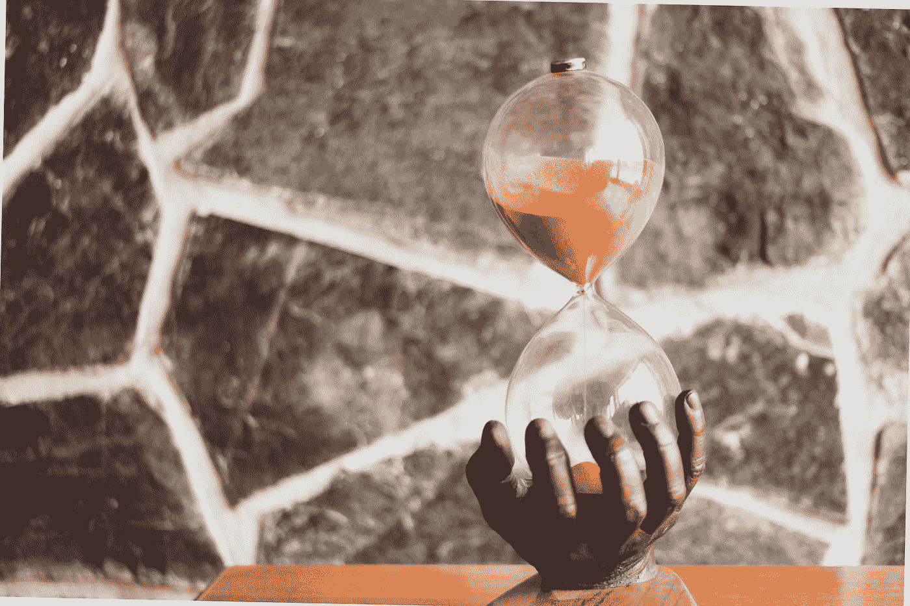
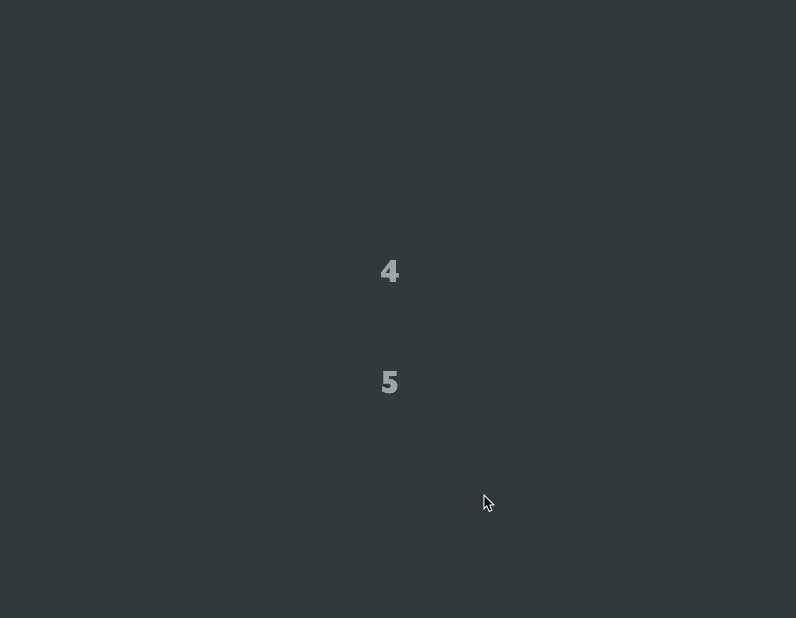

# 创建一个动画倒计时定时器与帧运动和反应

> 原文：<https://javascript.plainenglish.io/how-to-create-an-animated-countdown-timer-with-framer-motion-and-react-75035d13309c?source=collection_archive---------4----------------------->

一个指南，建立自己的动画倒计时定时器与帧运动，反应，并使用倒计时钩。



Photo by [Regös Környei](https://unsplash.com/@kornyeir?utm_source=medium&utm_medium=referral) on [Unsplash](https://unsplash.com?utm_source=medium&utm_medium=referral)

# 内容

*   介绍
*   入门指南
*   使用倒计时
*   有生命的
*   动画演示
*   过渡
*   解决办法

# 介绍

首先，感谢您花时间阅读这篇文章。我花了很多时间写这些，知道只有一个人发现了它的价值，这是值得的。

在这篇文章中，我们将介绍如何创建一个计时器，动画计时器，并在结束时庆祝。所有这些都使用了 React 和一个强大的动画库 Framer Motion。我们不能忘记一个 npm 包的出现，它将帮助我们创建计时器

# 入门指南

我们开始吧！首先，我们需要将依赖项安装到 React 项目中。

*Framer-Motion 要求您使用 React 版本 16.8 或更高版本。*

在 react 应用程序中运行以下命令来安装我们的成帧器运动依赖。

```
npm install --save framer-motion
```

现在它已经安装好了，您可以通过

```
import { motion } from “framer-motion"
```

我们还需要安装我们将用于计时器的东西！安装使用倒计时。

```
npm i @bradgarropy/use-countdown
```

太棒了，在这一点上，我们已经添加了帧运动和我们的定时器包到我们的项目中。

我也将使用样式组件，使我的页面布局更漂亮。现在，这不是必需的，你可以很容易地在层叠样式表中添加 CSS。但是如果你想拥有和我在你的项目中安装样式组件一样的代码。

```
npm install --save styled-components
```

完善您的 React 项目现在拥有了编码所需的一切。让我们从复制我的启动代码开始。*这不是必需的**

# 使用倒计时

use-countdown [npm](https://www.npmjs.com/package/@bradgarropy/use-countdown) 包是一个 React 钩子，它可以让你无缝地创建倒计时。当需要任何种类的计数器时，这个 React 钩子非常有用。

它可以很容易地传递你需要钩子的时间，并且它会把这个时间的值返回到一个对象中，就像这样:

```
{
  minutes: 1,
  seconds: 30,
  formatted: "01:30",
}
```

在我们的代码中，我们不需要任何复杂的东西。我们只需要几秒钟。

```
const countdown = useCountdown({
      seconds: 10,
      onCompleted: () => console.log('completed'),
})
```

如果我们`console.log(countdown)`这就是我们将会看到的。这将重复进行，直到达到值 0。

```
{
    "minutes": 0,
    "seconds": 10,
    "formatted": "00:10"
}
```

现在我们可以将`countdown.seconds`添加到 div 中占位符 10 的位置。这会给我们计时器！小心这个钩子！

# 有生命的

现在我们有一个计时器，让我们开始一些动画！要做到这一点，我们需要把我们的 div，其中有倒计时定时器到一个帧运动元素。我将使用一个`<motion.h1>`,这是一个典型的 H1 HTML 元素，但是现在有了框架运动的力量。

为了让这个倒计时看起来令人惊讶，让我们制作它的动画，让它从垂直的 y 轴进入我们的`initial`道具中，不透明度为 0。

接下来，我们需要用`animate`道具告诉我们的 h1 倒计时动画到哪里。

```
<motion.h1*initial*={{ y: -150, opacity: 0 }} *animate*={{ y: 0, opacity: 1 }}>
{countdown.seconds}
</motion.h1>
```

我们现在有了一个动画倒计时器，已经很棒了！但是可以变好！

# 动画演示

现在我们的计时器应该从上到下显示每个数字。当新号码进来时，我想让当前号码退出屏幕。现在，通常这对于普通的 CSS 和 JavaScript 来说是相当复杂的。但是通过 Framer Motion 强大的 AnimatePresence 元素，我们可以包装我们的子组件，并让它们一起制作动画！Framer 将使用 AnimatePresence 跟踪每个元素。

用`<AnimatePresence>{children}</AnimatePresence>`包装`motion.h1`，我们还需要为 h1 添加一个键，以便 AnimatePresence 可以跟踪每个孩子。

```
*key*={countdown.seconds}
```

为了创建我们的退出动画，我们简单地将`exit`道具添加到 h1 中。我将让数字继续在 y 轴上运行，不透明度为 0，退出时位置为绝对，这样它就不会干扰其他元素。

```
*exit*={{ y: 75, opacity: 0, position: "absolute" }}
```

厉害！看那有多光滑！就像坐在摩天轮上向你转过来一样！

# 过渡

我肯定你在想接下来会发生什么？我们已经有一个完美的倒计时器了？

嗯，我认为计时器的转换可以稍微改进一下。让我们看看如何实现这一点。

添加道具`transition`，让我们用持续时间属性让事情慢下来一点。最后但并非最不重要的是`ease`属性，这使得我们的动画在移动时感觉有生命。

这些字符串是 Framer 中内置的命名缓动函数。

*   `"linear"`
*   `"easeIn"`、`"easeOut"`、`"easeInOut"`
*   `"circIn"`、`"circOut"`、`"circInOut"`
*   `"backIn"`、`"backOut"`、`"backInOut"`
*   `"anticipate"`

我们将使用“easeOut”字符串。

```
*transition*={{
ease: "easeOut",
duration: 1,
}}
```

# 解决办法

最后但同样重要的是，让我们添加一个庆祝动画，一旦计时器到达零。

安装 react-confetti，这是一个提供五彩纸屑组件的 npm 包。

```
npm i react-confettiimport Confetti from "react-confetti";
```

从 React 导入`useState`,创建一个使用状态`complete, setComplete`,让我们将分派添加到我们的`useCountdown`钩子中，在完成时设置为 true。

```
const [complete, setComplete] = useState(false);const countdown = useCountdown({
seconds: 10,
onCompleted: () => setComplete(true),
})
```

现在在我们的返回中创建一个逻辑 AND，在 true 上显示我们的五彩纸屑组件。

```
{complete && <Confetti />}
```

一旦我们的计时器到零，这将使它下五彩纸屑雨！

这就完成了创建一个倒计时器的指南，它有一个使用倒计时钩子的星形外观。

下面是最后的代码:随意复制、粘贴和修改，直到你有一个适合你需要的定时器。

再次感谢你花时间阅读我的文章。

这里是最终产品！



查看我关于框架运动的其他文章:

[](/how-to-create-a-loading-spinner-with-framer-motion-and-react-70ee6d48b325) [## 如何创建带有成帧器运动和反应的加载微调器

### 创建仅具有帧运动和反应的加载微调器

javascript.plainenglish.io](/how-to-create-a-loading-spinner-with-framer-motion-and-react-70ee6d48b325) [](https://medium.com/@steven_creates/how-to-use-framer-motion-with-react-a2639b6b9b6b) [## 如何将帧运动与 React 一起使用

### 本系列指南+文章将介绍 React + Styled 中使用的成帧器运动的示例和概念…

medium.com](https://medium.com/@steven_creates/how-to-use-framer-motion-with-react-a2639b6b9b6b) 

再次感谢阅读！