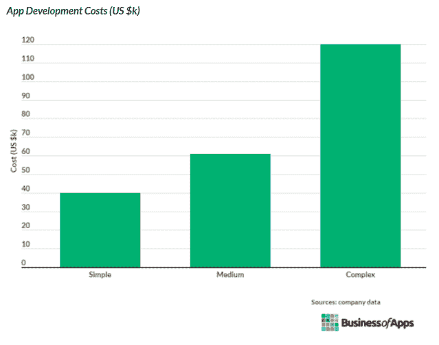

# 如何通过 10 个简单的步骤从头开始创建应用程序

> 原文：<https://javascript.plainenglish.io/how-to-create-an-app-from-scratch-in-10-simple-steps-ad032dc441?source=collection_archive---------10----------------------->

## 成功创建移动应用的 10 步指南

**如何从头开始制作应用程序？**

表面上看，答案很简单。概念化。创造。实施。但是，然后你就有了一个可以工作的应用程序(至少可以做它应该做的事情),其他什么都没有。

没有新客户。交通没有改善。没有更高的约定。没有结果。

> *成功的移动应用= ROI(优选目标)*

这种“返回”是组织或开发人员特定的目标。正确的移动应用开发流程会引导您找到能够实现上述目标的最终解决方案。Instagram、Whatsapp、Tinder、优步、PUBG 就是这种做法的典型例子。

那么，您如何以正确的方式将您的移动应用理念付诸实践呢？这里有一个为任何行业创建专业移动应用的十步指南，专注于为企业创造回报。

# 10 步打造成功的移动应用

1.  **构思草图**
2.  **研究市场**
3.  **创建并测试线框**
4.  **创建实体模型**
5.  **创建用户界面/UX 设计**
6.  **样机测试**
7.  **创建应用登录页面**
8.  **跨应用商店发布**
9.  **应用上市**
10.  **反馈升级**

## 1.勾画你的想法

[9350 亿美元——这是预计到 2023 年全球移动应用的收入。](https://www.statista.com/statistics/269025/worldwide-mobile-app-revenue-forecast/)

在这个世界上，移动应用是大多数东西的首选，用户可以在 570 万个应用中做出选择，这个收入数字并不令人惊讶。然而，从商业角度来看，这个惊人的数字意味着激烈的竞争。

要渗透到这个如此封闭的市场并取得成功，你需要在你的应用程序中灌输一种独特的身份。这个旅程的第一步是概念化。

当处理**步骤来创建应用程序**时，仔细分析你试图构建的东西。如果你还没有一个移动应用的想法，做一些相关的研究。但最重要的是，评估你申请的可信度。

> 你可以这样做。

*   让你的想法具体化。
*   在纸上画出来。
*   将其分解为可消化的部分。
*   定义应用程序的功能。
*   列出它的特点。
*   定义 USP——你的应用程序应该做好的一件事。
*   定义应用程序的投资回报率预期。

这个过程最好在几个小时到一周之间的任何时间完成，这取决于你的移动应用的广度。然而，不要为创造下一个最好的革命性产品而焦虑。你可能会浪费很多时间追求完美。

只需选择一个吸引你的想法，并与你的目标受众一起测试它的重要性。

## 2.研究市场

一个在纸上行得通的想法可能在人群中行不通。市场调查帮助你区分两者，并在这个过程中保护你的时间、精力和金钱。

我们不都是求实惠的 app 开发方案吗！

在开发之前进行研究可以明确你的移动应用在目标市场的前景。它验证你的应用创意的可信度，识别顶级利基竞争对手，并找到你创意中的漏洞。研究也有助于创造一个有更高成功机会的市场现成的最终产品的框架。

> 通过市场调研，找到以下几点的相关答案。

*   市场上需要你们的产品吗？
*   你的应用程序如何帮助人们？
*   你理想的用户/买家角色是什么样的？
*   你的 app 提出了正版/实用的解决方案吗？
*   哪些品牌/产品将是你的主要竞争对手？
*   你的竞争对手在犯什么错误？

通过研究，你可以在不冒资本风险的情况下，估算出对你的移动应用创意的需求。此外，如果研究没有描绘出有利可图的画面，不要害怕放弃你的想法。

## 3.创建和测试线框

线框是最基本的骨架，是应用程序设计的基础。它们描述了一个产品如何运作，而不太关注布局、屏幕安排或 UX。线框可以很容易地设计在纸上，白板，或系统屏幕上，并可以服务于许多目的。

*   验证应用功能
*   放下应用程序的可用性
*   想象每个页面将如何运行
*   建立透明的沟通
*   简化项目过渡

作为一个简单的视觉草图，线框可以保护你的项目免受许多不必要的意外。一旦你知道了每个页面应该做什么，你将很快发现异常，为偏离计划做好准备，并创造财务优势。

## 4.创建一个模型

实体模型是应用程序设计和功能的中到高保真重建。创建模型时，您可以尝试各种设计元素，看看哪些效果最好，哪些不好。

尽管它不完全是功能性的，但模型是从线框构建的，并添加了额外的设计元素，以创建一个更生动的应用程序。

创建一个样机来测试应用程序的交互体验和流程。尝试不同的设计以获得最佳效果。一旦完成，保存最后的几个设计作为备份。

## 5.从事用户界面/UX 设计

无论你是自己做还是雇佣专门的移动应用程序开发人员 来做平面设计，线框和模型都会让工作变得更容易。无论你选择什么，问问你自己-

> **如何构建一个界面人性化的简单 app** ？

记下今年最热门的设计趋势，并遵循最佳的用户界面/UX 实践，以提供一个能让用户满意的视觉画面。这里有一些帮助你前进。

*   直观导航
*   跨设备和跨平台体验
*   提供个性化选择
*   使用公认的手势
*   尽可能简化
*   最小化数据输入
*   保持适当的速度

根据当今的用户行为，视觉和图形设计的门槛越来越高。选项很多，从动画和模拟到像素完美的细节和令人惊叹的图形效果。利用它们，让你的原型发挥出最大的价值。

## 6.测试原型

尽可能让你的移动应用原型通过测试和质量分析。这样做可以确保你的应用程序的健壮性，并揭示致命的功能和设计缺陷。在发布前解决这些问题会增加你成功的机会。

基本的测试设置包括设备和操作系统。此外，测试移动应用程序的屏幕分辨率和类型。此外，始终遵循移动应用测试的黄金法则，以确保最佳结果。

*   创建特定的基于功能的测试用例
*   Crete 为每一个可能的用例提供点击路径
*   针对您的主要目标市场缩小测试设备的范围
*   用报告跟踪这个过程

当测试原型时，你的目标应该是衡量它的可用性、有用性、可访问性、合意性和导航功效。您可以选择手工测试，进行自动化测试，或者创建一个混合计划来清理您的解决方案中的所有问题。

> 然而，重要的是不要迷失在测试循环中。

计划测试的周期数(一个最有利的数字)并坚持下去。任何新开发的应用程序都有很多需要改进的地方，在当今的全球市场环境下，追求完美是一个很难的目标。在收到实时用户评论后，你最终会升级应用程序。

## 7.创建应用程序的登录页面

与普遍看法相反，你的移动应用需要一个登陆页面。

我们很快就会讨论营销。但是在应用程序发布之前，应用程序的营销过程就已经开始了。一个登陆页面位于它的正中央。问问任何一家专业的移动应用开发公司 ，他们都会证实一个登陆页面在帮助你的移动应用在用户中找到定位方面的重要性。

登录页面是关于你的应用程序的所有初步信息的主页。它是一个数字签名，是对你的应用程序的外观、感觉和功能的一瞥。它展示了你的应用的核心特性和品牌故事。此外，它可以包含在不同应用商店下载应用程序的链接，使潜在用户的旅程更容易。

> 手机 app 登陆页的优势有很多。

*   更好的品牌对话
*   产品推广
*   硬数据的来源
*   营销工具
*   增强品牌可信度
*   更好的发布后用户交互

当考虑创建一个新的移动应用程序时，你也应该在你的策略中包含一个登陆页面。这是因为，如果你选择 [**雇佣安卓应用开发者**](https://www.suntecindia.com/hire-android-app-developers.html) 或 iOS 开发者来做这项工作，你也可以在任务描述中公布对登陆页面设计的需求。这将吸引合适的资源，而且你的预算不会因为突然需要 [**雇佣印度软件开发人员**](https://www.suntecindia.com/hire-dedicated-developers.html) 进行网页设计而受到影响。

## 8.跨商店发布你的应用

两个最大的移动应用分销渠道仍然是苹果应用商店和谷歌 Play 商店。因此，最自然的最佳举措是至少在这两种情况下都使用你的手机。

这样做将为你的客户群打开一个广阔的前景，更多的社交机会，因此，更好的货币化。

您可以创建一个交叉兼容的流程，也可以为不同的环境创建不同的应用程序。在你开始实施这些**步骤来创建一个应用程序之前，做好这个决定。**请记住，跨平台应用程序是经济高效的工具，但是本地应用程序也有其自身的优势。学习。观察。然后，做出你的决定。

此外，在应用程序商店上建立一个信息丰富、引人入胜的登录页面。它和网页登陆页一样重要，能让你的应用吸引到合适的受众，并确保转化率。

> 以下是在 play store 上发布应用程序的一些快速提示。

*   使用创意展示来展示你的应用程序的最佳和最有用的功能。
*   在设计登陆页面之前，研究所有应用商店的用户行为模式。
*   使用 app store 视频展示真实的用户体验。
*   在发布应用之前，对其进行多项可用性测试。
*   使用 App Store 优化，让您的解决方案更容易被发现。

在你点击启动之前，你可以创建一个归纳——一种前言——以确保你的应用程序顺利运行。

开始内容营销。使用监管平台。选择小的目标群体来宣传你的应用，并在此基础上进行构建。与具有共同用户基础的其他互补、经济的应用程序开发解决方案建立联系。尽可能多地建立关系网。发布测试版本，并开放注册用户测试。

## 9.向目标受众推销你的应用

准备好遇到几个移动应用程序，它们提供与你相同的功能，销售给相同的受众群体，或者采用与你相似的方式来产生投资回报。

如果你重温这个指南——从如何构建一个简单的应用程序的第一步开始——你会注意到不同阶段的营销亮点。这不是一个线性过程。所以，这就是整合好的营销策略如何带来你想要的结果。

但是，当你坐下来勾画端到端营销和产品推广战略时，你需要的不仅仅是应用商店优化和登录页面设计。您可以使用以下任何工具来吸引目标受众的注意力，邀请他们访问您的应用商店页面，并获得他们的用户或付费客户。

*   社交媒体上的有机推广
*   社交媒体上的付费广告
*   热门小众平台上的内容营销
*   客座博客
*   搜索广告
*   影响者认可
*   移动营销平台

你如何营销一款应用也会影响评分。为了创造一个值得信赖的品牌和产品形象，让你的应用程序的 USP 成为与用户联系的基础。

## 10.实施基于反馈的升级

诚实的用户反馈，当被明智地分析和整合时，可以创造奇迹。它有可能给你带来更多的用户、转化率和收入。

你需要弄清楚的是-

*   如何有效地收集相关方的反馈
*   如何分析和实施反馈以提高应用性能

对于前者，你可以使用应用分析，接触客户，收集尽可能多的信息。对于后者，你需要和一个战略家和开发者的团队坐下来，精确地解决每一个用户问题，以增强体验。

尝试这个过程——许多过程中的一个——为你的应用程序创建一个更有意识和更有用的基于反馈的升级循环。

*   讨论并指定您希望收集的反馈类型(用户体验或核心功能)
*   勾画出通过应用程序或其 web 对应物收集反馈所需的用户界面
*   如果需要，选择另一种媒体(电子邮件、调查、采访)
*   计算实施反馈系统的成本
*   创建一个系统以确保对反馈的快速响应

一旦你的反馈系统到位并开始工作，你必须分析数据。得出推论并讨论每一个来为用户解决手边的问题。识别现存的问题，它们的频率，并调整你的开发路线图来消除它们。

# 2021 年做一个手机 App 要多少钱？

许多关键和非关键因素共同决定了移动应用开发的总体成本。

## 影响 2021 年移动应用开发的因素

> 特征
> 
> 复杂性
> 
> 设计
> 
> 平台
> 
> 和睦相处
> 
> 后端基础设施
> 
> 团队结构
> 
> 管理
> 
> 维护
> 
> 主办；主持
> 
> 监视
> 
> 营销

最终的数字还会受到你是雇佣专门的移动应用程序开发人员，还是自己或与内部团队完成这项工作的影响。总体而言，移动应用程序开发成本的估算如下。

> 此外，请查看下面的费率范围，以便更好地了解全球招聘资源如何影响您的总体预算。

您还会发现各种专业移动应用程序开发公司提供的成本计算器。少数甚至是免费的。尝试这些来更好地掌握你的成本估计。

# 那么，如何一步步创建一个 App 呢？

你有答案了！

如果您有任何疑问——您应该有疑问，因为移动应用程序开发是一项多层次的运动，挑战无处不在——您总能在这里找到帮助。无论是关于如何 [**雇佣 iPhone 应用程序开发人员**](https://www.suntecindia.com/hire-iphone-app-developers.html) 还是如何从零开始构建一个简单的应用程序，只要在这里提出一个问题，就会得到相关的回复。

祝开发愉快！

# 另请参阅:

> [***如何创建一个交友 App？(特性、成本、时间等等)***](https://www.suntecindia.com/blog/how-to-create-a-dating-app/)
> 
> [***2021 年打造自己的优步 App:综合指南***](https://www.suntecindia.com/blog/how-to-make-an-app-like-uber/)
> 
> [***如何将 iOS 应用转换为 Android 应用？(步骤、成本和挑战)***](https://medium.com/dev-genius/how-to-convert-ios-app-to-android-app-steps-cost-and-challenges-a064ebc0e636)
> 
> [***为货车司机开发一个 App 需要多少钱***](https://medium.com/flutter-community/how-much-does-it-cost-to-develop-an-app-for-truckers-features-development-process-cost-etc-e61f609c2668)
> 
> [***外包手机 App 开发服务的技巧和策略***](https://medium.com/mobile-app-development-publication/tips-and-strategies-to-outsource-mobile-app-development-services-a5a7f9c6ac85)
> 
> [***开发一个送餐应用程序(它的特性、成本和功能)***](https://medium.com/flutter-community/develop-a-food-delivery-application-its-features-cost-and-functionality-454b228b8111)

*更多内容请看*[***plain English . io***](http://plainenglish.io/)