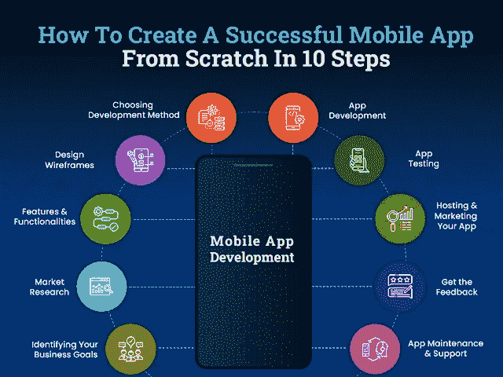

# 如何通过 10 个步骤从头开始创建应用程序

> 原文：<https://javascript.plainenglish.io/how-to-create-an-app-from-scratch-in-10-steps-7e8c46671676?source=collection_archive---------11----------------------->

随着智能手机用户数量的增加，移动应用的开发肯定会激增。移动应用无处不在；甚至没有一个行业不受数字化的影响。有研究表明，人们 90%的时间都花在移动应用上，平均每个月他们会访问 30 多个移动应用。

此外，到 2023 年，移动应用开发的收入预计将达到 9350 亿美元。

这些统计数据难道没有激励您在应用商店展示自己的业务吗？

当然，世界正在快速走向数字化，考虑为你的业务开发一个移动应用程序是对用户产生实质性影响的完美方法。

*假设您心中有一个非常棒的移动应用开发想法，那么您有什么策略可以将您的应用想法转化为完美的解决方案呢？*

*这是否就像构思、设计、开发和部署应用程序一样简单？*

*在开发移动应用时，一个重要的制约因素是如何开始移动应用开发？*

让我们简单明了地让你明白。毫无疑问，人们比以往任何时候都更多地使用移动应用。然而，这只能为您提供关于应用程序使用的信息，您不能仅仅基于这个想法来开发应用程序。

这将更可能是“人们喜欢网上购物，所以我打算开一家购物商店”。

在这个竞争激烈的市场中，如果你想在这个价值数十亿美元的行业中竞争，你需要了解你的商业应用开发解决方案如何与市场需求相关联，人们如何下载和使用移动应用等等。

无论是构建一个 MVP 解决方案还是一个成熟的应用程序，这都是一个复杂而昂贵的过程。所以，在您开始雇佣移动应用开发商从头开始制作应用程序之前，有必要为自己准备一份完整的指南，以创建一个专业的移动应用程序，确保您的投资获得巨大的回报。

因此，无论您想从头开始构建一个基本的移动应用程序还是开发下一个亚马逊应用程序，本指南都是为所有首次构建者、非技术用户以及任何首次或非技术用户编写的。在您通过本指南完成应用程序开发过程之前，您需要了解构建移动应用程序的其他方面。

与网上另一篇解释开发移动应用程序一般步骤的帖子不同，我们根据自己的经验起草了创建移动应用程序的基本参数。为了便于理解和遵循，我们将整个应用程序开发过程分为三个阶段——开发前、开发中和开发后。

**根据创建 app 的情况，可以点击章节先睹为快。以下是开发移动应用的重要参数:**

*   *如何创建一个应用程序？:预开发阶段需要考虑的事项
    -开发移动应用程序的最佳方式是什么？
    ——开发一个应用需要多长时间？
    -为 Android 或 iOS 创建一个移动应用需要多少钱？*
*   *如何用 10 个简单的步骤创建一个手机 App？——开发阶段指南*
*   *如何让自己的手机 App 成功？-后期开发阶段需要考虑的事情
    -从移动应用赚钱有哪些简单的方法？*

为了更好地理解，让我们直入这些要点:

## **1。预开发阶段:如何创建移动应用程序的指导？**

随着技术和创新的显著进步，开发移动应用程序不再是一项遥不可及的工作。然而，在您直接进入创建移动应用程序的过程之前，让我们快速了解一些与应用程序开发项目相关的最常见但最基本的问题。

让我们从最关键的问题开始。

*   **开发手机 App 最好的方法有哪些？**

如果说实话，没有一个适合所有人的应用程序开发流程。创建移动应用程序的方法主要取决于应用程序的想法、业务需求、预算、应用程序类型和您选择的应用程序发布平台。

如果你正在开发一个游戏应用程序或与这些系列相关的东西，原生应用程序开发将是你最好的选择。然而，如果你选择雇佣一家 [**应用程序开发公司**](https://www.xicom.biz/services/mobile-app-development/) 来创建一个面向广泛用户群的电子商务应用程序，你可能会得到一个跨平台的应用程序开发解决方案。

由于 Android 和 iOS 是最主要的操作平台，跨平台适合为精通技术的个人构建移动应用程序。它确保高度可定制的应用程序开发选项与两个平台兼容。

*   **开发一个 App 需要多长时间？**

移动应用程序开发就是在需求高的时候推出一个健壮的解决方案。由于每个应用程序开发项目都是不同的，创建一个移动应用程序所需的时间也因其他因素而异。您为移动应用程序开发选择的复杂应用程序结构、功能和技术越多，创建移动应用程序所需的时间就越长。

有的 app 几个月就能开发出来，有的可能要一年。如果一般来说，app 开发过程需要 6 到 9 个月。然而，具有复杂应用程序开发过程的应用程序将花费更长的时间。为基本用途开发一些简单的东西，比如计算器应用，不会超过一周。但如果你要与优步、亚马逊或 Instagram 等应用竞争，那么预计这需要一年多的时间。

*   **为 Android 或 iOS 创建一个移动应用需要多少钱？**

那些想开发移动应用程序的人最常被问到的问题是:“一个应用程序的开发成本是多少？”。

对于商业机构来说，计算制造一部手机的平均成本一直是个谜。嗯，说实话，创建一个移动应用程序的平均成本取决于你正在开发的移动应用程序的类型、你雇佣的移动 [**应用程序开发公司**](https://www.xicom.biz/services/mobile-app-development/) 、你正在集成的功能、你为应用程序开发选择的技术、它的过程以及其他对应用程序开发价格有重大影响的因素。根据应用程序开发项目的不同，你可以花费 17，000 到 35，000 美元来开发一个应用程序。

如果你试图偷工减料，以更低的成本开发移动应用，你的应用质量最终会受到影响。相反，值得寻找最合适的应用程序开发替代方案，在不损失质量的情况下节省应用程序开发预算和时间。

希望你对开发移动应用有所了解，并且有足够的好奇心立即开始你的应用开发过程。但是你们中的大多数人已经陷入了如何从零开始创建一个移动应用程序的困境？

我们知道应用程序开发是一个复杂、漫长和昂贵的项目，尽管我们已经实施了一个全面的指南来解释如何从头开始创建一个应用程序。

## **2。如何用 10 个简单的步骤创建一个移动应用程序？——开发阶段指南**

如果你对构建一个移动应用程序感到足够兴奋，但不确定如何开始，这本应用程序开发指南肯定会给你一个深入的解决方案，将你的应用程序开发想法执行为一个完美的解决方案。

为了让事情更容易和简单，让我们直接跳到为 Android 或 iOS 创建移动应用程序的指南:

*第一步:了解你的业务需求并定义明确的目标
第二步:进行市场调查并分析你的竞争对手
第三步:规划你的应用程序的特性和功能
第四步:设计并测试线框
第五步:决定并选择开发方法
第六步:应用程序开发
第七步:测试并分析移动应用程序的质量
第八步:托管并营销你的应用程序
第九步:获得反馈
第十步:应用程序维护和支持* 

让我们深入了解这些要点，以便更好地理解:

*   **第一步:了解您的业务需求并定义明确的目标**

虽然每个企业家的主要目标是从你的商业投资中获得数十亿美元的收入，但要实现这一目标，你需要掌握正确的策略。抛开技术不谈，你只需要把全部注意力放在理解你发布这款应用背后的目标是什么？你想从这款手机应用中获得什么？

让你离梦想更近的第一件事，就是头脑风暴一下推出这款应用的目的，以及它在为市场提供什么样的服务？ [**雇佣一个移动应用开发者**](https://www.xicom.biz/offerings/hire-mobile-developers/) 可以让这个任务更容易完成，因为他们拥有行业知识，可以更好地帮助你。了解您的业务目标的最佳方式是获得这些问题的答案:

*   你希望你的应用程序做什么？
*   *它要解决什么问题？*
*   如何让你的应用程序对用户更有吸引力？
*   *它将如何简化用户的生活？*
*   *制作一个手机 App 需要多少预算？*

各种商家通常会跳过 app 开发这一步，无法在市场上取得成功。你知道为什么，只因为缺乏远见。尽管有一个绝妙的应用程序开发想法，你需要清楚地知道你想从你的应用程序中得到什么。

*   **第二步:进行市场调查，分析你的竞争对手**

移动应用程序开发已经成为一个竞争激烈的市场，数百万个应用程序充斥其中。因此，对于企业来说，与行业领导者竞争并在市场中立足从来都不是一件容易的事情。

一旦你理解了你的商业目标，有了一个理论上听起来不错的应用想法，你需要在继续之前验证和研究这个想法。如果你选择外包一家软件开发公司，那么你可以最大限度地减少耗费大量时间进行市场调查的麻烦。他们有一个专家团队，无需付出太多努力就能获得市场洞察力。

验证你的应用想法的最好方法是在你开始应用开发之前进行市场调查。

假设你计划推出一款电子商务应用。很容易假设你的客户希望你的应用具有某些特性和功能，但是你的竞争对手到底提供了什么才是最重要的。像亚马逊、易贝一样，Etsy 将是强有力的竞争对手。你可以找出这些应用程序的不足之处，或者了解它们吸引用户注意力的策略。

始终以一种方式思考，创建一个能够改善你的目标客户的体验并保持他们参与的应用程序。

*   **第三步:规划应用的特性和功能**

在你着手为 Android 或 iOS 创建一个移动应用之前，你需要决定哪些特性和功能需要集成到你的移动应用中。真正决定你的应用成功的只有应用的特性。

但是在应用程序中添加什么是如何创建移动应用程序的最大部分。为了让你的应用程序最具吸引力，可以选择 [**雇佣一名应用程序开发人员**](https://www.xicom.biz/solutions/hire-developers/) 来集成机器学习、人工学习、实时跟踪、人脸识别等功能。然而，这些特性会很快增加你的应用开发预算。

因此，对于应用程序开发来说，没有你需要考虑的标准特性列表，但是基于应用程序的复杂性和用途，特性的分离可以很容易地完成。

请记住，添加不相关的功能对你的应用程序没有任何好处，但肯定会影响应用程序的性能。因此，不要试图填充你的应用程序，首先你可以创建一个最小可行产品(MVP ),然后将功能集成到应用程序中。一旦你发布了应用程序的基本版本，你就可以评估用户的反馈，然后相应地开发其余的功能。

*   **第四步:设计和测试线框**

如果你是第一次开发移动应用程序，那么你会想知道到底什么是线框图，它如何帮助应用程序开发过程…

简而言之，线框化是应用程序开发流程的重要组成部分，它允许您创建移动应用程序开发理念、目标、特性和功能、UI/UX 设计等的粗略布局。

它可以画在白板上，或者你可以使用这样的数字线框工具来简单地说明应用程序的开发布局，并帮助你了解最终的应用程序会是什么样子。基本上，线框定义了应用程序所有者和开发者的应用程序结构和开发流程。

一旦你知道了每个页面应该做什么，你很快就能发现缺陷，并在问题发生前修复它们。

*   **第五步:决定和选择 App 开发方法**

既然你已经有了商业目标、市场调研、特性和功能等等，下一步就是确定开发移动应用的方法。开发一个应用程序有很多方法，但是创建一个应用程序的最终方法取决于成本、资源、时间和功能。请记住，无论你选择什么方法来创建一个应用程序，都要确保它能提供卓越的性能和屏幕间的无缝导航。

*因此，在进入应用程序开发之前，让我们了解一下创建移动应用程序开发的最常见方法:*

**—原生应用开发:**原生应用分别使用平台特定的编程语言(如 Kotlin、Java、Object C 或 Swift)为特定平台(Android 或 iOS)开发。在你雇佣一家 [**移动应用程序开发公司**](https://www.xicom.biz/services/mobile-app-development/) 来创建一个移动应用程序之前，要知道从头开始编写一个原生应用程序将会花费你大量的金钱和更长的开发时间，但同时提供应用程序定制的最大灵活性，这一点很重要。

**—混合应用开发:**混合应用使用跨平台应用开发框架开发，如 Flutter、React Native 等。混合应用程序与多种平台兼容，因为它们基于单一代码基础，尽管它们开发速度快，并节省了应用程序开发预算。但你会感觉到应用程序的性能略有下降。

*   **第六步:应用开发**

从头开始构建移动应用程序是一个耗时且复杂的过程。因此，不管应用程序开发想法有多复杂，你都需要一个合适的应用程序开发团队，他们在最新技术和方法方面经验丰富，能够将你的应用程序想法转化为完美的解决方案。

为了让你的工作变得简单而富有成效，明智的做法是雇佣一个移动应用开发团队，由业务分析师、项目经理、应用开发人员、UIX/UX 设计师等组成。根据编码的复杂程度，您可以定义时间线并确保满足质量。

*   **第七步:手机 App 质量测试分析**

一旦应用程序准备就绪，在不同设备上测试它是成功的关键。不进行质量分析就推出 app，会增加 app 失败的几率。确保应用程序在线运行，并且在不同的应用程序商店上完美无缺。从来没有机会一口气推出一个完美的移动应用程序，因此应用程序测试将帮助您找到所有的错误，并使您能够在它推出之前修复它们。

*   **第 8 步:托管和营销你的应用**

现在，你的应用程序已经准备好发布，没有任何错误，尽管下一步是在应用商店或 google play 上部署它。在这里，你可以雇佣一个精通应用程序部署指南的应用程序开发团队。

嗯，应用部署不仅仅是上传应用，这个过程需要大量的文档和协议来托管应用。然而，应用程序开发团队的正确选择将处理好从生成签名 APK 到维护评论和评级的所有事情。

*   **第九步:获得反馈**

最后，你上传了一个应用程序，你的用户已经准备好注册这个应用程序了。你现在已经有了真正的客户，所以欢迎一些反馈总是一个好主意。但与此同时，你需要一个 [**应用程序开发公司**](https://www.xicom.biz/services/mobile-app-development/) 的协助，他们会考虑这些评论，并在你的应用程序中实施更改。这将有助于你赢得客户的信任，并清楚地表明你正走在正确的道路上。

*   **第十步:应用维护和支持**

你的工作不会随着一款应用的推出而结束。事实上，为了让你的应用程序运行顺畅，应用程序维护和支持是重要的考虑因素。每年都会推出许多技术和更新，因此经常更新您的应用程序以使其与新技术兼容是非常重要的。通常，应用维护和支持服务需要额外收费，费用取决于更新的复杂程度。

现在你有了一个移动应用程序，但是你将如何从中赚钱，它将如何帮助你的商业成功呢？

## **3。有哪些简单的手机 App 赚钱方法？**

无论你是创业公司还是商业爱好者，你最关心的是如何从移动应用中赚钱？

开发一个移动应用程序仍然会让企业捉襟见肘，但正确选择盈利策略将有助于它们克服这种支出，并证明这是一笔有利可图的交易。所以这里我们有一些下面提到的最有效的策略来帮助你从你的商业投资中获得最大收益。

*   **应用内广告**

这是最理想的赚钱策略之一，并且被大多数领先的应用程序所采用。通过向第三方企业提供应用程序中的空间，将有助于你从应用程序中赚钱。这种类型的货币化战略将双向运作。它一方面让商家产生收入，另一方面为第三方商家提供获取用户群的途径。

*   **应用内购买**

这是最适合游戏应用的盈利方式之一，允许用户通过向应用所有者支付额外的费用来获得额外的功能。

*   **免费增值**

与大多数应用程序一样，你的应用程序可以免费下载和访问，但用户必须支付额外的费用才能访问应用程序的更多功能或高级功能。

*   **认购计划**

这种类型的货币化方法非常适合流媒体应用，这些应用提供 15 天的试用，然后允许用户继续使用他们选择的订阅计划。允许他们选择每月、每季度或每年的订阅计划，但要确保费用容易负担得起。

# **结论:准备好将您的业务迁移到数字平台**

随着移动应用程序的使用越来越多，毫无疑问，企业已经获得了潜在的机会来扩大其在世界各地的影响，并从其投资中产生更多的收入。但是开发一个移动应用程序不仅仅是一个遵循传统步骤的过程。它需要深入的研究、规划、技术、开发方法等等。了解应用程序开发过程是值得的，但如果你真的想与行业巨头竞争，雇佣一家 [**移动应用程序开发公司**](https://www.xicom.biz/services/mobile-app-development/) 来创建一个移动应用程序是一个明智的决定。通过融合他们的数字体验和正确的技术，专家可以确保您获得最高标准的解决方案，帮助您对用户产生持久的影响。

如果你有一个移动应用程序开发的想法，但正在寻找能够处理应用程序开发的复杂性并能够将其转化为一个健壮的解决方案的专家，那么你可以 [**联系我们**](https://www.xicom.biz/contact/) 并获得你的免费评估或在下面提出疑问。

=======================================

*更多内容请看*[***plain English . io***](http://plainenglish.io/)