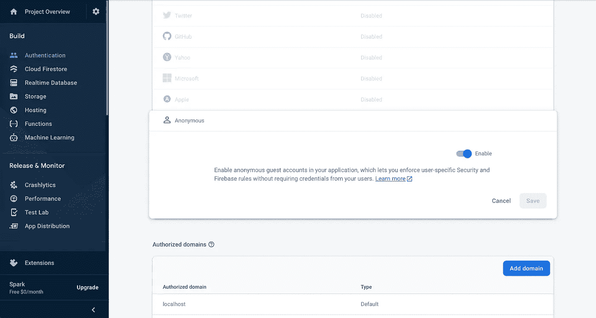
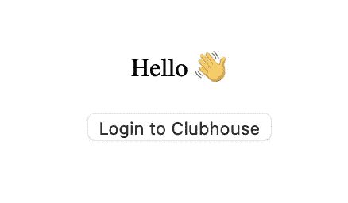
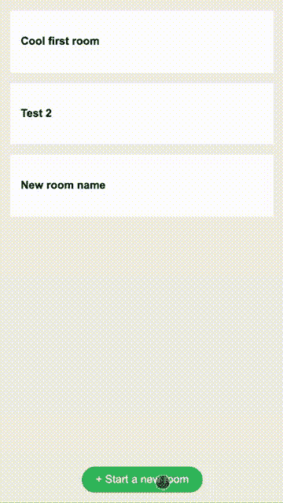
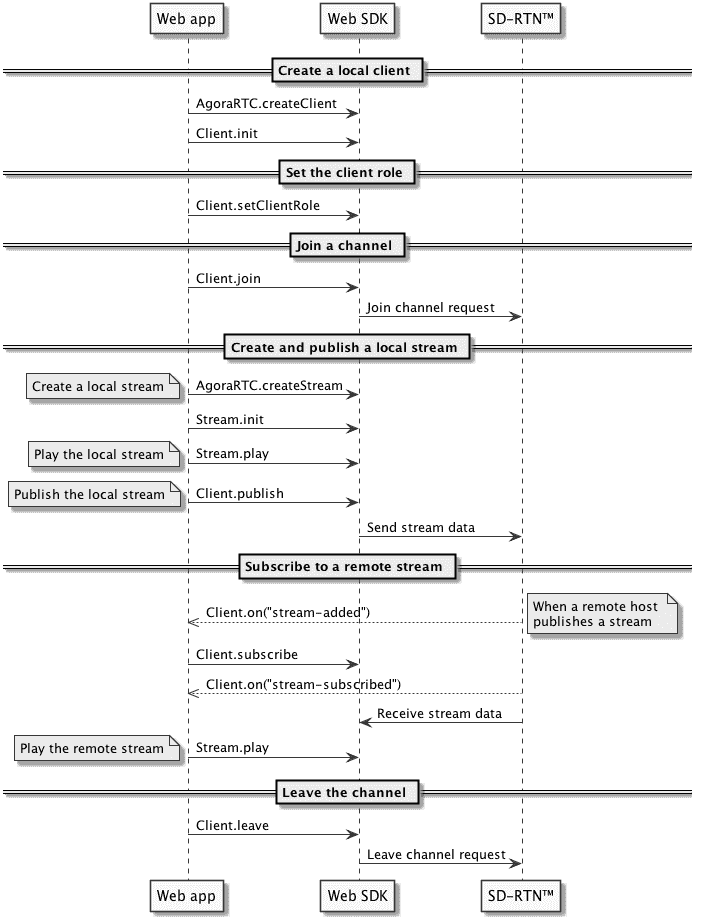
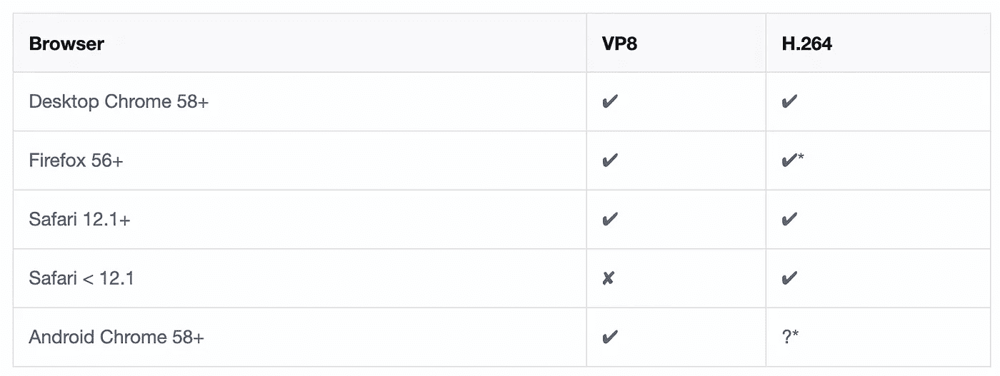

# 如何建立一个克隆的俱乐部会所

> 原文：<https://javascript.plainenglish.io/how-to-create-an-app-like-clubhouse-eeb2382da03e?source=collection_archive---------3----------------------->

## 用 Angular + Agora + Firebase 创建一个类似 ClubHouse 的应用程序


Photo by [William Krause](https://unsplash.com/@williamk?utm_source=medium&utm_medium=referral) on [Unsplash](https://unsplash.com?utm_source=medium&utm_medium=referral)

最近几周，网络上出现了越来越多关于俱乐部会所应用的技术信息。一些爱好者创建了带有会所 API 库的存储库，甚至发布了非官方的 Android 应用。

公众的兴趣和可用的信息使得建立你的语音网络或者至少知道如何实现它变得很有趣。

在本文中，我将讨论如何使用 Agora.io、Angular 和 Firebase 实现基本功能。

Firebase 只是一个例子，您可以使用任何后端来处理身份验证和存储空间

# 先决条件

*   创建了 firebase 项目
*   已经在您的机器上安装了 Node.js
*   已在全球安装`@angular/cli`
*   您对如何使用 Firebase 有所了解

# 议程

*   项目初始化
*   证明
*   客房大堂和客房创建
*   语音直播流一对多(最多 100 万听众)

但是首先，我们需要初始化项目。

打开终端，导航到所需的文件夹并运行:

```
ng new clubhouse
```

然后，让我们创建两个带路线的功能模块:

1.  `ng generate module profile — route profile — module app.module`
2.  `ng generate module rooms — route rooms — module app.module`

清除 app.component.html，只留下一个标记:

```
<router-outlet></router-outlet>
```

出发前剩下的最后一件重要的事——@ angular/fire 库。

```
ng add [@angular/fire](http://twitter.com/angular/fire)
```

将 Firebase 配置添加到环境变量中

```
export const environment = {
  production: false,
  **firebase: {
    apiKey: ‘<your-key>’,
    authDomain: ‘<your-project-authdomain>’,
    databaseURL: ‘<your-database-URL>’,
    projectId: ‘<your-project-id>’,
    storageBucket: ‘<your-storage-bucket>’,
    messagingSenderId: ‘<your-messaging-sender-id>’,
    appId: ‘<your-app-id>’,
    measurementId: ‘<your-measurement-id>’
  }**
};
```

并在`app.module.ts`中使用

```
imports: [
  BrowserModule,
  AppRoutingModule,
  **AngularFireModule.initializeApp(environment.firebase)**
]
```

现在我们准备好使用我们未来的应用程序了=)

# 证明

Firebase 应用程序有许多不同的认证提供者。为了使本教程简单，让我们使用一个匿名提供者。不需要任何不必要的动作。



但是在您的项目中，您可以使用任何类型的身份验证。

在`app-routing.module.ts`中设置房间模块为默认路线，并启用授权守卫。

```
...
import { AngularFireAuthGuard, redirectUnauthorizedTo } from '@angular/fire/auth-guard';**const redirectUnauthorizedToLogin = () => redirectUnauthorizedTo(['profile']);**const routes: Routes = [
  ...
  {
    path: 'rooms',
    loadChildren: () =>
    import('./rooms/rooms.module').then((*m*) => *m*.RoomsModule),
    **canActivate: [AngularFireAuthGuard],
    data: { authGuardPipe: redirectUnauthorizedToLogin }**
  },
  **{
    path: '**',
    redirectTo: 'rooms'
  }**
];
```

现在，我们将在个人资料页面上添加一个简单的登录按钮。如果您愿意，您可以创建单独的登录/注册/个人资料页面。但是在我们的例子中，用一个登录按钮就足够了。



Profile component view

profile.component.html

```
<p>Hello 👋</p>
<button (click)="login()">
Login to Clubhouse
</button>
```

配置文件.组件. scss

```
:host {
  display: block;
  text-align: center;
  padding: 50px 0;
}
```

实现成功时重定向到房间页面的登录方法。

单击浏览器中的登录按钮，如果一切正常，您将被重定向到房间页面。这一次 auth guard 将允许我们打开这个页面。

# 客房大堂和客房创建

在这一页，让我们展示带有可用房间和按钮“开始一个房间”的卡片。我们将使用 Firebase 实时数据库来存储房间列表。

首先，我们需要允许用户读写数据库。在浏览器搜索控制台中打开并转到:`Realtime database => Rules`。

```
{
  "rules": {
    ".read": "auth != null",
    ".write": "auth != null"
  }
}
```

打开`rooms.component.ts`。我们将在这里使用一些依赖项，所以让我们在构造函数中提供它们:

```
...
**import { AngularFireAuth } from '@angular/fire/auth';
import { AngularFireDatabase } from '@angular/fire/database';
import { Router } from '@angular/router';
import { Observable } from 'rxjs';
import { map, take, takeUntil } from 'rxjs/operators';**...
constructor(
  **private *auth*: AngularFireAuth,
  private *db*: AngularFireDatabase,
  private *router*: Router**
) {}...
```

现在我们需要一些变量来存储`rooms`、`subscriptions`和`userId`。

```
**export interface Irooms {
  key?: string;
  name: string;
  host?: string;
}**
...export class RoomsComponent implements OnInit {
  **public $rooms: Observable<Irooms[]> | undefined;
  public isRoomCreationShown = false;
  private user: string | undefined;
  private roomList = this.db.list<Irooms>('rooms');
  private $destroy: Subject<boolean> = new Subject<boolean>();** constructor(
    private *auth*: AngularFireAuth,
    private *db*: AngularFireDatabase,
    private *router*: Router
  ) {}
```

在组件初始化上，我们应该建立一个对数据库列表的订阅- `rooms`。

```
ngOnInit(): void {
  **this.$rooms = this.roomList.snapshotChanges().pipe(
    map((action) =>
      action.map((c) => {
        return {
          ...(c.payload.val() as any),
          key: c.payload.key
        };
      })
    )
  );**
}
```

当用户创建一个新房间时，我们需要将他定义为主人。当然，在生产中，最好是在云功能端进行，但是在我们的例子中，让我们保持简单。我们将在创建房间时为当前用户提供详细的 UID。为了提供它，我们需要从 firebase 用户身份验证状态中获取它。

```
ngOnInit(): void {
  ...
  **this.auth.authState.pipe(take(1)).subscribe({
    next: (user) => {
      this.user = user?.uid;
    }
  });**
}
```

房间部分快完成了。我们需要创建一个新房间的方法，我们需要一个导航用户到所需房间的能力。

```
public addRoom(nameInput: HTMLInputElement): void {
  if (nameInput.value.length) {
    this.roomList
    .push({
      name: nameInput.value,
      host: this.user
    })
    .then((resp) => {
       this.navigate(resp.key);
    });
  }
  nameInput.value = '';
  this.isRoomCreationShown = false;
}public navigate(roomId?: string | null): void {
  this.router.navigate([`rooms/${roomId}`]);
}
```

用于显示房间列表和创建房间的简单输入的模板。

带有显示房间创建形式的小过渡的样式。



I have no idea why typing is so slow on the gif 🐌

“房间”组件已经完成，下面是它应该看起来的样子。

很简化，但这是教程，不是真实项目。我不喜欢使用被动形式。对于生产来说，还是用它们比较好。

如您所见，当我们创建新房间时，我们打开了另一个页面，该页面当前是空的。这个组件此刻对你来说是不存在的，我们来补充一下。

在终端中运行:

```
ng g component rooms/room
```

别忘了将它添加到客房路线中:

```
const routes: Routes = [
  { path: '', component: RoomsComponent },
  **{ path: ':id', component: RoomComponent }**
];
```

# 语音直播一对多

首先在 [agora.io](https://www.agora.io/) 注册。这是一个 SaaS 后端，它位于俱乐部应用程序的后面。学习用的不用提供任何银行卡。

接下来，用 npm 安装 Agora SDK:

```
npm i agora-rtc-sdk
```

现在转到 Agora 控制台= >找到您的项目= >点击编辑= >复制您的应用程序 id。将它作为 firebase config 旁边的 agoraAppId 插入到 environment.ts 中。

```
export const environment = {
  production: false,
  firebase: {
    apiKey: ‘<your-key>’,
    authDomain: ‘<your-project-authdomain>’,
    databaseURL: ‘<your-database-URL>’,
    projectId: ‘<your-project-id>’,
    storageBucket: ‘<your-storage-bucket>’,
    messagingSenderId: ‘<your-messaging-sender-id>’,
    appId: ‘<your-app-id>’,
    measurementId: ‘<your-measurement-id>’
  },
  **agoraAppId: '<your-agora-app-id>'**
};
```

我们已经准备好构建最后一个组件——一个有实时流的房间。

这次我们将从模板开始，因为我们需要一个媒体播放器的容器。通过这个播放器，用户将听到声音。

```
<section class="room-content">
    <div #streamContainer></div>
    <div class="users">
        <div class="user-card"
             *ngFor="let user of $onlineList | async">
            
            <h4>{{user?.displayName}}</h4>
        </div>
    </div>
</section>
<section class="room-footer">
    <button class="btn leave-btn"
            (click)="leaveRoom()">✌️ Leave quietly</button>
</section>
```

在这个模板中，您可以看到两个部分。第一个是加入房间的用户列表。第二部分有一个离开房间的按钮。

我们使用匿名认证，没有用户名和头像，这就是为什么我们会产生随机的用户数据。

让我们添加样式，它们很简单:

我们将用绿色边框突出显示房间的主持人(演讲者)。

我们的下一步是组件逻辑。首先，我们需要导入`activatedRoute`并从路由中获取房间 id。

```
**import { Router, ActivatedRoute } from '@angular/router';**...
constructor(
  **private *activatedRoute*: ActivatedRoute,
  private *route*: Router**
) {}ngOnInit(): void {
  **this.roomId = this.activatedRoute.snapshot.paramMap.get('id');**
}
```

现在让我们进入最有趣的部分——实时流实现。下面是在主持人和观众之间启动直播流的主要步骤的序列图。



## 创建本地客户端

然后我们需要初始化 Agora 客户端，所以让我们创建这个私有方法并在组件初始化时调用它。

```
...
**import AgoraRTC from 'agora-rtc-sdk';
import { environment } from 'src/environments/environment';**
...ngOnInit(): void {
    this.roomId = this.activatedRoute.snapshot.paramMap.get('id');
    **this.initClient();**
}**private initClient(): void {
  this.client = AgoraRTC.createClient({
    mode: 'live',
    codec: 'vp8'
  });** **this.client.init(environment.agoraAppId);
}**
```

我们将创建一对多的流，这就是为什么我们需要使用`mode: 'live'`的原因，因为我们将只支持现代浏览器，所以我们使用`codec: vp8`。



Codec VP8 and H.264 browser support

## 设置用户角色并加入频道

在加入渠道之前，我们需要检测用户角色。正如您所记得的，在上一步中，我们在房间细节中保存了作为主机的用户 ID。现在我们需要从 Firebase auth 状态中获取当前用户 ID，并将其与房间主机进行比较。我们可以同时做。

```
private joinRoom(): void {
  combineLatest([
    this.auth.authState,
    this.db.object<Iroom>(`rooms/${this.roomId}`).valueChanges()
  ])
    .pipe(take(1))
    .subscribe({
      next: ([user, room]) => {
        this.user = user;
        this.room = room;
        this.isHost = this.user.uid === this.room.host;
        this.client.setClientRole(this.isHost ? 'host' : 'audience');
      }
    });
}
```

你可能会用自己的解决方案来取消订阅 observables，而不是`take(1)`。

在 ngOnInit 钩子中调用`joinRoom()`。

```
ngOnInit(): void {
    this.roomId = this.activatedRoute.snapshot.paramMap.get('id');
    this.initClient();
    **this.joinRoom();**
}
```

此外，对于我们的俱乐部应用程序，我们需要显示加入的人的列表。让我们为它创建一个角度服务，并通过地址将加入的用户存储在实时数据库中:`online/${roomID}`。

将此服务导入组件，并在设置用户角色后立即使用它:

```
private joinRoom(): void {
... next: ([user, room]) => {
     ...
     this.client.setClientRole(this.isHost ? 'host' : 'audience'); **this.presenceService
       .setPresenceOnline(
         {
           displayName: randomNames[Math.floor(Math.random() * randomNames.length)],
           key: this.user.uid
         },
         this.roomId
       )
      .pipe(take(1))
      .subscribe();**
  }
}
```

我用了随机的名字。根据需要在某处定义一个数组😊。当然，在真正的应用程序中，你应该从注册用户档案中取名字。

```
const randomNames = [
  'Sheryl Edie',
  'Dalton Kincade',
  'Nathan Laber',
  'Carola Wilmot'
];
```

理论上，目前，我们应该可以在 UI 上看到在线列表，但是我们看不到，因为模板仍然有一些未实现的方法。我们将很快实施所有这些措施。

加入这个流非常简单，但是需要额外的动作。我们需要在后端生成令牌。这个令牌取决于 Agora 发给你的证书。为了验证概念，可以在 [agora 管理面板](https://console.agora.io/)中直接生成临时令牌。点击编辑您的项目并找到按钮`generate temp token`。键入通道名“demo”(或任何其他名称，但将其作为第二个参数传递给`client.join()`函数)并复制生成的令牌。

设置用户角色后调用`joinStream`函数。

```
private joinRoom(): void {
...next: ([user, room]) => {
    ...
    this.presenceService
     .setPresenceOnline(...)
     .pipe(take(1))
     .subscribe(); **this.****joinStream();**
  }
}
```

## 创建和发布本地流

此时，我们需要在房间组件中定义一些变量。我们将在接下来的步骤中使用它们。

之前我们使用了`this.createLocalStream();`功能。我们需要实施它。该函数只能由主机调用。

```
private createLocalStream(): void {
  this.localStream = AgoraRTC.createStream(this.streamOptions);
  // Initialize the local stream
  this.localStream.init(() => {
    this.client.publish(this.localStream, this.handleError);
  }, this.handleError);
}
```

对于错误处理，让我们做一些简单的事情:

```
private handleError(*err*: any): void {
  console.error(*err*);
}
```

哇哦，我们创建了一个本地流，现在我们开始为加入者广播它。但是细木工怎么听得进去呢？只剩几步了。

## 订阅远程流

我们需要收听来自 Agora SDK 的事件。当流开始时，我们需要创建一个标签，SDK 将在那里播放流。当流结束时——我们需要移除那个标签。

```
private addStream(elementId): void {
 // Creates a new div for every stream
 const streamDiv = document.createElement('div');
 streamDiv.id = elementId;
 this.streamContainer.nativeElement.appendChild(streamDiv);
}private removeStream(elementId: string): void {
 const remoteDiv = document.getElementById(elementId);
 if (remoteDiv) {
  remoteDiv?.parentNode?.removeChild(remoteDiv);
 }
}
```

现在我们能够监听事件。

添加流时—为用户订阅以收听它。
订阅建立时—在 UI 上播放。

```
private subscribeToStreamStart(): void {
 this.client.on('stream-added', (evt) => {
   if (!this.localStreams.includes(evt.stream.getId())) {
     this.client.subscribe(evt.stream, null, this.handleError);
   }
 }); // Play the remote stream when it is subsribed
 this.client.on('stream-subscribed', (evt) => {
  const stream = evt.stream;
  const streamId = String(stream.getId());
  this.addStream(streamId);
  stream.play(streamId);
 });
}
```

在 ngOnInit 中调用 subscribeToStreamStart()函数。

## 离开频道

为了取消订阅流，我们需要做几乎相同的事情。

```
private subscribeToStreamStop(): void {
    // Remove the corresponding view when a remote user unpublishes.
    this.client.on('stream-removed', (evt) => {
      const stream = evt.stream;
      const streamId = String(stream.getId());
      stream.close();
      this.removeStream(streamId);
    });
    // Remove the corresponding view when a remote user leaves the channel.
    this.client.on('peer-leave', (evt) => {
      const stream = (evt as any).stream;
      const streamId = String(stream.getId());
      stream.close();
      this.removeStream(streamId);
    });
  }
```

我们需要做的最后一件事是添加离开空间功能，并在组件销毁时清除所有内容。

```
ngOnDestroy(): void {
  this.presenceService.setPresenceOffline(
  { key: this.user.uid },
    this.roomId
  );
  this.client.leave();
}public leaveRoom(): void {
  if (this.localStream) {
    this.localStream.stop();
    this.localStream.close();
  }
  this.route.navigate(['/rooms']);
}
```

恭喜你！我们完了！

完整的应用示例可在 [Github](https://github.com/Golosay/clubhouse-tutorial) 上获得。

# 结论

本文中的代码仅用于教程目的，并不适合生产，但足以了解如何实现一对多流媒体应用程序。

你可以在 Medium 上关注我的更多科技文章，也可以在 [Twitter](https://twitter.com/golosay) 上找到我。