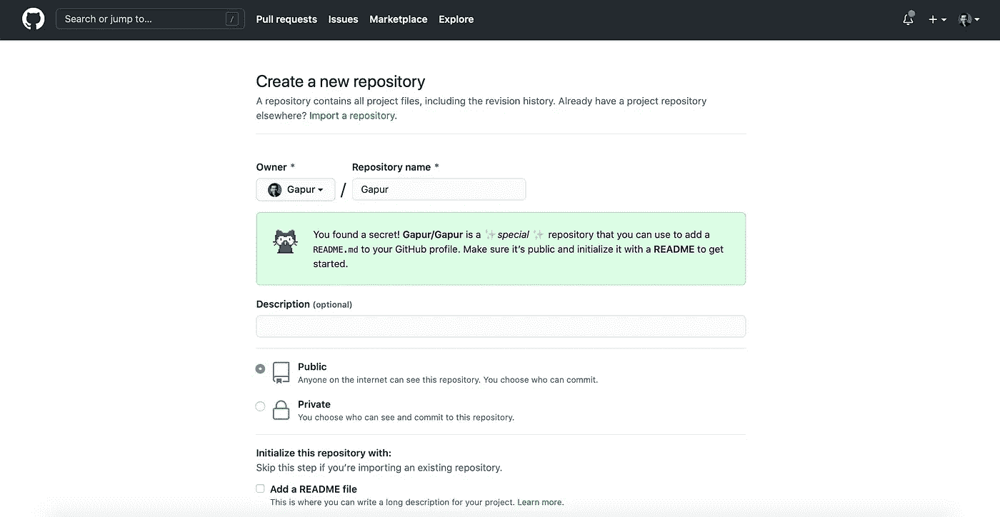
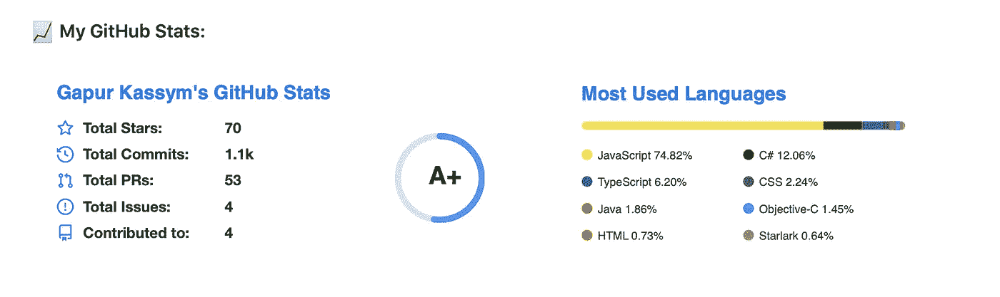
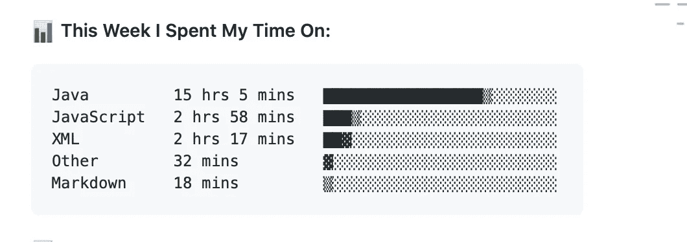
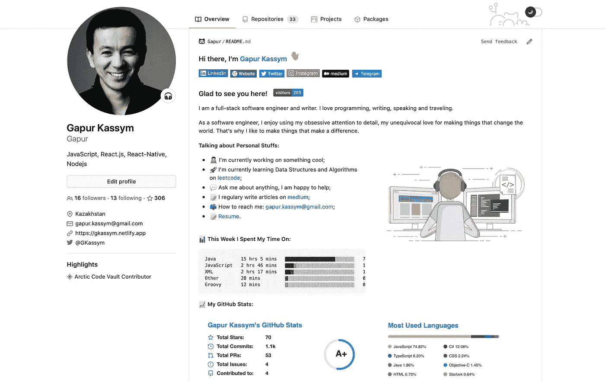

# 如何创建一个出色的 Github 简介自述文件

> 原文：<https://javascript.plainenglish.io/how-to-create-an-awesome-github-profile-readme-a474d5b45645?source=collection_archive---------0----------------------->

## 最佳 GitHub README 存储库工具


Photo by [Caleb White](https://unsplash.com/@caleb_white?utm_source=unsplash&utm_medium=referral&utm_content=creditCopyText) on [Unsplash](https://unsplash.com/s/photos/github?utm_source=unsplash&utm_medium=referral&utm_content=creditCopyText)

`[GitHub](https://github.com)`最近发布了一项功能，允许您在个人资料页面上添加一个`README`。这是一种在`GitHub`上与社区分享你的技能和项目的秘密方式。

您可以完全控制如何在`GitHub`个人资料中展示自己。我们可以在您的个人资料上向访问者展示您引以为豪的有趣的工作和项目或有用的贡献。

# 创建 GitHub 配置文件自述文件

让我们分三步创建一个`GitHub`档案`README`:

1.创建一个与您的用户名`GitHub`同名的新存储库。例如，如果您的用户名是`Gapur`，那么存储库名称必须是`Gapur`。



Create a new repository

2.在新的 repo 中创建一个包含内容(文本、图像、gif、表情符号等)的`README.md`文件。).


Getting to know your profile

3.提交并推动您的新`README`到`GitHub`。

# 美化您的 GitHub 个人资料

## 访客徽章

`[Visitor Badge](https://github.com/jwenjian/visitor-badge)`只需一行降价代码，就能统计出`README.md`、问题、`GitHub`中 PRs 的访问量。让我们用推荐的方式`${your.username}.${your.repo.id}`更新`page.id`并将下面一行添加到您的`README`文件中。

```

```


visitors

## GitHub 自述文件统计

`[GitHub Readme Stats](https://github.com/anuraghazra/github-readme-stats)`为你的`GitHub READMES`动态生成统计数据。

您应该复制并粘贴下面的代码行，只需将`?username=`值更改为您的 GitHub 用户名:

```

```



My GitHub Stats

## Wakatime 每周指标

WakaTime 让你知道你真正花在编码上的时间。我们可以将它与`GitHub`轮廓上的`[WakaTime Weekly Metrics](https://github.com/athul/waka-readme)`一起使用。

让我们分 4 步将`Dev Metrics`设置到`GitHub`配置文件中:

1.转到您的存储库操作`username/username/actions -> New Workflow -> Set up this workflow`；

2.删除所有默认操作内容，并将以下代码复制/粘贴到您的工作流中:

```
name: Waka Readme

on:
  workflow_dispatch:
  schedule:
    # Runs at 12am UTC
    - cron: "0 0 * * *"

jobs:
  update-readme:
    name: Update this repo's README
    runs-on: ubuntu-latest
    steps:
      - uses: athul/waka-readme@master
        with:
          WAKATIME_API_KEY: ${{ secrets.WAKATIME_API_KEY }}
```

3.回到你的`Settings -> Secrets -> New Repository Secret`，用`Name: WAKATIME_API_KEY`和`Value: Wakatime API Key`创建一个新的`Secret`。如果你不知道你的`WakaTime API Key`，请到`[Account Settings in WakaTime](https://wakatime.com/settings/account)`；

4.像这样给你的`README.md`添加一条评论，然后点击`Run workflow`:

```
<!--START_SECTION:waka-->
<!--END_SECTION:waka-->
```



WakaTime Dev Metrics

## Shields.io

`[Shields.io](https://github.com/badges/shields)`是 SVG 和光栅格式的简洁、一致、易读的徽章，可以很容易地包含在`GitHub README`中。每个月它提供超过 4.7 亿张图片。

最后，我们的`GitHub`简介:



Github Profile Readme

# 结论

感谢阅读，希望这篇文章对你有用。编码快乐！

# 资源

[](https://github.com/Gapur) [## Gapur -概述

### 我是一名全栈软件工程师和作家。我喜欢编程、写作、演讲和旅行。作为一个软件…

github.com](https://github.com/Gapur) [](https://docs.github.com/en/github/setting-up-and-managing-your-github-profile/managing-your-profile-readme) [## 管理您的个人资料自述文件

### 您可以将自述文件添加到 GitHub 个人资料中，向其他人介绍您自己。您可以分享关于…的信息

docs.github.com](https://docs.github.com/en/github/setting-up-and-managing-your-github-profile/managing-your-profile-readme) [](https://github.com/abhisheknaiidu/awesome-github-profile-readme) [## abhisheknaiidu/awesome-github-个人资料-自述文件

### 代码模式👨🏽‍💻随时欢迎投稿！请先阅读投稿指南。在某种程度上…

github.com](https://github.com/abhisheknaiidu/awesome-github-profile-readme)