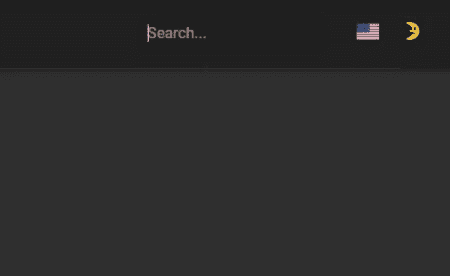

# 如何用 Gatsby 创建离线搜索页面

> 原文：<https://javascript.plainenglish.io/how-to-create-an-offline-search-page-with-gatsby-eb351d68cb6b?source=collection_archive---------6----------------------->

在制作 JAMStack 网站时，需要做出一些妥协，但搜索不是其中之一，这要感谢像 [flexsearch](https://github.com/nextapps-de/flexsearch) 和 [lunr.js](https://github.com/olivernn/lunr.js/) 这样的 javascript 库。

在遵循本教程[并将代码与](https://labs.walltowall.com/easy-client-side-search-for-gatsby-sites/) [Material UI 自动完成组件](https://material-ui.com/components/autocomplete/)结合之后，我能够创建你在这篇博客中看到的搜索栏。

这已经很好了，但我还想有一个搜索页面，在那里可以通过帖子的标签，标题和内容匹配的查询。

# 创建新的搜索索引

首先，我将把下面的代码添加到我的 Gatsby 配置中，这将创建一个新的`localSearchPage`索引，通过 GraphQL 进行查询。

# 搜索页面

如教程所示，`useFlexSearch`钩子可以用来获取搜索结果，但是没有指明查询在博客文章字段中的匹配位置。

函数`getExcerpt`需要以某种方式返回博文的摘录，其中突出显示了查询。

所以我需要找到查询在博文中的确切位置，并用类似于`query`的 HTML `span`元素替换它，为此，我将使用正则表达式。

此外，我将需要一个功能来修剪文本，并添加一个省略号，如果需要的话，这个从 StackOverflow 的[将做得很好。](https://stackoverflow.com/a/41267747/4307769)

当查询是`adipiscing`时，这段代码将把类似于`Lorem ipsum dolor sit amet, consectetur adipiscing elit. Sed condimentum risus nec scelerisque auctor`的字符串转换成`Lorem ipsum dolor sit amet, consectetur adipiscing elit. Sed condimentum risus nec scelerisque auctor`，由于这个字符串是 HTML 格式的，为了显示它，我将在一个`em`元素中使用`dangerouslySetInnerHTML`属性。

`truncateStringToWord`的反向使用有点不方便，但是大部分代码可以转移到 Gatsby 构建过程中，所以博客性能不会受到影响。

我希望这篇博文对你有所帮助，你可以通过在我的博客中搜索[来查看这个页面。下一集再见！](https://pablo.gg/en/search?q=javascript)

*原载于*[*https://pablo . gg*](https://pablo.gg/en/blog/coding/how-to-create-an-offline-search-page-with-gatsby/)*。*

*更多内容请看*[***plain English . io***](http://plainenglish.io)