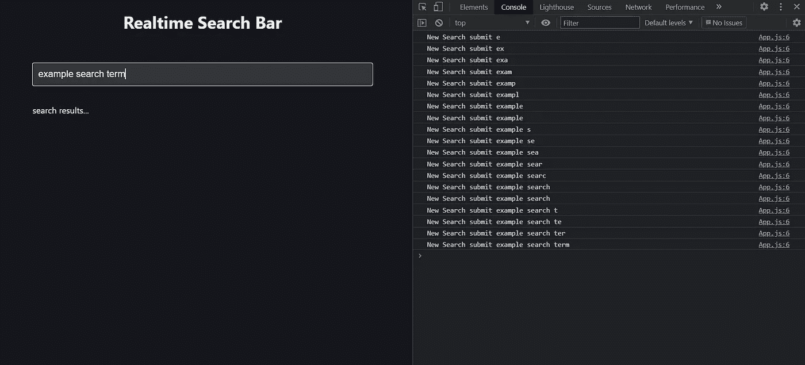
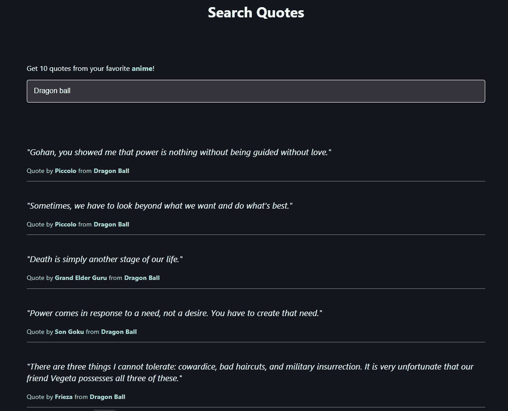
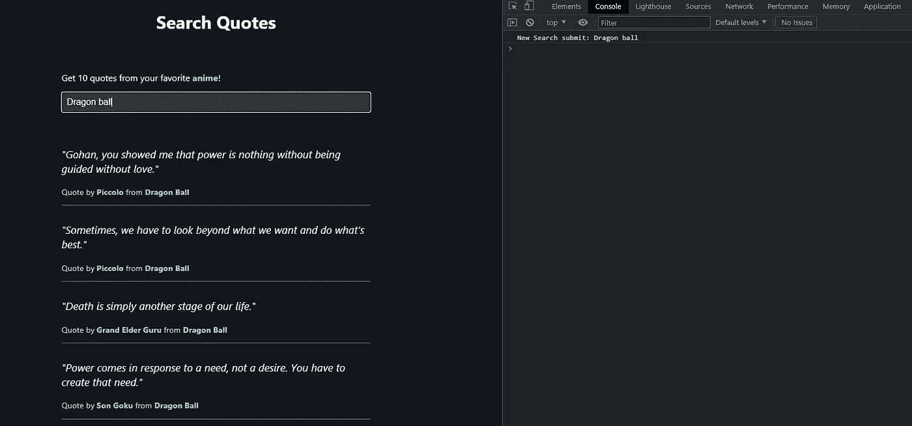
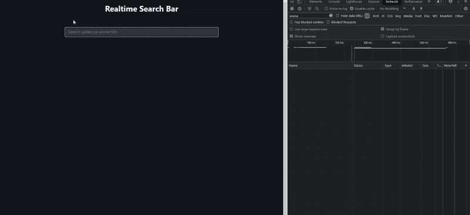
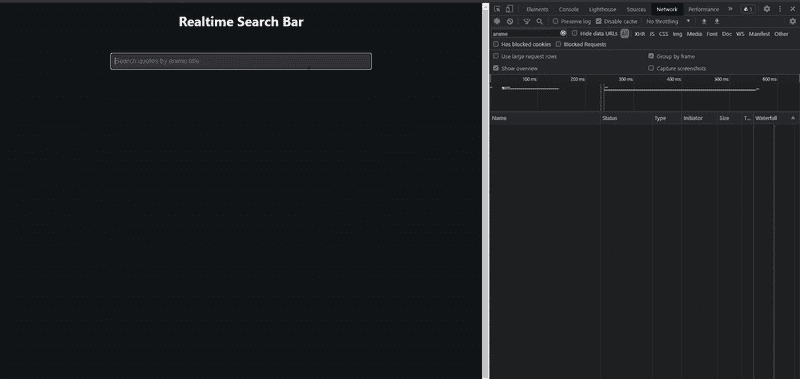

# 如何使用 React 创建优化的实时搜索

> 原文：<https://javascript.plainenglish.io/how-to-create-an-optimized-real-time-search-with-react-6dd4026f4fa9?source=collection_archive---------1----------------------->

## 了解如何使用反跳和记忆技术创建带有 React 挂钩的优化实时搜索功能。

开发任何类型的应用程序时，最常见的场景之一是允许用户搜索某些东西。然而，即使这很常见，也可能很棘手，因为很容易实现带有性能问题的搜索功能。那么，如何才能做得更好呢？

在本文中，我们将看到如何使用两种流行的优化技术来创建高效的搜索特性:*去抖动*和*记忆化*。

尽管我们将使用 React，但是请记住，这些技术不是 React 特定的，您可以在任何语言或框架中使用它们。

最终的结果将看起来像[这个](https://angelofaella.github.io/realtime-search-bar)。

# 项目设置

我们将创建两个主要组件:`App`和`SearchBar`。

`App`组件包含一个标题、一个`SearchBar`和一个`div`来显示搜索结果。

目前，`SearchBar`组件只包含一个简单的`input`字段。

用几行 CSS(你可以在 GitHub [资源库](https://github.com/AngeloFaella/realtime-search-bar)看到所有的源代码)，这就是我们的 app 的样子。

# 实时搜索

我们希望在用户书写时接收输入，并实时呈现结果。为了实现这一点，我们可以利用输入字段的`onChange`事件，每次他的值改变时都会调用这个事件。

每次触发`onChange`时，我们调用`App`组件的`onSearchSubmit`回调函数，将输入值作为参数传递。

我们可以利用两个反作用挂钩:

1.  `useState`:当输入改变时，我们将新值存储在一个名为`term`的状态变量中。
2.  `useEffect`:每次`term`更新时，我们调用`onSearchSubmit`，将新的搜索词作为参数传递。

出于调试的目的，在`onSearchSubmit`中，我们记录搜索词，看看是否一切正常。

从控制台中，您可以看到每输入一个新字符都会提交一个新的搜索(效率不是很高，对吧？我们稍后会对此进行改进)。

# 应用程序接口

是时候添加一个真正的 API 来测试我们的搜索特性了。

对于这个例子，我选择了 [Animechan](https://github.com/RocktimSaikia/anime-chan) ，这是一个很好的提供动画引用的宁静 API。获取某个动画的一组引用的最简单的方法是发送一个带有参数`title`作为查询字符串的请求。

考虑到这一点，我们现在可以在`onSearchSubmit`回调函数中写入 HTTP 请求。

一旦我们得到报价，我们就将它们存储在`App`州。为了渲染结果，我们首先映射引号数组，为每个元素创建一个`Quote`组件，然后在主要部分显示`Quote`列表。

`Quote`是一个非常简单的组件，显示了一个引语，他的作者，以及取自的动画。

现在我们可以得到一些真正的动漫名言了！

一切似乎都很好，但让它“正常工作”是不够的。我们可以做得更好。

# 去抖

我们喜欢实时效果，但是为输入的每个字符提交一个新的搜索太低效了。

A new search is submitted for each character typed

为了避免这种情况，我们引入了所谓的*去抖功能。*

`debounce`功能会延迟`onChange`事件的处理，直到用户停止键入一段预定的时间。这将大大减少对`onSearchSubmit`功能的调用次数。

为了在我们的`SearchBar`组件中实现去抖功能，我们可以使用以下策略:

1.  当输入改变时，我们更新一个名为`debounceTerm`的状态变量。
2.  每次`debounceTerm`改变，一个`useEffect`钩子安排一个定时器在 1 秒后更新`term`的值。
3.  如果`debounceTerm`的另一次更新在不到 1 秒钟的时间内发生，先前的计时器将被取消(使用 useEffect 的[清除功能)，并计划新的计时器。](https://reactjs.org/docs/hooks-effect.html)
4.  当定时器启动并更新`term`时，新的搜索被提交。

这里我们可以看到，现在只有一个搜索提交后，1 秒钟从最后一个字符键入。

search with debouncing

我选择了 1 秒钟来找到优化和搜索速度之间的正确平衡。根据您的需求，您可以选择或多或少的高时间，分别提高效率或加快响应速度。

# 记忆

如果我们用相同的输入连续进行两次搜索会发生什么？正如我们从控制台的 Network 选项卡中看到的，我们实际上进行了两次 API 调用，以获得几秒钟前得到的同一组报价。

Redundant API call

如果这看起来没什么大不了的，想象一个场景，您为每个 API 调用付费。

为了解决这个问题，我们可以实施一种叫做*记忆*的技术。记忆化(是的，没有字母 R)是一种优化技术，它包括存储昂贵的函数调用的结果，并在相同的输入再次出现时返回缓存的结果。

从头开始创建记忆功能并不难，但是有几个实现可供使用。我们将使用流行库 [lodash](https://lodash.com) 中的`memoize`函数。

为了保持项目的有序，我将 API 调用转移到了另一个文件中，在`src/apis/animeChan.js`中。在这里，我们导入`lodash`，并将进行调用的异步函数作为输入参数传递给`memoize`。

此时，在`App`组件中，我们可以调用`requestQuotes`。

回到控制台，我们可以看到，无论我们用相同的输入进行多少次搜索，API 调用只是每个标题一次。

Memoized API call

*去抖*和*记忆*是每个开发者都应该知道的简单而强大的技术。当然，搜索功能只是您可以使用它们的用例之一。

*去抖动*可用于限制函数被调用的速率，这通常是一个耗时的函数。*内存化*可用于缓存任何“昂贵”函数的结果。

# 资源

*   Github 回购:[https://github.com/AngeloFaella/realtime-search-bar](https://github.com/AngeloFaella/realtime-search-bar)
*   活生生的例子:[https://angelofaella.github.io/realtime-search-bar](https://angelofaella.github.io/realtime-search-bar/)
*   animechan API:[https://github.com/RocktimSaikia/anime-chan](https://github.com/RocktimSaikia/anime-chan)
*   洛达什:[https://lodash.com](https://lodash.com/)

如果您喜欢这篇文章，您可能也会喜欢:

 [## 使用代理 API 将 Python 列表引入 JavaScript

### 如何使用 JavaScript 代理 API 创建一个带切片和负索引的类 Python 列表对象？

javascript.plainenglish.io](/bringing-python-lists-to-javascript-with-proxy-api-1db8c3e559b4) 

*更多内容请看*[*plain English . io*](http://plainenglish.io/)